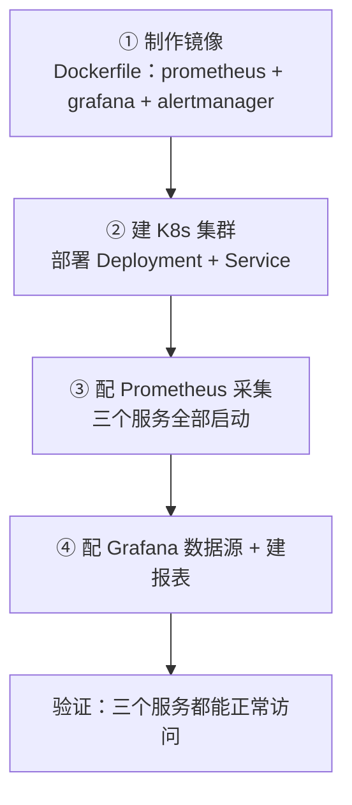

# Kubernetes 认证考点: 在 K8s 集群中把 Prometheus/Grafana 做成镜像并暴露出外网访问

云厂商页面上点几下就能开一套 Prometheus，但真到项目里，往往要的是"这套东西在我自己的镜像里，版本我说了算"。

结论：**整体三步 —— ① 制作包含 Prometheus、Grafana、AlertManager 的镜像；② 建 K8s 集群把监控告警服务部署进去；③ 配 Prometheus 采集、把三个服务都起起来，再配 Grafana 的数据源和报表验证可用。镜像的 Dockerfile 里有两个关键动作：Prometheus 用可执行文件下载解压即可（解压完把压缩包删掉，镜像能小一圈），Grafana 和 AlertManager 有专门源，两条命令就装好；启动三行命令里，前两个加 `&` 后台跑，最后一个 Grafana **故意不加 `&`**，让它前台阻塞当容器的一号进程。部署后还要用 Ingress（ingress-nginx）把三个端口 9090/9093/3000 通过二级域名暴露到外网。**

## 纲要

- 三步总览与两条路线
- Dockerfile：安装与启动
- 为什么最后一个启动命令不加 `&`
- 端口清单与 Service 暴露
- 部署过程：pending → Running
- 用 Ingress 暴露到外网
- 本地解析：改 hosts
- 登录 Grafana、配数据源、建第一张报表

## 三步总览



**要讲的方式是自己在集群里部署；另外还有一条路是直接吃云厂商的云服务（腾讯云上也有 Prometheus 和 Grafana 的云服务，页面上操作一下就行）**，那条路可以自己试试，这里不展开。

## Dockerfile：安装与启动

要把监控服务部署到 K8s 集群，得先做相应的镜像。**看它的 Dockerfile 文件** —— 前面一段是更新源和设置基本内容，不需要改动就不讲了；接下来是软件的安装。

**Prometheus 的安装建议直接使用可执行文件，下载和解压就可以用了；下面是删除这个压缩包 —— 因为压缩包下载解压之后就没用了，删掉镜像更小一点，留在里面的话镜像就会大一些。**

**接下来是安装 Grafana 和 AlertManager，它们有专门的源，可以直接用这种方式安装，简单很多，两行命令就把它们弄好了。** AlertManager 的配置这里先放着，**后面用 AlertManager 做告警的时候再来详细看这些配置。**

```dockerfile
# ---- 基础镜像与更新 ----
FROM alpine:3.19

RUN apk update && apk add --no-cache ca-certificates \
    && wget -q -O /tmp/prometheus.tar.gz \
       https://github.com/prometheus/prometheus/releases/download/v2.53.0/prometheus-2.53.0.linux-amd64.tar.gz \
    && tar -xzf /tmp/prometheus.tar.gz -C /tmp \
    && mv /tmp/prometheus-2.53.0.linux-amd64/prometheus /usr/local/bin/ \
    && rm -rf /tmp/prometheus.tar.gz /tmp/prometheus-2.53.0.linux-amd64   # ← 删压缩包，镜像小一圈

# ---- AlertManager：有专门源，两行命令 ----
RUN apk add --no-cache alertmanager

# ---- Grafana：同样有专门源 ----
RUN apk add --no-cache grafana

# ---- 配置文件 ----
COPY prometheus.yml /etc/prometheus/prometheus.yml
COPY alertmanager.yml /etc/alertmanager/alertmanager.yml

# ---- 启动 ----
ENTRYPOINT ["/usr/local/bin/start-monitor.sh"]
```

启动脚本这一步是整篇最容易被忽略、也最值得记住的地方：

```bash
#!/bin/sh
# Prometheus：后台跑，把日志重定向到文件
/usr/local/bin/prometheus \
    --config.file=/etc/prometheus/prometheus.yml \
    --storage.tsdb.path=/data/prometheus \
    > /var/log/prometheus.log 1>&1 &

# AlertManager：同样后台跑
/bin/alertmanager \
    --config.file=/etc/alertmanager/alertmanager.yml \
    --storage.path=/data/alertmanager \
    > /var/log/alertmanager.log 1>&1 &

# Grafana：★ 故意不加 &，前台阻塞
/usr/share/grafana/bin/grafana-server \
    --config=/etc/grafana/grafana.ini \
    > /var/log/grafana.log 2>&1
```

**有一个地方需要注意：后面的重定向会把日志重定向到指定文件里。这里 `1` 是标准输出、`2` 是错误日志，它们都会重定向到我们定义的这个日志文件里来；最后那个 `&` 就是让整个命令运行在后台，以静默的方式运行。**

**但是最后一条 Grafana 我们没在后面加 `&`，所以它会在前端运行被阻塞，整个进程会保持这个容器的运行，它就是这个容器的一号进程，让这个容器不会启动完成就终止掉。**

```text
两种写法的差别（这是容器里最经典的一题）

写法 A（三个都加 &）：
  prometheus &   alertmanager &   grafana &
  → 脚本跑完就退出了
  → 容器 PID 1 没了 → 容器立刻 Terminated / CrashLoopBackOff

写法 B（前两个 &，grafana 不放）：
  prometheus &   alertmanager &   grafana
  → 前两个后台，grafana 占住前台
  → grafana 是 PID 1，永远不退出 → 容器活着
  → 日志也能实时跟随容器 stdout
```

**为什么把 Grafana 放在最后面？因为 Prometheus 和 AlertManager 会有配置改动的话，就需要重启进程，所以把它放到前面；而 Grafana 不需要在文件中配置和重启，所以就让它作为一号进程，让整个容器不会退出。**

> 这条规则推广一下：**容器里永远要有且只有一个前台进程占住 PID 1**，其余都放后台。把三个服务都放后台是新手最常见的"容器秒退"根因。

**后面三个是服务的端口：9090 是 Prometheus，9093 是 AlertManager，3000 是 Grafana。**

## 端口清单

| 端口 | 服务 | 说明 |
| --- | --- | --- |
| 9090 | Prometheus | UI + API + 自监控指标 |
| 9093 | AlertManager | 告警接收与 UI |
| 3000 | Grafana | 后台、数据源、面板 |

## 部署进集群

**去腾讯云上看，现在已经创建了一个 K8s 集群，是一个托管的标准集群。我们进入集群里来部署服务 —— 这次不创建命名空间，直接用默认的 default，这样是为了快速部署和运行起来，顺便再熟悉一遍部署操作。**

部署的步骤跟之前演示过的一样，**在页面上操作非常简单，就是点选一下，很多配置保持默认就行；把容器端口配置上，还需要把它暴露出来。**

```yaml
apiVersion: apps/v1
kind: Deployment
metadata:
  name: monitor
spec:
  replicas: 1
  selector:
    matchLabels: { app: monitor }
  template:
    metadata:
      labels: { app: monitor }
    spec:
      containers:
        - name: monitor
          image: registry.internal/observability/monitor:1.0
          ports:
            - containerPort: 9090
            - containerPort: 9093
            - containerPort: 3000
          readinessProbe:
            httpGet: { path: /-/ready, port: 9090 }
            initialDelaySeconds: 20
          livenessProbe:
            httpGet: { path: /-/healthy, port: 9090 }
            initialDelaySeconds: 40
```

**Service 也需要把这三个端口都暴露出来（9090、9093、3000），这样就能创建和部署起来了。**

```yaml
apiVersion: v1
kind: Service
metadata:
  name: monitor
spec:
  selector: { app: monitor }
  ports:
    - name: prometheus,   port: 9090,  targetPort: 9090
    - name: alertmanager, port: 9093,  targetPort: 9093
    - name: grafana,      port: 3000,  targetPort: 3000
```

**看看这个速度应该挺快的，执行一下看看 pending 状态，就是等待资源加载；好，现在已经运行起来了，Deployment 运行起来了；看一下 Service 里面有两个 —— Service 和 Prometheus，监控服务都部署完成了。**

```text
kubectl get deploy,pod,svc -n default
NAME                     READY   UP-TO-DATE   AVAILABLE   AGE
deployment.apps/monitor  1/1     1            1            40s

NAME                          READY   STATUS    RESTARTS   AGE
pod/monitor-7d9c8f6b4-x2klm   1/1     Running   0          38s

NAME                 TYPE        CLUSTER-IP     PORT(S)                    AGE
service/kubernetes   ClusterIP   10.96.0.1      443/TCP                    12d
service/monitor      ClusterIP   10.96.2.88     9090/TCP,9093/TCP,3000/TCP  38s
```

## 用 Ingress 暴露到外网

**登到容器里看一下这个端口是不是正常启动了；另外要在浏览器上访问，就需要把服务暴露到外网。这个过程我们需要配置 ingress，先要去开启组件、开启 ingress-nginx 组件（装得也挺快的），安装完成之后在 ingress-nginx 里可以新建它的实例，取个名字，参数保持默认 —— 资源的使用这里换成自定义的 HPA 也行，其实默认都行不用改。**

```text
① 控制台 → 云原生监控 → 开启 ingress-nginx 组件（等它装完）
② ingress-nginx → 新建实例
   ├── 名称：monitor-ingress（自定义）
   └── 资源规格：默认 / 自定义 HPA 都行
③ ingress-nginx → 新建 Ingress
   └── 选 ingress-nginx-controller 作为 class
④ 配域名规则（三个服务三种写法，用二级域名）
```

**Ingress 里创建时可以选到 ingress-nginx controller。之前已经演示过一次，这次再熟悉一下端口、域名这些配置：我们有三个服务端口，9090 是 Prometheus、9093 是 AlertManager、3000 是 Grafana，给它们设置不同的域名。**

**如果没这么多子域名，就设置目录（路径前缀）来做路由转发，后端服务的路径前缀要有差异才能实现；现在直接用二级域名来实现就好。**

```yaml
apiVersion: networking.k8s.io/v1
kind: Ingress
metadata:
  name: monitor
  annotations:
    nginx.ingress.kubernetes.io/rewrite-target: /
spec:
  ingressClassName: nginx
  rules:
    - host: prometheus.monitor.local
      http:
        paths:
          - path: /
            pathType: Prefix
            backend:
              service: { name: monitor, port: { number: 9090 } }
    - host: alertmanager.monitor.local
      http:
        paths:
          - path: /
            pathType: Prefix
            backend:
              service: { name: monitor, port: { number: 9093 } }
    - host: grafana.monitor.local
      http:
        paths:
          - path: /
            pathType: Prefix
            backend:
              service: { name: monitor, port: { number: 3000 } }
```

**创建这个 Ingress，最后会暴露一个负载均衡的外网 IP 地址。**

## 本地解析：改 hosts

**有了外网 IP，在本地测试要去命令行下面改一下 hosts 文件。我们去改这个 host，把相应的子域名在本地配置上就好了 —— 我们没有真正做域名解析，但本地配置的 host 在本地就能正常做域名解析；这只是本地可以做，没有配置 host 的机器就不能实现了。**

```bash
# 拿到 Ingress 的外网 IP
kubectl get ingress monitor
# NAME      CLASS   HOSTS                                                             ADDRESS
# monitor   nginx   prometheus.monitor.local, alertmanager...monitor.local, grafana... 129.204.x.x

# 写进本机 hosts（域名多时也可以配 path 规则，这里用二级域名）
sudo vim /etc/hosts
129.204.x.x  prometheus.monitor.local alertmanager.monitor.local grafana.monitor.local
```

```text
/etc/hosts 解析示意（仅本机生效，换台机器就没了）
129.204.x.x ── prometheus.monitor.local   ──► ingress-nginx ──► Service:9090 ──► Pod
129.204.x.x ── alertmanager.monitor.local ──► ingress-nginx ──► Service:9093 ──► Pod
129.204.x.x ── grafana.monitor.local      ──► ingress-nginx ──► Service:3000 ──► Pod
```

## 登录与验证

**现在可以用域名访问三个服务了。Prometheus 的用户名密码是 admin（即默认账号），我们先登录上去，第一次登录之后还要改一下密码，改成 `admin12345678`。好，也登录进来了，Prometheus 也登录进来了，这就说明监控服务已经没问题了。**

**看 Prometheus 的配置，里面有静态的 target，`localhost:9090` 就是 Prometheus 服务监控和采集自己的指标数据；它里面有哪些指标？点开这里就能看到采集到的所有指标。**

```bash
# 容器里 / 命令行都能验的那一下
curl -s localhost:9090/-/healthy            # Prometheus is Healthy.
curl -s localhost:9090/api/v1/targets | \
  python3 -c "import sys,json;d=json.load(sys.stdin)['data']['activeTargets'];print([t['labels'].get('job')+':'+t['health'] for t in d])"
# ['prometheus:up']
```

## 配数据源与第一张报表

**在 Grafana 里面配置图形化报表。再来看一遍数据源的配置：加一个数据源，这个地方只要填一下 Prometheus 的地址就好了，后面的验证、授权都是空的，所以这些地方不用填，这个数据源已经创建好了。**

然后 **Dashboard 里新建一个仪表盘，给这个 panel 取个名字，就能看到这个报表；这里配一下它的 query，默认会有一个 query，这里是几种编辑模式，用 build 模式就能够可视化地选择指标、选它的标签确定值、操作；这里用 sum 汇总，具体这些配置随时调整随时去试都没问题。**

```text
Grafana Panel 配置（build 模式）
├── Datatasource:  ← 刚建好的 Prometheus
├── 指标 A：go_goroutines
│   ├── 标签：job → 选中这个 job
│   ├── 操作/聚合：sum
│   └── Legend custom：用标签和变量 → 显示成「线程数」
└── + Query B（切到标准模式）
    └── 指标 B：go_goroutines{instance=...}
        ├── 聚合：sum
        └── Legend：切层数
```

**曲线名字可以修改，用 custom 使用标签和变量改成「线程数」，马上就能看到这条曲线的名字是线程数；再加一个 query（query B），切换成标准模式，配置 `go_goroutines` 的 instance，再把操作切到 sum —— 现在就有两条曲线了，把这些都配置好之后保存起来，第一个仪表盘就好了。**

```text
报表（第一个仪表盘）
├── 曲线 A（绿）：线程数   ← go_goroutines，sum 汇总，legend 用 {{instance}}
└── 曲线 B（黄）：切层数   ← go_goroutines{instance=...}，sum 汇总
** 两条曲线，保存 → Dashboard 生成
```

## API 速览

| 对象 / 字段 | 位置 | 作用 |
| --- | --- | --- |
| `ENTRYPOINT` / `CMD` | Dockerfile | 容器 PID 1，决定容器活不活 |
| `1>` / `2>` 重定向 | 启动脚本 | 1 标准输出、2 错误日志写文件 |
| `&` 后台符 | 启动脚本 | 不加它的那个进程才会当 PID 1 |
| `containerPort: 9090/9093/3000` | Deployment | 三个服务的容器端口 |
| `Service ports` | Service | 必须把 9090/9093/3000 都暴露 |
| `ingressClassName: nginx` | Ingress | 关联 ingress-nginx controller |
| `rules[].host` | Ingress | 二级域名区分三个服务 |
| `nginx.ingress.kubernetes.io/rewrite-target` | Ingress annotation | 路径重写 |
| `grafana.ini` | 配置文件 | Grafana 自身的配置（不需要改就重启） |
| `prometheus.yml` | 配置文件 | 改了要重启进程 |

## Demo 示例

把整条链路压成一份可复现的清单：

```bash
# 1. 构建镜像（不同环境参数略有差别）
cd dockerfile                  # Dockerfile 目录
docker build -t registry.internal/observability/monitor:1.0 .

# 2. 本地跑一下进容器验证，再推送镜像
docker run -d --name monitor-local -p 9090:9090 -p 9093:9093 -p 3000:3000 registry.internal/observability/monitor:1.0
docker exec -it monitor-local sh      # 进去看端口是不是正常启动了
docker push registry.internal/observability/monitor:1.0

# 3. 部署到集群
kubectl apply -f deployment.yaml      # Deployment + Service（default 命名空间）
kubectl get pod -w                    # 先 Pending（拉镜像）→ Running

# 4. 装 ingress-nginx 组件并建实例，再建 Ingress
kubectl apply -f ingress.yaml
kubectl get ingress monitor           # 等 ADDRESS 出来

# 5. 本地解析 + 访问
sudo vim /etc/hosts                   # 追加三行二级域名
open http://grafana.monitor.local     # admin / admin → 改密
```

验证"容器没秒退"这一条最关键的：

```bash
kubectl get pod -l app=monitor -o wide
# RESTARTS 一直 0 且 STATUS=Running → 说明 PID 1（grafana）稳稳占着前台
#
# 如果看到 CrashLoopBackOff：99% 是三行启动命令全加了 &
#   → 把最后一条 grafana 的 & 去掉，重新构建
kubectl logs -l app=monitor --tail=20
# 期望看到 grafana 的启动日志在最后一行（它就是前台进程）
```

## 总结

这一节把"监控栈从零到能访问"串成了一条完整工业链路，踩点最集中的是这三个：

1. **镜像是三合一**：Prometheus + AlertManager + Grafana 一个镜像、一个容器，Dockerfile 里 **Prometheus 用官方可执行文件下载解压，解压完把压缩包删掉能让镜像小一圈**；AlertManager 和 Grafana 有专门源，各两行命令；
2. **容器里必须有一个前台进程** —— 前两个服务加 `&` 后台跑，**最后一个 Grafana 故意不加 `&`，前台阻塞当一号进程，容器才不会启动完就退出；把它放最后的理由是 Prometheus 和 AlertManager 改配置要重启进程，而 Grafana 不用**；顺便用 `1>`/`2>` 把标准输出和错误日志都重定向进文件；
3. **端口三个**：9090 / 9093 / 3000，**Deployment 的 containerPort 和 Service 的 ports 两边都要配齐**，Service 少暴露一个，Ingress 那边就会 503；
4. **对外靠 ingress-nginx**：先装组件 → 建实例 → 建 Ingress 选 controller → **三个服务用二级域名区分（没子域名就换路径前缀，且后端 path 前缀要不同）**，最终拿到负载均衡的外网 IP；
5. **本地没 DNS 就改 `/etc/hosts`** —— 只在当前机器生效，换机器就失效，别当成正式方案；
6. **验证顺序**：Prometheus 看 `/-/healthy` 和 `targets`（`localhost:9090` 是自己抓自己）；Grafana 首次登录 `admin`/`admin` 改密、数据源只填 Prometheus 地址；
7. **第一张报表就是 build 模式选指标 → 配标签 → `sum` 汇总 → legend 用 `{{变量}}` 改成中文曲线名 → 加 query B → 保存**，两条曲线（线程数 / 切层数）出来就说明整条链路通了。

