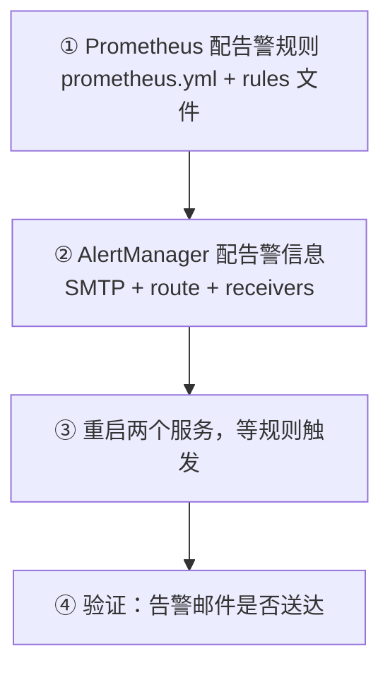

# Kubernetes 认证考点: 配好 Prometheus 告警规则与 AlertManager 的邮件告警

规则写了但永远不触发，是告警配置里最常见的失败方式 —— 通常不是规则写错，而是两处配置没对上。

结论：**就三步 —— ① 在 Prometheus 里配置告警规则；② 在 AlertManager 里配置告警信息（这次实验用邮件告警，要配 SMTP 服务与接收人邮箱）；③ 全部配好后等规则触发、看邮件有没有来。要改的是两个文件：`prometheus.yml`（静态采集 + 指向 AlertManager 的 `localhost:9093` + `rule_files`）和一个告警规则文件（定义告警分组、名称、表达式、阈值、摘要描述）；AlertManager 侧关键是 `global` 里的 SMTP 配置、`route` 的分组策略、`receivers` 里的 email/webhook 两种接收器。配完必须把 Prometheus 和 AlertManager 两个服务重启，规则才会生效。**

## 纲要

- 三步与两个要改的文件
- prometheus.yml：告警相关的三个段
- 告警规则文件：两条规则怎么写
- AlertManager：SMTP 配置（三个坑）
- 路由分组：四个时间旋钮
- 接收器：email 与 webhook
- 重启与等待验证

## 三步



**第一步在 Prometheus 中配置告警规则；第二步在 AlertManager 中配置告警信息；这次使用邮件告警，需要配置邮件的 SMTP 服务以及接收人邮箱地址等；第三步全部配置好之后，剩下的就是等待，看配置的告警规则是否正常触发、看告警通知邮件是否正常发送过来。**

## 两个要改的文件

**项目源码的 `observability` 目录里一共有三个文件，其中两个需要修改：一个是 Prometheus 里的静态采集（static targets），另一个就是告警规则文件。**

```text
observability/
├── prometheus.yml          ← 改：静态采集 + alertmanager 地址 + rule_files 引用
├── alert_rules.yml         ← 改：告警分组与告警规则信息
└── alertmanager.yml        ← 改：SMTP + route + receivers
```

## prometheus.yml：告警相关的三个段

**里面有两段，`alerting` 一段、`rule_files` 一段，可以配置 AlertManager 服务如何请求告警服务，因为都不在本地，所以用 `localhost:9093` 端口。然后这里再定义 `rules` 这样的一个规则文件。**

```yaml
# prometheus.yml
global:
  scrape_interval: 15s
  evaluation_interval: 15s      # ← 告警规则的检查周期

# 静态采集（前面讲过的那一段）
scrape_configs:
  - job_name: prometheus
    static_configs:
      - targets: ['localhost:9090']
  - job_name: user-service
    static_configs:
      - targets: ['user-service:8080']

# ① 指向告警服务：Prometheus 满足规则后调它
alerting:
  alertmanagers:
    - static_configs:
        - targets: ['localhost:9093']

# ② 规则文件：告警分组与告警规则的信息都在这里定义
rule_files:
  - /etc/prometheus/rules/*.yml
```

**关键在于分清两件事：`alerting` 说的是"告警往哪发"，`rule_files` 说的是"什么时候算告警"。** 前者写地址，后者写条件。

## 告警规则文件

**规则文件里主要是去定义告警分组、告警规则信息，里面有告警的名称；我们这里配置了两个告警名称，下面是它的表达式（expression）—— 指标怎么来、触发的阈值是什么。**

```yaml
# alert_rules.yml
groups:
  - name: service-alerts
    rules:
      # 告警一：服务没起来
      - alert: ServiceDown
        expr: up{job="user-service"} == 0      # ← 这个指标等于 0 时说明服务没有启动
        for: 1m
        labels:
          severity: critical
        annotations:
          summary: "服务未启动"
          description: "user-service 的 up 指标为 0，服务未启动或采集失败"

      # 告警二：线程数过多
      - alert: TooManyGoroutines
        expr: go_goroutines{job="user-service"} > 3   # ← 超过三个线程
        for: 5m                                       # ← 并且持续五分钟这种状态
        labels:
          severity: warning
        annotations:
          summary: "线程数过多"
          description: "user-service 的 goroutines 超过 3 且持续 5 分钟"
```

三个点要读懂：

| 字段 | 含义 | 常见错法 |
| --- | --- | --- |
| `alert` | 告警名称，**分组的维度也是它** | 一堆告警叫同一个名字 → 全被合并成一条 |
| `expr` | 判定表达式 | 忘了带 `{job=...}`，匹配到了所有 job → 误报 |
| `for` | 条件要持续多久才算数 | 不写 `for`，抖动一下就报警告 |
| `labels.severity` | 路由依据 | 不写标签 → route 匹配不上，走 default |
| `annotations` | 摘要和描述 | 只写死文本，没带 `{{ $labels.* }}` → 收到看不出是谁 |

**Prometheus 根据这些规则就会定时去查看指标是不是达到阈值、持续时间是不是都满足条件；如果满足条件，它就会调用 AlertManager 服务发送这个告警通知。**

```text
两条规则的触发语义（对照写）
ServiceDown       up{job="user-service"} == 0 且持续 1 分钟  → firing
TooManyGoroutines go_goroutines{job="user-service"} > 3 且持续 5 分钟 → firing

注意：go_goroutines 是个瞬时向量，直接比 > 3 会跟着采样抖动跳
     生产上更常见写法是 rate/increase 套一层，或加 absent()
```

## AlertManager：SMTP 配置的三个坑

**AlertManager 里我们这次实验的是邮件告警，需要注意在 `global` 里面设置 SMTP。这几个地方要留意：首先第一个是 SMTP 服务器 —— 我们用 163（网易邮箱）试过，本地可以用 25 端口，在云厂商的服务器上 25 端口用不了，那我们换成 465 端口是可以的；还有在海外的话，465 端口安全验证不通过，如果在海外或者香港，可以用 gmail 服务器。**

三个坑拆开说：

| 坑 | 现象 | 处理 |
| --- | --- | --- |
| **25 端口在云上被封** | 本地能发，一上云就超时/连接拒绝 | 换 **465**（SSL）或 587（STARTTLS） |
| **海外/香港 465 安全校验不过** | TLS 握手失败 | 海外换 **Gmail SMTP**，端口与来源邮箱跟着换 |
| **填了邮箱登录密码** | 登录失败 | 要填 **SMTP 授权码**，不是邮箱密码 |

**还有这个密码要注意：我们开通 SMTP 服务，它会给我们生成一个授权码，这个密码不是我们的邮箱密码，而是这个授权码单独给 SMTP 服务用的。拿到这个授权码，我们就可以填写进来。**

```yaml
# alertmanager.yml
global:
  resolve_timeout: 5m
  smtp_smarthost: 'smtp.163.com:465'   # ← 云上 25 用不了 → 465；海外换 smtp.gmail.com:465
  smtp_from: 'alert@example.com'       # ← 来源邮箱，必须和下面 auth_username 同一个
  smtp_auth_username: 'alert@example.com'
  smtp_auth_password: 'xxxxxxxxxxxx'   # ← SMTP 授权码，不是邮箱密码！
  smtp_require_tls: true

route:
  receiver: email                      # ← 默认接收器
  group_by: [alertname]                # ← 根据告警名称来做分组
  group_wait: 30s                      # 新告警组创建时，等多久才发第一次通知
  group_interval: 5m                   # 同组两次通知之间的最小间隔
  repeat_interval: 5m                  # 告警一直 firing 不恢复时，多久重复提醒
  routes:
    - matcher: 'severity="critical"'
      receiver: email
      continue: false
    - matcher: 'severity="warning"'
      receiver: email
      continue: true

receivers:
  - name: email
    email_configs:
      - to: 'oncall@example.com'       # ← 接收人邮箱地址
        from: 'alert@example.com'
        smarthost: 'smtp.163.com:465'
        require_tls: true
  - name: webhook
    webhook_configs:
      - url: 'http://im.internal/hook/alert'   # ← webhook 类型要配回调地址
```

**第四个时间旋钮的含义，一次说清：**

| 字段 | 触发时机 | 取值参考 |
| --- | --- | --- |
| `group_wait` | **一个新的告警组刚创建**时，等这么久才发第一条 | 10s~1m（越小越及时） |
| `group_interval` | 同一个组**两次通知**之间的最小间隔 | 1m~5m |
| `repeat_interval` | 告警**一直 firing 不恢复**，多久重复发一次 | 1h~4h（课程里实验用 5 分钟） |
| `resolve_timeout` | 多久收不到告警就当已解决 | 5m |

> **课程里那句"五分钟之后就可以发出去了"，指的就是 `repeat_interval` 设成 5 分钟** —— 意思是告警一直响着没恢复的话，超过 5 分钟才会再提醒一次，中间若还在 `group_interval` 内就不会重复发。

## 接收器：可以配很多组

**receiver 里面我们定义了两个：一个是 webhook，一个是 email。我们这里会通过邮件来发送告警。当然我们可以设置很多个接收组、很多个接收组；这些组如果都用的话，邮箱地址也可以是不一样的，不同类型、不同重要程度的告警发给不同的人是都可以设置的。**

```text
接收器（receivers）的分组思路
├── email 组 → oncall@example.com、manager@example.com（不同邮箱）
├── webhook 组 → IM 群机器人 / 自研值班平台回调地址
└── 按 severity 路由：
    critical → email（值班）+ webhook（电话/短信）
    warning  → email（群邮）
    其他      → default
```

**不同接收器类型的配置项不一样：webhook 类型需要配一个回调地址，email 类型需要配置接收人的邮箱地址。**

**后面自定义告警的时候还可以再来处理这些接收组 —— 这一段其实就是其他配置，屏蔽什么告警、可以配一些标签，具体就不讲了。我们主要把邮件告警搞定，能够发送邮件就好了。**

## 重启与验证

**这些都配置好之后，把 Prometheus 服务和 AlertManager 服务重启一下，然后就可以等着，等它触发这些告警规则满足条件了，就会发送告警邮件了。**

如果要在容器里演示这个操作，**需要进到容器里面修改 Prometheus 和 AlertManager 的配置，还要重启服务，再等待这些操作和等待** —— 这一步才能真正看到邮件发出去。

```bash
# 改完配置必须重启（Prometheus/AlertManager 都不热加载告警相关的全局配置）
# 先给变量赋值，例如：POD=$(kubectl get pod -n monitoring -o jsonpath='{.items[0].metadata.name}')
kubectl exec -it $POD -- sh
  # 容器内：改配置
  vi /etc/prometheus/prometheus.yml
  vi /etc/prometheus/rules/alert_rules.yml
  vi /etc/alertmanager/alertmanager.yml
  # 重启两个进程（不是 restart pod，是杀进程让 supervisor/容器重起）
  kill -HUP $(pidof prometheus)       # 部分配置可热加载
  kill -TERM $(pidof alertmanager)
  exit

# 或直接回滚重建，更简单：
kubectl rollout restart deployment/monitor
kubectl logs -l app=monitor --tail=50
```

验证顺序（照着排，哪一步断了就知道卡在哪）：

```text
① 规则有没有被加载
   curl -s localhost:9090/api/v1/rules | python3 -m json.tool
   期望：看到 service-alerts 组 + 两条规则，health = ok

② 阈值到了没触发
   curl -s 'localhost:9090/api/v1/query' --data-urlencode 'query=up{job="user-service"}'
   期望：value = 0（或 go_goroutines > 3）且持续 for 的时间已过

③ Prometheus 有没有把告警发出去
   curl -s localhost:9093/api/v2/alerts
   期望：能看到 $labels.alertname=ServiceDown 的告警实例

④ 收没收到邮件
   看 oncall@example.com 的收件箱；没收到就按下面这条链逐段排查
```

```text
邮件没到时的排查顺序（从后往前）
├── 邮箱里没有？
│   ├── AlertManager 进程是不是活着、日志有没有 smtp 报错   ← 先看这里
│   ├── 25/465 端口通不通（云上 25 多半不通）              ← 最常卡这一步
│   ├── 授权码对不对（是不是填了邮箱登录密码）              ← 第二常卡
│   └── from / auth_username 是不是同一个邮箱              ← 网易会拒
├── 有日志但报 connection refused → 安全组/防火墙没放 465
├── 有日志但报 535 auth failed   → 授权码错或没开 SMTP 服务
└── 告警实例压根没出现            → 回到 ①②，规则没加载或 for 时间没到
```

## API 速览

| 字段 | 文件 | 作用 |
| --- | --- | --- |
| `alerting.alertmanagers` | prometheus.yml | 告警往哪发（9093） |
| `rule_files` | prometheus.yml | 指向告警规则文件 |
| `evaluation_interval` | prometheus.yml | 告警规则检查周期 |
| `groups[].name` | 规则文件 | 规则分组 |
| `alert` | 规则文件 | 告警名（也是分组维度） |
| `expr` / `for` | 规则文件 | 条件与持续时间 |
| `labels.severity` | 规则文件 | 路由匹配依据 |
| `annotations.summary/description` | 规则文件 | 邮件正文内容 |
| `global.smtp_smarthost` | alertmanager.yml | SMTP 地址+端口（25/465/587） |
| `global.smtp_auth_password` | alertmanager.yml | **SMTP 授权码，不是邮箱密码** |
| `route.group_by` | alertmanager.yml | 按什么合并（课程用告警名称） |
| `route.group_wait` / `group_interval` / `repeat_interval` | alertmanager.yml | 通知节奏三旋钮 |
| `receivers[].email_configs[].to` | alertmanager.yml | 收件人地址 |
| `receivers[].webhook_configs[].url` | alertmanager.yml | 回调地址 |

## Demo 示例

一份改完就能用的完整配置：

```yaml
# ===== prometheus.yml（只列告警相关段）=====
global:
  scrape_interval: 15s
  evaluation_interval: 15s

alerting:
  alertmanagers:
    - static_configs:
        - targets: ['localhost:9093']

rule_files:
  - /etc/prometheus/rules/*.yml

scrape_configs:
  - job_name: prometheus
    static_configs: [{ targets: ['localhost:9090'] }]
```

```yaml
# ===== rules/alert_rules.yml =====
groups:
  - name: service-alerts
    rules:
      - alert: ServiceDown
        expr: up{job="user-service"} == 0
        for: 1m
        labels: { severity: critical }
        annotations:
          summary: "服务 {{ $labels.job }} 未启动"
          description: "up 指标为 0，已持续 1 分钟，请检查容器状态"

      - alert: TooManyGoroutines
        expr: go_goroutines{job="user-service"} > 3
        for: 5m
        labels: { severity: warning }
        annotations:
          summary: "{{ $labels.job }} 线程数过多"
          description: "goroutines 超过 3 且持续 5 分钟"
```

```yaml
# ===== alertmanager.yml =====
global:
  resolve_timeout: 5m
  smtp_smarthost: 'smtp.163.com:465'
  smtp_from: 'alert@example.com'
  smtp_auth_username: 'alert@example.com'
  smtp_auth_password: 'SMTP授权码'
  smtp_require_tls: true

route:
  receiver: email
  group_by: [alertname]
  group_wait: 30s
  group_interval: 5m
  repeat_interval: 5m

receivers:
  - name: email
    email_configs:
      - to: 'oncall@example.com'
        from: 'alert@example.com'
        smarthost: 'smtp.163.com:465'
        require_tls: true
        send_resolved: true          # ★ 恢复通知也发出来，别让人一直挂着
  - name: webhook
    webhook_configs:
      - url: 'http://im.internal/hook/alert'
        send_resolved: true
```

快速自测（不用等真实故障）：

```yaml
# 用一个恒真规则把整条链路逼出来
groups:
  - name: smoke
    rules:
      - alert: AlwaysFiring
        expr: vector(1)
        for: 15s
        labels: { severity: critical }
        annotations:
          summary: "告警链路自测"
```

```bash
# 等 30s（group_wait）前后看这一条链
watch -n5 'curl -s localhost:9090/api/v1/rules | head -c 200; echo;
           curl -s localhost:9093/api/v2/alerts | head -c 200'
```

## 总结

告警配出来不难，配出**会响、会收到、不会吵**的告警才是本事。这一节的核心复盘：

1. **两处配置、两个服务**：规则在 **Prometheus**（条件），投递在 **AlertManager**（SMTP、路由、接收人）—— 别忘了 Prometheus 靠 `alerting.alertmanagers` 里的 `localhost:9093` 找到它；
2. **规则三要素**：`alert` 名称 + `expr` 表达式 + `for` 持续时间；再加 `labels.severity` 做路由依据、`annotations` 写摘要描述（**一定要带 `{{ $labels.* }}`，否则收到邮件看不出是哪个服务**）；
3. **两条示范规则**：`up == 0` 表示服务没启动；`go_goroutines > 3` 且持续 5 分钟表示线程数过多；
4. **SMTP 三个坑**：**云厂商服务器 25 端口用不了 → 换 465；海外/香港 465 安全验证不过 → 换 Gmail；密码不是邮箱密码，是开通 SMTP 时生成的授权码**；来源邮箱必须和 `smtp_from` / `auth_username` 一致；
5. **通知节奏三旋钮**：`group_wait`（新组等多久发第一条）、`group_interval`（同组最小间隔）、`repeat_interval`（不恢复时多久重复提醒，课程实验设 5 分钟）；分组用 `group_by: [alertname]` 按告警名称分；
6. **接收器可以很多组**：email 配收件人地址、webhook 配回调地址；**不同重要程度的告警发给不同人，靠的就是 `receivers` 多组 + `routes` 按标签匹配**；
7. **改完必须重启 Prometheus 和 AlertManager**，规则才生效；
8. **验收顺序**：规则加载 → 阈值触发 → AlertManager 收到告警实例 → 邮件送达；卡住时从这条链的最后一段往回查，80% 卡在 465 端口和授权码这两项上。

