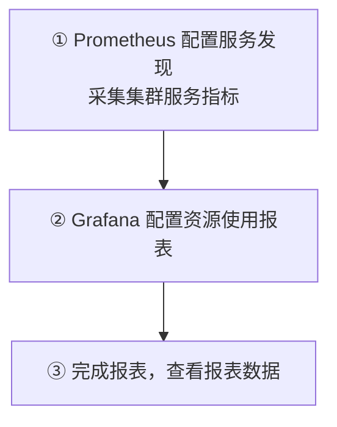

# Kubernetes 认证考点: 配好动态服务发现采集集群指标，并在 Grafana 出资源报表

静态 `static_configs` 只能抓自己写死的那几个地址，服务一多就配不完，也不自动跟扩缩容。

结论：**三步 —— ① 在 Prometheus 里配置服务发现，采集到 K8s 集群的服务指标；② 在 Grafana 里配置服务的资源使用报表；③ 看报表的数据。这次改用 yaml 文件 + `kubectl apply` 的方式部署（不再在页面点选），`observability/prometheus-k8s` 目录里装的是 account.yaml（ServiceAccount + ClusterRole + 绑定）、两个 Service 和一个 Deployment；Service 特意用 **NodePort**（前面都是 ClusterIP）把 33001/33002 直接透出；Prometheus 侧从 `static_configs` 换成 `kubernetes_sd_configs`，配 `role: node` / `role: endpoints` / `apiserver` 三类任务，靠 Service 上的 `prometheus.io/port` 这类 annotation 自动找到目标；最后把配置 copy 进容器重启，就能在 targets 里看到自动发现出来的节点、服务和容器指标。**

## 纲要

- 三步与本次的部署方式变化
- account.yaml：权限三件套
- Service 用 NodePort 透出
- 一个关键 annotation 让服务被自动发现
- prometheus.yml：三类动态任务
- 落地操作顺序
- 进容器验证权限
- 在 Grafana 里出四张资源面板

## 三步与方式变化



**前一次启用 Prometheus 和 Grafana 是在腾讯云容器服务页面上手动创建 Deployment 和 Service；这一次要做的事情更多，所以换一种方式 —— 直接用 yaml 文件的方式，然后通过 kubectl 命令在服务器上执行这些 yaml 文件。**

```text
observability/
├── prometheus-k8s/                 ← 本次新增目录
│   ├── account.yaml                ← 创建账号、角色及绑定
│   ├── prometheus.yml              ← 采集配置（本次的操作手册）
│   ├── service-grafana.yaml        ← Grafana Service
│   ├── service-prometheus.yaml     ← Prometheus Service（NodePort）
│   └── deployment-prometheus.yaml  ← Deployment
└── ...
```

## account.yaml：权限三件套

**account 文件里创建了一个集群角色（ClusterRole）"prometheus"，需要的资源接口权限（node、service、endpoint、pod 等）我们都配置上去；再创建一个 ServiceAccount，命名空间是 `monitoring`；所以需要先手动创建命名空间，账号名称是 `prometheus`，最后把角色和账号进行绑定。创建完之后，使用普罗米修斯的账号就有相应的权限了，可以访问到节点、service、endpoint、pod 等资源接口的权限。**

```yaml
# account.yaml
apiVersion: v1
kind: Namespace
metadata:
  name: monitoring                  # ★ 要先手动创建

---
apiVersion: v1
kind: ServiceAccount
metadata:
  name: prometheus
  namespace: monitoring

---
apiVersion: rbac.authorization.k8s.io/v1
kind: ClusterRole
metadata:
  name: prometheus
rules:
  - apiGroups: [""]
    resources: ["nodes", "services", "endpoints", "pods"]
    verbs: ["get", "list", "watch"]
  - apiGroups: ["extensions"]
    resources: ["ingresses"]
    verbs: ["get", "list", "watch"]
  - apiGroups: ["networking.k8s.io"]
    resources: ["ingresses"]
    verbs: ["get", "list", "watch"]
  - apiGroups: ["metrics.k8s.io"]
    resources: ["pods", "nodes"]
    verbs: ["get", "list", "watch"]

---
apiVersion: rbac.authorization.k8s.io/v1
kind: ClusterRoleBinding
metadata:
  name: prometheus
roleRef:
  apiGroup: rbac.authorization.k8s.io
  kind: ClusterRole
  name: prometheus
subjects:
  - kind: ServiceAccount
    name: prometheus
    namespace: monitoring
```

> **为什么必须是 ClusterRole 不能是 Role**：动态服务发现要"遍历全集群的节点和 endpoint"，权限作用域必须跨命名空间，`Role` 只能管一个 namespace 的东西。

## Service 用 NodePort 透出

**第二个是 Service，我们要创建一个 Prometheus 监控 Service，这个 Service 的类型大家要注意一下 —— 前面配置的都是普通的 ClusterIP 类型，这里用的是 NodePort 类型，可以直接暴露出集群的端口出来。这里的端口我们配置了 33001 和 33002，分别对应 Grafana 和 Prometheus 端口；那我们访问的时候，只要用集群云主机的外网 IP 加上这里的端口就可以直接访问了。NodePort 类型可以用来暴露个别的服务。**

```yaml
# service-prometheus.yaml / service-grafana.yaml
apiVersion: v1
kind: Service
metadata:
  name: prometheus
  namespace: monitoring
spec:
  type: NodePort                    # ← 前面都是 ClusterIP，这次换 NodePort
  selector: { app: prometheus }
  ports:
    - name: prometheus
      port: 9090
      targetPort: 9090
      nodePort: 33002               # ← 33001 给 Grafana，33002 给 Prometheus
```

```text
访问路径对比
ClusterIP：只在集群内可达 → 要另配 Ingress 才能外网访问
NodePort：NodeIP:33002 直接可达 → 省掉一层 Ingress
  <云主机外网IP>:33002  → NodePort → Service:9090 → Pod:9090
```

**这种写法的取舍**：少一层 Ingress 配置，适合"个别服务想快速露出去"；代价是**节点端口冲突、并且把服务直接暴露在节点网络上**，所以正式环境更常见的是 NodePort 打底 + Ingress 收敛入口。

## 一个关键 annotation 让服务被自动发现

**还有一个 service 的 yaml 文件，这里有一点点特别：我们在 service 的 metadata 中增加了一个 annotation，加上一些标签，把 prometheus 的 port 和 scheme 配置进去。有了这些信息，在 Prometheus 的动态发现时它就能自动找到这个服务 —— 这是它的 8080 端口，就会自动去采集这个 8080 端口的指标数据。这就是动态的服务发现，有这种标签它就能找到这个服务。**

```yaml
apiVersion: v1
kind: Service
metadata:
  name: user-service
  namespace: default
  annotations:
    prometheus.io/scrape: "true"     # ← 允许发现
    prometheus.io/port: "8080"       # ← 抓哪个端口
    prometheus.io/path: "/metrics"   # ← 抓哪个路径
spec:
  selector: { app: user-service }
  ports:
    - port: 8080
      targetPort: 8080
```

这个注解是**"服务自带可观测性声明"** —— 谁起服务谁顺手写上，监控那边不用记住这个地址，规则一改就全集群生效。

## Deployment 锁定账号

**再来看一下部署，部署的标签信息和模板配置里 container 的一些配置、暴露的端口、资源的需求。要注意：这里加了一个 `serviceAccountName`，就是前面 account.yaml 文件中定义的账号；我们需要锁定这个账号，那容器就会有这个账号的权限了。**

```yaml
apiVersion: apps/v1
kind: Deployment
metadata:
  name: prometheus
  namespace: monitoring
spec:
  replicas: 1
  selector:
    matchLabels: { app: prometheus }
  template:
    metadata:
      labels: { app: prometheus }
    spec:
      serviceAccountName: prometheus    # ★ 锁定账号，容器才有读 API 的权限
      containers:
        - name: prometheus
          image: registry.internal/observability/prometheus:2.53
          ports:
            - { containerPort: 9090, name: prometheus }
          resources:
            requests: { cpu: "300m", memory: "512Mi" }
            limits:   { cpu: "1",    memory: "2Gi" }
          volumeMounts:
            - { name: data,  mountPath: /data }
            - { name: cfg,   mountPath: /etc/prometheus }
      volumes:
        - name: data
          emptyDir: {}
        - name: cfg
          configMap:
            name: prometheus-config
```

## prometheus.yml：三类动态任务

**Prometheus 这个配置文件就跟以前不一样了。以前很简单，只有一个 static_configs；现在增加的是自动的服务发现方式。job_name 就是采集任务的名称。下面是 kubernetes_sd_configs，使用 node 角色，要有 node 节点的访问权限，然后去请求；下面这个 bearer_token 和 tls_config 是容器内用户的身份和 SSL 证书，有这两个才能够请求到 APIServer，需要 node 角色的权限才能够正常返回。**

```yaml
# prometheus.yml（动态版）
scrape_configs:
  # ① 每个节点上的 kubelet / cAdvisor
  - job_name: 'kubernetes-nodes'
    kubernetes_sd_configs:
      - role: node
    bearer_token_file: /var/run/secrets/kubernetes.io/serviceaccount/token
    tls_config:
      ca_file: /var/run/secrets/kubernetes.io/serviceaccount/ca.crt
    relabel_configs:
      - source_labels: [__address__]
        target_label: __address__
        regex: '(.*):10250'
        replacement: '$1:10255'          # 只读端口，只读权限更安全
      - source_labels: [__meta_kubernetes_node_name]
        target_label: node

  # ② endpoints 角色：靠 Service 上的 annotation 找到目标
  - job_name: 'kubernetes-services'
    kubernetes_sd_configs:
      - role: endpoints
    bearer_token_file: /var/run/secrets/kubernetes.io/serviceaccount/token
    tls_config:
      ca_file: /var/run/secrets/kubernetes.io/serviceaccount/ca.crt
    relabel_configs:
      # ★ 只有带 prometheus.io/scrape=true 的服务才留下
      - source_labels: [__meta_kubernetes_service_annotation_prometheus_io_scrape]
        action: keep
        regex: true
      - source_labels: [__meta_kubernetes_service_annotation_prometheus_io_port]
        action: replace
        target_label: __address__
        regex: (.+);(.+)
        replacement: $1:$2

  # ③ API Server 自身指标
  - job_name: 'kubernetes-apiservers'
    kubernetes_sd_configs:
      - role: endpoints
    bearer_token_file: /var/run/secrets/kubernetes.io/serviceaccount/token
    tls_config:
      ca_file: /var/run/secrets/kubernetes.io/serviceaccount/ca.crt
    relabel_configs:
      - source_labels: [__meta_kubernetes_namespace, __meta_kubernetes_service_name, __meta_kubernetes_endpoint_port_name]
        action: keep
        regex: default;kubernetes;https
```

三类角色的分工，一次说清：

| `role` | 发现什么 | 抓到的典型指标 |
| --- | --- | --- |
| `node` | 每个节点上的 kubelet / **cAdvisor**（组件管理节点上的 docker 和 container，指标从这里读） | `node_cpu_seconds_total`、`container_*`、节点内存 |
| `endpoints` | Service 背后的 Pod 端点，**靠 annotation 筛** | 业务自定义指标、`inv_request` |
| `apiserver` | API Server 本身 | `apiserver_request_*`、etcd、controller-manager |

**动态发现能采集到的数据有很多，当然配置也会有很多（`role: pod` / `role: service` / `role: ingress` 等还有别的玩法）。**

## 落地操作顺序

**先把这些文件复制到服务器上去，登录到服务器进入目录里操作：创建 account，把账号、角色和绑定都创建好，成功了；然后部署 Prometheus 的服务，很快把 Service 和 Deployment 创建好了；Deployment 创建成功了。**

```bash
# 1. 先建账号体系
kubectl create -f account.yaml
kubectl get sa,clusterrole,clusterrolebinding -n monitoring

# 2. 部署 Prometheus 的 Service 和 Deployment
kubectl create -f service-prometheus.yaml
kubectl create -f service-grafana.yaml
kubectl create -f deployment-prometheus.yaml
kubectl get deploy,svc -n monitoring

# 3. 等 Pod 起来
kubectl get pod -n monitoring -w
```

## 进容器验证权限

**接下来登录到 Prometheus 容器里面来验证它的账号权限。我们在里面查看一下这个结果是否有权限 —— 这几个请求都用了容器的用户身份、本地的 token，把这个用户身份传进去；前面这两个是要用 namespace 和 node 的信息，下面再调用的是指标的数据。我们来访问一下，看看是否正常，数据、数据量还是挺多的 —— 说明权限这一块是没问题的。**

```bash
TOKEN=$(cat /var/run/secrets/kubernetes.io/serviceaccount/token)
NS=$(cat /var/run/secrets/kubernetes.io/serviceaccount/namespace)
CA=/var/run/secrets/kubernetes.io/serviceaccount/ca.crt

# ① 能不能列节点（对应 ClusterRole 里 nodes 的 list）
curl -s --cacert $CA -H "Authorization: Bearer $TOKEN" \
  https://$KUBERNETES_SERVICE_HOST:$KUBERNETES_SERVICE_PORT/api/v1/nodes | head -c 200

# ② 能不能列 endpoint
curl -s --cacert $CA -H "Authorization: Bearer $TOKEN" \
  https://$KUBERNETES_SERVICE_HOST:$KUBERNETES_SERVICE_PORT/api/v1/namespaces/$NS/endpoints | head -c 200

# ③ 指标端口够不够读
curl -s localhost:10255/metrics | head -5     # kubelet / cAdvisor 的指标
```

> **权限没给够时的典型症状**：Prometheus 的 targets 里 `kubernetes-nodes` 全 down、日志刷 `403 Forbidden`，但容器看起来一切正常 —— 权限问题必须靠上面这三条命令单独验，不能只看"Pod  Running"。

## 换配置重启

**因为容器里的配置文件还是默认的，所以它是采集不到这些接口的。我们进入到 Prometheus 的安装目录，把本地的 Prometheus 配置文件复制进去；新建一个文件，把这个 Prometheus 配置文件的内容 copy 进去，copy 完之后我们要把 Prometheus 重启 —— 先把进程杀掉，再启动起来。**

```bash
kubectl exec -it -n monitoring deploy/prometheus -- sh
  # 容器内
  cp /mnt/prometheus.yml /etc/prometheus/prometheus.yml
  kill $(pidof prometheus) && /usr/local/bin/prometheus \
      --config.file=/etc/prometheus/prometheus.yml \
      --storage.tsdb.path=/data/ > /var/log/prom.log 1>&1 &
```

## 验证 targets

**我们看一下 33002 端口（Prometheus 服务端口）。这里有很多 targets：首先是 kubelet 里面发现了一个节点，这个节点的指标数据能够正常读取到；APIServer 还没有读取到，所以 up 是 0；kubernetes-services 找到了两个服务，一个是 8080 端口（我们自己的 user-service），还有一个是 kube-dns，它也配置了 prometheus annotation —— 这是服务发现。再刷新一下，APIServer 这个也已经察觉到了。**

```text
Targets 视图（刷新后）
├── kubernetes-nodes     1/1  UP      node01，10255 上 kubelet + cAdvisor
├── kubernetes-apiservers 0/1  DOWN   up=0，还没配好（后面补）
├── kubernetes-services  2/2  UP      user-service:8080、kube-dns
├── apiserver 等组件                   container / coredns / etcd / kubelet 指标齐全
└── 业务自定义指标                     inv_request 也会被采集进来
```

```bash
# 先给变量赋值，例如：NODE_IP=1.2.3.4
curl -s "http://$NODE_IP:33002/api/v1/targets" | \
  python3 -c "
import sys,json
for t in json.load(sys.stdin)['data']['activeTargets']:
    print(t['scrapePool'], '|', t['labels'].get('job'), '|', t['scrapeUrl'], '|', t['health'])"
# kubernetes-nodes | node01 | http://10.0.0.11:10255/metrics | up
# kubernetes-services | user-service | http://10.0.0.11:31234/metrics | up
```

**里面的指标就非常非常多了：apiserver、container、coredns、etcd、kubelet 等等；我们自定义的 `inv_request` 这个指标也会被采集进来。**

## 在 Grafana 里出四张资源面板

**在 Grafana 里配置一下报表，把这些指标的数据配到报表里面来。进来之后先配 datasource，这个操作过几遍了 —— host 填 9090 保存；然后新建一个 dashboard 配一下名字。**

**我们按文档里的"CPU 使用率"把它复制进来，有什么指标就用什么指标，指标的名字有可能不一样，我们改一下名字，把 container 显示出来 —— 能看到两个容器，一个是 Prometheus 的服务，一个是 user-service，这是 CPU 的使用情况，使用率还非常低。**

```text
Panel 1：CPU 使用率
├── 指标：rate(container_cpu_usage_seconds_total[5m])
├── 分组：by (container, pod, namespace)
├── 显示：两个容器 → prometheus 服务 / user-service
└── 改标题、调单位（percent）

Panel 2：内存使用情况
├── 指标：container_memory_usage_bytes
├── 分组：by (container, pod)
└── 标题改成「container 内存」

Panel 3 + 4：网络
├── 接收数据（入向）
├── 读 / 写（磁盘 I/O）
└── 往外写的传输速率（网络发送）
** 网络这块按 pod 分组
```

三个面板的查询骨架：

```text
# CPU 使用率（换成真实的 container 指标名即可用）
sum(rate(container_cpu_usage_seconds_total{namespace="default"}[5m]))
  / sum(kube_pod_container_resource_requests{resource="cpu",
       namespace="default"} ) by (container)

# 内存使用情况
sum(container_memory_usage_bytes{namespace="default"}) by (container)

# 网络（按 pod 分组）
sum(rate(container_network_receive_bytes_total[5m]))   by (pod)   # 接收
sum(rate(container_network_transmit_bytes_total[5m]))  by (pod)   # 往外写
sum(rate(container_fs_read_bytes_total[5m]))           by (pod)   # 读
sum(rate(container_fs_write_bytes_total[5m]))          by (pod)   # 写
```

**现在一个报表就出来了，那里面有两个服务 —— user-service 和 Prometheus —— 它们的网络传输、CPU、内存这些资源情况都出来了。操作的时候按文档和这些配置文件走一遍，应该都能得到想要的效果。**

## API 速览

| 对象 / 字段 | 位置 | 作用 |
| --- | --- | --- |
| `Namespace monitoring` | account.yaml | 先手动建 |
| `ServiceAccount prometheus` | account.yaml | 容器内的身份 |
| `ClusterRole` + `ClusterRoleBinding` | account.yaml | 给 nodes/services/endpoints/pods 的读权限 |
| `serviceAccountName` | Deployment | 把权限挂进 Pod |
| `type: NodePort` + `nodePort` | Service | 33001/33002 直接透出 |
| `prometheus.io/scrape/port/path` | Service annotation | 动态发现的目标声明 |
| `kubernetes_sd_configs[].role` | prometheus.yml | node / endpoints / pod / service / ingress |
| `bearer_token_file` + `tls_config.ca_file` | prometheus.yml | 能请求 APIServer 的凭据 |
| `relabel_configs action: keep` | prometheus.yml | 按 annotation 过滤目标 |
| `__meta_kubernetes_service_annotation_*` | 内置标签 | 读 Service 上的注解 |
| kubelet 10255 / cAdvisor | 节点 | 节点与容器指标来源 |
| `container_cpu/memory/network_*` | 指标名 | 面板取数用 |

## Demo 示例

从零到出图的最短清单：

```bash
# 1. 应用全部文件（顺序：账号 → 服务 → 部署）
kubectl create -f account.yaml
kubectl create -f service-prometheus.yaml
kubectl create -f service-grafana.yaml
kubectl create -f deployment-prometheus.yaml

# 2. 等 Pod 就绪
kubectl -n monitoring rollout status deploy/prometheus

# 3. 进容器验权限（403 就是 ClusterRole 没给够）
TOKEN=$(cat /var/run/secrets/kubernetes.io/serviceaccount/token)
curl -s --cacert /var/run/secrets/kubernetes.io/serviceaccount/ca.crt \
  -H "Authorization: Bearer $TOKEN" \
  "https://$KUBERNETES_SERVICE_HOST:$KUBERNETES_SERVICE_PORT/api/v1/nodes" -o /dev/null -w '%{http_code}\n'
# 期望 200

# 4. 换配置 + 重启
kubectl cp prometheus.yml -n monitoring deploy/prometheus:/etc/prometheus/prometheus.yml
kubectl exec -n monitoring deploy/prometheus -- kill $(pidof prometheus)

# 5. 用节点外网 IP + NodePort 访问
# 先给变量赋值，例如：NODE_IP=1.2.3.4
open http://$NODE_IP:33002/targets
open http://$NODE_IP:33001     # Grafana，密码 admin12345678
```

Grafana 侧三步走：

```text
① Datasource → Add new → Prometheus → URL: http://<podIP>:9090 → Save & test
② Dashboard → New → 命名「集群服务资源情况」
③ + Add panel ×4：
   CPU / 内存 / 网络 / 传输（各复制一份改标题、改指标名）
   保存 → 报表里同时看到 prometheus 与 user-service 两个服务的资源曲线
```

## 总结

从静态采集切到动态服务发现，收益不只是"少写几行配置"：

1. **权限是前提**：`ServiceAccount` + `ClusterRole` + `ClusterRoleBinding` 三件套，再在 Deployment 上写 `serviceAccountName` 把权限带进容器；**必须用 ClusterRole，Role 管不了跨命名空间的节点和 endpoint**；
2. **发现靠 annotation 声明**：Service 上写 `prometheus.io/scrape: "true"` + `port` + `path`，Prometheus 的 `role: endpoints` 任务用 `action: keep` 把它筛出来 —— **谁起服务谁顺手加三行，比运维记一堆地址靠谱**；
3. **三类任务各管一片**：`role: node` 抓 kubelet/cAdvisor（节点与容器指标）、`role: endpoints` 抓业务服务、`apiserver` 抓控制面；
4. **要能请求 APIServer，`bearer_token_file` + `tls_config.ca_file` 缺一不可**；容器里默认的 serviceaccount 证书路径是固定的，别手写路径；
5. **Service 从 ClusterIP 换成 NodePort**（33001 Grafana / 33002 Prometheus），用节点外网 IP + 端口直接访问，省掉一层 Ingress；代价是端口暴露在节点网络上，正式环境建议 NodePort 打底再收敛到 Ingress；
6. **改配置必须杀进程重启**，静态容器里不会热加载；
7. **验证顺序**：targets 里能看到节点 UP、services 找到两个带 annotation 的服务 → 指标里 container/coredns/etcd/kubelet 齐全 → 业务自定义指标 `inv_request` 也被采到；
8. **最后回到 Grafana**：datasource 填 Prometheus 地址，四张面板分别取 CPU、内存、网络（接收/发送）、读写，按 `container` / `pod` 分组 —— 一张报表里同时看到业务服务和 Prometheus 自己的资源曲线，整条链路才算闭环。

