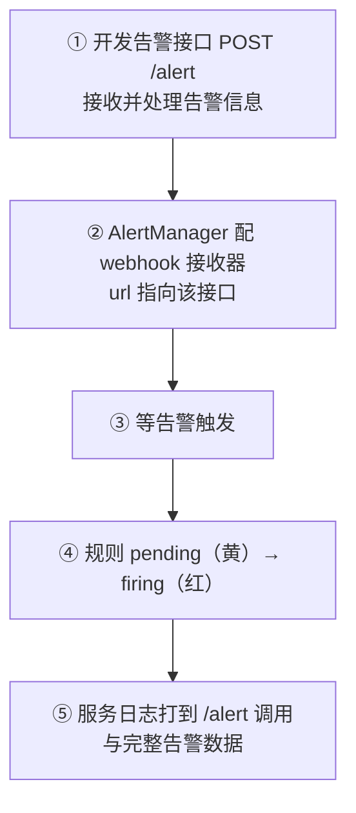
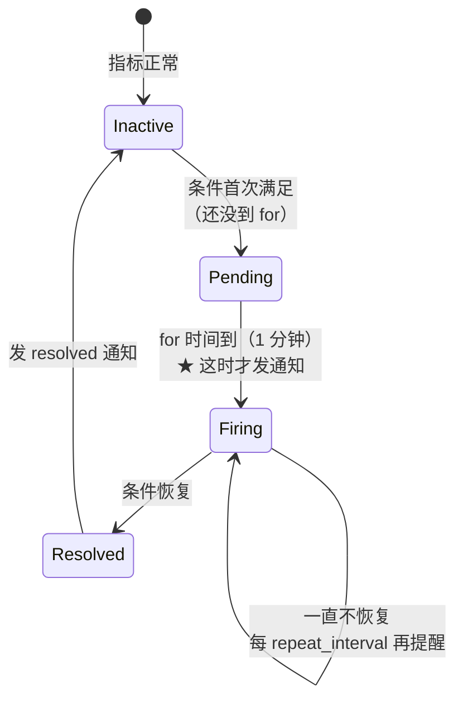

# Kubernetes 认证考点: 用 webhook 接口代码实现 Prometheus 自定义告警通知

邮件告警是最省事的，但真到值班场景里，你往往要的是"弹到后台页面 / 推到企业微信 / 发短信"。

结论：**自定义告警三步 —— ① 开发一个 POST 告警接口接收告警信息（在网关目录里注册一个新接口专门处理告警消息，从 body 里读出 AlertManager 传过来的 JSON 并打印看格式）；② 在 AlertManager 里把 receiver 从 email 改成 webhook，把开发的接口地址（8080 端口上的 `/alert`）配进 webhook_configs 的 url；③ 等告警触发，看接口有没有被调用。这个接口是"灵活和强大"的来源：消息怎么格式化、发给谁、走哪些渠道（短信/企业微信/后台页面提示），全由这一段代码决定。**

## 纲要

- 三步与为什么自定义更常用
- 第一步：写一个接收告警的 POST 接口
- AlertManager 的 webhook 通知数据结构
- 第二步：把 receiver 从 email 改成 webhook
- 第三步：等告警，看状态从黄变红
- 日志里看到调用与完整告警数据
- 自定义通知可以做些什么

## 三步



**这一步会用到前面几节的东西：Prometheus 里已经配好的告警规则、AlertManager 已经能跑起来。不同的只是最后一段投递 —— 不再走 SMTP，而是打到一个自己写的 HTTP 接口上。**

## 第一步：写一个接收告警的 POST 接口

**通过代码来实现自定义告警，首先需要去实现一个接口。这个接口在网关（gateway）目录里面，在方法里面注册一个新的接口，专门来接收和处理告警信息。我们在 `mall.go` 文件（网关启动文件）里定义了一个方法 `PostAlert`，把路由传进去，这里就实现这个 Post 方法的接口。**

> 这里的 `mall.go` 是课程示例项目里的网关入口文件，实际项目里就是"网关路由初始化 + 注册告警 handler"的那个文件。下面给出的是去掉项目耦合、自包含可跑的等价实现。

```go
package main

import (
	"log"
	"net/http"
	"time"

	"github.com/gin-gonic/gin"
)

const (
	alertPath = "/alert"
	alertAddr = ":8080"
)

// AlertAlertManager 推送的单个告警实例
type AlertAlertManager struct {
	Status      string            `json:"status"`       // firing / resolved
	Labels      map[string]string `json:"labels"`       // alertname/severity/job/...
	Annotations map[string]string `json:"annotations"`  // summary/description
	StartsAt    time.Time         `json:"startsAt"`
	EndsAt      time.Time         `json:"endsAt"`
	GeneratorURL string           `json:"generatorURL"`
}

// AlertNotifyBody 是 /api/v2/alerts 的 Webhook 消息体
type AlertNotifyBody struct {
	Receiver string             `json:"receiver"`
	Status   string             `json:"status"`   // firing / resolved
	Alerts   []AlertAlertManager `json:"alerts"`
	GroupLabels map[string]string `json:"groupLabels"`
	CommonLabels map[string]string `json:"commonLabels"`
	Version  string             `json:"version"`
	GroupKey string             `json:"groupKey"`
}

// PostAlert 接收并处理来自 AlertManager 的告警通知
func PostAlert(c *gin.Context) {
	// 1. 把 AlertManager 传过来的 JSON 数据读出来
	var body AlertNotifyBody
	if err := c.ShouldBindJSON(&body); err != nil {
		log.Printf("[alert] 解析失败: %v", err)
		c.JSON(http.StatusBadRequest, gin.H{"error": err.Error()})
		return
	}

	// 2. 先原样打印，就能看清它的格式具体长什么样
	log.Printf("[alert] receiver=%s status=%s groupKey=%s alerts=%d",
		body.Receiver, body.Status, body.GroupKey, len(body.Alerts))

	// 3. 自定义告警处理：格式化、发给谁、通过哪些渠道
	for _, a := range body.Alerts {
		alertName := a.Labels["alertname"]
		severity := a.Labels["severity"]
		summary := a.Annotations["summary"]

		log.Printf("[alert]   ↳ %s [%s] %s (job=%s) startsAt=%s",
			alertName, severity, summary, a.Labels["job"], a.StartsAt.Format(time.RFC3339))

		// TODO：在这里接真正的通知渠道
		// - 企业微信 / 钉钉 / Slack 机器人
		// - 短信、电话（第三方网关）
		// - 后台页面消息中心（入库 + 长连接推送）
		//
		// resolved 的消息也要处理：把页面上的红点清掉
		if a.Status == "resolved" {
			log.Printf("[alert]   ↳ %s 已恢复，清理通知", alertName)
		}
	}

	c.JSON(http.StatusOK, gin.H{"message": "ok"})
}

func main() {
	r := gin.Default()

	// 注册 /alert 接口：告警触发时 AlertManager 就会打到这里
	r.POST(alertPath, PostAlert)

	// 顺带把被监控的 /metrics 留出来（Prometheus 抓它）
	r.GET("/metrics", func(c *gin.Context) { c.String(200, "") })

	if err := r.Run(alertAddr); err != nil {
		log.Fatalf("网关启动失败: %v", err)
	}
}
```

**这个接口就是用来接收告警消息然后进行处理。我们可以在 body 里面读取到由 AlertManager 传过来的一个 JSON 格式的数据，把这个数据打印出来，就能看到它的格式具体是怎样的内容。**

> `Status` 有两种值：**`firing`**（条件刚满足，要通知人）和 **`resolved`**（恢复了，**必须处理，否则值班的人会一直挂着"未恢复"**）。

## 第二步：receiver 改成 webhook

**先把服务启动起来，这里会注册一个 `/alert` 接口，后面测试告警的话就会调用到这里；再把 Prometheus 和 AlertManager 也都启动起来。AlertManager 里还有一个配置，这个 receiver 之前设置的是 email receiver，通过邮件来发告警；这一次把它改一下，改成 webhook，来接收。这个地方要配置一个 URL 地址，就是 main 中实现的接口 —— 8080 端口里面的 `/alert` 接口。**

```yaml
# alertmanager.yml（改这一段）
global:
  resolve_timeout: 5m

route:
  receiver: webhook          # ← 从 email 换成 webhook
  group_by: [alertname]
  group_wait: 10s
  group_interval: 5m
  repeat_interval: 5m

receivers:
  - name: webhook            # ← 课程示例里的 hook 名称
    webhook_configs:
      - url: 'http://<网关服务IP>:8080/alert'   # ← main 里实现的接口
        send_resolved: true                  # ★ 恢复通知也发

  # 旧的 email 接收器留着也行，改成别的 route 用
  - name: email
    email_configs:
      - to: 'oncall@example.com'
        from: 'alert@example.com'
        smarthost: 'smtp.163.com:465'
        require_tls: true
```

```text
调用方向（注意跟 Prometheus 不是一回事）
Prometheus ──(告警实例)──► AlertManager ──(POST JSON)──► 我们的网关 /alert
   判定规则                   分组 + 路由               自定义处理 + 通知
```

## 第三步：等告警触发

**启动起来之后，Prometheus 里面应该能采集到一些指标 —— 太快了还没有采集到；刷新一下，两个都采集到了：8080 和 9090，两个都采到了。这里的指标也有很多。告警的配置配的是 goroutines 线程数：一个是 9，一个是 13（080 就是那个 Go 服务，有 9 个线程；一个服务有 13 个线程），都超过我们定义的三个线程，它们应该都会有告警，有个执行周期，所以我们需要稍微等待 —— 告警也会有一个告警的周期，需要稍微等一等。**

```text
Targets（刷新后）
├── job=user-service   → 8080   UP   ← 自定义 /alert 接口所在的 Go 服务
└── job=prometheus     → 9090   UP

告警规则：go_goroutines{job=...} > 3，for: 1m
  ├── 服务 A：9 个 goroutines   → 超阈值
  └── 服务 B：13 个 goroutines  → 超阈值
```

**状态的变化是两段的，别把它看成一步：**



**看到这个地方先变成黄色，就是 pending（已经 pending 了）；变黄之后还要等一段时间，就是一分钟。如果还是这种状态，超过我们定义的三个线程数的话，它就会变红（firing）才会发通知。那我们再等一等 —— 现在两个都变红了，告警已经发出来了。**

| 状态 | 颜色 | 含义 | 有没有通知 |
| --- | --- | --- | --- |
| inactive | 灰 | 条件没满足 | 无 |
| pending | 黄 | 条件满足了，但 `for` 时间不够 | **无** |
| firing | 红 | `for` 时间到，必须处理 | **有** |
| resolved | — | 恢复了 | 有（需 `send_resolved: true`） |

> **这就是"告警有周期"的意思**：从黄到红中间隔的正是规则里的 `for`，课程里是 1 分钟。所以配完别急着看，等一会儿；也别把 `for` 设太长，否则真故障要等半天才响。

## 看日志：接口被调用了

**告警发出来之后，我们在这里查看日志，现在会请求到 `/alert`，查看日志就能看到它会调用到这个接口，然后打印出详细的日志。**

```text
服务日志（gin 默认日志 + 我们打印的告警）
[GIN] POST /alert  → 202
[alert] receiver=webhook status=firing groupKey={alertname="TooManyGoroutines"} alerts=2
[alert]   ↳ TooManyGoroutines [warning] 线程数过多 (job=user-service) startsAt=2026-10-02T13:52:11+08:00
[alert]   ↳ TooManyGoroutines [warning] 线程数过多 (job=order-service) startsAt=2026-10-02T13:52:11+08:00
```

**告警的数据很长的一段内容 —— 这说明我们的 webhook 接收到了这个告警。**

```json
{
  "receiver": "webhook",
  "status": "firing",
  "alerts": [
    {
      "status": "firing",
      "labels": {
        "alertname": "TooManyGoroutines",
        "job": "user-service",
        "severity": "warning",
        "instance": "10.244.1.23:8080"
      },
      "annotations": {
        "summary": "user-service 线程数过多",
        "description": "goroutines 超过 3 且持续 1 分钟"
      },
      "startsAt": "2026-10-02T13:52:11.482Z",
      "endsAt": "0001-01-01T00:00:00Z",
      "generatorURL": "http://<节点>:33002/graph?g0.expr=go_goroutines..."
    }
  ],
  "groupLabels": { "alertname": "TooManyGoroutines" },
  "commonLabels": { "alertname": "TooManyGoroutines", "severity": "warning" },
  "version": "4",
  "groupKey": "{alertname=\"TooManyGoroutines\"}:{}"
}
```

**具体要怎么处理？大家根据自己的需求来实现你们自定义的通知就好了 —— 可能是放到我们后台的页面，做个消息通知，这是具体的实现。**

## 自定义通知可以做些什么

**比如我们可以通过短信或者通过企业微信，或者是这个消息需要在我们的 web 页面上提示，这些都需要不同的处理逻辑。我们这里只是简单地把日志打印出来了。**

```text
告警处理分支（都是这同一个接口里的事）
├── ① 消息格式化
│   └── 拼出人能一眼看懂的一行：服务 / 级别 / 摘要 / 持续多久 / 链接
├── ② 渠道分发
│   ├── 企业微信 / 钉钉 / Slack 机器人（POST 一条消息）
│   ├── 短信 / 电话（第三方网关，critical 专用）
│   └── 后台页面消息中心（入库 + 长连接/WebSocket 推送）
├── ③ 去重与合并
│   ├── 同一 alertname 已经通知过且未恢复 → 不再重复打
│   └── 按 severity 决定渠道权重
├── ④ 恢复处理
│   └── Status == "resolved" → 清页面红点 / 关工单
└── ⑤ 兜底
    ├── 通知渠道失败要有重试或至少落盘
    └── 自己这个接口挂了，告警不该消失（落库 + 本地文件）
```

## API 速览

| 对象 / 字段 | 位置 | 作用 |
| --- | --- | --- |
| `r.POST("/alert", PostAlert)` | 网关路由 | 注册接收接口 |
| `PostAlert(c *gin.Context)` | 处理函数 | 接收并自定义处理告警 |
| `ShouldBindJSON` | gin | 解析 AlertManager 的 JSON |
| `Status` | 告警体 | `firing` / `resolved` |
| `Labels` | 告警体 | `alertname`/`severity`/`job`/`instance` |
| `Annotations` | 告警体 | `summary` / `description` |
| `generatorURL` | 告警体 | 一键跳到 Prometheus 现场 |
| `webhook_configs[].url` | alertmanager.yml | **指向自己实现的接口** |
| `send_resolved` | webhook_configs | 恢复消息要不要发 |
| `route.receiver` | alertmanager.yml | 从 email 换成 webhook |
| `for` | 告警规则 | 决定 pending → firing 的等待 |

## Demo 示例

跑通这条链路的最小组合：

```bash
# 1. 启动网关（8080，注册了 /alert）
go run ./cmd/gateway

# 2. 启动 Prometheus + AlertManager（告警规则 go_goroutines > 3，for: 1m）
kubectl rollout restart deployment/monitor

# 3. AlertManager 的 receiver 改成 webhook
# 先给变量赋值，例如：POD=$(kubectl get pod -n monitoring -o jsonpath='{.items[0].metadata.name}')
kubectl exec -it $POD -- vi /etc/alertmanager/alertmanager.yml
kubectl exec -it $POD -- kill $(pidof alertmanager)

# 4. 等规则从黄变红（约 for 的时间 + group_wait）
watch -n5 'curl -s localhost:9093/api/v2/alerts | head -c 300; echo'

# 5. 看网关日志有没有收到
tail -f logs/gateway.log | grep alert
```

手动触发一次，不用等真实故障：

```bash
# 直接给自己的接口打一条 AlertManager 格式的消息
curl -XPOST http://127.0.0.1:8080/alert -H 'Content-Type: application/json' -d '{
  "receiver": "webhook",
  "status": "firing",
  "alerts": [{
    "status": "firing",
    "labels": {"alertname": "TooManyGoroutines", "severity": "warning", "job": "user-service"},
    "annotations": {"summary": "user-service 线程数过多", "description": "goroutines 超过 3"},
    "startsAt": "2026-10-02T13:52:11Z"
  }],
  "version": "4",
  "groupKey": "{alertname=\"TooManyGoroutines\"}:{}"
}'
# 期望日志：[alert] receiver=webhook status=firing ... alerts=1
```

## 总结

自定义告警这一步，把"能报"变成了"报得有用"：

1. **三步走**：写 POST 接口 → AlertManager 把 receiver 换成 webhook 并填 url → 等触发验证；
2. **接口在哪注册**：网关目录下（示例里的 `mall.go`）加一个 `PostAlert`，把路由传进去，实现这个 POST 方法；
3. **先打印结构再写逻辑** —— AlertManager 的 body 是**固定格式的 JSON**，含 `receiver` / `status` / `alerts[]` / `groupLabels` / `groupKey` / `version`；单个告警里最常用的是 `labels`（alertname、severity、job、instance）和 `annotations`（summary、description）；
4. **状态是两段**：条件满足先 **pending（黄，不发通知）**，过了 `for` 时间才 **firing（红，才发）** —— 课程里那条"变黄之后还要等一分钟"，等的就是这个；
5. **data 里最值钱的是 `generatorURL`**，拿到它就能一键跳到 Prometheus 现场，省掉值班同学手拼查询；
6. **`resolved` 一定要处理** —— 配 `send_resolved: true` 并在接口里清状态，否则页面上红点永远摘不掉；
7. **自定义的价值在渠道**：企业微信/钉钉机器人、短信/电话、后台页面消息中心，全在这一个函数里分分支；**顺带要做去重合并（同 alertname 未恢复就不再打）和失败兜底（落盘/重试）**；
8. **实际工作中自定义告警比邮件用得更多，因为灵活性好** —— 邮件只是"把 JSON 换个格式写进邮箱"，而 webhook 能把你自己的值班流程直接接进来。

