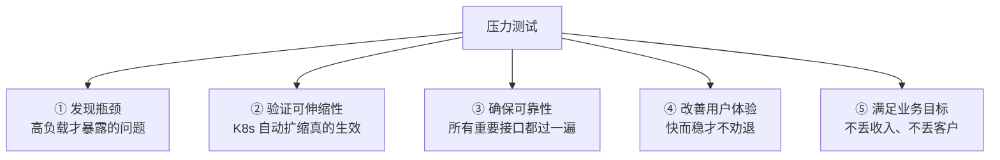

# 试试服务的抗压能力 —— 本章导学：在压测前先想清楚为什么

实战课程进入尾声，最后一块拼图是**压力测试**。功能测试只能证明"能跑通"，证明不了"扛得住"——而生产环境恰恰是用"扛不扛得住"来定义系统质量的。这一章我们就用 WRK 这个既简单又高效的工具，去测试服务的抗压能力，但在动手压之前，先把"压测为什么重要"这件事拆开聊清楚。

## 纲要

- 为什么功能测试不等于性能测试
- 压测重要性的五个理由
- 本章要做的三件事：重要性分析 / 实操压测 / 报告解读
- 压测的两类方法：单服务 vs 全链路、本地 vs 分布式
- 用 WRK 对实战项目下手
- 压测报告重点指标与优化方向

## 功能测试与性能测试的分界

写代码时我们习惯跑一遍接口、看返回对不对，这叫功能测试。但线上一旦流量起来，问题才暴露：接口延时不线性上涨、连接数堆积、内存悄悄涨到 OOM、CPU 被打满后雪崩。这些**非功能性问题，只有把负载推到足够高才会现形**。所以压测不是"锦上添花"，而是上线前必须的一关。

## 压测为什么重要：五个理由



- **① 发现系统瓶颈**：访问量小时很多问题发现不了，尤其性能问题与极端情况下的瓶颈；普通的测试更多是验证功能与流程能跑通、数据是否准确，而压力测试侧重于非功能性，验证很多性能问题只有负载非常高时才暴露——卡顿、接口延时陡增、内存溢出、死锁等；
- **② 验证服务的可伸缩性**：在不同负载级别下伸缩，确认系统能自动伸缩满足需求且不明显降性能。K8s 里 HPA 配好不等于扩得出来，Pod 起来要时间，流量可能已经冲垮了——这种"看起来能扩、实际扩不动"的结论只有压测能下；
- **③ 确保服务的可靠性**：压力测试有助于识别容易故障或导致错误的区域；系统接口很多，只测个别接口说明不了问题，必须对所有重要接口都做高负载验证；
- **④ 改善用户体验**：快速可靠的系统让用户更容易接受，缓慢或不可靠的系统让他们痛苦并离开；
- **⑤ 满足业务目标**：缓慢或不可靠会导致收入损失、客户流失、声誉受损；确保高负载高并发下表现良好，产品才有竞争力。

## 本章要做的三件事

```dir
本章压测实践流程
├── 1. 理论铺垫
│   └── 压测重要性拆解（上面五个理由）
├── 2. 实际压测（对实战项目）
│   ├── 选工具：WRK（简单、高效，工作常用）
│   ├── 压接口：了解接口性能与瓶颈
│   └── 对比压测：换参数看性能梯度与优化方向
└── 3. 报告解读
    └── WRK 压测报告重点指标分析
```

课程里主要是一些通用性的分析方法和建议，目的是让大家在自己工作和开发中能直接套用。

## 压测的两类方法

压测方法主要分两组，互相补充而不是二选一：

| 维度 | 选项 A | 选项 B |
| --- | --- | --- |
| 按范围 | 单个服务压测（自己写的服务先压一遍，明确并发能力） | 全链路压测（几十个微服务时，从入口压、按调用比例放大） |
| 按环境 | 本地压测（排除网络，看程序极致） | 远程/分布式压测（更真实、并发更高、网络延迟叠加后问题一目了然） |

对初学者，掌握好**最简单的本地单个服务压测**就够了；概念上的差异在于：单服务压测定位到代码层，全链路压测定位到系统级瓶颈点。

## 用 WRK 对实战项目下手

WRK 是课程选中的工具，理由很实在：既简单又高效，平时工作中也经常遇到。典型用法：

```bash
# 先定基线（本地，排除网络）
wrk -t4 -c64 -d30s --latency http://127.0.0.1:8080/api/user/1

# 再上分布式/远程（带网络与多实例）
# 先给变量赋值，例如：GW_IP=1.2.3.4
wrk -t8 -c200 -d60s --latency http://$GW_IP:8080/api/user/1

# 加压找延迟陡增的临界点
for c in 100 200 400 800 1600; do
  echo "=== connections=$c ==="
  wrk -t8 -c$c -d20s --latency http://$GW_IP:8080/api/user/1 2>&1 | tail -4
done
```

压测过程中我们会用几个关键参数（线程数 `-t`、连接数 `-c`、时长 `-d`），并修改它们做对比——用不同的线程数、连接数，压测报告会有明显差别。大家在以后做压测时也可以这样试一试，换成不同参数进行对比。

## 压测报告重点指标与优化方向

最后会详细解读 WRK 的压测报告，把其中最重要的几个指标讲透：

| 指标 | 含义 | 期望 |
| --- | --- | --- |
| QPS / Requests/sec | 每秒处理请求数 | 越高越好 |
| Latency（avg / stdev / max） | 请求延迟 | 越低越好 |
| Latency Distribution | 延迟分布（如 99% 分位） | 越低越好 |
| 连接数 | 可支撑的连接 | 越高越好 |
| 瓶颈点 | 延迟陡增的并发数 | 用来定容量上限 |

QPS 越高越好、延迟越低越好、网络传输越少越好。大家自己开发的系统，压测结果可以对照课程给出的标准，看看自己的服务能达到哪个级别。当指标低于预期时，一定要仔细分析系统性能瓶颈出现在哪、哪些地方可能出问题、需要怎么优化。

## 总结

进入压测这一章，先把心态摆正：**压测是上线前必须的一关，不是可选项**。

1. **功能测试 ≠ 性能测试**：非功能性问题只有高负载才暴露，功能跑通不代表扛得住；
2. **五个理由**撑起压测的必要性：发现瓶颈、验证可伸缩性（尤其 K8s 的 HPA 真生效与否）、确保可靠性（所有重要接口都要过）、改善体验、满足业务目标；
3. **两类方法**——单服务 vs 全链路、本地 vs 分布式——互补使用，初学先吃透本地单服务压测；
4. **工具选 WRK**：简单高效、工作常用，核心参数是线程数、连接数、时长，换参数做对比就能看到性能梯度；
5. **报告看重点**：QPS 越高越好、延迟越低越好、网络传输越少越好，指标低于预期时务必定位瓶颈与优化方向。

带着这些思考，我们下一节就真正动手去压。
