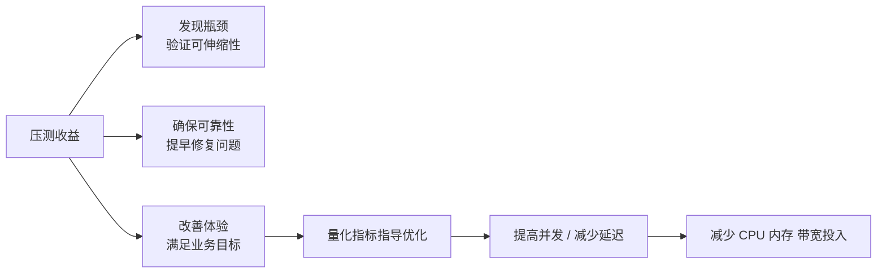

# 本章小结 —— 压力测试与 WRK 实战复盘

这一章我们彻底把"压测"这件事做了一遍：先想清楚为什么重要，再用 WRK 对实战项目施压，最后把压测报告读透。下面把关键结论复盘一遍，方便复习和对照自己的系统。

## 纲要

- 压测重要性的五条再提醒
- 压测方法的两组分类
- WRK 关键参数与对比压测
- 压测报告重点指标怎么读
- 性能优化的一般思路与边界
- 把"压测—分析—优化"变成闭环

## 压测重要性的五条再提醒

压测能帮我们发现系统瓶颈、验证服务的可伸缩性、确保服务的可靠性；在压力测试中提早发现问题并及时修复，比线上事故后再救火成本低得多。同时它还能改善用户体验、满足业务目标——通过压测优化提升服务性能、减少请求延时，用户感觉更快，也能支撑和服务更多用户。



一个常被忽略的账：**压测给的量化指标能直接指导优化**——提高了并发能力、减少了延迟，也就减少了对 CPU、内存、网络带宽这些硬件资源的投入。优化不是为了加机器，而是"并发更高、延迟更低的同时资源还更少"。

## 压测方法的两组分类

压测方法分为单个服务压测和全链路压测，也可以分为本地压测和远程分布式压测。这里主要是概念的差异，大家掌握好最简单的**本地单个服务压测**就好。

| 维度 | 选项 A | 选项 B |
| --- | --- | --- |
| 范围 | 单服务压测（定位代码层） | 全链路压测（定位系统级瓶颈，按调用比例放大） |
| 环境 | 本地压测（排除网络，看程序极致） | 远程/分布式（更真实、并发更高、网络延迟叠加） |

初学阶段不需要追求全链路与分布式，把单服务的压测流程跑熟、能读出自己的容量上限，就已经满足大部分日常需求。

## WRK 关键参数与对比压测

实际操作里，我们对服务做压力测试，压测过程中使用了几个关键参数，并且修改它们做对比：线程数（`-t`）、连接数（`-c`）、时长（`-d`）。不同参数组合在压测报告里会有明显差别，大家以后做压测时也可以这样试一试——换成不同的参数进行压测对比。

```bash
# 对比线程数与连接数对结果的影响
wrk -t4  -c100  -d30s --latency http://127.0.0.1:8080/api/user/1
wrk -t8  -c200  -d30s --latency http://127.0.0.1:8080/api/user/1
wrk -t16 -c400  -d30s --latency http://127.0.0.1:8080/api/user/1
```

通过对比能直观看到：连接数上去后 QPS 是否还能线性增长，延迟是否在某一点开始陡增——那个陡增点就是系统的容量上限。

## 压测报告重点指标怎么读

最后我们对 WRK 压测报告做了详细解读，把其中最重要的几个指标拎出来：

| 指标 | 读法 | 期望 |
| --- | --- | --- |
| QPS / Requests/sec | 每秒处理请求数 | 越高越好 |
| Latency（avg/stdev/max） | 平均/标准差/最大延迟 | 越低越好 |
| Latency Distribution | 延迟分布，尤其 99% 分位 | 越低越好 |
| 网络传输 | 读写的字节量 | 越低越好（省带宽） |
| 瓶颈点 | 延迟陡增的并发数 | 用来定容量上限 |

**QPS 当然是越高越好，延迟当然是越低越好，网络传输也是越低越好。** 大家自己开发的系统和服务，压测报告的结果也可以对照课程里给到的标准，看看自己的服务能够达到哪一个级别。

> 读报告的黄金三问：① Req/Sec 是多少（每秒能处理多少请求）？② Latency 99% 在哪一档陡增（就是可支撑的并发上限）？③ 加压时 Pod 副本有没有涨（可伸缩性是否真的生效）？

## 性能优化的一般思路与边界

当压测报告中得到的指标低于预期时，**一定要仔细分析**，看看系统的性能瓶颈出现在哪里、哪些地方可能出现问题、需要怎么优化。

```dir
性能优化思考路径
├── 看延迟分布
│   ├── 无压：基线成本是多少
│   ├── 压力大：吃多少并发开始抖
│   └── 再大：延迟陡增/超时 = 容量上限
├── 看资源三项
│   ├── CPU    → 算法/并发/副本数
│   ├── 内存   → GC/对象复用/缓存命中
│   └── 带宽   → 压缩/裁剪/分页
└── 优化 → 再压 → 对比（量化"优化了多少"）
```

关于系统优化的方法，有一些通用的方案和做法，但在具体的服务中还是有很多细节和操作，**没法套用统一的方案和方法**——这正是压测的价值：它把"感觉挺快"变成"多少 QPS 下 P99 多少毫秒"的硬数字，让优化有可衡量的目标。

## 总结

把这一章压测相关的要点收一下：

1. **五条重要性**：发现瓶颈、验证可伸缩性、确保可靠性、改善体验、满足业务目标；其中"量化指标指导优化"能反过来减少 CPU/内存/带宽投入；
2. **方法两组**：单服务 vs 全链路、本地 vs 分布式——初学先吃透本地单服务压测；
3. **WRK 参数对比**：线程数、连接数、时长是关键旋钮，换参数对比能看到性能梯度与容量上限；
4. **报告三指标**：QPS 越高越好、延迟越低越好、网络传输越低越好；对照课程标准看自己服务在哪个级别；
5. **指标低于预期必须分析**：定位瓶颈点、判断问题所在、确定优化方向，不能只看数字不行动；
6. **优化没有万能模板**：通用方案存在，但具体服务细节多、无法套统一方法，靠"优化 → 再压 → 对比"的循环拿到量化结果。

压测不是为了出一份报告，而是为了让"出问题之前就知道会在哪个并发数出问题"。
