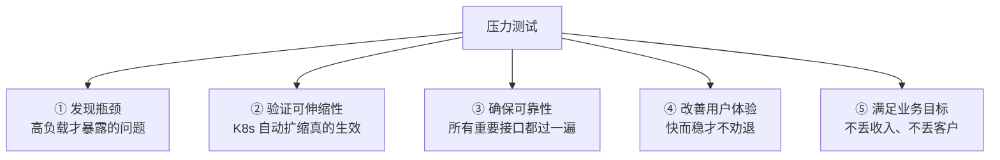
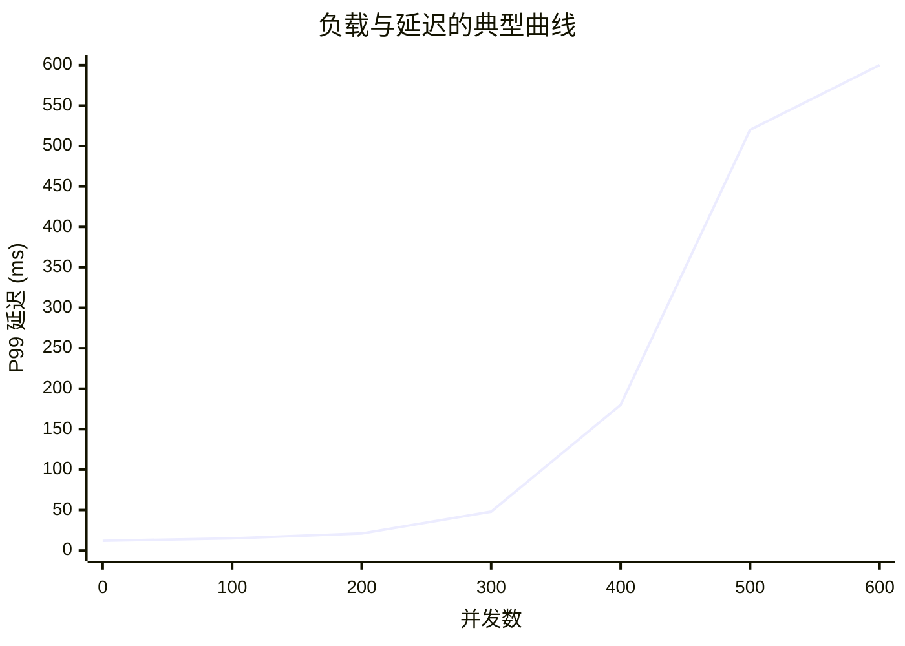
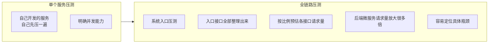

# Kubernetes 认证考点: 压测为什么重要 —— 五个理由、量化指标与两类压测方法

功能测试只能证明"能跑通"，证明不了"扛得住"。

结论：**压测的必要性有五条 —— ① 发现系统瓶颈（普通测试只验证功能与流程，性能问题只在高负载下才暴露）；② 验证可伸缩性（K8s 的自动扩缩能不能真的生效，得靠压测证明）；③ 确保可靠性（要覆盖所有重要接口，只测个别接口说明不了问题）；④ 改善用户体验；⑤ 满足业务目标（慢和不可靠直接导致收入损失与客户流失）。它给出的量化指标主要两类：**并发能力**（每秒请求数、可支持连接数、可推的在线人数）和**延迟表现**（无压/高负载/过载三档）。方法上分两组：**单个服务压测 vs 全链路压测**（微服务下全链路更常用），**本地压测 vs 远程分布式压测**（本地排除网络看程序极致，分布式更真实、更能暴露延迟）。**

## 纲要

- 五个理由
- 两类量化指标：并发能力 + 延迟
- 优化的三个成本方向：CPU / 内存 / 带宽
- 方法之一：单服务压测 vs 全链路压测
- 方法之二：本地压测 vs 远程分布式压测
- 落地顺序建议

## 五个理由



**理由一：发现系统瓶颈。** **当服务的访问量很少的时候，很多问题都无法被发现，尤其是性能问题，还有某些极致情况下才会出现的瓶颈。普通的测试更多是验证功能、可用流程能够跑通、数据是否准确；而压力测试则侧重于非功能性，验证很多的性能问题只有当负载非常高的时候才会暴露出来 —— 比如系统会出现卡顿、接口延时陡增，甚至出现内存溢出或者死锁等情况。通过模拟用户流量和交易，可以了解系统在高负载下的表现，并确定需要优化或改进的地方。**

**理由二：验证服务的可伸缩性。** **通过在不同级别的负载下进行伸缩，可以确保系统可以自动伸缩以满足需求，并且可以在不显著降低性能的情况下进行伸缩 —— 尤其是在 K8s 中可以非常容易地支持服务的自动扩缩容，那么这些能力也需要通过压力测试才可以得到验证：确保在高负载情况下，服务的自动伸缩可以生效，没有导致明显的系统卡顿和延迟。**

> 这条最容易被跳过、也最容易翻车：**HPA 配好不等于扩得出来**。CPU 阈值 70% 看起来合理，但 Pod 起来要时间，流量已经冲垮了 —— 这种"看起来能扩、实际扩不动"的结论只有压测能下。

**理由三：确保服务的可靠性。** **压力测试还有助于确保系统的可靠性，使其能承受高负载，可以识别系统里容易出现故障或可能导致错误、崩溃的任何区域。系统的接口和功能会有很多，如果只是测了某几个个别接口，只能说明这几个接口没有性能问题；为了全面验证服务的可靠性，也就意味着要对所有重要接口进行测试，只有经过高负载的考验，才能确保这些接口不会出现问题。**

**理由四：改善用户体验。** **通过优化性能和可靠性，压力测试还有助于改善用户体验 —— 一个快速可靠的系统会让用户更容易接受，而一个缓慢或不可靠的系统会让他们感到痛苦并拒之门外。**

**理由五：满足业务目标。** **压力测试对实现业务目标很重要 —— 缓慢或不可靠的系统可能会导致收入损失、客户流失以及声誉受损；通过确保系统在高负载高并发下表现良好，才能让产品保持竞争力和成功。**

## 两类量化指标

**压力测试可以通过量化的指标直观地了解服务能力，也能清晰知道服务的并发能力、延迟、性能、可用性、伸展性等非功能性需求是否可以得到满足。**

### 指标一：并发能力

**从压力测试中可以明确知道系统的并发能力：每天可以支持的连接数是多少、每秒可以处理的请求数是多少？知道了服务的并发能力，也就能大概知道服务可以同时支持的在线人数、每天可以支持的最高请求量。**

```text
从一次压测结果往外推
├── 每秒请求数 QPS        ← wrk / ab 直接给出的 Latency + Requests/sec
├── 可支撑连接数          ← Connection: keep-alive 长连接场景
├── 可推在线人数          ≈ QPS × 单用户平均请求间隔的倒数
└── 日请求量上限          ≈ QPS × 86400（再考虑峰谷比，通常要打 1/5~1/10 折扣）
```

### 指标二：延迟表现

**另外一个量化指标是知道服务的延迟情况：没有压力时，单次请求的延迟是多少？压力很大的时候，请求的延迟又是多少？压力再大的情况下，系统是否就出现了不可用延迟问题，也就是性能问题。**



这条曲线上要读三个点：

| 阶段 | 特征 | 要回答的问题 |
| --- | --- | --- |
| **无压** | 延迟最低且平稳 | 单请求基线成本是多少 |
| **压力大** | 延迟开始抬升、出现毛刺 | 吃多少并发才开始抖 |
| **再大** | 延迟陡增 / 超时 / 不可用 | **系统崩的临界点在哪**（这就是容量上限） |

**优化了服务性能、减少延迟，也就可以带来更好的用户体验，同时也能增强并发能力，或者减少服务器资源的投入。**

## 优化的三个成本方向

**服务器资源抽象出来主要是 CPU、内存和网络带宽这三方面，我们在做系统优化的时候也是在这三方面来考虑：增加了 CPU 是否可以满足并发能力的需求？增加了内存是不是可以提高系统性能、减少请求的性能？增加了网络带宽是不是就可以让用户体验更好？**

```text
优化的三个抓手（与成本直接对应）
├── CPU    → 换更快的算法/减少序列化、开并发、加副本
├── 内存   → 减少 GC 压力、复用对象、缓存命中率
└── 带宽   → 压缩响应体、去掉冗余字段、分页/裁剪

一般规律：增加服务器资源肯定会有明显效果
但服务器资源也是很重的成本支出

真正目标：满足更好的并发能力、减少延迟的同时，
          还能减少 CPU / 内存 / 网络带宽的投入
达成方式：不断进行优化 → 不断压测和对比 → 得到量化的结果
```

这里的关键不是"加机器"，而是**把"优化了多少"变成可量化的数字**：同样 QPS 下 P99 从 180ms 降到 90ms，同时副本数从 6 降到 4 —— 这才是压测给的账。

## 方法之一：单服务压测 vs 全链路压测

**压力测试的方法主要就是单个服务的压测以及全链路压测。**



**单个服务的压测比较常见，我们自己开发的服务肯定是需要我们首先进行压测，明确知道服务的并发能力是多少。**

**但当系统不仅仅是一两个服务、而是由几十个微服务组成的时候，再进行单个服务的压测就会很麻烦，也很不可靠 —— 所以在微服务架构下，全链路压测用得就很多了。**

**全链路最简单的方式：从系统的入口处进行压测，把系统的外部接口都整理出来，根据每个接口的请求量和调用次数的比例关系预估出来一些数值，然后从这些入口接口进行压测；后端的微服务请求量肯定会放大很多倍，这时候就容易找到具体的瓶颈了。**

两种方法的取舍：

| | 单服务压测 | 全链路压测 |
| --- | --- | --- |
| 场景 | 自己写的服务、刚上线的新接口 | 几十个微服务组成的系统 |
| 优点 | 简单、可控、能精确定位到代码层 | 真实、能暴露跨服务累积问题 |
| 缺点 | 单服务没问题不等于整体没问题 | 流量模型预估不准会失真 |
| 关键产出 | 这个服务的 QPS 上限 | 整条链路的瓶颈点和容量上限 |

> **全链路压测的核心难点是"流量模型"**：按每个接口的**请求量和调用次数的比例关系**预估出各服务的放大倍数。估小了压不出瓶颈，估大了压垮自己还会误导容量规划。

## 方法之二：本地压测 vs 远程分布式压测

```text
本地压测                          远程分布式压测
├── 排除网络的影响                 ├── 更真实地模拟实际应用场景
├── 最接近单个程序的性能极致        ├── 可以带来更高的并发量
├── 单程序执行效率高、性能好        ├── 给系统服务带来更高负载
├── 部署多个实例，自然也就能得到    ├── 远程调用网络延迟也会更高
│   更高的效果                     ├── 客户端和服务端是否出现更高延迟一目了然
└── 适合：定位程序本身的算法/GC 问题 └── 适合：验证真实容量与端到端延迟
```

- **本地压测**：**可以排除网络的影响，最接近单个程序的性能极致。如果单个程序的执行效率高、性能好，那么部署多个实例，自然也就可以得到更高的效果。**
- **分布式压测**：**可以更加真实地模拟实际的应用场景，也可以带来更高的并发量，给系统服务带来更高的负载；同时因为远程调用网络延迟也会变得更高，这时候不论是客户端还是服务端是否会出现更高的延迟，也就可以一目了然地发现了。**

```text
两种压测互补，不是二选一
① 本地压测 → 排除网络，找程序自身瓶颈（算法、锁、GC、连接池）
② 分布式压测 → 叠加网络与多实例，找系统级瓶颈（带宽、上下游、数据库）
③ 最后拿分布式结果反推单实例容量，指导 HPA 的 min/max
```

## 落地顺序建议

```text
一次完整的压测流程
├── ① 确定目标：QPS 目标 / P99 目标 / 资源成本目标
├── ② 选方法
│   ├── 单服务压测（新服务先做）→ 定基准
│   └── 全链路压测（线上系统）→ 定容量与瓶颈点
├── ③ 选环境
│   ├── 本地压测 → 排除网络看程序极致
│   └── 远程/分布式压测 → 贴近真实
├── ④ 执行：从低并发往上加，记录三个阶段的延迟
├── ⑤ 读结果：并发上限 = 延迟陡增的临界点
├── ⑥ 优化 → 再压 → 对比（量化"优化了多少"）
└── ⑦ 把结论写成 SLO / HPA 阈值 / 扩容预案
```

## API 速览

| 指标 / 概念 | 含义 | 典型来源 |
| --- | --- | --- |
| Requests/sec（QPS） | 每秒处理请求数 | wrk / ab 输出 |
| Latency（avg / stdev / max） | 请求延迟 | wrk 输出 |
| Latency distribution / Timeout | 延迟分布与超时数 | wrk 输出 |
| Connections 与连接数 | 可支撑连接（长连接） | 客户端配置 |
| 可推在线人数 | QPS × 单用户请求频率的倒数 | 由 QPS 推导 |
| 日请求量上限 | QPS × 86400 × 峰谷折扣系数 | 由 QPS 推导 |
| P99 / P95 延迟 | 分位延迟（比 avg 更能代表体感） | 由分布计算 |
| CPU / 内存 / 带宽 | 三项成本资源 | `top` / `kubectl top` / 网络监控 |
| HPA 生效验证 | 高负载下副本是否真的涨了 | `kubectl get hpa,pod -w` |

## Demo 示例

一个最小但完整的可执行压测回路：

```bash
# 1. 先定基线（本地，排除网络）
wrk -t4 -c64 -d30s --latency http://127.0.0.1:8080/api/user/1

# 2. 再看分布式/远程（带上网络与多实例）
# 先给变量赋值，例如：GW_IP=1.2.3.4
wrk -t8 -c200 -d60s --latency http://$GW_IP:8080/api/user/1

# 3. 同时盯三项资源（优化就看这三个数）
kubectl top pod -l app=user-service
kubectl get hpa user-service -w        # ★ 验证「可伸缩性」这条理由

# 4. 逐步加压，找出延迟陡增的临界点
for c in 100 200 400 800 1600; do
  echo "=== connections=$c ==="
  wrk -t8 -c$c -d20s --latency http://$GW_IP:8080/api/user/1 2>&1 | tail -4
done
```

典型的输出长这样（课程里说的"延迟陡增"就在第二段）：

```text
Running 30s test @ http://127.0.0.1:8080/api/user/1
  8 threads and 200 connections
  Latency   4.21ms    8.34ms   48.12ms   92.10ms   ← avg / stdev / max /+/-stdev
  Req/Sec    47.6k
  1.43M requests in 30.05s, 812MB read
  Requests/sec:    47681.32
  Latency Distribution
     50%    3.11ms
     90%    6.42ms
     99%   21.05ms   ← 高负载下这个数开始甩开 avg，就是瓶颈信号
  Status codes: 200 = 1430000
```

```text
读报告的黄金三问
① Req/Sec 是多少？          → 这就是「每秒可以处理的请求数」
② Latency 99% 在哪一档陡增？→ 这里就是「可支撑的并发上限」
③ 加压时 Pod 副本有没有涨？ → 这就是「可伸缩性是否真的生效」
```

## 总结

压测这件事，本质上是把"感觉挺快"变成"多少 QPS 下 P99 多少毫秒"：

1. **五条理由** —— 发现瓶颈、验证可伸缩性、确保可靠性、改善体验、支撑业务目标；其中**只有压测能验证 K8s 的自动扩缩是否真的在流量冲击下来得及生效**；
2. **可靠性那条最容易被打折**：只测几个接口只能说明那几个没问题，**要对所有重要接口都过一遍高负载**；
3. **两个量化维度**：**并发能力**（每秒请求数、连接数、可推的在线人数与日请求量）和**延迟表现**（无压 / 高负载 / 过载三档，重点看过载那一档什么时候崩）；
4. **优化的三个成本面是 CPU、内存、网络带宽**，加资源通常有效但很贵；**真正的目标是"并发更高、延迟更低的同时资源还更少"**，而这只能靠"优化 → 压测 → 对比"的循环拿到量化结果；
5. **方法第一组：单服务 vs 全链路** —— 自己写的服务先单机压出基准；**几十个微服务时，从入口压测、按接口调用比例估放大倍数，让后端请求量放大很多倍，才容易找到真瓶颈**；
6. **方法第二组：本地 vs 分布式** —— **本地排除网络、看程序极致；分布式更真实、并发更高、网络延迟叠加后客户端与服务端的延迟问题一目了然**；两者互补；
7. **最后把结论落到工程上**：SLO 阈值、HPA 的 CPU 目标值、扩容预案 —— 压测不是为了出一份报告，是为了让"出问题之前就知道会在哪个并发数出问题"。

