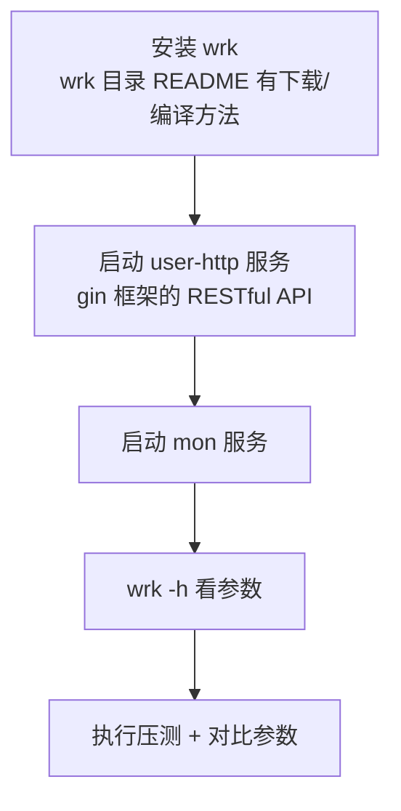

# Kubernetes 认证考点: 用 wrk 做压测、读懂参数，以及日志磁盘 IO 怎么把 QPS 卡死

压测最值钱的不是那几个数字，而是"为什么卡在这个数字上"。

结论：**wrk 的常用参数就六个 —— `-c` 连接数、`-d` 持续时间、`-t` 线程数、`-s` 使用 Lua 脚本文件、`-H` 增加 header 信息、`--latency` 打印延迟信息。实测一轮参数（1 线程 1 连接 → 2/10 → 8/40 → 100/1000）QPS 始终卡在 1.6~1.7 万，怎么加线程加连接都不动，这说明触到了系统极限；真正的原因不是 CPU 也不是代码 —— 是 gin 服务把运行日志打到了磁盘上，**磁盘 IO 成了瓶颈。关掉日志重启后同样的参数直接冲到 10 万以上（1 线程 1 连接只有 3.8 万，10 个连接就能到 12 万，这就是"连接数不到够"）。POST 接口要用 Lua 脚本设 `wrk.method`，gRPC 则 wrk 做不了，得换 ghz。**

## 纲要

- 准备：装 wrk 与起服务
- wrk 的参数与单位
- 第一轮：调参数，QPS 为什么纹丝不动
- 定位：把日志关掉再压一次（本讲核心）
- 第二轮：连接数够不够才是关键
- POST 接口与 Lua 脚本
- gRPC 压测换 ghz
- 压测收尾时的那几个"假报错"

## 准备



**之前已经提到过，安装方法整理到文档中了，这次不具体操作；`wrk` 目录的 README 文件里已经把下载、安装以及源码的编译安装方法都整理好了，照着做就行 —— wrk 比较简单，之前也装过。**

**然后启动 user 服务，这里主要用到 gin 框架开发的 RESTful API。我们这次压测都是在本地完成，不考虑远程的网络因素，也不做分布式压测，只是理解和掌握如何做压测 —— 不同方法都是互通的，准备工作都完成，最后就是执行 wrk 命令进行压力测试，详细了解 wrk 命令的参数和高阶用法（用 Lua 脚本进行压测）。**

```text
项目目录
├── wrk/
│   └── README.md        ← 下载、安装、源码编译方法都在这里
├── user-http/           ← gin 框架的 RESTful API（8080）
└── mon/                ← 监控服务
```

> **本次刻意只做本地压测**：排除网络因素，结果更纯粹，也更容易归因。

## wrk 的参数与单位

**用 `wrk` 命令加上 `-h` 就能看到下面这些内容（wrk 的参数和选项，帮助文档是英文的，后面加了一些翻译）：**

| 参数 | 含义 | 示例 |
| --- | --- | --- |
| `-c` | **connections 连接数** | `-c1000` |
| `-d` | **duration 持续时间** | `-d30s` |
| `-t` | **threads 线程数** | `-t4` |
| `-s` | **使用 Lua 脚本文件** | `-s post.lua` |
| `-H` | 增加 header 信息 | `-H "Authorization: xxx"` |
| `--latency` | 打印延迟信息 | `--latency` |
| `--timeout` | 设置超时时间 | `--timeout 5s` |

**关于字节的单位，遇到 K、M 和 G 符号，对应的是 1K、1M、1G（网络传输的字节单位）；下面的 ms、s、m、h 是毫秒、秒、分钟、小时这些时间单位，一看就懂。**

```bash
# 看完整帮助（后面带中文注释的那一版）
wrk -h
```

## 第一轮：调参数，QPS 为什么纹丝不动

**服务启动起来之后开始压测，请求的是 8080 端口，也就是 gin 框架开发的 RESTful API；先试一下 `hello` 这个接口能不能正常返回，然后压力测试验证 wrk 的使用（地址按自己的接口改一下就行）。**

```text
① 1 线程 + 1 连接
wrk -t1 -c1 -d30s http://127.0.0.1:8080/hello
→ Requests/sec: 17000  ← 就是常说的 QPS

② 2 线程 + 10 连接
wrk -t2 -c10 -d30s http://127.0.0.1:8080/hello
→ 还是 17000 左右

③ 8 线程 + 40 连接（线程和连接都比之前多很多）
→ 变成 16000 了，比前面还少，但差别不大

④ 100 线程 + 1000 连接
→ 还是 16000 左右

⑤ 1 线程 + 1000 连接（只把线程改少，连接不变）
→ 没什么变化，15000 多
```

**结果不管是一万五、一万六还是一万七，差别都非常小；说明参数的、系统的极限就到这里了，我们再去做压测、修改参数它都没什么区别。**


**那就得分析一下：我们这个 `hello` 接口什么都没做，也没有数据库的调用，也没有很多循环、没有什么变量的复制啊，都没有 —— 为什么压测结果就一直卡在一万六、一万七左右呢？**

## 定位：日志才是那个瓶颈

**我们再来看一下 gin 服务的运行情况，这里有大量的服务日志。所以我们认为之所以 QPS 会卡在一万七、一万六左右，原因就是因为我们把日志打印出来了。那我们把运行日志关掉，再来对比看一下：把日志注释掉，再压一次，还是 1000 连接 1 线程 —— 结果还是一万六左右，返回了一万七，没什么变化；那我们把服务重启一下 —— 好了，重启了，应该就不会有日志了，再来一次，看到结果有很大的变化，变成十万多。**

```text
第一轮（开日志）：
  1000 连接 / 1 线程  →  ~16000
  → 再怎么调参数都上不去

第二轮（关日志 + 重启服务）：
  1000 连接 / 1 线程  →  ~100000+   ← 十几倍的差距
```

**关键细节：关完日志第一次测"没什么变化"，是因为没有重启服务 —— 日志开关要重启后才生效。这一步很多人会在这里误判，以为"关日志没用"。**

**我们只做了两个调整：一个是把日志关了，还有就是调整了参数，很清楚地看到它们的区别。如果我们开启日志，再怎么压测、改参数，最后的结果都会卡在一万六左右、一万七的样子 —— 因为我们的磁盘 IO 达到了性能瓶颈，就很难突破一万六、一万七了。**


**这一课的结论值得单独记住：`hello` 这种空接口，代码本身根本不是瓶颈；把日志打进磁盘的 IO 才是。一旦磁盘 IO 满了，你怎么加线程、加连接都是在排队。**

## 第二轮：连接数够不够才是关键

**那我们换成一个线程、一个连接，还能达到十万吗？只能到三万八。那换成两个线程、十个连接再对比试一试，可能达到十二万左右 —— 所以十二万这个值基本上就到了服务的极限了。**

```text
关日志之后的第二轮（核心对比）
├── 1 线程 / 1 连接   → 38,000
├── 2 线程 / 10 连接  → 120,000 左右
└── 1000 连接/1 线程  → 100,000+
```


**把第二轮拆成两条规律：**

1. **连接数不够，压不出服务极限** —— 只有 1 个连接时，哪怕把线程再怎么加，QPS 也只能到 3 万多，**因为并发请求全靠这一个连接排队发，客户端就这么点吞吐**；
2. **连接数够了才能压满** —— 10 个连接就到 12 万、1000 个连接也是 10 万+，**再往上加连接已经到服务极限，不会涨了**。

**所以这些结果通过压力测试是我们可以发现的，也可以帮助我们进行优化和调整 —— 大家一定要注意，日志的影响、磁盘 IO 的问题非常明显。**

| 阶段 | 瓶颈是谁 | 现象 |
| --- | --- | --- |
| 开日志 | **磁盘 IO** | 加线程/连接都卡在 1.6~1.7 万 |
| 关日志 + 连接数 = 1 | **客户端并发度** | 只能到 3.8 万 |
| 关日志 + 连接数 ≥ 10 | 服务自身 | 12 万左右，到顶 |

## POST 接口与 Lua 脚本

**下面这几个压测大家自己试一下。压测下面这些服务接口，还有具体的这个使用的是 POST 方法，这时候我们需要用到 Lua 脚本。**

```lua
-- post.lua：wrk 的 Lua 脚本（wrk 目录下官方示例里能找到更多）
request = function()
   local headers = { ["Content-Type"] = "application/json" }
   local body = '{"userId":1001,"amount":10}'
   return wrk.format("POST", "/api/order/create", headers, body)
end
```

```bash
wrk -t4 -c100 -d30s -s post.lua --latency http://127.0.0.1:8080
```

```text
Lua 脚本（wrk 高阶用法，本例只用最基础能力）
├── 全局变量
│   ├── wrk.method      ← "POST"
│   ├── wrk.path        ← 请求路径
│   ├── wrk.body        ← 请求体
│   ├── wrk.headers     ← 请求头表
│   └── wrk.format()    ← 拼出完整请求串
├── 生命周期方法（本例没用到）
│   ├── setup()         ← 线程启动时执行一次
│   ├── init()          ← 每个请求前执行
│   └── started()/done() ← 开始 / 结束回调
└── 官方示例里有更多 lua 方法，按示例改一改就能快速跑起来
```

**我们这里虽然只用到最简单的 Lua 脚本能力，没有用到它的方法，但大家了解它的能力，之后如果有需求可以再看一下 wrk 文档里 Lua 方法的示例。这次会修改一些压测的参数，多试几次对比，看看它们的区别，便于更好地理解和掌握压测方法。**

**用 Lua 脚本压 POST 接口时，数据库读写性能还是非常高的 —— 因为数据库是空的，所以压测能达到八千多的 QPS，性能还是不错的；但服务端还有很多日志，日志这里也会影响到它的一些性能。**

## gRPC 服务换 ghz

**如果是压测 gRPC 服务，用 wrk 是做不到的，这里介绍一个工具：ghz。大家可以去它官网上看怎么安装和使用。**

```bash
# ghz 跟 wrk 很类似，使用也很简单；学会 wrk 换个工具也容易
ghz -c 50 -n 10000 -proto ./proto/order.proto -import-paths ./proto -call OrderService.Create -insecure localhost:8085
```

```text
ghz 压测结果（课程示例）
├── 总请求数 5 万多 → 约 5000+ QPS，能支持五千多并发
├── 分布图 / 直方图（ghz 自带展示）
└── 报错很少：
    ├── 2 个 "不可用"
    └── 8 个连接错误
```

> **注意那个"8 个错误"其实是压测工具自己的收尾行为，不是服务出错了** —— 见下节。

## 压测收尾时的那几个"假报错"

**压测的结果是可以看到很多分布图、直方图，总请求数能达到五万多，也就是五千多的 QPS 能支持五千多的并发，看到一些报错很少的报错 —— control 的有两个不可用，有八个。我们请求了十秒钟，十秒钟的最后时刻，所有连接会被强制关掉，这时候没有处理完的请求，也就是每个连接的最后一个请求（十个连接，最后的十个请求）就会出现这些错误，末端应该不会有报错。**

```text
为什么最后几秒会有零星报错
t=9.9s  wrk 时间到，开始强制断开全部连接
t=9.9s  —— 此时仍在飞行途中的请求被直接掐断
        → 每个连接最后一个请求 → 10 个连接 = 10 个异常
t=10.0s 报告统计

结论：
  高请求量下只有 10 个异常，且都集中在最后时刻
  = 压测工具收尾中断，不是服务故障
  **报告里应当排除这最后一批，再看真实错误率**
```

**判断标准很简单：报错是不是**全都发生在最后一次采样窗口、且数量约等于连接数**？如果是，就是收尾噪音；如果错误散布在整个压测过程，那才是真问题。**

## API 速览

| 参数 / 概念 | 含义 | 备注 |
| --- | --- | --- |
| `-c` | connections 连接数 | **决定能否压出服务极限** |
| `-t` | threads 线程数 | 本地压测 2~8 足够 |
| `-d` | duration 持续时间 | 建议 ≥ 30s 才稳 |
| `-s` | 使用 Lua 脚本 | POST / 自定义 header 要用 |
| `-H` | 增加 header 信息 | 带鉴权的接口用 |
| `--latency` | 打印延迟信息 | 建议一直开 |
| `--timeout` | 超时时间 | 默认 1s，容易误报 |
| `K/M/G` | 1K / 1M / 1G 字节单位 | wrk 帮助里的单位说明 |
| `ms/s/m/h` | 毫秒/秒/分钟/小时 | 时间单位 |
| `wrk.format()` | Lua 里拼请求 | POST 必需 |
| `ghz` | gRPC 压测工具 | wrk 压不了 gRPC |

## Demo 示例

把这一讲的全过程落成一条可复现的命令：

```bash
# 0. 看参数
wrk -h

# 1. 起服务（gin 的 RESTful API，8080）
go run ./cmd/user-http

# 2. 第一轮：调参数（对比 QPS）
for cfg in "1 1" "2 10" "8 40" "100 1000"; do
  set -- $cfg
  echo "=== threads=$1 conns=$2 ==="
  wrk -t$1 -c$2 -d30s --latency http://127.0.0.1:8080/hello | tail -5
done

# 3. 定位：把 gin 的访问日志注释掉
sed -i.bak 's/^.*c.Logger().Print.*$//' internal/middleware/accesslog.go

# 4. ★ 关键：必须重启服务，否则日志开关不生效
pkill -f user-http && go run ./cmd/user-http &

# 5. 第二轮：再看连接数的影响
wrk -t1 -c1   -d30s http://127.0.0.1:8080/hello   # ≈ 38k
wrk -t2 -c10  -d30s http://127.0.0.1:8080/hello   # ≈ 120k
wrk -t1 -c1000 -d30s http://127.0.0.1:8080/hello  # ≈ 100k
```

一次典型的 wrk 输出（**注意 `Latency Distribution` 那段**）：

```text
Running 30s test @ http://127.0.0.1:8080/hello
  2 threads and 10 connections
  Thread Stats   Avg      Stdev     Max   +/- Stdev
    Latency     1.02ms    2.11ms  89.31ms   98.11%
    Req/Sec    59.82k    8.42k   62.15k    86.20%
  Latency Distribution
     50%    0.81ms
     90%    1.42ms
     99%    8.65ms      ← 这一档才是体感，不是 avg
  HTTP requests:
    3.58M requests in 30.04 sec
    Socket errors: connect 0, read 0, write 0, timeout 0
  Non-2xx responses: 0
```

gRPC 侧换 ghz：

```bash
# 10 秒压测，10 个连接
ghz -c 10 -n 10 -proto ./proto/order.proto -import-paths ./proto \
    -call OrderService.Create -insecure -duration 10s localhost:8085
# 关掉收尾噪音后看：真实错误率应当接近 0
```

## 总结

这一讲真正想让人记住的，不是 wrk 怎么用，而是**"卡住了要往哪找原因"**：

1. **wrk 六个常用参数**：`-c` 连接、`-t` 线程、`-d` 时长、`-s` Lua 脚本、`-H` header、`--latency` 延迟；`K/M/G` 与 `ms/s/m/h` 是它的单位说明；
2. **第一轮加了线程加了连接，QPS 纹丝不动（1.6~1.7 万）→ 这不是参数问题，是系统触到瓶颈了**；
3. **瓶颈是磁盘 IO**：gin 服务把运行日志打到了磁盘，**`hello` 这种什么都不做的接口，代码不是瓶颈，日志写入才是**；
4. **改完配置必须重启服务** —— 关日志后第一次测"还是 1.6 万"，就是没重启导致的误判；
5. **重启后同一组参数直接到 10 万以上，差距是十几倍**，这比任何调参经验都直观；
6. **第二轮证明了连接数的意义**：**1 个连接只能到 3.8 万（客户端自己就被限住了），10 个连接就到 12 万（压满服务极限）** —— 单连接压不出服务的能力；
7. **POST 接口用 Lua 脚本**（`wrk.format` 拼 method/path/headers/body）；**gRPC 服务 wrk 做不到，换 ghz**，用法跟 wrk 很像，学会一个另一个就会；
8. **结尾那几个错误是假报错**：压测最后时刻强制断连，飞行中的请求被掐断，数量约等于连接数 —— 报真实错误率时要排除最后一批；
9. **一句话方法论：QPS 卡住先别调参数，先对被压的服务做一次"资源画像"（CPU / 内存 / 磁盘 IO / 网络），看是哪一项先到顶。**

