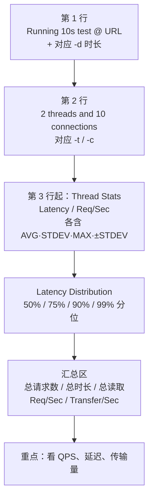
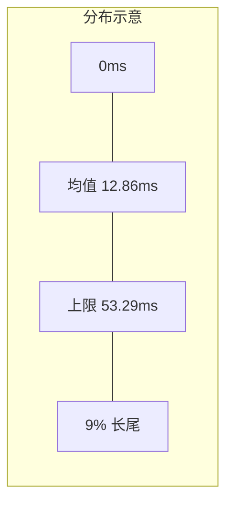
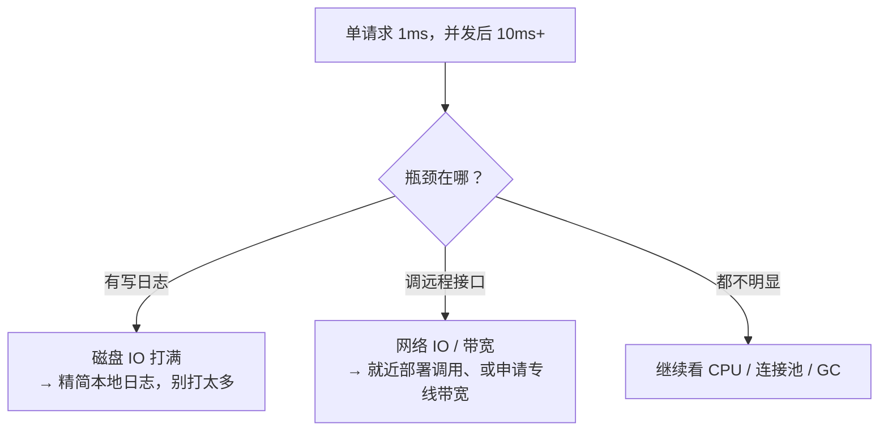

# Kubernetes 认证考点: 读懂 wrk 压测报告的重点指标、标准差与性能梯度

会跑 wrk 很容易，会读它的报告才叫会压测。

结论：**报告逐行看：第一行是测试时长与 URL（来自 `-d`），第二行是线程数与连接数（来自 `-t`/`-c`），第三行起是统计。延迟四个值分别是 AVG 平均值、STDEV 标准差、MAX 最大值、±STDEV 正负标准差 —— 例：平均 12.86ms、标准差 40.43ms，则区间是 0~53.29ms（下限不能为负），且 **91.08% 的请求延迟小于 53.29ms**。Req/Sec、Latency Distribution（50%/75%/90%/99%）、总请求数与每秒请求数/传输量依次往下。** 真正要盯的只有三块：**每秒请求数（QPS）**、**延迟（尤其"单次低但并发高"的 IO 型瓶颈）**、**网络传输量**；课程给的性能梯度是 **10 万以上（极好）→ 1 万以上（很好）→ 1k 左右（不错）→ 100 以下（管理端慢接口，必须限流保护）**。

## 纲要

- 报告逐行怎么读
- Latency 四个统计值：均值 / 标准差 / 极值
- Req/Sec 与"压测为什么不能只跑十秒"
- Latency Distribution 直方图怎么看
- 汇总区：总请求、传输量
- 重点指标一：QPS 的四档梯度
- 重点指标二：延迟的四种体检结论
- 重点指标三：网络传输

## 报告逐行怎么读



**在这个示例图上从上到下逐行来看：**

- **第一行 `only ten second test` 执行了十秒的测试，最后是 URL 地址 —— 这里的十秒就是参数 `-d` 所指定的。**
- **第二行 `two threads and ten connections` 启动了两个线程、十个连接，对应参数中的 `-t` 和 `-c`。上面这两行都是描述了 wrk 请求的参数。**
- **接下来就是 wrk 压测报告的具体内容。**

## Latency 四个统计值

**第四行 `Latency` 延迟 —— 请求接口的等待时间，这个值越小越好。一般认为，延迟在十毫秒左右就说明性能极好；延迟超过一百毫秒就需要特别注意了，因为在排除网络影响之后的接口延时超过一百毫秒，说明接口的执行时间有点长了，程序的性能就比较低，它的并发能力也就会比较低。**

**压测报告中有四点：AVG 平均值、STDEV 标准差、MAX 最大值、加减 STDEV 正负标准差。平均值和最大值容易理解；标准差就是在平均值的基础上加一个偏差值，正负标准差就是在平均值的基础上减标准差和加标准差这个区间内的数值。**

```text
示例数据：avg = 12.86ms，stdev = 40.43ms
├── MAX            = 最高单次
├── AVG            = 12.86ms
├── STDEV          = 40.43ms  ← 波动幅度，比 avg 更能说明"稳不稳"
└── ±STDEV 区间
      上限 = avg + stdev = 12.86 + 40.43 = 53.29ms
      下限 = avg - stdev = 12.86 - 40.43 = -27.57ms  ← 不能为负，取 0
      ∴ 实际区间 = 0 ~ 53.29ms
      该区间内延迟占比 91.08%
      ∴ 91.08% 的请求延迟 < 53.29ms
```

**平均值 12.86ms 看起来还行，但标准差 40.43ms 说明抖动很大 —— 这正是"均值会骗人"的典型：这里 91% 的请求在 53ms 内，剩下 9% 就甩到 53ms 以上去了。**



**要点：判稳定性看标准差，判体感看分位数（后面那张 Latency Distribution）。**

## Req/Sec 与"为什么不能只跑十秒"

**下一行的 `Req/Sec` 是每个线程每秒的请求数，同样也有平均值、标准差、最大值和正负标准差。由于咱们这里只有两个线程，而且压测时间只有十秒钟，所以出来的结果平均值和最大值的偏差会比较大。**

**正常来说，压测持续时间需要至少维持一分钟以上，最好是五分钟、十分钟 —— 因为真实的突发流量很少到只有十秒钟就结束了。**

```text
压测时长建议
├── 10s（课程示例）→ 只适合看个热闹，偏差大
├── 1min           → 最低可接受
├── 5min           → 推荐，能覆盖一次完整 GC / 连接池回收
└── 10min          → 更稳，能看出缓慢泄漏
```

## Latency Distribution 直方图

**再来看下面的 `Latency Distribution` 延迟分布的直方图：百分之五十的请求延迟低于 756 微秒，百分之七十五的请求延迟低于 0.94 毫秒，百分之九十的请求延迟低于 44.01 毫秒，百分之九十九的请求延迟低于 227.47 毫秒。从这张延迟直方图里也可以清晰地了解到压测时结果的延迟情况，而且这个数据和上面的延迟的平均值、最大值、正负标准差的值也是有关联的。**

```text
Latency Distribution（课程示例）
├── 50%  < 756 μs
├── 75%  < 0.94 ms
├── 90%  < 44.01 ms
└── 99%  < 227.47 ms   ← 这一档才是用户真正会感觉到的"卡"
```

| 分位 | 数值 | 说明 |
| --- | --- | --- |
| P50 | 0.756 ms | 一半请求比它还快，是"正常态" |
| P75 | 0.94 ms | 还没到 1ms |
| P90 | 44.01 ms | 开始明显变慢 |
| **P99** | **227.47 ms** | **长尾所在，性能优化要看它，不是 avg** |

> **和前面的数对照看**：avg 12.86ms、上限 53.29ms 覆盖了 91% 的请求；剩下的 9% 就落在 P90 之后的那一大段里，最后撑到 P99 = 227ms。**所以 P99 才是体感指标。**

## 汇总区

**再往下看就是汇总后的结果：总共有 164170 个请求，持续了 10.02 秒，读取了 18.94 MB 的数据；然后是平均到每秒的请求数和传输量 —— 每秒请求数 16388.14，每秒传输量 1.84 MB。**

```text
Summary:
  Total requests:        164170
  Total duration:        10.02s
  Total read:            18.94MB
  Requests/sec:          16388.14
  Transfer/sec:          1.84MB
```

## 重点指标一：QPS 的四档梯度

**首先就是看每秒请求数，这个数越大越好，一般分为几个梯度：十万以上、一万以上、1k 左右、一百以下。**

| 档位 | 典型场景 | 结论 |
| --- | --- | --- |
| **10 万以上** | Redis / 内存引擎这类服务；gin 框架开发的普通接口（没太多业务逻辑、只读一两次缓存、跑在性能好的服务器上）；简单 mysql 查询 | **性能极好** |
| **1 万以上** | 大部分无 heavy 逻辑的 HTTP 接口 | 很好 |
| **1k 左右** | 单机能到 1000 QPS 已经算是不错的；简单 mysql 查询也能到 1000+；**有大量 mysql 查询或更新操作的服务，性能会受 mysql 影响，并发很难超过 1k** | 不错但要看依赖 |
| **100 以下** | 大量管理端程序：复杂查询、大量增删改 | **需要限频/限流保护** |

两条榨取价值的结论：

- **数据库是分水岭**：**如果只是简单的 mysql 查询 QPS 也能达到一千以上；如果是有大量的 mysql 查询或者更新操作，那整个服务的性能就会受到 mysql 的影响** —— 可以考虑增加 mysql 从库，**但更好的优化方法是引入缓存、减少 mysql 数据库的读写**；
- **慢接口要保护**：**大部分管理端程序会有很多复杂的查询，或者很多新增修改删除这类操作，那么这些接口的并发能力可能会低于一百每秒 —— 这时候需要考虑对这类接口进行限频、限流处理，保护好这类接口，不要因为突发的请求访问这些慢接口，把整个服务给拖垮了。**

```text
一条链路的性能 = 最慢的一环
gin 接口 → Redis 读一两次      → 10 万级
gin 接口 → 简单 mysql 查询     → 1 千级
gin 接口 → 大量 mysql 查询/写  → 1 千以下，且随数据量下滑
管理端 → 复杂查询 + 多表增删改 → 100 以下
优化方向：加从库分流读、加缓存挡高频读、慢接口限流
```

## 重点指标二：延迟的四种体检结论

**还要重点看延迟数据，这个值越小越好。**

| 观察到的现象 | 判定 | 要做什么 |
| --- | --- | --- |
| 单次请求延迟 ~1ms | 性能极好 | 保持 |
| 单次请求延迟 ~10ms | 性能非常优秀 | 保持 |
| **单次请求延迟 > 100ms** | 接口执行时间过长、并发能力必然低 | **单独拿出来分析优化**（依赖接口太多太慢 / 数据库查询太多太复杂） |
| **单次低、并发高**（单 1ms，并发后 > 10ms） | **瓶颈在 IO，不在算法** | 见下方拆解 |

**最后一种是最有价值、也最容易被误判的：如果单次请求的延迟很低，但是并发请求的延迟很高 —— 比如单次请求延迟在一毫秒左右，但并发请求时平均延迟超过十毫秒 —— 这时候就要分析接口的瓶颈在哪里。程序性能方面应该是没问题，并发量上去之后很可能在网络 IO 方面、在磁盘 IO 方面出现问题；如果有写日志、如果有调用远程接口，这些就很容易受到磁盘 IO 和网络 IO 的影响。**



**所以在这种情况下，还要注意把本地的日志进行精简，不要打印太多的日志；远程接口也需要注意网络带宽是不是要优化网络调用，比如就近部署和调用，或者申请专线带宽等。**

> 这条正好接上前一讲那个案例：空接口 `hello` 卡在 1.7 万 QPS，关掉日志就冲到 10 万 —— **"单次低、并发高"就是磁盘 IO 瓶颈的信号**。

## 重点指标三：网络传输

**最后还要看一下网络传输这个指标，一般不太容易出现问题 —— 因为现在的局域网基本上都是万兆带宽，每秒钟可以传输十 GB 以上，这方面的瓶颈不太常见；但是传输量非常大，也是需要引起注意的，毕竟传输的内容越多，程序对它进行接收、解析处理的耗时也会增加。如果走外网的话，带宽费用也是非常高昂的，所以大家还是要关注一下网络传输这个数据，尽量控制上传的 body 和响应的 body 稍微做一些精简，效果就会立竿见影。**

```text
网络传输的三个关注点
├── 传输量大 → 接收方解析/序列化耗时增加（CPU 也跟着涨）
├── 走外网   → 带宽费用高昂，超流量就是钱
└── 应对     → 精简上传 body 与响应 body（裁剪字段、分页、压缩）
               效果立竿见影
```

## API 速览

| 报告项 | 含义 | 该看哪几个 |
| --- | --- | --- |
| `Running Xs test @ URL` | 时长与地址（`-d`） | 时长是否够（≥1min） |
| `N threads and M connections` | 并发模型（`-t` / `-c`） | 连接数是否够 |
| `Latency` 的 AVG / STDEV / MAX / ±STDEV | 延迟四值 | **STDEV 看稳定性、MAX 看长尾** |
| `Req/Sec` 的四个值 | 每线程每秒请求数 | 看 AVG + STDEV |
| `Latency Distribution` | 50/75/90/99 分位 | **P99 是体感指标** |
| `Total requests / duration / read` | 汇总 | 反推总吞吐 |
| `Requests/sec` | **QPS（核心收益指标）** | **越大越好** |
| `Transfer/sec` | 每秒传输量 | 传输量异常大要查 body |
| `Socket errors` | 连接/读/写/超时 | 与最后时刻收尾区分 |

## Demo 示例

一套"照着读"的判读清单：

```text
① 先看参数行：跑了多久？多少线程/连接？
   → 10 秒 / 2 线程 / 10 连接：样本太小，结论不可信，重跑 5 分钟
② 再看 Latency 四值：avg 12.86 / stdev 40.43
   → 区间 0~53.29ms 覆盖 91.08% → 剩下 9% 在长尾里 → 看 P99
③ 看 Latency Distribution：P50 0.756ms、P99 227.47ms
   → P50 很好但 P99 差 300 倍 → 抖动问题，不是性能问题
④ 看 Requests/sec：16388
   → 落在「1 万以上」档，符合空接口预期
⑤ 看 Transfer/sec：1.84MB
   → 局域网不算高；外网场景要算钱
⑥ 对上业务：这个接口是不是查库？查了几处？
   → 若 QPS < 1k 且依赖 mysql，优先加缓存而不是加机器
```

```bash
# 想拿到可信结论，压测别只跑 10 秒
wrk -t4 -c100 -d5m --latency http://127.0.0.1:8080/hello | tee report.txt

# 同时盯住服务侧，判断瓶颈在 CPU 还是 IO
top -H -p $(pgrep -f user-http)
iostat -x 1 | grep -E '%util|await'     # ← 磁盘 IO 打满就是「日志/写盘」型瓶颈
ss -antp | grep -c ESTAB                # ← 连接数是否够用
```

## 总结

读报告的方法可以压缩成三句话：

1. **参数行先自检** —— 跑了几秒、几个线程几个连接；**只有十秒的压测，"平均值和最大值的偏差会比较大"，至少跑一分钟、最好五到十分钟**，因为真实突发流量不会十秒就结束；
2. **统计值看三处**：**AVG/STDEV 看整体与波动（区间下限不能为负）**、**P99 看真实体感**、**Req/Sec 看吞吐结果**；直方图（P50/P75/P90/P99）是这三处的展开，务必对着看；
3. **三个真正要盯的指标**：
   - **每秒请求数（QPS）** —— 梯度是 **10 万以上 / 1 万以上 / 1k 左右 / 100 以下**；**单机 1000 QPS 已经是不错的性能**，管理端慢接口低于 100 QPS 就该**限频限流保护**，别让它把整个服务拖垮；
   - **延迟** —— **单次 1ms 极好、10ms 优秀、100ms 以上必须单独分析**；**最典型的问题是"单次低、并发高"，那瓶颈八成在磁盘 IO（日志）或网络 IO（远程调用/带宽），解法是精简本地日志、远程调用就近部署或上专线**；
   - **网络传输** —— 局域网万兆很少成为瓶颈，但**传输量大 = 解析耗时涨 + 外网带宽费高**，精简请求/响应 body 见效最快；
4. **别忘了依赖的分水岭**：简单 mysql 查询能到 1k，大量读写就被 mysql 拖住 —— **加从库只是分流，引入缓存减少读写才是更彻底的优化**。
5. 一句话收口：**avg 告诉你平均多快，P99 告诉你用户体验多差，Req/Sec 告诉你这机器值不值。**

