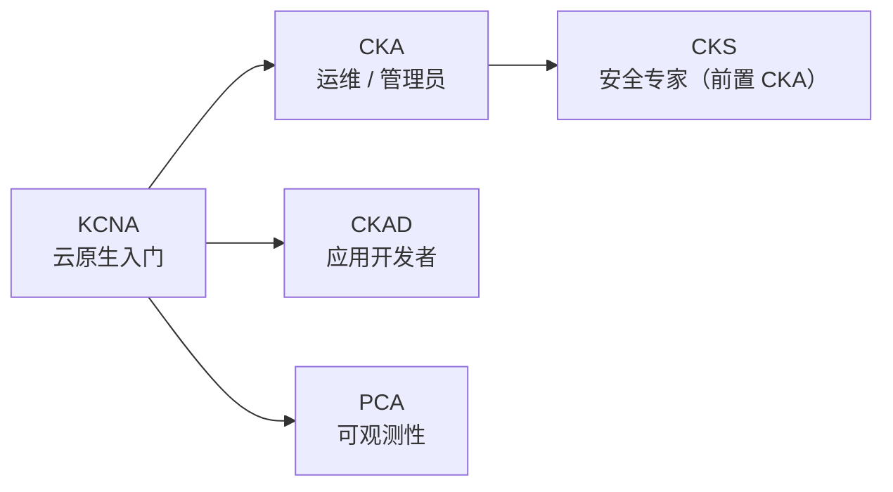

# KCNA 认证试题讲解 —— 本章导学：用真题把云原生体系过一遍

课程学完了，是不是就到了"考试季"？这里并不是要考大家，而是通过 KCNA 这套认证考试来更好地检验前面的学习成果——它同时也是一个极好的复习方法。如果你还不清楚云原生技术相关的官方认证有哪些、有没有兴趣去考，那这一章正好补上。

## 纲要

- 什么是 KCNA，以及它为什么是入门级
- 本章学习形式：图文自学 + 典型真题精讲
- 试卷形态：50 题 / 90 分钟，挑典型题讲
- 真题讲解的选题原则：补盲区 + 防易错
- 顺带介绍 CKA / CKAD / CKS 等进阶认证
- 给备考者的建议

## 什么是 KCNA

KCNA（Kubernetes and Cloud Native Associate）是 CNCF（云原生计算基金会）推出的**入门级**云原生认证，比 CKA / CKAD / CKS 这些"性能型"认证更容易一些，可以先来试一试。它面向的对象是希望提升 Kubernetes 基础知识和技能、理解到专业水平的考生；对于正在学习或有兴趣使用云原生技术的同学，这是一个理想的起点。



## 本章的学习形式

关于 KCNA 认证这部分内容，咱们直接通过图文来学习就好，不在视频里逐一铺开。起码你该知道：KCNA 是谁颁发和认证的（CNCF）、考察的内容有什么、怎么考试、费用是多少等信息。

```dir
本章内容结构
├── 1. KCNA 认证概览（图文自学）
│   ├── 颁发机构：CNCF
│   ├── 考察内容 / 考试形式 / 费用
│   └── 是否报名，随你情况
├── 2. 典型真题讲解（视频精讲）
│   ├── 一份试卷 50 题 / 90 分钟
│   ├── 只挑典型题讲（全讲会远超时长）
│   └── 侧重：课程没覆盖的内容 + 易错内容
└── 3. 相关认证介绍
    ├── CKA / CKAD / CKS
    └── PCA（原 CPA，Prometheus 方向）
```

## 试卷形态与讲解策略

一份 KCNA 试卷有**五十道题**，做题需要**九十分钟**。如果逐题全讲，时间肯定远超课程时长，所以我们只挑其中的**典型试题**来讲：

- 针对一些**课程中没有覆盖到**的内容（云原生面很广，课程不可能面面俱到）；
- 针对一些**比较容易出错**的内容（选型题、干扰项特别多）。

通过"做题—讲解"的方式练习，是比单纯看视频、看文章好得多的学习方法。建议大家把这一节的内容都学一学，同时也把更多的试题自己尝试着做一下——练得越多，体系越扎实。

## 真题讲解的选题原则

```dir
选题逻辑
├── 补漏型
│   └── 课程未覆盖：OCI 标准 / Serverless 边界 / 十二要素 / 安全四 C 等
└── 防错型
    └── 易混淆：云原生架构特征（高成本是陷阱）
    └── 易误选：Serverless "不需要服务器"（其实是不管运维）
    └── 排序题：安全四 C 从内到外
```

这类题的共同特点是**考概念边界而非操作熟练度**——KCNA 不考你手速，考你"听起来都对"的选项里哪个才是标准答案。

## 顺带认识进阶认证

在讲完真题之后，我们还会把云原生和容器化技术相关的几个认证都介绍一下。KCNA 是初级认证，沿着这条路往下走还有：

| 认证 | 面向 | 前置 |
| --- | --- | --- |
| **CKA** | Kubernetes 管理员（生产级集群的安装配置管理） | — |
| **CKAD** | K8s 应用开发者（设计、构建、部署云原生应用） | — |
| **CKS** | K8s 安全专家 | 必须先过 CKA |
| **PCA / PCC** | Prometheus 可观测性（PromQL 为重） | 建议先有 KCNA/CKA |

- 想具备 K8s 的运维能力 → 需要 **CKA**；
- 想在 K8s 平台做服务开发 → 需要 **CKAD**；
- 想成为 K8s 安全专家 → 需要 **CKS**（难度更高，且需先通过 CKA 才能预约）；
- 这些认证都具有很高的专业水平，有志深入的同学可以多关注、进一步学习。

## 给备考者的建议

```dir
务实备考建议
├── 心态
│   └── 有证总比没有好，但能力永远比证书重要
├── 动机
│   └── 更理性的目标是：拿真题练手、检验学习成果
├── 方法
│   ├── 先图文自学 KCNA 概览（谁颁发 / 考什么 / 怎么考 / 多少钱）
│   ├── 再刷典型真题，重点看"课程没覆盖 + 易错"的部分
│   └── 顺带了解 CKA/CKAD/CKS/PCA 的报考路径
└── 注意
    └── 这些认证培训和报名费用不便宜，极少有岗位硬性指定
```

## 总结

进入 KCNA 这一章，先把定位弄清：

1. **KCNA 是 CNCF 的入门级云原生认证**，比 CKA/CKAD/CKS 容易，适合作为第一块敲门砖；
2. **学习方式是"图文自学 + 真题精讲"**：概览部分自己看，真题只挑典型题讲（课程未覆盖 + 易错）；
3. **试卷 50 题 / 90 分钟**，考概念辨析而非命令行手速，干扰项多；
4. **顺带认识进阶路线**：CKA（运维）→ CKAD（开发）→ CKS（安全，前置 CKA）→ PCA（可观测性）；
5. **备考建议很务实**：证书是加分项，能力才是根本；更理性的动机是用真题检验自己的学习成果。

带着"用真题复盘整套云原生体系"的心态，我们下一节就开始讲题。
