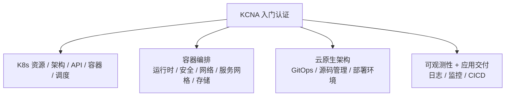

# 本章小结 —— KCNA 认证全景与云原生知识体系复盘

这一章我们借 KCNA 认证真题，把整门云原生课程的知识体系又过了一遍。下面把 KCNA 的定位、考察范围、相关认证，以及备考的务实建议复盘清楚，方便大家对照查漏。

## 纲要

- KCNA 是什么：云原生入门级认证
- 考察内容的四大板块（K8s / 容器编排 / 云原生架构 / 可观测与应用交付）
- 真题讲解带来的两点收获：全面性 + 题库练习
- 进阶认证路线：CKA / CKAD / CKS / PCA
- 考试费用与报名的务实建议
- 一句话定调：能力比证书重要

## KCNA 是什么

KCNA 是云原生的**入门级认证**，专为希望提升 Kubernetes 基础知识和技能、理解到专业水平的考生设计；对于正在学习或有兴趣使用云原生技术的考生，它是个理想选择。拿到 KCNA，说明你已具备**整个云原生生态系统的概念性知识**——这正是它的价值：广度优先，帮你建立一张完整的地图。



## 考察内容的四大板块

虽然 KCNA 是初级经验级认证，但涵盖的内容却是最全面的。真题里涉及的领域非常多：

| 板块 | 包含内容 |
| --- | --- |
| **K8s 本身** | 资源、架构、API、容器、调度（scheduler）等 |
| **容器编排** | 编排基础、运行时（runtime）、安全、网络、服务网格（Service Mesh）、存储 |
| **云原生架构** | GitOps 基础、源码管理、部署环境概念（Deployment environments） |
| **可观测性 & 应用交付** | 日志、监控、CICD 等（有时也并入 DevOps 基础） |

> 注意：KCNA 真题里大量出现"云原生的监控/日志/什么是云原生"这类选择题——这跟我们前面监控、日志两章的内容直接对应，复习时务必重点看。

## 真题讲解的两点收获

通过真题讲解，我们能拿到两件事：

1. **全面性**：KCNA 涉及领域极广，课程没能全面覆盖所有地方，可以通过专门的培训来提高；真题里既有 K8s 内容，也有容器编排、云原生架构与 DevOps 基础；
2. **题库练习**：虽然官方没有给出具体题库，但从以前的考试真题中也能练习和掌握很多内容。课程整理了**超过五十道真题**，让大家提前感受 KCNA 的考试风格。

```dir
真题练习的两种用途
├── 检验学习成果
│   └── 比单纯看视频/文章更有效，是"主动回忆"
└── 补齐知识盲区
    └── 课程未覆盖的领域，靠真题暴露出来再去补
```

## 进阶认证路线

除了 KCNA，云原生体系里还有几条更"硬"的认证线，与 K8s 强相关：

| 认证 | 全称 / 面向 | 前置 |
| --- | --- | --- |
| **CKA** | Certified Kubernetes Administrator，运维/管理员 | — |
| **CKAD** | Certified Kubernetes Application Developer，应用开发者 | — |
| **CKS** | Certified Kubernetes Security Specialist，安全专家 | 必须先过 CKA |
| **PCA / PCC** | Prometheus Certified Associate，可观测性方向 | 建议先有 KCNA/CKA |

- 成为 K8s 管理员 → 需要 **CKA**；
- 在 K8s 平台做服务开发 → 需要 **CKAD**；
- 成为 K8s 安全专家（比 CKA 更进一步） → 需要 **CKS**，且需先通过 CKA 才能预约；
- 想深入监控可观测性 → 还有 **PCA**（文中也写作 CPA，Prometheus 高级领域认证）。

## 考试费用与务实建议

这些认证的考试费用都在**三百美元左右**（换成人民币就是两千多元）。是否要报名，看大家自己的情况。

```dir
关于"要不要考"的判断框架
├── 成本账
│   ├── 培训和报名费用都不便宜
│   └── 极少有公司/机构岗位硬性指定需要这些认证
├── 价值账
│   ├── 有证总比没有好
│   └── 但能力永远比证书重要
└── 更理性的动机
    └── 用真题练习 + 检验学习成果，而不是为了那张纸
```

重点提醒：**根据真题进行练习和学习，是很好的方法**——它让零散的知识点被真题串成体系，也能提前暴露盲区。至于要不要花两千多块报名考试，结合自身职业规划决定即可。

## 总结

这一章围绕 KCNA 把云原生知识地图收了个尾：

1. **KCNA 是 CNCF 入门级认证**，广度优先，拿到即证明你具备整张云原生生态的概念性知识；
2. **考察四大板块**：K8s 本身（资源/架构/API/容器/调度）、容器编排（运行时/安全/网络/服务网格/存储）、云原生架构（GitOps/源码管理/部署环境）、可观测性与应用交付（日志/监控/CICD）；
3. **真题的两大价值**：全面性（暴露课程未覆盖处）+ 题库练习（课程整理 50+ 真题），用"做题"主动回忆比看视频高效得多；
4. **进阶路线清晰**：CKA（运维）→ CKAD（开发）→ CKS（安全，前置 CKA）→ PCA（可观测性），都是云原生体系的专业认证；
5. **费用约 300 美元（两千多元人民币）**，岗位极少硬性要求，更理性的动机是"拿真题练手、检验成果"；
6. **定调一句话**：通过本章学习，大家对这类认证考试情况都应有所了解，对云原生架构、微服务、容器化等知识的理解和掌握也应有所加深——**能力永远比证书重要**。

希望大家顺利通过 KCNA 或类似的认证考试，也把这套云原生体系真正用起来。
