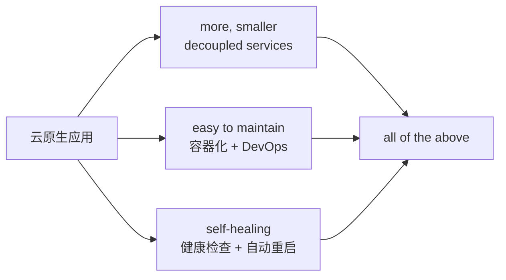
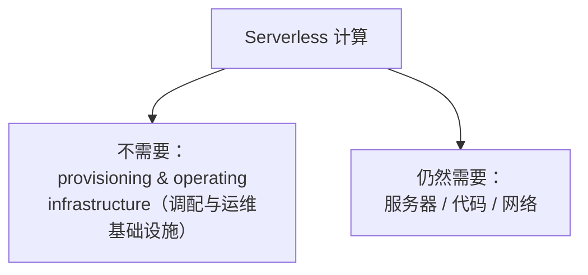
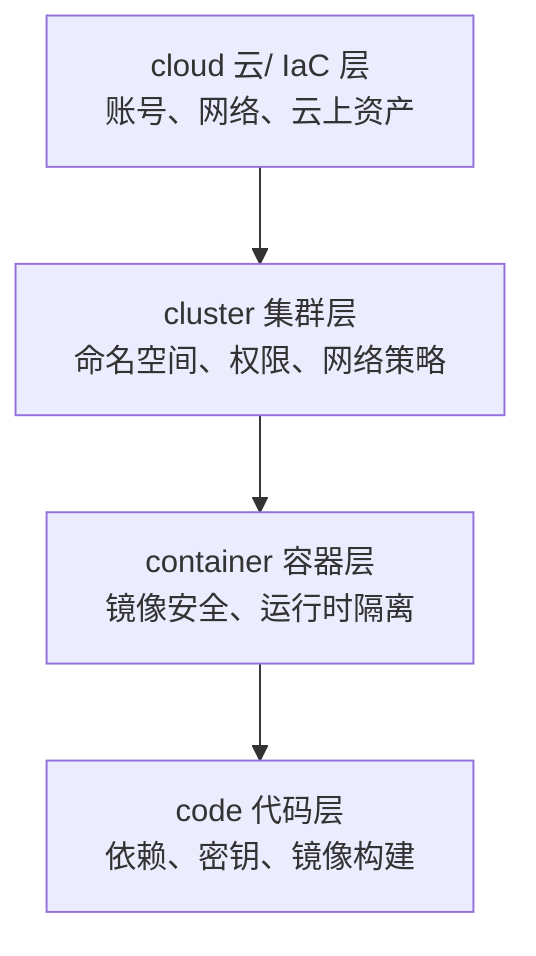

# Kubernetes 认证考点: KCNA 真题精讲（一）—— 云原生特征、OCI 标准与 Serverless 边界

KCNA 的题不难，难在选项里塞的都是"听起来都对"的干扰项。

结论：**真题讲解（一）覆盖第 0、1、2、4、5、12、14 题。核心答案：① 云原生应用 = 更小的解耦服务 + 易维护 + 自我恢复（全选 d）；② 云原生架构的特征是**高度自动化与可扩展（b）**，不是高成本低复杂、也不是高风险复杂；③ OCI 管的是 **runtime / image / distribution** 三项标准，build 与 Docker 都无关（b）；④ Serverless 不需要的是**资源调配与运维基础设施（b）**，不是"服务器"—— 服务器、代码、网络都还在；⑤ 十二要素（12-factor）是关于**云原生应用开发与部署的方法论/指南**；⑥ 上传容器镜像的地方是 **Registry（b）**，不是管理面板、不是 K8s、不是 etcd；⑦ 云原生安全四 C 从内到外是 **code → container → cluster → cloud。**

## 纲要

- 考试形态：全英文 / KCNA-ZH
- 第 0 题：云原生应用是什么
- 第 1 题：云原生架构的特征
- 第 2 题：OCI 提供哪些容器标准
- 第 4 题：Serverless 不需要什么
- 第 5 题：十二要素应用是什么
- 第 12 题：镜像上传到哪
- 第 14 题：云原生安全四 C 的排序

## 考试形态

**KCNA 的在线考试没法直接演示，只能把一些真题拿出来一个个讲解。这里找到了五十多道题，已经录入到在线题库后台，后面再有更新也会在网站上更新。**

**KCNA 的在线考试是全英文页面，KCNA-ZH 是中文页面，报名认证考试的时候大家根据自己的情况来选择。虽然题库平台上已经有全部中文页面，但为了保证 KCNA 试题的原汁原味，还是直接看英文的页面。**

```text
KCNA 备考提醒
├── 语言：官方考试英文页面；KCNA-ZH 是中文版，报名时可自选
├── 题量：五十多道（题库持续更新）
├── 难度：考概念辨析，不是考命令行手速
└── 复习重点：云原生的监控/日志/什么是云原生 这一章，选择题反复出现
```

## 第 0 题：云原生应用是怎样的

**Question：Cloud native applications（云原生的应用程序）是怎样的？**

| 选项 | 内容 | 是否成立 |
| --- | --- | --- |
| a | **more, smaller, decoupled services** 更小、更多的解耦服务 | ✅ 云原生微服务架构里的微服务就是符合"更小、解耦"的服务 |
| b | **easy to maintain** 容易维护 | ✅ 容器化技术、DevOps 技术都能高效地对服务进行开发、测试、部署和运维 |
| c | **self-healing** 自我恢复 | ✅ 自动健康检查、自动重启等能力帮助应用自动恢复 |
| **d** | **all of the above** 以上全部 | ✅ **正确答案** |

**正确答案是 d（all of the above）。**



> 复习落点：**云原生的监控和日志服务、这一章里"什么是云原生"那一节**，全部对得上。

## 第 1 题：云原生架构的特征

**Question：What are some characteristics of cloud native architecture（云原生架构的一些特征是什么）？**

| 选项 | 内容 | 判定 |
| --- | --- | --- |
| a | high cost and maintenance 高昂的成本和复杂 | ❌ |
| **b** | **high automation and scalability 高度自动化和可扩展** | ✅ **正确** |
| c | high security risk and complexity 高风险和复杂性 | ❌ |
| d | all of the above 以上全部 | ❌ |

**解析：我们使用云原生架构，其中很重要的一个目标就是降低成本、简化运维，所以 a 不成立；虽然云原生架构非常庞大、很多组件都有一定的复杂性，但这些不会片面地带来高风险、高成本、高复杂度 —— 通过引入 GitOps 和 DevOps 平台、通过 K8s 框架都可以带来非常好的自动化处理能力（服务的健康检查和自动恢复、服务资源的自动扩缩容），通过完善的可观测性能力，云原生架构的安全性应该是更加安全可靠的。**

**综上，选项 b 是正确的。**

```text
为什么 a / c 是干扰项
a「高成本」→ 云原生目标恰恰是降本
c「高风险」→ 组件多≠风险高；可观测性 + 自动化让系统更可控
b「自动化 + 可扩展」→ 这才是 K8s / GitOps / DevOps 真正兑现的东西
   ├── 自动化：健康检查、自动恢复、自动扩缩容
   └── 可扩展：声明式副本数 + HPA
```

## 第 2 题：OCI 提供哪些容器标准

**Question：The Open Container Initiative（OCI）provides container standards —— 开放式容器协议为什么提供了容器标准？出现的关键词有 runtime、image build、distribution。**

| 关键词 / 选项 | 与 OCI 的关系 |
| --- | --- |
| **runtime** | ✅ 容器运行时 |
| **image** | ✅ 镜像格式 |
| **distribution** | ✅ 分发规范 |
| build | ❌ 镜像构建（这是 Docker/BuildKit 等工具链的事） |
| Docker | ❌ 容器化技术的具体实现 / 产品名称，不是标准本身 |

**Docker 其中的 build 是镜像构建，肯定和 OCI 没有关系；而 Docker 是一个容器化技术的具体实现或者产品名称，肯定也是和 OCI 没有关系。所以就剩下容器的运行时、镜像和分发这三项 —— 这三项是 OCI 所支持的，所以正确答案是 b。**

```text
OCI 的三块标准（记忆点）
├── runtime spec     容器运行时规范（runC 就是它的参考实现）
├── image spec       镜像格式规范
└── distribution    镜像分发（push / pull 的 API 语义）
** 没有 build —— 构建是工具链的职责
```

## 第 4 题：Serverless 不需要什么

**Question：Serverless computing doesn't require（无服务器计算，不需要什么）？**

| 选项 | 内容 | 判定 |
| --- | --- | --- |
| a | service / 服务器 | ❌ 很多人会误选 |
| **b** | **provisioning and operating infrastructure 资源调配和操作基础架构** | ✅ **正确** |
| c | application code 应用程序代码 | ❌ |
| d | network 网络 | ❌ |

**这道题很多人会误选 a：无服务计算是不是没有服务器呢？那正确答案是 b —— 服务器、代码和网络这些都是最基础的组成部分，是不可或缺的；Serverless 只是省去了我们来管理基础架构，不需要自己来维护和管理服务器。所以记住：serverless computing 只是不需要管理服务器，并不是不需要服务器。**



> 一句话记法：**"无服务器"= 无服务器运维，不是无服务器硬件。**

## 第 5 题：十二要素应用是什么

**Question：The twelve factor app is a ______ guideline（十二因素应用程序是什么的指南）？**

**十二要素应用程序是一种构建软件即服务（SaaS）应用程序的方法，可以在现代云平台上运行（例如 AWS、微软 Azure、谷歌云 GCP 等）；它提供了一组用于开发和部署应用程序的最佳实践，重点关注可伸缩、可维护性、可移植性和弹性等因素。**

**十二要素应用程序与构建容器或在 K8s 上部署并没有特别相关 —— 尽管这些技术可以用来实现它的一些原则。正确答案是 a（方法论 / 指南）。**

```text
12-Factor App：一份方法论，不是一项技术
├── 面向：SaaS 应用在云平台上运行（AWS / Azure / GCP）
├── 提供：开发与部署的最佳实践
├── 关注：可伸缩性、可维护性、可移植性、弹性
└── 与容器 / K8s 的关系：
    这些技术可以用来实现它的一些原则，但 12-factor 本身不是容器规范
** 易错点：别因为它"常和容器一起出现"就选成技术项
```

## 第 12 题：镜像上传到哪

**Question：Where can you upload container images（可以在哪里上传容器镜像）？**

| 选项 | 是什么 | 判定 |
| --- | --- | --- |
| a | Portainer 类管理工具 —— 管理容器、镜像、挂载卷，以及由容器组成的编排栈 | ❌ 不是存镜像的 |
| **b** | **Registry 仓库** | ✅ **专门存储镜像的仓库** |
| c | Kubernetes | ❌ 容器编排框架 |
| d | etcd | ❌ 强一致的分布式 KV 数据库 |

**Portainer 是一个用于管理容器和镜像、安装到这些容器中的卷、以及由容器组成的编排栈的工具，不是用来存储镜像的；K8s 是容器编排框架、微服务开发框架；etcd 是强一致的分布式 KV 数据库。所以正确答案应该是 b（Registry），是专门存储镜像的仓库。**

```text
四个容易混的概念
├── Registry  ← 存镜像（Docker Hub / Harbor / ACR）
├── Portainer ← 管容器与卷的可视化管理面板
├── Kubernetes← 编排框架
└── etcd      ← 分布式 KV（存集群状态）
```

## 第 14 题：云原生安全四 C 排序

**Question：Sort the forces of cloud native security, starting from the inside（云原生安全的四 C，从内部开始排序）。**

| 选项 | 顺序 | 判定 |
| --- | --- | --- |
| a | code → container → cloud → cluster | ❌ cluster 跑在 cloud 前面了 |
| b | cluster → container → cloud → code | ❌ code 应该是最内部的 |
| **c** | **code → container → cluster → cloud** | ✅ **正确** |
| d | container → cluster → cloud → code | ❌ code 不是最内部 |

**我们一个一个来看：a 是 code、container、cloud、cluster，这里的 cluster 是在 cloud 前面的，所以 a 不正确；b 是 cluster、container、cloud、code，这里的 code 应该是最内部的，b 也不正确；d 是 container、cluster、cloud、code，和 b 类似，code 应该是最内部的，d 也就不对。正确答案是 c —— 从内到外是 code、container、cluster、cloud。**



> **从内往外记：代码 → 容器 → 集群 → 云。** 修漏洞从 code 开始，防护边界一层层往外扩。

## 答题方法小结

```text
KCNA 选择题的三个套路
├── ① "all of the above" 题：先逐个证伪前面几个，再选全选
├── ② 问"是什么"的题：分清「方法论/标准/工具/产品」
│     OCI = 标准；Docker = 产品；12-factor = 方法论；Registry = 仓库
└── ③ 排序题：找边界项（最内/最外），先定这两项，中间的排不出错
```

## API 速览

| 术语 | 英文 | 一句话 |
| --- | --- | --- |
| 云原生应用 | Cloud native application | 更小解耦 + 易维护 + 自我恢复 |
| 云原生架构特征 | high automation and scalability | 自动化与可扩展性是答案 |
| 开放容器协议 | OCI | runtime / image / distribution |
| 无服务器计算 | Serverless computing | 不管基础设施调配与运维，不是没有服务器 |
| 十二要素应用 | 12-factor app | SaaS 开发与部署的方法论 |
| 镜像仓库 | Registry | 专门存镜像 |
| 容器管理面板 | Portainer | 管理容器/镜像/卷/编排栈 |
| 云原生安全四 C | 4 C's | code → container → cluster → cloud |

## Demo 示例

把这几道题串成一张复习表，考前照着过一遍：

```text
题目回顾（一）
┌──────┬──────────────────────┬──────────────────────────────┐
│ 题号 │ 问什么               │ 正确答案                     │
├──────┼──────────────────────┼──────────────────────────────┤
│ 0    │ 云原生应用什么样     │ d 全选（解耦/易维护/自愈）    │
│ 1    │ 云原生架构的特征     │ b 高度自动化 + 可扩展         │
│ 2    │ OCI 的标准范围       │ b runtime / image / dist     │
│ 4    │ Serverless 不需要    │ b 基础设施调配与运维          │
│ 5    │ 12-factor 是什么     │ a 方法论 / 指南               │
│ 12   │ 镜像上传去哪         │ b Registry                   │
│ 14   │ 安全四 C 从内到外    │ c code → container → cluster │
└──────┴──────────────────────┴──────────────────────────────┘
```

现场排除法模板（以第 1 题为例）：

```bash
# 不做"凭感觉选"，按这个顺序排
Q="云原生架构特征"
1. 找绝对反例   → a「高成本」与「云原生目标=降本」冲突      → 排除
2. 找绝对反例   → c「高风险」被可观测性 + 自动化反证         → 排除
3. 剩下 b、d    → d 是 all of the above，只有前三者全对才选  → 排除 d
4. 选 b
```

## 总结

这七道题共同考的就是**概念边界**，而不是操作熟练度：

1. **云原生应用**（第 0 题）＝**更小更解耦的服务 + 易维护 + 自我恢复**，属于"全选题"，三个描述都成立；
2. **云原生架构特征**（第 1 题）＝**高度自动化与可扩展（b）**；**a「高成本」和 c「高风险」都是干扰项** —— 组件多不等于成本高、风险高，GitOps / DevOps / K8s 恰恰是把复杂度和成本压下去的手段；
3. **OCI**（第 2 题）管的三块是 **runtime / image / distribution**；**build 和 Docker 都不算标准**（Docker 是实现，build 是工具链）；
4. **Serverless**（第 4 题）不需要的是**基础设施的调配与运维（b）**，**不是服务器** —— 这句话是全场最经典的误选点；
5. **12-factor**（第 5 题）是**面向云平台 SaaS 的开发部署方法论/指南**，跟"容器技术本身"没有绑定关系；
6. **镜像存哪**（第 12 题）＝**Registry**；Portainer 是管理面板、K8s 是编排框架、etcd 是 KV 库，三个都不是仓库；
7. **安全四 C 排序**（第 14 题）从内到外是 **code → container → cluster → cloud**；
8. **通用做题法**：**先找绝对反例排除选项 → 再处理 all of the above → 排序题先定首尾**。

