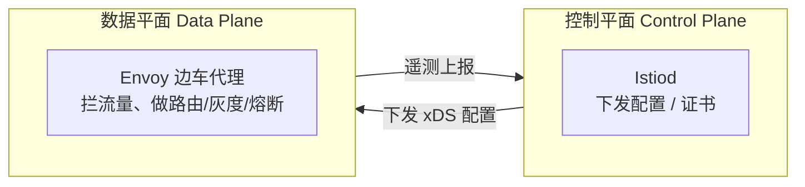
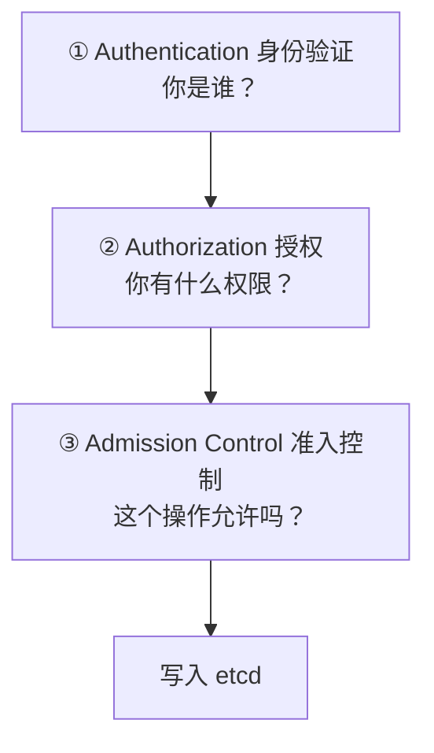

# Kubernetes 认证考点: KCNA 真题精讲（二）—— ServiceMesh 到 K8s 基础概念的八道题

第二组真题（第 17/19/21/22/23/27/28/36 题）可以分成两块：**上半场是 ServiceMesh 与 kubelet 的架构题，下半场是 K8s 基础概念的送分题。**

结论：**ServiceMesh 主要由**数据平面（管流量）+ 控制平面（管管理）**两部分组成（第 17 题）；节点上的 agent 叫 **kubelet**，它跟 API Server 通信、管容器生命周期、上报资源使用，**kube-proxy 是网络代理不是 kubelet（第 19 题）**；请求在 API Server 里要过 **authentication → authorization → admission control** 三关（第 21 题）；K8s 已把 **Docker 标记为 deprecated**，推荐 CRI-O / containerd / gVisor（第 22 题）；网络模型里 **「节点与 Pod 之间加密通信」不是硬要求，只是建议（第 23 题选 c）**；官方 CLI 是 **kubectl（第 27 题）**、最小可部署单元是 **Pod（第 28 题）**、流行版本控制工具是 **Git（第 36 题）。**

## 纲要

- 第 17 题：ServiceMesh 的主要组成
- 第 19 题：节点上的 agent 是谁
- 第 21 题：请求在 API Server 的三阶段
- 第 22 题：哪个容器运行时被标记废弃
- 第 23 题：哪项不是 K8s 网络要求
- 第 27/28 题：kubectl 与 Pod
- 第 36 题：版本控制工具
- 一条做题线：先翻译再排序

## 第 17 题：ServiceMesh 的主要部分

**Question：What are the main parts of a Service Mesh（服务网格的主要部分是什么）？**

**这里需要回顾一下 Service Mesh 与 Istio 的原理与能力。Service Mesh 包含两部分：一个是数据平面（控制流量的），一个是控制平面（控制管理端的），所以正确答案是 b。**

| 选项 | 内容 | 判定 |
| --- | --- | --- |
| a | controller manager and DNS | ❌ controller-manager 是 K8s 核心组件；DNS 是 K8s 扩展插件 |
| **b** | **data plane and control plane** | ✅ **正确** |
| c | antivirus and malware scanner | ❌ 病毒和恶意软件扫描，明显不对 |
| d | dock（docker）fire and network | ❌ 明显不对 |



## 第 19 题：节点上运行的 agent 叫什么

**Question：The c（kube-）agent learning on each worker node is called（在每个工作节点上运行的 kube agent 被称为什么）？**

**从下面的选项里很容易排除其他几个来，正确答案是 b：kubelet（kube agent）—— 负责与 kube-apiserver 控制平面进行通信，并管理节点上运行的容器，它确保容器运行正常，并处理容器生命周期事件（如启动、停止、并重新启动容器）；它还监视容器的资源使用情况并向控制平面报告，然后控制平面就可以做出有关调度和扩展工作负载的决定。**

| 选项 | 是什么 | 判定 |
| --- | --- | --- |
| a | **systemd** —— Linux 操作系统的系统和服务管理器 | ❌ 不属于 kube agent |
| **b** | **kubelet** —— 与 API Server 通信、管容器生命周期、上报资源 | ✅ **正确** |
| c | **container** —— 容器运行时，执行镜像并管理其生命周期 | ❌ 这是运行时不是 agent |
| d | **docker** —— 具体产品，制作和管理镜像容器的工具 | ❌ 具体产品 |

```text
节点上的四个"容易混"的东西
├── kubelet   ← 节点 agent，跟 API Server 通话，管 Pod 生命周期   ★答案
├── kube-proxy← 网络代理，每个节点跑，按 IP+端口把流量路由到容器
│               （**它不是 kubelet 的 agent**，这是命题人埋的坑）
├── containerd← 容器运行时，真正跑容器
└── systemd   ← 宿主机 init 系统
```

> 课程里特意点了一句：**如果再增加一个 kube-proxy 选项，大家是不是就会有一些疑惑、可能会选错呢？** —— kube-proxy 在网络层跑，kubelet 在 Pod 生命周期层跑，两者职责不同。

## 第 21 题：请求在 API Server 的三个阶段

**Question：Sort the three stages a request needs to go through in the APIServer（请求在 APIServer 需要经历的三个阶段进行排序）。**

**首先要回答这个问题并不难 —— 咱们需要对下面几个名词进行准确的翻译才行：admission control 准入控制、authorization 授权、authentication 身份验证。再回到问题：APIServer 首先要进行身份验证，需要知道请求的人是谁；然后要验证用户的角色，也就是这个人有什么授权，有了用户的角色就可以知道他的角色对应的有哪些权限了，这一步就是准入控制。所以它的顺序是：身份验证（authentication）→ 授权（authorization）→ 准入控制（admission control），正确答案是 c。**



| 阶段 | 干什么 | 典型实现 |
| --- | --- | --- |
| **Authentication** | 判定身份 | client cert / token / ServiceAccount / OIDC |
| **Authorization** | 判定权限（RBAC） | Role / ClusterRole / 鉴权链 |
| **Admission Control** | 在落库前拦截对象 | LimitRanger、ResourceQuota、Validating/Mutating Webhook |

> **三者的方向记成"先认人、再给权、最后准入"**；顺序错了，RBAC 就可能在认证之前被问到，逻辑上说不通。

## 第 22 题：哪个容器运行时被标记废弃

**Question：Which container runtime is marked as deprecated by Kubernetes（哪个容器运行时被 Kubernetes 标记为不推荐使用）？**

**这里一眼就可以看出来，正确答案是 c：Docker —— Kubernetes 已经将 Docker 标记为不推荐使用，支持使用容器运行时接口 CRI。尽管 K8s 依然支持 Docker，但建议使用其他容器运行时，如 CRI-O 或 gVisor，它们是专门为 K8s 设计的，并提供更好的性能和安全功能。**

| 选项 | 是什么 | 判定 |
| --- | --- | --- |
| a | **CRI-O** —— 轻量级开源容器运行时，针对 K8s 优化，支持 CRI | 推荐替代 |
| b | **containerd** —— 容器运行时，管理容器镜像生命周期并提供稳定 API | 推荐替代 |
| **c** | **Docker** | ✅ **被标记 deprecated** |
| d | **gVisor** —— 容器沙箱，为运行容器提供安全和轻量环境 | 推荐替代 |

```text
K8s 容器运行时的关系
Docker（deprecated，通过 dockershim 转发到 CRI）
   ↓ 现在直接走 CRI
CRI-O / containerd（默认）
   ↓ 更进一步要更安全
gVisor（沙箱，弱隔离但更安全）
```

## 第 23 题：哪项不是 K8s 网络的要求

**Question：Which of the following is NOT requirement in Kubernetes networking（下面哪项不是 K8s 网络的要求）？**

| 选项 | 内容 | 判定 |
| --- | --- | --- |
| a | pod 与 node 网络互通 | ✅ 是要求 |
| b | （pod 与 pod 网络互通） | ✅ 是要求 |
| **c** | **port communicating encrypted（节点与 Pod 之间、port 与 port 之间的加密通信）** | ❌ **只是建议，不是必须 —— 本题正确答案** |
| d | network address translation 无 NAT —— Pod 应有唯一 IP，且能在没有任何 NAT 的情况下直接互相通信 | ✅ 是要求 |

```text
K8s 网络模型四条硬要求（CNI 必须满足）
├── ① pod 之间可直接通信，不需要 NAT
├── ② node 与 pod 之间可直接通信，不需要 NAT
├── ③ pod 看到自己的 IP 与别人看到的-ip 一致
└── ④ pod 自身的网络命名空间……（①~③ 对应选项 a/b/d）

「加密通信」不在硬性要求里
→ 它是可选加固项，由 CNI / 服务网格（mTLS）自己去做
** 所以本题选 c
```

## 第 27 / 28 题：kubectl 与 Pod

**Question 27：What is the name of the official Kubernetes command line interface（K8s 官方命令行接口的名称是什么）？** —— **答案很明显是 b：kubectl。** containerctl / coopertwo / postctl 都不是 K8s 官方 CLI，cali 也不是常用工具。

**Question 28：What is the smallest deployable compute unit of Kubernetes（K8s 最小的可部署计算单元是什么）？** —— **选项 c 是正确答案：Pod。** Pod 是 K8s 中最小、最简单的可部署单元，它表示集群中正在运行的进程的单个实例，可以包含一个或多个密切相关的容器；这些容器共享相同的网络命名空间，并且可以使用 localhost 的接口相互通信；**Pod 设计为短暂的，可以根据需要动态创建、更新和销毁。**

| 选项 | 是什么 | 判定 |
| --- | --- | --- |
| a | 容器 —— 逻辑和技术实体，代表单个软件应用/服务的运行环境；Pod 可包含一个或多个容器 | ❌ 比 Pod 还小一层 |
| **c** | **Pod** | ✅ **最小可部署单元** |
| b | Deployment —— 更高级别的资源，管理 Pod 的多个副本的部署和扩展 | ❌ 更高层 |
| d | ReplicaSet —— 确保任何给定时间运行特定数量的 Pod 副本 | ❌ 更高层 |

```text
层级关系（从外到内）
Deployment → ReplicaSet → Pod → Container
** 问"最小可部署单元" → Pod
```

## 第 36 题：流行的版本控制工具

**Question：What is the name of a popular version control tool（流行的版本控制工具的名称是什么）？** —— **选项 b，git 是正确答案。Git 是一个自由开源的分布式版本控制系统，广泛用于软件开发和协作；它允许用户跟踪代码库的更改、与其他开发者协作，并管理软件项目的不同版本。**

| 选项 | 是什么 | 判定 |
| --- | --- | --- |
| a | Docker —— 容器化系统，以可移植高效的方式打包分发应用 | ❌ |
| **b** | **Git —— 分布式版本控制系统** | ✅ **正确** |
| c | Kubernetes —— 开源容器编排平台，自动化部署、扩展和管理 | ❌ |
| d | containerd —— 高性能容器运行时，K8s 用它管理镜像生命周期 | ❌ |

```text
四个词的一行区分
Git        ← 管代码版本
Docker     ← 管应用打包
Kubernetes ← 管容器编排
containerd ← 管容器运行
```

## 一条做题线：先翻译，再排序

课程里说"要回答第 21 题并不难，咱们需要对下面的几个名词进行准确的翻译才行" —— 这句话适用于整组题：

```text
真题（二）速查
┌──────┬──────────────────┬────────────────────────────────────┐
│ 题号 │ 问什么           │ 正确答案                           │
├──────┼──────────────────┼────────────────────────────────────┤
│ 17   │ ServiceMesh 组成 │ b 数据平面 + 控制平面              │
│ 19   │ 节点 agent       │ b kubelet（kube-proxy 是干扰项）    │
│ 21   │ API Server 三阶段│ c authentication→authorization→     │
│      │                  │   admission control                 │
│ 22   │ 哪个 runtime 废弃│ c Docker                           │
│ 23   │ 哪项不是网络要求 │ c 加密通信（只是建议）             │
│ 27   │ 官方 CLI         │ b kubectl                          │
│ 28   │ 最小可部署单元   │ c Pod                              │
│ 36   │ 版本控制工具     │ b git                              │
└──────┴──────────────────┴────────────────────────────────────┘
```

## API 速览

| 名词 | 英文 / 全称 | 一句话 |
| --- | --- | --- |
| 数据平面 | data plane | 管实际流量（Envoy 边车） |
| 控制平面 | control plane | 管配置与下发（istiod） |
| 节点 agent | kubelet | 跟 API Server 通信、管 Pod 生命周期 |
| 网络代理 | kube-proxy | 按 IP+端口做路由，**不是 kubelet 的 agent** |
| 身份验证 | authentication | 你是谁 |
| 授权 | authorization | 你有什么权限 |
| 准入控制 | admission control | 这个对象能不能进集群 |
| CRI | Container Runtime Interface | K8s 与运行时的接口层 |
| CNI | Container Network Interface | 网络插件规范 |
| kubectl | 官方 CLI | K8s 命令行 |
| Pod | 最小可部署单元 | 短暂、可动态销毁重建 |

## Demo 示例

把第 21 题那条链路敲一遍，比背顺序牢：

```bash
# ① 身份验证失败：直接 401 Unauthorized
kubectl --token=wrong-token get pods    # error: invalid authentication token

# ② 身份验证过、授权失败：403 Forbidden（它能证明你是谁，但没权限）
kubectl auth can-i create deployments --namespace default
# no

# ③ 授权过、准入控制拦下：403 + admission webhook / quota 报错
kubectl create limitrange my-limit --hard='default/pods=2'
kubectl run busy --image=busybox --restart=Never   # 超过配额会被 admission 拒

# 三者的报错形态完全不同，现场就能反推走到哪一步
```

```bash
# 第 28 题的层级：从 Pod 往外看出去
kubectl api-resources --verbs=get --no-headers | sort | head -20
# pods      ← 最小可部署单元
# replicasets / deployments / statefulsets / daemonsets ← 都是它上面的壳
```

## 总结

这组题的规律非常清楚 —— **不是考会不会用，而是考名词语义**：

1. **ServiceMesh = 数据平面 + 控制平面**（第 17 题 b），controller-manager/DNS/杀毒/防火墙都是混进来的其它领域名词；
2. **节点 agent 是 kubelet**（第 19 题 b）—— 它跟 API Server 通信、管容器生命周期、上报资源；**kube-proxy 是网络代理，不是 kubelet 的 agent**，这是本题最大的陷阱；
3. **API Server 三关的顺序是 authentication → authorization → admission control**（第 21 题 c）—— 先认人、再给权、最后准入；
4. **Docker 被 K8s 标记为 deprecated**，推荐 CRI-O / containerd / gVisor（第 22 题 c）；
5. **K8s 网络四条硬要求里没有"加密通信"** —— 加密只是建议，靠 CNI 或服务网格 mTLS 实现（第 23 题选 c）；
6. **官方 CLI 是 kubectl**（第 27 题）、**最小可部署单元是 Pod**（第 28 题）、**版本控制工具是 Git**（第 36 题）；
7. **层级要记牢：Deployment → ReplicaSet → Pod → Container**，问"最小"就答 Pod；
8. 最后一条方法论：**排序题先把名词翻译准（authN / authZ / admission），名词翻译准了，顺序自然排出来。**

