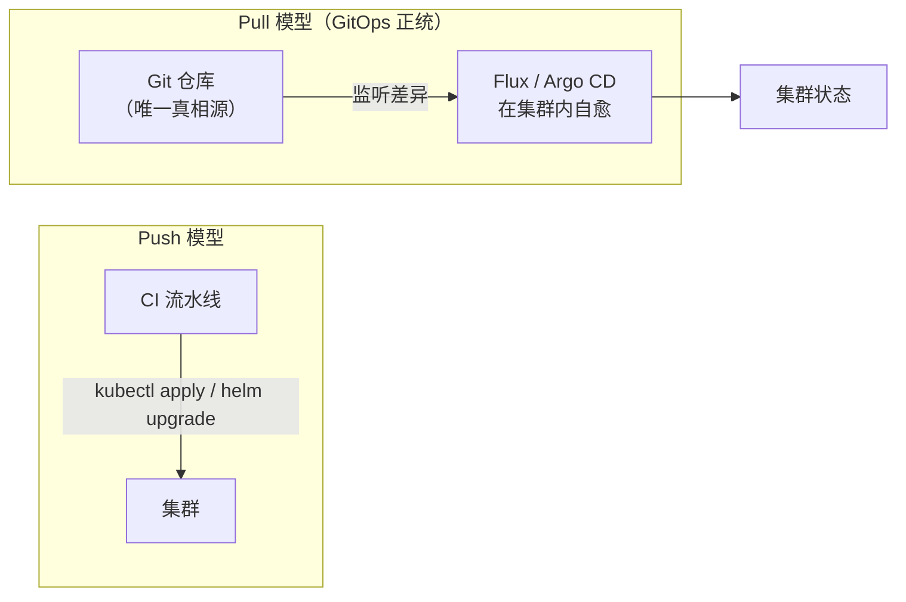
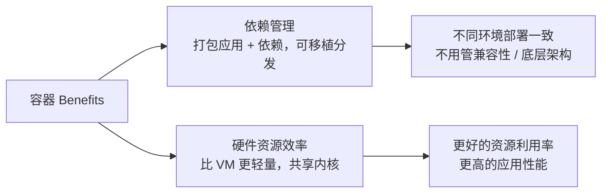

# Kubernetes 认证考点: KCNA 真题精讲（三）—— CI/CD 术语、GitOps 双雄与三道多选题

第三组真题（第 38/40/41 题 + 一道 kubectl 实操题 + 第 48 题 + 三道多选题）里，**单选题大多在考"术语的准确含义"，多选题则在考"这个概念到底能干什么"。**

结论：**CI/CD 是持续集成（Continuous Integration）+ 持续交付（Continuous Delivery），别和 deployment 部署混淆（第 38 题）；Flux 是面向 K8s 的 GitOps 工具（第 40 题）；「Flux 和 Argo CD 都用 push 方式」这个说法是**错的（b）** —— Argo CD 同时支持 push 和 pull，Flux 以 pull 为主（第 41 题）；查"已终止容器"的日志要 `kubectl logs -p <pod> -c <容器>`（-p 指 previous、previous terminated 实例，-c 指容器名）（第 44 题样式）；只增不减的值要用 **Counter**（第 48 题）；三道多选题答案分别是：**容器能帮助依赖管理与提高硬件资源利用率（a+b）**、**K8s 节点只有控制平面节点和工作节点两种（a+d）**、**云成本优化靠 Right Sizing 与预留实例（b+d）。**

## 纲要

- 第 38 题：CI/CD 代表什么
- 第 40 题：Flux 是什么
- 第 41 题：push 还是 pull（Argo CD / Flux）
- 实操题：查已终止容器的日志
- 第 48 题：只用 Counter 的值
- 多选一：容器能帮什么
- 多选二：节点的两类
- 多选三：云成本优化的方法

## 第 38 题：CI/CD 代表什么

**Question：What does CI/CD stand for（CI/CD 代表什么）？**

**我们知道它们是持续集成、持续交付，这里考验的就是这几个单词的翻译了：CI 持续是 continuous、集成是 integration、CD 交付是 delivery，这里很容易跟 deployment 部署搞混了。所以 CI 是 continuous integration，CD 是 continuous delivery，正确答案 b。**

| 缩写 | 全称 | 中文 | 干什么 |
| --- | --- | --- | --- |
| **CI** | **Continuous Integration** | 持续集成 | 频繁合并代码、自动构建 + 跑测试 |
| **CD** | **Continuous Delivery** | 持续交付 | 构建产物随时可发布到生产（手动按钮决定何时发） |
| CD（另一个） | Continuous Deployment | 持续部署 | 自动发布到生产，与 Delivery 不同 |

> **区分点**：**Delivery 是"随时能发、要不要发你说了算"，Deployment 是"发了不用你同意"。** 课程特意提醒"这很容易跟 deployment 部署搞混了"，考试就爱在这儿挖坑。
>
> 顺便补一句：课程录音里的 "container" 是 continuous 的转写误差，标准术语是 **continuous（持续的）**，不是 container（容器）。

## 第 40 题：Flux 是什么

**Question：Flux is built with the ...（Flux 是 ... 系统项目中的一个）？**

**Flux 是一个面向 Kubernetes 的连续渐进交付解决方案，具有开放性和扩展性，所以正确答案是 c：Flux 是一个 GitOps tool。**

```text
Flux 的身份
├── 定位：面向 K8s 的 GitOps / 渐进式交付工具
├── 特性：开放性、可扩展性
├── 来源：Kubernetes 生态（Weaveworks 发起，后捐给 CNCF）
└── 关键动作：监听 Git 仓库里声明的状态 → 在集群里把现实对齐过去
```

## 第 41 题：push 还是 pull

**Question：Flux and Argo CD are popular GitOps tools. They use a push based approach?（它们使用基于推送的方法，对不对）**

**正确答案是 b（错）。Argo CD 支持基于推送和拉取的部署；Flux 只是基于拉（pull）的模型，它使用接收器（receiver）使其与基于推的管道一样快速而响应。**



| 工具 | 模型 | 特点 |
| --- | --- | --- |
| **Flux** | **pull 为主** | 集群内跑 controller，持续比对 Git 与实况并纠偏；靠 receiver（webhook）让通知跟上 |
| **Argo CD** | **pull + push 都支持** | 默认 reconcile 式拉，也支持直接用 repo 触发的推式部署 |

> **一句话结论**：**GitOps 的正统是 pull（集群自己对齐 Git）**，push 只是 CI 侧的一个延伸手段；所以"它们都用 push"这个说法不成立。

## 实操题：查已终止容器的日志

**Question：How can you show the logs of previously terminated container named ruby in the web-one pod（如何在 web-one pod 中显示之前终止的名为 ruby 的容器的日志）？**

**这里考验的是 kubectl 的日志查询参数的使用：指定 pod 需要用到 `-p` 参数，指定容器需要用到 `-c` 参数；这里只有选项 d 把 `-p` 和 `-c` 参数都带上了，所以正确答案是 d。**

```bash
# 正确写法（-p + -c 都要带）
kubectl logs -p web-one -c ruby

# 拆解
#   -p / --previous=true   显示这个 Pod 上一个（已终止/已崩溃重启前的）实例日志
#   -c / --container=ruby  指定容器名（一个 Pod 里可能有多个容器）
```

| 参数 | 作用 | 常见坑 |
| --- | --- | --- |
| `kubectl logs <pod>` | 看当前容器日志 | 容器已 Terminated 就什么都没有 |
| `kubectl logs -p <pod>` | 看**上一个**实例（崩溃前那次）的日志 | 首次启动就崩过、没历史实例 → 报 "previous container termination not found" |
| `kubectl logs <pod> -c <name>` | 多容器 Pod 里指定容器 | 漏 `-c` 会打印容器名到 stderr 并报错 |
| `kubectl logs -p <pod> -c <name>` | **两者都要** | 本题答案 |

```text
排查崩溃的黄金三连
kubectl describe pod web-one | tail -20        # 看 Last State / Exit Code / OOMKilled
kubectl logs web-one -c ruby --previous        # 看崩溃前那次的日志 ← 关键
kubectl logs web-one -c ruby                   # 看重启后的（通常是空的）
```

## 第 48 题：只知道涨的指标用什么类型

**Question：Which Prometheus metric type should be used for a value that only increases（哪种 Prometheus 指标类型应该用于只增加的值）？**

**正确答案是 c：Counter —— 只有单调递增或者为 0。**

| 选项 | 类型 | 特性 | 判定 |
| --- | --- | --- | --- |
| a | **Histogram** | 保存区间数据（bucket），可以算出直方图数据 | ❌ |
| b | **Gauge** | 可以增加、可以减少，也可以直接设置为具体数值 | ❌ |
| **c** | **Counter** | **只增不减（重启归零），用 rate/irate 求速率** | ✅ **正确** |
| d | **Summary** | 类似 Histogram，直接算好的分位数数据 | ❌ |

```text
四种类型的判定口诀
├── Counter  ← 累计量：请求总数、错误总数、字节总数 → 配 rate()
├── Gauge    ← 瞬时量：队列长度、内存占用、线程数 → 直接画
├── Histogram ← 分桶区间：延迟分布 → histogram_quantile()
└── Summary  ← 客户端算好的分位：quantile 已算好，服务端不存 bucket
```

> **判据只有一条：这个值会不会往下走？** 会 → Gauge；只增 → Counter。

## 多选题一：容器能帮助什么

**Question：Containers can help with（容器可以帮助什么）？**

**容器可以帮助应用程序的依赖管理和更有效地使用硬件资源，因此选项 a 和选项 b 是正确的。**

| 选项 | 内容 | 判定 |
| --- | --- | --- |
| a | **依赖管理** | ✅ 容器提供了一种轻量级、可移植的方式来打包和分发应用程序及其依赖项，让在不同环境中管理和部署更容易，不用担心兼容性问题或底层技术架构的差异 |
| b | **更有效使用硬件资源** | ✅ 容器被设计为比传统虚拟机更具资源效率，能更好利用硬件资源、提高应用性能 |
| c | 编写安全的应用程序代码 | ❌ 与容器的好处没有直接关系（容器只提供间接安全优势） |



**关于 c 的边界要说清：容器的好处跟"编写代码"本身没有直接关系；不过容器也能提供一些安全优势 —— 比如把应用程序及其依赖与底层主机系统相隔离，以及轻松分发安全补丁和更新。**

## 多选题二：节点有哪两类

**Question：What are the two types of Kubernetes nodes（K8s 节点的两种类型是什么）？**

**K8s 节点的两种类型是控制平面节点和工作节点，因此选项 a 和 d 是正确的。**

| 选项 | 类型 | 判定 |
| --- | --- | --- |
| **a** | **控制平面节点 Control-plane node** | ✅ 负责管理 K8s 集群，包括 API Server、etcd、Scheduler 和 Controller Manager 等 |
| b | 数据节点 | ❌ 不是 K8s 生态中常用的术语 |
| c | 安全节点 | ❌ 也不是，因为 K8s 提供了可应用于集群中所有节点的安全功能 |
| **d** | **工作节点 Worker node** | ✅ 也叫计算节点，负责运行部署在 K8s 集群中的容器化应用程序 |

```text
集群节点两类
├── Control-plane 控制平面节点
│   ├── kube-apiserver
│   ├── etcd
│   ├── kube-scheduler
│   └── kube-controller-manager
│   （托管集群里这些由云厂商托管，用户看不到）
└── Worker 工作节点（计算节点）
    ├── kubelet        ← 管 Pod 生命周期
    ├── kube-proxy     ← 网络代理
    └── 容器运行时（containerd / CRI-O）
```

## 多选题三：云成本优化的方法

**Question：Which methods can be used to optimize cloud cost（哪些方法可以用于优化云成本）？**

**可用于优化云成本的方法有正确调整大小和保留实例，因此选项 b 和 d 是正确的。**

| 选项 | 方法 | 判定 |
| --- | --- | --- |
| a | 购买专用裸机服务器 | ❌ 通常不被视为云环境里的成本优化策略，因为它涉及直接购买和管理硬件资源，可能既昂贵又耗时 |
| **b** | **Right Sizing 正确调整大小** | ✅ 调整实例（虚拟机或容器）的大小以更好匹配正在运行的工作负载，避免为不必要的资源付费，并提高应用性能 |
| c | 地理复制 | ❌ 通过跨多个地理位置复制数据来提高可用性和性能，跟优化成本没有直接关系 |
| **d** | **Reserved Instances 保留/预留实例** | ✅ 承诺在指定时间段内使用特定的实例类型或主机以换取折扣价格，降低长时间运行工作负载的成本，并提供成本可预测性 |

```text
云成本优化的两条主力
├── Right Sizing（b）
│   └── 先把规格调到刚刚好 → 不为闲置资源付钱
└── Reserved / Saved Instances（d）
    └── 长期稳定的负载 → 承诺 1~3 年换折扣 → 成本可预测

不是成本优化的（干扰项）
├── 买裸机（a）  → 变回自建机房，贵且重
└── 地理复制（c）→ 买的是可用性与性能，方向相反
```

## 速查表

```text
真题（三）速查
┌────────────┬──────────────────────┬────────────────────────────┐
│ 题号       │ 问什么               │ 正确答案                   │
├────────────┼──────────────────────┼────────────────────────────┤
│ 38         │ CI/CD 是什么         │ b Continuous Int. + Deliv. │
│ 40         │ Flux 是什么          │ c GitOps tool              │
│ 41         │ 都用 push 吗         │ b 错（Flux 是 pull）        │
│ 44（样式） │ 查已终止容器日志     │ d kubectl logs -p pod -c c │
│ 48         │ 只增的指标类型       │ c Counter                  │
│ 多选 0     │ 容器能帮什么         │ a + b（依赖管理、硬件效率） │
│ 多选 1     │ 节点两类             │ a + d（控制平面 / 工作）    │
│ 多选 2     │ 云成本优化方法       │ b + d（Right Sizing、预留） │
└────────────┴──────────────────────┴────────────────────────────┘
```

## API 速览

| 术语 | 全称 | 一句话 |
| --- | --- | --- |
| CI | Continuous Integration | 频繁集成、自动构建测试 |
| CD | Continuous Delivery | 随时可发布，发不发你定 |
| CD | Continuous Deployment | 自动发布，不用人批 |
| GitOps | — | 以 Git 为唯一真相源，集群自己对齐 |
| Flux / Argo CD | — | 主流 GitOps 工具，pull 为主 |
| `kubectl logs -p` | `--previous` | 看上一个已终止实例的日志 |
| `kubectl logs -c` | `--container` | 多容器 Pod 里选容器 |
| Counter | Prometheus | 只增不减，配 rate() |
| Gauge / Histogram / Summary | Prometheus | 瞬时量 / 分桶 / 客户端分位 |
| Right Sizing | 成本优化 | 规格刚好匹配负载 |
| Reserved Instances | 成本优化 | 承诺时长换折扣 |

## Demo 示例

把这几道题涉及的命令全部试一遍：

```text
# ① 已终止容器的日志（-p 是本题考点）
kubectl logs -p web-one -c ruby        # 崩溃前那次的日志
kubectl logs    web-one -c ruby        # 重启后的（多半是空的）
kubectl describe pod web-one | grep -A5 'Last State'

# ② Counter 用 rate()，Gauge 直接画
# Counter（只增）：
rate(http_requests_total[1m])              # ✅
# Gauge（可增可减）：
go_goroutines                              # ✅ 直接画

# ③ Right Sizing：看实际用量再决定要不要缩
kubectl top pod -A --sort-by=memory | head -20
kubectl top node

# ④ GitOps 的 pull 行为观感（Flux）
flux get kustomization        # 看 reconcile 状态
flux get helmrelease          # Flux v2 用 HelmRelease 管 helm 版
kubectl get configmap -n flux-system   # controller 一直在比对
```

```bash
# ⑤ Kubernetes 节点两类
kubectl get nodes -o wide
NAME     STATUS   ROLES            AGE
cp-01    Ready    control-plane    30d      # ← a
node-01  Ready    <none>           30d      # ← d（worker）
kubectl get pods -n kube-system | grep -E 'apiserver|etcd|scheduler|controller'
# 这些都在控制平面节点上
```

## 总结

本组题的最后一颗子弹，仍然打在"术语边界"上：

1. **CI/CD = Continuous Integration（持续集成）+ Continuous Delivery（持续交付）**；**别和 Deployment 搞混 —— Delivery 是「能发不发由人定」，Deployment 是自动发**；
2. **Flux 是 GitOps 工具**，面向 K8s 的渐进式交付，开放可扩展；
3. **「Flux 和 Argo CD 都用 push」是错的（b）** —— **GitOps 的正统是 pull（集群自己对齐 Git）**，Flux 以 pull 为主、靠 receiver 补实时性，Argo CD 两种都支持；
4. **查已终止容器的日志要带 `-p`（previous）和 `-c`（容器名）两个参数** —— 容器一崩，当前 `logs` 是空的，真正的信息全在上一个实例里；
5. **只增不减的值用 Counter**，会涨会跌的是 Gauge，算分位数才用 Histogram / Summary；
6. **容器帮的是"依赖管理"和"硬件资源效率"**（多选 a+b）；**写代码不是容器的直接职责**，安全只是隔离与补丁分发带来的间接优势；
7. **K8s 节点只有两类：控制平面节点（a）与工作节点/计算节点（d）**，"数据节点""安全节点"都不是标准说法；
8. **云成本优化的两条主力是 Right Sizing（b）与预留实例（d）** —— 前者砍浪费、后者换折扣；**买裸机是退回自建、地理复制买的是可用性，都不是降成本**。

