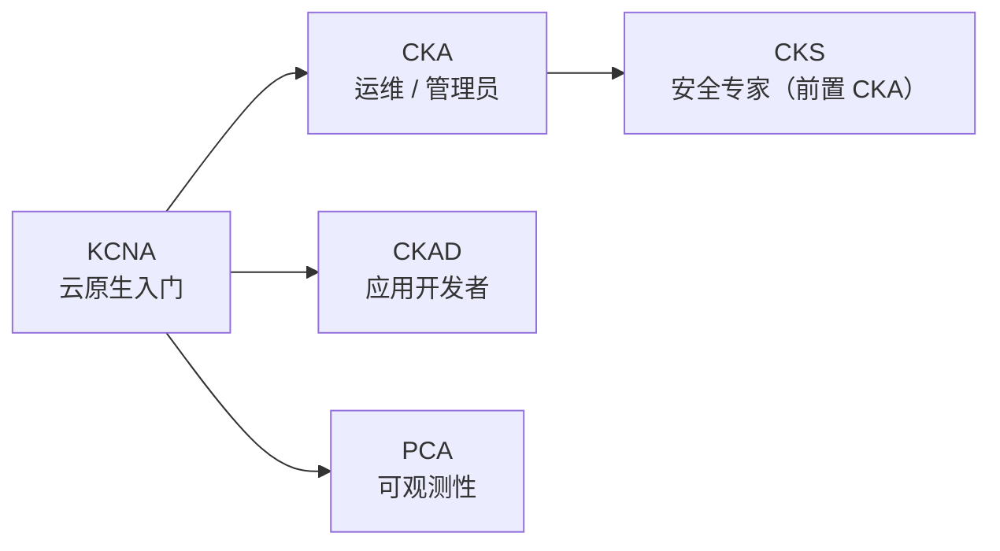
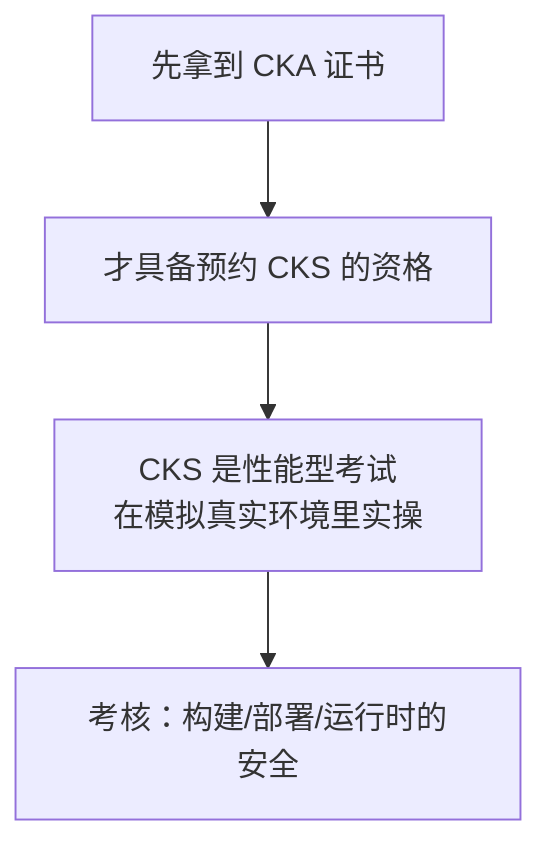

# Kubernetes 认证考点: 相关认证全景 —— CKA / CKAD / CKS / PCA 的报考条件与权重

KCNA 只是云原生入门级认证，沿着这条线往下还有四个更"硬"的证书。

结论：**四张证对应四种人 —— ① 运维/管理员考 **CKA**（Certified Kubernetes Administrator），考生产级集群的安装配置管理能力，2 小时、2800 多元；② 应用开发者考 **CKAD**（Certified Kubernetes Application Developer），考为 K8s 设计、构建、部署云原生应用的能力；③ 安全方向考 **CKS**（Certified Kubernetes Security Specialist），**必须先持有 CKA 才能报考**，权重里供应链安全、漏洞最小化、运行时安全各占大头；④ 可观测性方向考 **PCA / PCC**（Prometheus Certified Associate），考 Prometheus 与 PromQL，建议先有别的 K8s 认证打底。共同点是**都有中文版本（后缀 -CN）、都是线上/现场的性能型考试**。课程最后给的忠告很实在：**有证总比没有好，但能力永远比证书重要。**

## 纲要

- 四条认证线
- CKA：运维与管理
- CKAD：应用开发者
- CKS：安全专家（前置 CKA）
- PCA：Prometheus 可观测性
- 报名的顺序建议

## 四条线



**讲了 KCNA 认证考试，还有好几个相关的认证，这里也来介绍一下。这几张证不是并列的，是按"你想干什么"分叉出去的。**

| 认证 | 面向谁 | 考什么 | 前置 |
| --- | --- | --- | --- |
| **CKA** | 管理员 / 云管理员 / 管理 K8s 的 IT 专业人 | 生产级集群的安装、配置、管理 | — |
| **CKAD** | 应用开发者 | 为 K8s 设计、构建、部署应用 | — |
| **CKS** | 安全工程师 | 构建/部署/运行时的容器与平台安全 | **必须已过 CKA** |
| **PCA / PCC** | 可观测性与监控方向的工程师、应用开发 | Prometheus 与 PromQL | 建议先有 KCNA/CKA |

## CKA：运维与管理

**CKA（Certified Kubernetes Administrator）认证考试是专为 Kubernetes 管理员、云管理员和其他管理 Kubernetes 实力的 IT 专业人员而设置的。如果是从事运维和开发的话，CKA 是比较合适的一个认证 —— 已获得认证的 K8s 管理员具备了进行基本安装以及配置和管理生产级规模的集群的能力。**

**考试的权重包括：**

| 模块 | 占比 |
| --- | --- |
| 集群架构安装和配置 | 15% |
| 工作负载和调度 | 15% |
| 网络 | 20% |
| 存储 | 10% |
| **故障排除** | **30%** |

**考试时间是两个小时，考试费用在两千八百多元；中文版本是 CKA-CN。**

```text
CKA 备考重点（按权重倒排）
├── 30% 故障排除 ← 大头，全是排障场景（Pod 起不来、网络不通、节点 NotReady）
├── 20% 网络     ← Service / Ingress / NetworkPolicy
├── 15% 集群安装配置 ← kubeadm / 二进制 / 证书轮换
├── 15% 工作负载和调度 ← Deployment / StatefulSet / 调度器
└── 10% 存储     ← PV / PVC / StorageClass

注意：CKA 是「实际动手」型考试，题量大、2 小时很紧
     → 必带 `kubectl` 别名（官方允许，把 vim 玩熟）
```

## CKAD：应用开发者

**CKAD（Certified Kubernetes Application Developer）认证考试证明考生为 Kubernetes 设计、构建和部署云原生应用程序的能力。通过认证的 K8s 应用程序开发人员可以为 K8s 设计、构建和部署云原生应用程序。**

**参加该考试需要具备容器运行时和微服务体系结构的工作知识，并具备以下能力：使用或者兼容 OCI 容器镜像；应用云原生的应用概念和架构；使用和验证 K8s 资源定义。**

**考试的权重：**

| 模块 | 占比 |
| --- | --- |
| 应用程序设计和构建 | 20% |
| 应用部署 | 20% |
| 应用部署维护 | 15% |
| **使用应用环境配置与安全** | **25%** |
| 服务与网络 | 20% |

**考试的费用与 CKA 类似，也有中文版本的现场考试 CKAD-CN。**

```text
CKAD 与 CKA 的本质差别
CKA → 你负责「集群能不能稳」
CKAD → 你负责「应用能不能在集群里跑对」
├── 你要会写 YAML 并当场改对（ConfigMap/Secret/ResourceQuota/LimitRange）
├── 会排「服务访问不到」「探针失败」「镜像拉取失败」
└── 权重里 25% 是「应用环境配置与安全」→ ConfigMap/Secret/安全上下文吃重
```

## CKS：安全专家（前置 CKA）

**CKS（Certified Kubernetes Security Specialist）认证：获得 CKS 认证的 K8s 安全专家，在构建、部署和运行时确保基于容器的应用程序和 Kubernetes 平台的安全及最佳实践。**

**在参加 CKS 考试之前，考生必须已经通过 CKA 认证考试；在获得 CKS 证书之后才可以预约 CKS 考试。CKS 是一项基于性能的认证考试，在模拟的真实环境中测试考生对 Kubernetes 和云安全的知识。**



**获得 CKS 证书表明考生具备在应用部署和运行中保护基于容器应用和 K8s 平台的必要能力，并具备在专业环境中执行这些任务的资格。考试的权重：**

| 模块 | 占比 |
| --- | --- |
| 集群安装 | 10% |
| 容器运行时安全 | 10% |
| 系统强化 | 15% |
| **微服务漏洞最小化** | **20%** |
| **供应链安全** | **20%** |
| **监控、日志记录和运行时安全** | **20%** |

**考试和费用跟 CKA 类似，也有中文版本的线上考试 CKS-CN。**

```text
CKS 的三个大头（60%）
├── 供应链安全 20%      ← 镜像签名、SBOM、镜像扫描、准入控制
├── 微服务漏洞最小化 20% ← 最小权限、非 root 运行、只读根文件系统
└── 监控/日志/运行时安全 20% ← 审计日志、Falco 一类运行时检测
```

## PCA：Prometheus 可观测性

**PCA（文中也作 PCC，Prometheus Certified Associate）认证考试展示了工程师对可观测性的基本知识和使用 Prometheus 的技能。PCC 是入门级专业认证，专为对可观测性和监控感兴趣的工程师、应用开发人员设计。**

**建议考生在参加 PCA 考试前已获得其他的 K8s 认证（如 KCNA、CKA 等），或已完成 Prometheus 特定的培训和云原生培训课程。PCA 考试的目的是帮助考生使用 Prometheus，具备了解基础的数据监测、指标、告警、仪表盘的能力。**

| 模块 | 占比 |
| --- | --- |
| 可观测性的概念 | 18% |
| Prometheus 基础能力 | 20% |
| **PromQL** | **28%** |
| 仪表和导出器 | 16% |
| 报警和仪表盘 | 18% |

**通过认证的 PCA 考生具备在应用程序栈中构建和抓取可观测性数据的基础知识（无论它是否云原生）；PCC 持有人具备使用 Prometheus 监控云原生应用程序和基础设施的最佳实践的能力；还确保考生了解如何使用可观测数据来提高应用程序性能、排除系统实现故障，并将该数据输入其他系统。**

**考试和费用与 KCNA 类似，也有中文版本的线上考试 PCA-CN。**

```text
PCA 备考的重心很明显：PromQL 28%
├── 18% 可观测性概念（Counter/Gauge/Histogram/Summary 这类）
├── 20% Prometheus 基础（配置、scrape、标签）
├── 28% PromQL            ← 权重最高，多练区间向量 + rate/irate
├── 16% 仪表和导出器      ← Grafana、node_exporter、自定义 exporter
└── 18% 报警和仪表盘      ← Alertmanager 与规则
```

## 报名的顺序建议

想了解更多和报名的话，可以去国内网站看一下。**关于这些认证的建议和推荐：肯定是有总比没有好，但是能力永远比证书重要。**

**而且这些认证的培训和报名费用也不便宜，却没有哪些公司或者机构的岗位指定需要这些认证。所以现在看来，对于从事 K8s 相关开发和运维的同学，根据自己的实际情况，可以考虑参加这些认证 —— 不过这些认证的考试内容也是一个练习和训练的好方法，可以通过它们的真题来检验自己的学习成果。**

```text
一个务实的取舍框架
├── 想证明自己能管生产集群 → CKA（运维岗基本盘）
├── 想证明自己能写能在 K8s 跑的应用 → CKAD（开发岗）
├── 已经在做 CKA 之后想补安全 → CKS（有前置门槛，别跳步）
└── 想深入可观测性 / 监控方向    → PCA（PromQL 是核心）

算账提醒：培训和报名费用都不便宜，且很少有岗位硬要求
→ 更理性的动机是「拿真题练手、检验学习成果」
```

## API 速览

| 认证 | 全称 | 时长 / 形式 | 中文版 |
| --- | --- | --- | --- |
| KCNA | Certified Kubernetes / CNAS 入门级 | 线上 | KCNA-ZH |
| **CKA** | Certified Kubernetes Administrator | 2 小时，性能实操 | CKA-CN |
| **CKAD** | Certified Kubernetes Application Developer | 同 CKA 类似 | CKAD-CN |
| **CKS** | Certified Kubernetes Security Specialist | 同 CKA 类似（需 CKA） | CKS-CN |
| **PCA / PCC** | Prometheus Certified Associate | 同 KCNA 类似 | PCA-CN |

## Demo 示例

把备考动作落成清单，用 CKA 举例（其余同理）：

```text
CKA 两周备考节奏
├── 第 1 周：按权重过知识点
│   ├── 故障排除 30% ← 刷「Pod 起不来 / DNS 不通 / 节点 NotReady」三类场景
│   ├── 网络 20%     ← Service 类型、Ingress、NetworkPolicy
│   └── 其余 40%     ← kubeadm、调度、存储、HPA
├── 第 2 周：限时刷真题 + 背快捷键
│   └── 2 小时 20~30 题 → 平均每题 4~6 分钟，必须练出手感
└── 考前：把官方允许的编辑器配置好（vim 别名与缩写）
```

```bash
# 先给变量赋值，例如：POD=$(kubectl get pod -o jsonpath='{.items[0].metadata.name}')；CONTAINER=web
# CKA 考试现场最常用的几条，提前练熟
kubectl get pod,svc,ing -A            # 一上来先全览
kubectl describe pod $POD | tail -20 # 排障第一刀
kubectl logs $POD -p -c $CONTAINER          # 看崩溃前日志（本题组刚考过）
kubectl get events --sort-by=.lastTimestamp | tail -30
kubectl run tmp --rm -it --image=busybox --restart=Never -- sh
kubectl apply -f - <<'EOF'            # 现场写 YAML，熟到不用想
apiVersion: v1
kind: Pod
metadata: { name: demo }
spec:
  containers: [{ name: web, image: nginx }]
EOF
```

## 总结

1. **CKA 给运维/管理员**：考生产级集群的安装配置与排障，**权重最大的是故障排除 30%、网络 20%**；2 小时、2800 多元，中文版 CKA-CN；
2. **CKAD 给开发者**：考 OCI 镜像、云原生架构、**K8s 资源定义的编写与验证**；权重最高的是**应用环境配置与安全 25%**、部署与服务网络各 20%；中文现场版 CKAD-CN；
3. **CKS 给安全方向**：**必须先持有 CKA 才能报考**；是性能型考试，在模拟环境里实操；**供应链安全 20% + 漏洞最小化 20% + 监控/日志/运行时安全 20%** 是三大块；中文线上版 CKS-CN；
4. **PCA 给可观测性方向**：**PromQL 占 28% 是绝对重心**，此外指标类型/概念 18%、基础能力 20%、仪表与导出器 16%、报警与仪表盘 18%；建议先有 KCNA / CKA 或其他培训打底；中文线上版 PCA-CN；
5. **共同规律**：四张证都有中文版本（后缀 -CN）、都是上手实操的性能型考试，不是背题库；
6. **课程给的忠告值得抄下来**：**有证总比没有好，但能力永远比证书重要**；培训和报名费用不便宜，也没有哪个岗位硬性指定；**更理性的动机是——拿这些认证的真题当练习题，检验自己的学习成果。**

