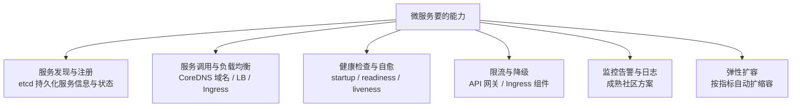
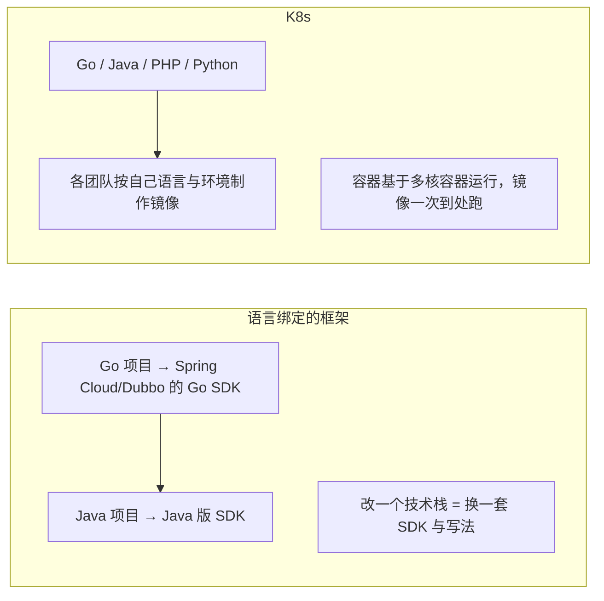
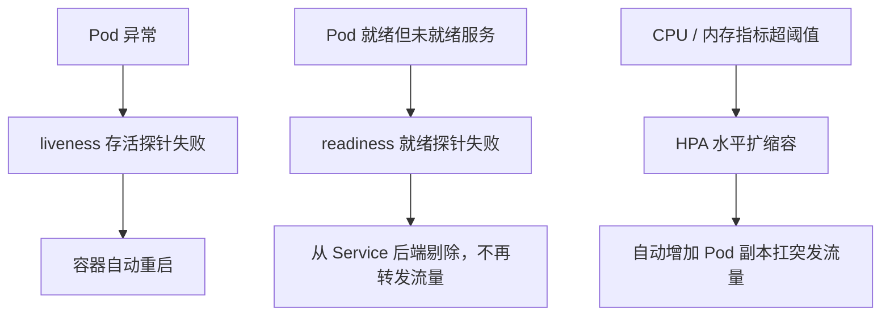

# 为什么选择 Kubernetes 作为微服务框架

前面讲过的微服务框架（Spring Cloud、Dubbo 这类）都是**和开发语言绑定的**，跟项目代码强关联：换公司、换团队、换项目，技术栈一变就得重学一套。Kubernetes 恰恰相反 —— 它**不像普通开发框架那样直接支持 gRPC 或 HTTP 协议、不能直接生成业务代码**，但这丝毫不妨碍它被称作微服务框架，因为在很多方面它甚至做得更多。

结论：**Kubernetes 用 etcd 做注册中心、CoreDNS + Ingress/LoadBalancer 做服务调用与负载均衡、三种探针做健康检查并自动重启异常实例、API 网关或 Ingress 组件补上限流降级、社区方案补齐监控告警与日志，从而把研发效率和可用性两个最大优势做出来了 —— 新机器装好标准系统接入即成节点、下线时自动在其他节点拉起服务、镜像一次多技术栈复用、按 CPU/内存指标自动扩缩容。**

## 纲要

- 它不是一个"开发框架"，却能干微服务框架的全部活
- 微服务基础能力：注册中心 / 服务调用 / 负载均衡 / 健康检查
- 限流降级、监控告警、日志怎么补上
- 通用性：为什么"换技术栈不用重学"
- 优势一：研发效率的提升（传统运维 vs K8s）
- 优势二：服务可用性的提高（自愈 + 自动扩缩容）
- 一张架构图看全

## 它不是开发框架，但覆盖了微服务框架的能力面



这是关键认知：**Spring Cloud 是"嵌在代码里的框架"，Kubernetes 是"托着所有服务的平台"**。前者你得改代码接它，后者连代码都不用为它改一行。

## 微服务基础能力逐项对照

| 微服务需要的能力 | Kubernetes 里怎么做 |
| --- | --- |
| **服务发现 / 注册中心** | 用 **etcd** 作为注册中心，服务的实际信息与状态都**持久化保存在 etcd** 中 |
| **服务调用** | 可以走**内置 CoreDNS 的域名**来请求（服务名即域名），也可以引入组件实现 |
| **负载均衡** | **LoadBalancer / Ingress 组件**实现四层与七层的负载均衡 |
| **健康检查** | **启动检查 startup、就绪检查 readiness、存活检查 liveness** 三种探针 |
| **实例异常自愈** | 实例出现异常，可以**让容器自动重启** |
| **限流降级** | 引入 **API 网关**，或者在 **Ingress 组件**中实现 |
| **监控告警 / 日志** | 都有**很成熟的社区解决方案，很容易加入进来** |
| **弹性扩缩容** | 基于 CPU、内存等指标的**水平自动扩缩容（HPA）** |

对照记忆（考试选择题常考）：**注册中心是 etcd 不是 ZooKeeper；健康检查是三种探针不是一种；限流降级不是 K8s 内核能力，要靠网关或 Ingress 补。**

## 限流降级、监控告警、日志怎么补

三件事要分清归属：

- **限流降级**：K8s 自身不管限流，做法是**引入 API 网关**（如 Kong、APISIX），或者**在 Ingress 组件里实现**（ingress-nginx 就有限流注解）；
- **监控告警**：不是 K8s 本身的能力，但**是这个体系中非常重要的组成部分** —— 指标、告警一体，靠 Prometheus + AlertManager 这类方案接入；
- **日志**：同样靠社区方案（如 logtail、EFK）接入，成本低、成熟度高。

## 通用性：为什么"换技术栈不用重学"

微服务强调的是**用自己最熟悉的方式来开发服务**。如果因为开发语言、框架的原因要做很多改变，就体现不了微服务框架的优势了。



- **传统的微服务框架**：和开发语言相关、与项目代码强关联，换一个公司/团队/项目、技术栈一变，就要重新学一套东西；
- **Kubernetes**：**基于容器运行，各个技术团队按自己的开发语言和环境要求，只需要制作一次镜像，以后直接用这个镜像启动服务**；从镜像启动的容器**有完整的编译环境与运行环节，彼此完全隔离、互不影响**；
- 结论：**管理成本的账不在语言上算，而在"节点增删"这个操作上算** —— 集群里增加节点、减少节点都只是一次简单操作，**并不因为机器数量变大就多出多少管理成本**。

## 优势一：研发效率的提升

先想清楚**传统运维有多重**：

| 场景 | 传统运维要做的事、要花的时间 |
| --- | --- |
| **加一批服务器** | 采购、上架、装系统、配环境、调依赖……交付使用按天/按周算 |
| **机器淘汰下线** | 运维和开发都要介入，服务迁移全靠人肉排点 |
| **异地新建机房** | 筹备工作量极大 |
| **多语言多技术栈**（Go/Java/PHP…） | 开发团队和运维团队各自维护一套环境体系 |
| **成千上万个服务、每天多次更新部署** | 开发运维被重复劳动占满，没时间做业务分析、系统设计和开发优化 |

几百台服务器、几十个服务就已经让开发和运维忙得焦头烂额，**更不敢想几十万台服务器和上万个微服务**。

换成 Kubernetes 之后，同一批问题的答案变成：

1. **新机器上线**：把这批机器**装上标准的操作系统（里面已经包含 Kubernetes 等一整套软件）**，加进线上就作为新节点加入集群，**业务开发完全不用关心这个过程 —— 因为机器和服务的环境是完全分离的**；
2. **机器淘汰**：**直接把这些机器逐个从集群中剔除**就行；如果服务部署在要剔除的机器上，**Kubernetes 会自动在其他机器上把服务部署和启动起来，新服务运行正常之后才会把原来的服务踢掉，最后才把机器下线** —— 整个过程自动完成，**几分钟内搞定**；
3. **多技术栈**：各团队做**一次镜像**就能到处跑，环境完全隔离；
4. **机器数量大**：增加和减少节点都只是很简单的操作，**不因机器数量增加管理成本**。

## 优势二：服务可用性的提高



- **健康检查与自愈**：**Kubernetes 具有健康检查和服务自愈的能力**，自动完成异常服务的**重启或者剔除**；
- **自动扩缩容（更强大的能力）**：**基于服务指标，比如 CPU 使用率、内存使用率等，配置服务的水平自动扩缩容**；
- 应对场景：突发流量、推广活动之类的流量，对计算资源需求完全不同，**手动一是无法预知、二是效率太低**，而自动扩缩容可以快速增加资源帮服务撑住突发流量；
- **自定义指标**：除了 CPU/内存，也可以按需**配置具体指标所对应的自定义处理程序**；
- **指标与告警**：虽然**不是 Kubernetes 本身的能力，却是这个体系中非常重要的组成部分**。

## 一张架构图看全

```dir
一个 K8s 集群（同时是微服务框架）
├── 控制面
│   ├── kube-apiserver      # 所有能力的入口，服务/端点的真相来源
│   ├── etcd                # 注册中心：服务实际信息与状态持久化在这里
│   ├── kube-controller-manager  # 自愈、扩缩容、故障转移的执行者
│   └── kube-scheduler      # 把新 Pod 挑到合适节点
├── 数据面（每个节点）
│   ├── kubelet             # 管容器生命周期，执行三种探针
│   ├── kube-proxy          # Service 的负载均衡转发
│   └── Pod（容器）
│       ├── Go 服务镜像      # 各团队自己打，一次镜像到处跑
│       ├── Java 服务镜像    # 环境完全隔离，互不影响
│       └── PHP / Python 服务镜像
├── 流量进来的四种姿势
│   ├── ClusterIP + CoreDNS 域名（集群内服务调用）
│   ├── LoadBalancer / NodePort（对外暴露）
│   └── Ingress（七层路由 + 限流降级注解）
└── 可观测（社区方案，非 K8s 内核）
    ├── 指标 + 告警：Prometheus / AlertManager
    └── 日志：logtail / EFK
```dir

## 落地示例：自愈 + 自动扩缩容

把上面"自愈 + 自动扩缩容"落成一组最小配置。假设有个 Go 服务镜像 `registry/user-rank:v1`：

```yaml
apiVersion: apps/v1
kind: Deployment
metadata:
  name: user-rank
spec:
  replicas: 2
  selector:
    matchLabels:
      app: user-rank
  template:
    metadata:
      labels:
        app: user-rank
    spec:
      containers:
        - name: user-rank
          image: registry/user-rank:v1   # 各技术栈各打各的镜像，环境完全隔离
          ports:
            - containerPort: 8080
          # 三种探针：启动 / 就绪 / 存活
          startupProbe:                   # 慢启动先给它时间，避免被 liveness 误杀
            httpGet:
              path: /healthz
              port: 8080
            failureThreshold: 30
            periodSeconds: 10
          readinessProbe:                 # 不就绪就不接流量（等价于"从负载均衡摘除"）
            httpGet:
              path: /readyz
              port: 8080
            periodSeconds: 5
          livenessProbe:                  # 挂了就重启（自愈）
            httpGet:
              path: /healthz
              port: 8080
            periodSeconds: 10
            initialDelaySeconds: 15
---
apiVersion: autoscaling/v2
kind: HorizontalPodAutoscaler
metadata:
  name: user-rank
spec:
  scaleTargetRef:
    apiVersion: apps/v1
    kind: Deployment
    name: user-rank
  minReplicas: 2
  maxReplicas: 10
  metrics:
    - type: Resource            # 基于 CPU / 内存使用率（也可以用自定义指标）
      resource:
        name: cpu
        target:
          type: Utilization
          averageUtilization: 60   # 平均 CPU 用到 60% 就加副本
```

观察与验证：

```bash
# ① 自愈：删掉一个 Pod，看它是怎么被自动拉回来的
kubectl delete pod -l app=user-rank
kubectl get pod -l app=user-rank -w

# ② 就绪/存活：把 /healthz 打成 500，看容器重启、ready 变不就绪
kubectl exec -it deploy/user-rank -- sh -c 'echo down > /proc/healthz_marker'

# ③ 自动扩缩容：压一把，看副本数从 2 涨到 10
# 先给变量赋值，例如：SVC_IP=10.96.1.23
wrk -c50 -t10 -d60 http://$SVC_IP:8080/api/rank

# ④ 扩缩容的事件与原因，看 HPA 的判定依据
kubectl describe hpa user-rank
kubectl get events --sort-by=.lastTimestamp | tail -20
```

注意两个坑：**`readinessProbe` 失败只摘流量不重启，`livenessProbe` 失败才重启**；**HPA 的指标来自 Metrics Server，没装 Metrics Server 时 HPA 会一直显示 `<unknown>`**。

## 总结

1. **Kubernetes 不是传统意义的开发框架**：它**不能直接支持 gRPC/HTTP 协议、不能直接生成业务代码**，但它在更多方面超越了一个框架所能做的；
2. **服务发现与注册**：用 **etcd 作为注册中心，服务的实际信息和状态都在 etcd 中持久化保存**；
3. **服务调用与负载均衡**：既可以通过**内置的 CoreDNS 域名**请求，也可以通过**引入 LoadBalancer 和 Ingress 组件**实现；
4. **健康检查有三种**：**启动检查 startup、就绪检查 readiness、存活检查 liveness**；实例出现异常可以让**容器自动重启**；
5. **限流降级不在内核里**：需要**引入 API 网关，或者在 Ingress 组件中实现**；**监控告警和日志都有很成熟的社区方案，很容易加入进来**；
6. **通用性是最大差别之一**：传统微服务框架**和开发语言相关、与项目代码强关联**，换团队换技术栈就得重学；**Kubernetes 基于容器运行，各技术团队按自己语言与环境只做一次镜像就能到处跑，容器环境完全隔离**；机器数量再大，**增删节点也只是简单操作，不额外增加管理成本**；
7. **优势一：研发效率提升** —— 传统方式下加机器、机器淘汰、新建机房、多语言多技术栈、成千上万个服务每天多次更新部署，会把开发和运维的时间全部吃在重复劳动里；K8s 下**新机器装标准操作系统（含 K8s 全套软件）接入即成节点，开发完全不关心；剔除机器时 K8s 自动在其他机器上启动服务，新服务正常后才踢掉旧服务再下线，整个过程几分钟内自动完成**；
8. **优势二：服务可用性提高** —— **健康检查 + 服务自愈**自动重启或剔除异常服务；**基于 CPU、内存等指标的 HPA 水平自动扩缩容**，快速应对突发流量和推广活动，也能配置自定义指标的自定义处理程序；**指标和告警虽不是 K8s 本身能力，却是这个体系里非常重要的组成部分**。
