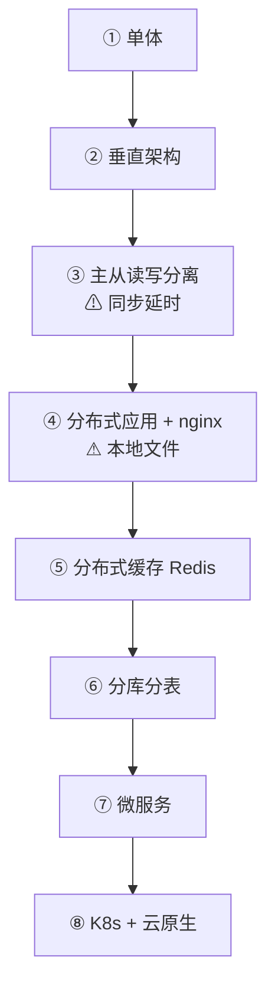

# 本章小结 —— 微服务概述与 K8s 治理微服务的优势

第二章我们围绕"微服务概述"与"K8s 治理微服务的优势"展开，内容大体分三块：后台技术架构的演进与服务发现/负载均衡、用设计模式理解 API 网关并深入服务治理的限频/限流/降级/熔断、最后介绍常用微服务框架并讲清"为什么选 K8s"。下面把整章串一遍，并留下三道值得长期思考的作业。

## 纲要

- 架构演进：从单体到云原生（微服务是流量逼出来的）
- 微服务核心：服务发现与服务治理
- API 网关：五个设计模式的组合
- 服务治理：限频/限流/降级/熔断五种自保手段
- 框架选型：为什么选 Kubernetes 作为微服务框架
- 三道作业题与思考框架

## 架构演进：从单体到云原生

每一代架构都不是被"设计"出来的，是被流量和数据量逼出来的。演进链条是：单体（一台服务器）→ 垂直架构（应用与数据库分开）→ 主从读写分离（注意同步延时）→ 分布式应用 + nginx（注意本地文件依赖）→ 分布式缓存 Redis（1k→10 万并发）→ 分库分表（行多用水平、字段多用垂直）→ 微服务（按数据独立性拆分）→ K8s 容器化 + 云原生（DevOps 带来效率跃迁）。



关键规律：**每次升级都是"解决上一代的新问题，同时引入下一代的新问题"**——没有终极形态，只有当下最划算的形态。是容器化 + K8s + DevOps 把微服务从概念变成了工业现实（几个人管成千上万个微服务、一天发 n 次）。

## 微服务核心：服务发现与服务治理

微服务是分布式系统，服务可能跨主机、网段、机房甚至地区互相调用，所以**服务发现是微服务的灵魂**。注册中心三大功能：① 服务注册（服务名 + 访问方式/协议 + 地址）；② 服务查询（按名取调用方式）；③ 服务健康检查（随时掌握实例状态、异常时配告警/重启）。两种发现模式：客户端发现（消费者自己拿信息 + 自己做 LB，更灵活少一跳）与服务端发现（走网关，网关统一发现与 LB，调用方简单）。

| 微服务需要的能力 | Kubernetes 里怎么做 |
| --- | --- |
| 服务发现 / 注册中心 | etcd 持久化服务信息与状态 |
| 服务调用 | CoreDNS 域名（服务名即域名）/ LoadBalancer / Ingress |
| 负载均衡 | kube-proxy / Ingress 四层七层 |
| 健康检查 | startup / readiness / liveness 三种探针 |
| 限流降级 | API 网关 / Ingress 组件（非内核能力） |
| 监控告警 / 日志 | Prometheus/AlertManager / EFK 等社区方案 |
| 弹性扩缩容 | HPA（CPU/内存/自定义指标） |

## API 网关：五个设计模式的组合

把网关当"转发请求的东西"理解不了它的重要性，把它当"一组设计模式的组合"就通了。五个模式：① 代理模式（调用方只认代理，后端部署透明）；② 外观模式（隐藏后端复杂度、一致接口，如对外 HTTP+HTTPS、后端只 HTTP；客户端 1.0/1.1/2.0、后端统一 HTTP/2.0）；③ 中介者模式（协调各方、缺了控制点）；前三个是结构型。④ 责任链模式（插件串成链、按序执行、各干各的）；⑤ 策略模式（换负载均衡算法 = 换调用策略）；后两个是行为型。落到能力是两组：基础能力（路由器 + 转发器 + 负载均衡）与扩展能力（插件化中间件：跨域/授权/监控/缓存/熔断/降级/限流）。

## 服务治理：五种自保手段

调用方不能只会"调"，还得会"自保"。五种手段：超时（主动断连接）、限流（限制最大并发/频次）、熔断（目标大量异常时快速拒绝、不再调用）、降级（更友好的兜底响应）、隔离（A 的突发不能波及 B/C）。重点区分：**限频限制时间窗口内的频次（配额用完不可挪），限流限制并发数（用不完的可留给突发——这正是令牌桶的命门）**；熔断是降级的特殊形式（简单粗暴停止调用，冷却后放探测请求）。

## 框架选型：为什么选 Kubernetes

传统微服务框架（Spring Cloud / Dubbo 等）和开发语言绑定、与代码强关联，换技术栈就得重学一套。Kubernetes 基于容器运行，**各技术团队按自己语言与环境只做一次镜像就能到处跑，环境完全隔离**；新机器装标准系统接入即成节点，剔除机器时 K8s 自动在其他节点拉起服务，整个过程几分钟自动完成。再叠加 etcd 注册中心、三种探针自愈、HPA 自动扩缩容，研发效率与服务可用性两方面优势明显。

## 三道作业题

这一章留了三道开放式作业，没有标准答案，建议结合本章内容讨论：

**题一：微服务拆分的边界。** 微服务架构最核心的是服务发现与服务治理，但服务该怎么划边界？以怎样的方法/原则确定"某些功能、数据属于这个服务而不是另一个"？拆分为多个微服务，是否真的比把几个合并在一起更合适？你是怎么考虑服务拆分合理性的？

```dir
拆分合理性的判据
├── 数据独立性是首要判据（不是"业务听起来不同"）
├── 反面教材：拆了服务却共用一个大库 → 只是把单体切成几块
└── 持续追问：合并 vs 拆分，哪个当下最划算？
```

**题二：框架选型与动机。** 你在平时工作和学习中用过、熟悉哪些微服务框架？最终为什么选择某个框架而不是别的？

**题三：限流的"不丢弃"方案。** 网关限流场景下，后端服务只允许调用方每分钟 100 次请求，超出阈值通常会直接丢弃请求。有没有办法**不丢弃这些超限请求，而是等并发少的时候把之前的请求也都执行一遍**？

```dir
题三的解题方向（提示，非标准答案）
├── 直接丢弃：超出即 429（最简单，但丢请求）
├── 队列缓冲：把超限请求放进队列，低峰时消费
│   └── 代价：请求延迟变高、需要设置最大积压与超时
├── 令牌桶的"攒令牌"：允许一定突发，但突发过量仍要排队/丢弃
└── 关键权衡：不丢请求 = 接受更高延迟 + 需要容量保护（防队列无限增长）
```

## 总结

整章的核心是"微服务 + K8s"这条主线：

1. **架构演进是流量逼出来的**：单体→垂直→读写分离→分布式→缓存→分库分表→微服务→云原生，每一步解决上一代问题又引入新问题；
2. **服务发现是灵魂**：注册中心三功能（注册/查询/健康检查）、两种模式（客户端/服务端发现），落到 K8s 就是 etcd + Service/Endpoints + 探针；
3. **API 网关 = 五个设计模式**：代理/外观/中介者（结构型）+ 责任链/策略（行为型），能力分基础（路由/转发/LB）与扩展（插件中间件）两组；
4. **服务治理五种自保**：超时/限流/熔断/降级/隔离；限频≠限流，熔断是降级的特殊形式；
5. **为什么选 K8s**：语言无关、一次镜像到处跑、节点增删简单、etcd 注册、探针自愈、HPA 扩缩容，研发效率与可用性双升；
6. **三道作业值得长期想**：拆分边界看数据独立性、框架选型讲动机、限流"不丢弃"靠队列缓冲但须防积压失控。
