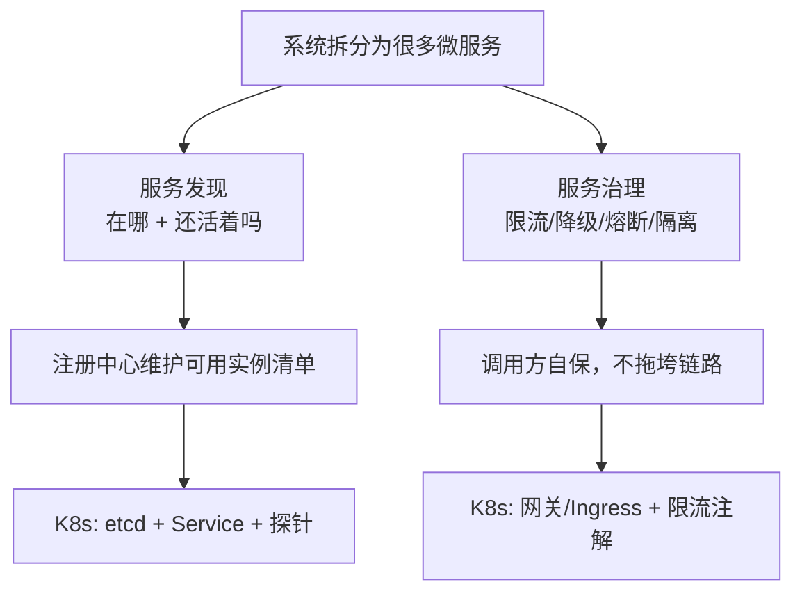

# 本章导学 —— 微服务概述与 K8s 治理微服务的优势

这一章我们的主线是**微服务概述**，以及 **K8s 治理微服务的优势**。我们会重点讲系统架构方面的内容，也会深入微服务最核心的服务发现与服务治理。先跟着导学想一想：你经历过哪些系统架构？当系统规模和团队规模都变大之后，为什么微服务会自然而然地出现？

## 纲要

- 本章主线：微服务概述 + K8s 治理微服务的优势
- 从你经历过的架构聊起：单机到云原生
- 微服务的核心：服务发现与服务治理
- 本章要讲的内容地图
- 为什么 K8s 与云原生被越来越多团队接受
- 各语言框架 vs 容器化标准

## 从你经历过的架构聊起

在工作和学习中，你都经历过怎样的系统架构？不妨对照一下：

```dir
你可能走过的架构路径
├── 单机部署（初级阶段）
│   └── 一台服务器跑全套，简单便宜
├── 前后端分离 / 经典 MVC 三层架构
├── 数据库主从同步、读写分离
├── 数据量变大后的分库分表
├── 引入分布式缓存系统
├── 引入分布式配置中心
└── 分布式部署与运行
```

随着用户量和访问量不断增加，不仅要用到分布式的缓存、配置、存储系统，**我们自己开发的应用系统也需要支持分布式部署和运行**。这时候系统规模——无论是功能复杂度还是用户请求量——都比较大，开发团队的规模也越来越大，于是微服务架构就孕育而生了。

## 微服务的核心：服务发现与服务治理

这几年，K8s 和云原生的架构越来越被大家接受和使用。基本上只要超过十几人的团队，就会考虑把系统容器化放进 K8s 集群，甚至直接上云。



提到微服务架构，首先想到的就是**服务发现和服务治理**。一个大的系统拆成很多微服务、服务越来越多，当存在成千上万个微服务时：这些服务如何注册、如何访问？访问方式又是怎样的？服务异常、请求量太大等情况又要如何应对？这些都是微服务架构中需要重点考虑和处理的情况。所以本章我们能全面学习**服务发现、负载均衡、网关、限流限频、降级熔断**等丰富内容。

## 本章内容地图

```dir
本章内容结构
├── 第一部分：后台技术架构演进 + 服务发现/负载均衡
│   └── 单体→垂直→读写分离→分布式→缓存→分库分表→微服务→云原生
├── 第二部分：设计模式理解 API 网关
│   └── 代理/外观/中介者 + 责任链/策略；基础能力 + 扩展能力
├── 第三部分：服务治理——限频/限流/降级/熔断
│   ├── (一) 为什么要自保：超时/限流/熔断/降级/隔离
│   └── (二) 限频限流区别 + 算法 + 降级方法 + 熔断三状态
├── 第四部分：常用微服务框架介绍与对比
│   └── 各开发语言自己的框架
└── 第五部分：为什么选择 K8s 做微服务框架
    └── 语言无关 / 一次镜像到处跑 / etcd / 探针 / HPA
```

## 为什么 K8s 与云原生被越来越多团队接受

前面讲到架构演进——当系统规模和团队规模都变大之后，微服务自然出现。但光有"拆"还不够，**能不能管得动**才是关键。随着容器化技术成熟、云原生理念深入，Kubernetes 已经成为一个行业标准。本节我们会做一些框架的介绍与对比，也会讲清**为什么选择 K8s 做微服务框架**。

| 传统微服务框架 | Kubernetes 作为微服务框架 |
| --- | --- |
| 和开发语言绑定（各语言各一套 SDK） | 基于容器，语言无关 |
| 换技术栈 = 重学一套写法 | 各团队做一次镜像到处跑，环境隔离 |
| 节点增删要人肉运维 | 节点增删是简单操作，不随规模线性增成本 |
| 能力嵌在代码里 | 能力在平台层（etcd/探针/HPA/Ingress） |

## 各语言框架 vs 容器化标准

各个开发语言都有自己的开发框架——Web 框架、RPC 框架，再加一个配置中心，把网关等中间件引入进来，就能组装成一个微服务框架。但这一切与开发语言和系统环境**息息相关**：换一个团队、换一种开发语言、换一套技术栈，就得重新搭建一次。

```dir
传统组装方式（语言相关）
├── 选 Web 框架 / RPC 框架（按语言）
├── 加配置中心
├── 引入网关等中间件
└── 组装成微服务框架（换技术栈 = 重搭）

容器化方式（语言无关）
├── 各团队按自己语言做镜像
├── 镜像一次制作、到处运行
├── 环境彼此隔离、互不影响
└── K8s 提供注册/调用/LB/探针/扩缩容
```

而随着容器化与云原生成熟，Kubernetes 一次成为行业标准——这也是本章最后要讲清的核心论点。

## 总结

进入第二章，先把调子定下来：

1. **主线是"微服务概述 + K8s 治理微服务的优势"**，重点在系统架构与服务发现/服务治理；
2. **架构是演进出来的**：从单机到云原生，每一步都是被流量和数据量逼出来的，微服务在系统规模与团队规模变大后自然出现；
3. **微服务的核心是服务发现与服务治理**：成千上万个服务如何注册、访问、应对异常与洪峰，是本章要回答的问题；
4. **本章地图清晰**：架构演进 → API 网关设计模式 → 限频限流降级熔断 → 框架对比 → 为什么选 K8s；
5. **K8s 成为标准的关键**：语言无关、一次镜像到处跑、节点增删简单、平台层统一提供注册/调用/LB/自愈/扩缩容，比"换技术栈就重搭一套"的传统框架更适合现代团队。

下一节我们就从后台技术架构的演进史讲起。
