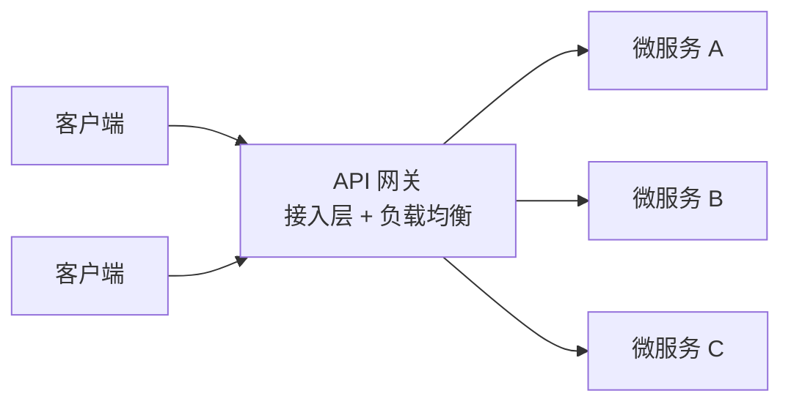
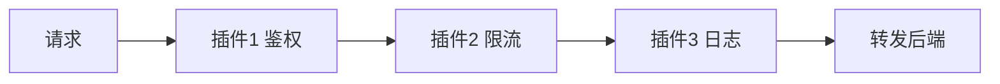
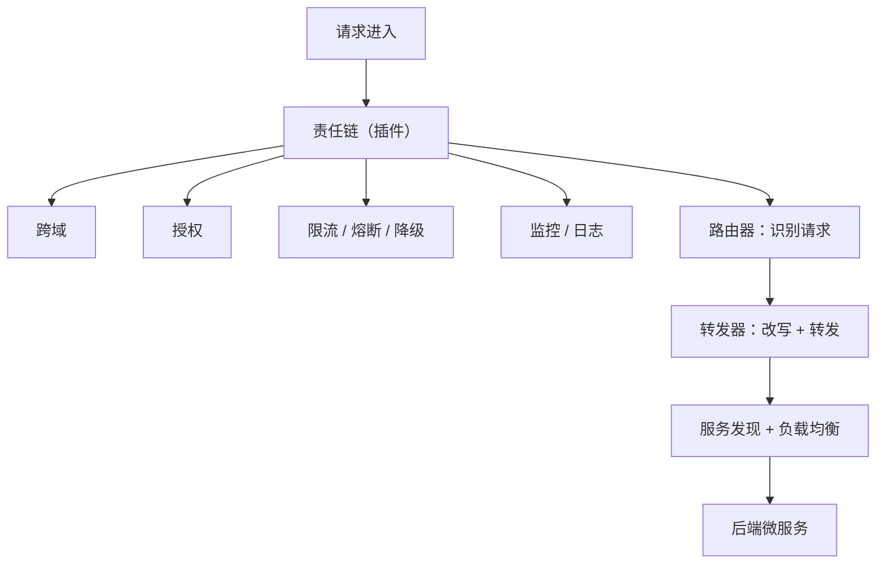

# 从设计模式角度理解 API 网关 —— 五个模式与两组能力

把网关当"转发请求的东西"理解不了它为什么这么重要，把它当"一组设计模式的组合"就通了。API 网关既是服务的接入层、也是服务调用的负载均衡器，它身上能套出五个设计模式：代理、外观、中介者（结构型）与责任链、策略（行为型），落到能力上就是基础能力（路由/转发/LB）与扩展能力（插件化中间件）。

## 纲要

- 网关是什么：接入层 + 负载均衡
- 结构型三兄弟：代理 / 外观 / 中介者
- 行为型两兄弟：责任链 / 策略
- 基础能力：路由器 + 转发器 + 负载均衡
- 扩展能力：插件化的中间件
- 五个模式一张总图

## 网关是什么

API 网关作为服务的接入层、作为服务调用的负载均衡器，作用非常重要。



调用方只认网关一个入口，后面成千上万个微服务怎么部署、怎么访问，调用方一律不用知道。换一个角度——它身上用了哪些设计模式、为什么要这么用？

## 结构型模式一：代理模式

代理模式可以让调用方和服务方解耦：调用方只需要知道代理对象（网关），而代理对象后面的成千上万个微服务怎么部署和访问，调用方不需要都知道。通过代理对象可以简化调用访问方式，也可以通过代理对象增强对后端微服务的控制。网关既可能是七层代理，也可能是四层代理——四层转发 TCP/UDP 流、快但不看内容；七层看得懂 HTTP/gRPC，才能做路径路由、header 改写、协议转换。

## 结构型模式二：外观模式

外观模式和代理模式很像，都可以解耦、简化访问；但它会**隐藏后端服务的复杂度，提供一致的高层接口**，让后端服务更强、更容易使用。例如：

| 场景 | 对端 | 后端只需 |
| --- | --- | --- |
| 协议加密 | 网关对外支持 HTTP + HTTPS | 只支持 HTTP（HTTPS 在网关终止） |
| 协议版本 | 客户端可走 1.0 / 1.1 / 2.0 | 统一用 HTTP/2.0（性能更好） |
| 跨域与授权 | 在网关统一封装，调用方看到接口一致 | 所有后端都能享受这一层 |

> 外观模式的本质：在外围加一层"统一门面"，把复杂度挡在门后，对外只暴露一个简单一致的接口。

## 结构型模式三：中介者模式

中介者模式和代理模式更像，只是**缺少代理对象的控制点**。它负责把客户端与一堆后端协调成一条稳定的调用路径，而不替任何一方做决定。

```dir
代理模式 vs 中介者模式
├── 代理模式：替代、控制、增强（"我来替你干，而且我能管住你"）
└── 中介者模式：协调、收敛（"我把各方串起来，但不替你做决定"）
```

前三个都属于**结构型模式**——管"怎么把调用方和后端接起来"。

## 行为型模式四：责任链模式

责任链模式是在网关中配置多个插件作为请求接收者的一条链条，按配置顺序执行插件一、插件二、插件三；链上的各个插件只需要完成自己的特定任务。



```dir
责任链的三个要点
├── ① 链条：多个插件 = 多个接收者，串成一条链
├── ② 顺序：按配置顺序执行（顺序错，行为就变）
│   例：鉴权必须在限流前——否则未登录的人也能把限流打满
└── ③ 职责单一：每个插件只完成自己的特定任务
```

这条"每个插件只干一件事"是网关插件体系能扩展的前提：不改核心转发逻辑，只往链上挂处理器。

## 行为型模式五：策略模式

策略模式根据不同的算法实现，表现不一样的行为。比如选择不同的负载均衡算法实现，就可以在请求时执行不同的调用策略。

```dir
策略模式在网关里
同一个「选后端实例」的动作，换一份算法 = 换一种行为
├── 轮询 Round Robin
├── 加权轮询（按实例规格）
├── 随机 + 权重
├── 一致性哈希（同 key 落同实例，适合有状态/本地缓存）
└── 最少连接（把请求给最闲的）
```

这就是策略模式：**算法可替换，接口不变**。前两个行为型模式（责任链/策略）管"请求在网关里怎么被处理"。

## 两组能力

API 网关离不开基础能力（路由器和转发器），还有负载均衡能力。

### 基础能力：路由器 + 转发器 + 负载均衡

| 组件 | 干什么 | 细节 |
| --- | --- | --- |
| **路由器** | 识别请求 → 匹配规则 | 按 URI 路径 / header / query / 甚至 body 来识别 |
| **转发器** | 二次包装后转发给特定后端 | 可改请求：域名、路径、header、query、甚至 body；也可改响应：增加 header、甚至直接改 body |
| **负载均衡** | 从多个实例里选一个 | 依赖服务发现从注册中心拿到微服务信息，再按算法调用某个后端实例 |

### 扩展能力：插件化的中间件

一个能自定义插件来实现更多能力的网关才是强大的网关。常见中间件：

```dir
网关的中间件清单
├── 安全类：授权鉴权、跨域 CORS、认证、签名校验
├── 稳定性：熔断、降级、限流、重试、超时
├── 性能类：缓存、静态响应处理、压缩
└── 可观测：监控、日志、链路埋点
```

## 五个模式一张总图



```dir
API 网关 = 结构型 3 个 + 行为型 2 个
结构型（怎么把调用方和后端接起来）
├── 代理模式   调用方只认代理，后端部署变化对调用方透明
├── 外观模式   对外一致接口，隐藏后端复杂度（协议收敛、统一封装）
└── 中介者模式 协调客户端与一堆后端，收敛成稳定入口
行为型（请求在网关里怎么被处理）
├── 责任链模式 多个插件串成链，按序执行，各干各的
└── 策略模式   算法可替换（换负载均衡 = 换调用策略）
```

## 一个可落地的配置骨架

把五模式与两组能力对应到一份配置上，注意：下面这段 YAML 里的双花括号是 Helm 模板占位符，已放在 fenced 代码块内，配合文章头部的 disableNunjucks 开关不会被 Hexo 渲染器误处理。

```yaml
apiVersion: v1
kind: ConfigMap
metadata:
  name: gateway-config
data:
  config.yaml: |
    # ① 代理 / 外观：对外一个入口，协议到后端统一收敛
    listen:
      http: ":80"
      https: ":443"
      protocol_upgrade:
        client: [http/1.0, http/1.1, http/2.0]
        backend: http/2

    # ② 路由器：识别特定请求（URI / header / query）
    router:
      - name: user-api
        match:
          uri: { prefix: /api/user }
          headers:
            - key: Authorization
              exists: true
        backend: user-service

    # ③ 转发器：改写请求与响应
    forwarder:
      request:
        setHeaders: { X-Gateway: "v1" }
        rewritePath: "/api/user(/.*)? => /v1$1"
      response:
        setHeaders: { X-Frame-Options: "DENY" }

    # ④ 责任链：插件按序执行（鉴权在前，限流在后）
    chain:
      - name: cors
      - name: auth
      - name: rate_limit
      - name: metrics
      - name: circuit_breaker

    # ⑤ 策略：负载均衡算法可替换
    loadBalancer:
      strategy: least_conn
      discovery: registry
```

## 总结

理解网关最快的方式，是把这五个模式当成五把钥匙：

1. **代理模式**——网关就是那个"代理对象"，调用方只认它，后面成千上万个微服务怎么部署怎么访问，调用方一律不用知道；代理既能简化访问，也能增强对后端的控制；网关可以是四层或七层代理；
2. **外观模式**——和代理很像，但更强调隐藏后端复杂度、提供一致高层接口；三个经典例子：对外 HTTP+HTTPS / 后端只需 HTTP；客户端 1.0/1.1/2.0 / 后端统一 HTTP/2.0；跨域与授权在网关统一封装；
3. **中介者模式**——和代理更像，但缺了代理对象的控制点，作用是协调与收敛；
4. **前三个是结构型，后两个是行为型**——这个分类本身就是考点；
5. **责任链模式**——多个插件串成接收者链条，按配置顺序执行，每个插件只完成自己的特定任务；
6. **策略模式**——不同算法表现不同行为，换负载均衡算法就是换调用策略；
7. **基础能力两件套**：路由器（按 URI / header / query / 甚至 body 识别请求）+ 转发器（二次包装转发，能改请求与响应）+ 服务发现与负载均衡；
8. **扩展能力才是网关胜负手**——跨域、授权、监控、负载均衡、缓存、熔断、降级、限流、请求分辨和管理、静态响应处理；能自定义插件的网关才叫强大网关，有些内置、有些要自己二次开发。
