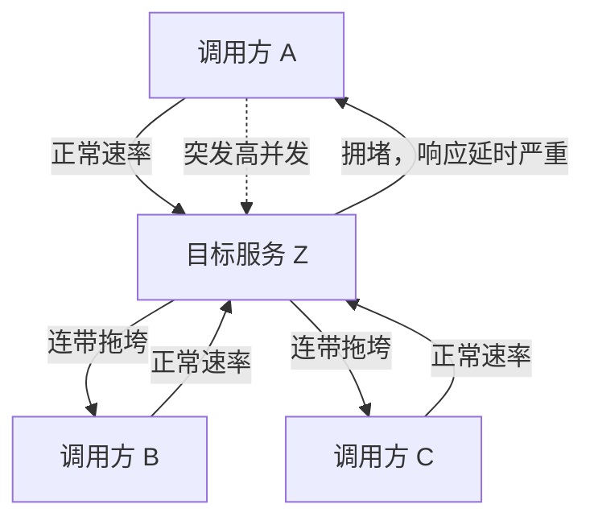

# 服务调用的限频、限流、降级和熔断（一）—— 调用方为什么要自保

线上环境里的服务调用，总会有意外：目标服务出 bug、性能与并发能力断崖下降，调用方还照常猛打，结果不只是目标服务立刻不可用，**调用方自己也会被一堆慢请求拖垮**；更常见的是运营推广一个活动，后端根本没提前知道，流量暴涨直接把服务冲垮。所以调用方不能只会"调"，还得会"自保"。这一节先把"为什么要自保"和两个真实场景讲清楚，再给出五种自保手段的概览。

## 纲要

- 两个真实场景：bug 拖垮 + 活动暴涨
- 五种自保手段：超时 / 限流 / 熔断 / 降级 / 隔离
- 一个关键认知：自保发生在调用方进程里
- 五种手段的对照表
- 本节重点与下一节预告

## 两个真实场景

服务治理不是理论问题，是被事故逼出来的。



**场景一：目标服务有 bug 或性能暴跌。** 如果调用方没设超时，请求就一直挂着等 TCP 连接，连接数越积越多，资源开销越来越大，最后调用方和目标服务一起崩溃。

**场景二：活动推广带来的突发流量。** 后端服务没有对应措施，流量峰值直接压过来，瞬间把服务冲垮。

> 区分清楚一件事：**凡是"调用方做出的决定"，都发生在调用方进程里，不需要改目标服务一行代码**——这正是五种手段能救你的前提。

## 五种自保手段

我们提炼出五种解决方案，本节先给全貌，下一节（二）再深入限频、限流、降级、熔断的算法与方法。

| 手段 | 作用 | 典型配置 | 代价 |
| --- | --- | --- | --- |
| **超时 timeout** | 调用方主动中断请求的连接 | 按目标服务预估延时设 TCP 超时，例如接口 100ms 内返回 → 设 500ms 或 1s | 什么都不配 = 无限等待 |
| **限流 rate limit** | 限制请求的最大并发数 / 频次 | 目标服务最大 1000 QPS，就不让它超过这个数进来 | 超出的请求要快速失败或排队 |
| **熔断 circuit breaker** | 某时间段内目标服务大量异常，就暂时不再调用它 | 错误率 / 连续错误数阈值 + 熔断窗口 | 熔断期间功能确实不可用（快速失败） |
| **降级 fallback** | 目标服务异常时返回友好兜底，比熔断温和 | 默认值 / 旧数据 / PlanB | 结果不完美，实现有难度 |
| **隔离 isolation** | 调用方 A/B/C 都调目标服务 Z，A 的突发不能波及 B、C | 线程池 / 信号量 / 连接池分别计数 | 资源占用翻倍 |

## 逐一看定义

### ① 超时

作为调用方会主动中断请求的连接。我们调用 API 时，一般会根据目标服务预估的接口延时来配置 TCP 超时时间——比如 API 大部分情况 100 毫秒内就能返回，那可以把请求超时设置为 500 毫秒或者 1 秒。**如果不设置超时**，当目标服务出现异常、无法正常快速响应时，原服务和目标服务的所有请求就会无限等待，TCP 连接数越来越多，系统资源开销越来越大，很容易就崩溃掉。

### ② 限流

目的是**限制请求的最大并发数**。比如目标服务最大可以支持 1000 QPS，那就不能让超过这个并发的请求进来，否则很容易冲垮目标服务。

### ③ 熔断

当目标服务在某个时间段内出现大量的异常情况，这时候如果继续请求目标服务，大概率也还是会返回异常结果。所以这就需要熔断策略——**暂时把调用目标服务的请求快速返回，不再去调用目标服务**。

### ④ 降级

类似熔断的场景，目标服务出现大量异常。这时候的响应不要像熔断那么简单粗暴，而是要有更加友好的响应，这就是**服务降级**策略。

### ⑤ 隔离

原服务 A、B、C 都直接调用目标服务 Z。正常情况下 A、B、C 的请求量都不大；但突然原服务 A 出现突发高并发来请求 Z，导致 Z 出现拥堵、响应延时严重，进而也影响原服务 B 和 C 的请求——这就是**没有做隔离**时容易出现的问题。隔离就是避免 A 的突发拖垮 B、C。

```dir
五种手段的层次关系
├── 调用方进程内（无需改目标服务）
│   ├── 超时    最底层防线：不让连接无限堆积
│   ├── 限流    控制打到下游的速率/并发
│   ├── 隔离    控制单个下游对全局的影响范围
│   ├── 熔断    下游已异常 → 直接不调
│   └── 降级    下游异常 → 给兜底而不是失败
└── 熔断与降级的关系
    └── 熔断是降级的特殊形式（更粗暴：停止调用 + 冷却后探测）
```

## 本节重点与下一节预告

本节我们主要讲解了**限流、熔断、降级**的相关算法和方法，关于超时、隔离的方案，后面根据大家反馈可以适当再补充完善。

需要记住的几个判断：

- **超时**是性价比最高的第一道防线——不设就会把所有请求挂死、连接堆到崩；
- **限流**保护的是"目标服务最大能扛多少"，超出要快速失败或排队；
- **熔断**是"下游已经不行了，先别打了"，冷却后再放探测请求；
- **降级**比熔断温和，给一个不完美但可用的兜底；
- **隔离**防止一个下游的突发拖垮其他调用方。

## 总结

记住"调用方自保"这件事，先把框架立住：

1. **自保是被事故逼出来的**：目标服务 bug 拖垮调用方、活动暴涨冲垮后端，两种场景都要求调用方不能只会"调"；
2. **五种手段**：超时（主动断连接）、限流（限制最大并发/频次）、熔断（下游大量异常时不再调用）、降级（更友好的兜底）、隔离（A 的突发不波及 B/C）；
3. **关键认知**：这些决定都发生在调用方进程里，不需要改目标服务一行代码；
4. **超时是最底层防线**：不设就会连接无限堆积、资源开销爆炸，最后一起崩；
5. **熔断是降级的特殊形式**：简单粗暴停止调用，冷却后放探测请求，比降级"狠"一点；
6. **本节是（一）**：讲清"为什么自保 + 五种手段概览"；限频与限流的区别、四种限流算法、降级八法、熔断三状态，留到（二）深入。
