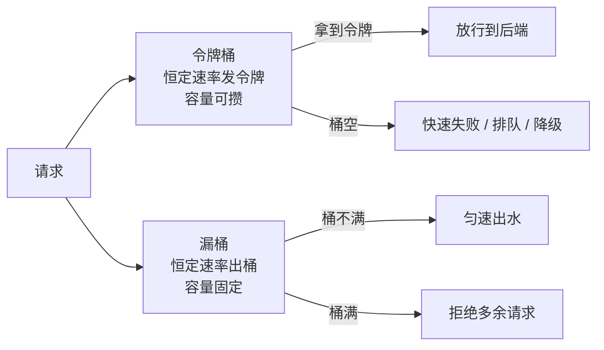
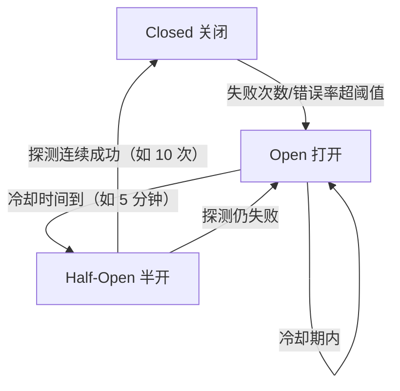

# 服务调用的限频、限流、降级和熔断（二）—— 算法、方法与三道面试题

上一节我们讲清了"调用方为什么要自保"和五种手段的概览。这一节落到**算法和方法**上——限频和限流到底有什么区别？四种限流算法怎么选？降级有哪些具体方法？熔断又有哪三状态？最后用三道高频面试题把整节串起来。

## 纲要

- 限频 vs 限流：一个看"频次"一个看"并发"
- 四种限流算法：固定窗口 / 滑动窗口 / 令牌桶 / 漏桶
- 限流放在哪：网关层 / 服务自身 / 调用方
- 降级八法：有总比没有好
- 熔断三状态与触发/恢复条件
- 三道面试题实战

## 限频 vs 限流

先分清这两句话差在哪：

- **限频**：限制的是**时间窗口内的频次**，比如"发短信 ≤ 100 次/小时、≤ 1000 次/24 小时"，**配额是配额，用完就没了，不能挪到下一秒去用**；
- **限流**：限制的是**同时并发数**，比如"目标服务最大撑 10000 QPS"、"接口并发配额 10 次/秒"，**没用不完的部分可以留给突发流量用**。

一句话：**限频管"时间窗口内总共多少次"，限流管"同一时刻最多多少并发"**。

## 四种限流算法

| 算法 | 思路 | 优点 | 缺点 | 适用 |
| --- | --- | --- | --- | --- |
| **固定窗口计数** | 每 1s 一个窗口，计数器 +1 到阈值就拒 | 实现最简单 | 窗口边界可被打满（临界期请求数翻倍） | 粗粒度限频，如短信条数 |
| **滑动窗口 / 滑动日志** | 记录每个请求时间戳，统计最近 1s 数量 | 边界问题弱化 | 存时间戳占内存 | 精度要求高的限频 |
| **令牌桶** | 恒定速率往桶里放令牌，请求取令牌，容量可攒 | **允许突发**，支持"配额用不完留给突发" | 实现稍复杂 | 接口限流、对外配额 |
| **漏桶** | 请求进桶，恒定速率出水 | 输出**匀速**，削峰最好 | 不支持突发 | 保护下游均匀负载 |

一句话记忆：**令牌桶管"能不能突发"，漏桶管"出得匀不均匀"**。



## 限流放在哪

```dir
限流的三层位置
├── 网关层限流      面向客户端，防刷、保护整条链路
├── 服务自身限流    保护自己（自己最多吃 10000 QPS）
└── 调用方限流      调用方主动限制给某个下游的调用量（隔离思想的第一层）
```

三层互补：网关兜住外部流量、服务兜住自身容量、调用方兜住对单个下游的冲击。

## 降级八法

降级的理念就一句：**有总比没有好，哪怕返回的结果不那么完美**。

```dir
服务端降级手段一览
├── 读旧数据        有备份/缓存就直接用，旧数据比空的强
├── Plan B         同一件事多方案，A 挂了切 B（开发量大、可用性极高）
├── 默认值         降级开关打开，异常直接返回默认值（最简单）
├── 放弃部分请求    砍掉一部分请求，减少对后端并发量
├── 降低质量       跳过耗时逻辑，不要求实时算出全量结果
├── 提高参与门槛    门槛高一点，进来的请求少一点
├── 反向过滤       过滤太费劲 → 不过滤，直接返回全部内容
└── 补偿服务       异常时先记日志，事后做补偿，数据最终一致
```

两个提醒：① 如果你的服务无法接受不完美结果，就别用降级；② 如果降级实现太难或效果不好，也别硬降级——为小概率异常兜太多底，没人感知得到，复杂度却实打实涨了。

## 熔断三状态与触发/恢复

熔断比降级简单，本质是降级的特殊方法：

| 状态 | 含义 | 行为 |
| --- | --- | --- |
| **Closed（关闭）** | 正常放行，统计错误 | 记录失败次数/错误率 |
| **Open（打开）** | 直接拒绝，不再调用目标服务 | 请求快速失败 |
| **Half-Open（半开）** | 冷却结束后放一小部分探测请求 | 成功则回 Closed，失败则再 Open |



触发与恢复要成对设计（示例值）：1 分钟内超时/5xx 响应超 100 次 → 触发；5 分钟后尝试 10 次请求 → 全成功则恢复、有失败则继续熔断；再等 5 分钟重试。还有一层容易忽略：**最简单的触发与恢复方式是手动**（运维改配置、开关降级），自动方式才需要上面这一整套规则。手动兜底 + 自动按规则恢复，是线上最稳的组合。

## 三道面试题实战

源稿里给了三道非常典型的面试题，正好对应上面的算法：

**题一：后端接口只能支撑最大 QPS 为一万，要怎么保护它？**
→ 这是**限流（并发语义）**。在网关层或服务自身加限流，目标服务最大 10000 QPS 就不让它超过这个数进来，超出快速失败或排队。可用令牌桶/漏桶实现。

**题二：发短信接口不超过一百次/小时、一千次/24 小时，怎么实现？**
→ 这是**限频（频次语义）**。用固定窗口或滑动窗口计数：每小时窗口计数到 100 就拒，每 24 小时窗口计数到 1000 就拒。注意配额用完不能挪到下一窗口——所以选窗口计数而非令牌桶。

**题三：某接口并发配额十次/秒，用不完的部分可在突发流量时使用，用什么策略？**
→ 答案就是**令牌桶**。桶里有 10 个令牌时突发能一次打 10 个，没用时令牌会攒着（攒到容量上限），突发时就能借。这正是"限流用不完的配额留给突发"的命门。

```dir
三题解法对照
├── 题一（万 QPS 保护）     → 限流 + 令牌桶/漏桶，超阈值快速失败
├── 题二（短信 100/时 1000/天）→ 限频 + 固定/滑动窗口，配额不跨窗口
└── 题三（10/s 可攒突发）  → 令牌桶（容量可攒、允许突发）
```

## 总结

这一节把"算法和方法"补齐：

1. **限频 ≠ 限流**：限频限制时间窗口内的频次（用完不挪），限流限制并发数（用不完可留给突发）；
2. **四种算法**：固定窗口最简单但临界翻倍、滑动窗口弱化边界、令牌桶允许突发、漏桶输出匀速——**令牌桶管突发，漏桶管均匀**；
3. **限流三层位置**：网关层防刷、服务自身保容量、调用方隔离下游冲击；
4. **降级八法**：读旧数据/PlanB/默认值/放弃部分请求/降低质量/提高门槛/反向过滤/补偿服务，理念是"有总比没有好"，但接受不了不完美就别用；
5. **熔断三状态**：Closed → Open → Half-Open → Closed，触发与恢复要成对设计，手动兜底 + 自动恢复最稳；
6. **三道面试题**：万 QPS 保护（限流）、短信配额（限频窗口）、十次/秒可攒突发（令牌桶）——把算法和场景对上号，面试就不慌。
