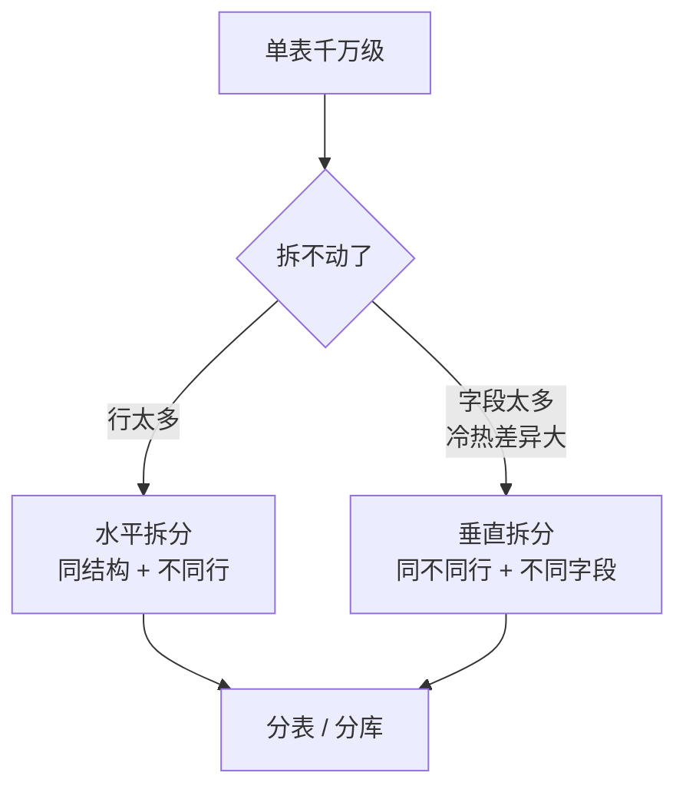
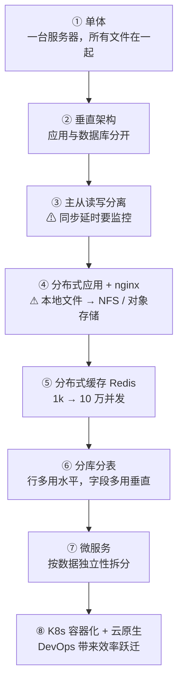

# Kubernetes 认证考点: 后台技术架构的发展史 —— 从单体、读写分离到微服务与云原生

每一代架构都不是被"设计"出来的，是被流量和数据量逼出来的。

结论：**演进链条是：单体（一台服务器、所有文件在一起）→ 垂直架构（应用与数据库分开）→ 主从读写分离（**重点：主从同步延时**）→ 分布式应用（多应用服务器 + nginx 做唯一接入层，**注意本地文件依赖，靠 NFS 共享**）→ 分布式缓存 Redis（**mysql 单机约 1000 并发、Redis 单机约 10 万，缓存查询只要 1~2 毫秒**）→ 分库分表（**行数太多用水平拆分，字段太多/读写频率差异大用垂直拆分**）→ 微服务（按"数据尽量独立"拆分，团队变大后自然发生）→ K8s 容器化 + 云原生（DevOps 让几个人管成千上万的微服务、一天发 n 次）。**

## 纲要

- 起点：单体架构
- 第二步：垂直拆分应用与数据库
- 第三步：主从与读写分离（延时要盯）
- 第四步：分布式应用 + nginx（本地文件的坑）
- 第五步：分布式缓存 Redis
- 第六步：分库分表（两种拆法）
- 第七步：微服务与它的由来
- 第八步：容器化与云原生
- 一张总图与omenclature 对照

## 起点：单体架构

**当你想要做一个自己的个人网站，比如博客、论坛这种系统，因为是个人网站，可以预见的数据量和访问量都会很有限，这时候你会选择怎样的系统架构呢？没错，单体架构才是你最需要的。所谓单体架构，就是只用一台服务器，所有的程序文件都在一起，既简单又便宜。所以在互联网早期，包括现在的创业型团队都经历过单体架构。**

**当个人博客网站的用户和访问量越来越大，这时候最简单的方式就是升级为垂直架构，把应用和数据库分开来部署。**

## 第二步：垂直架构

```text
单体                    垂直架构
├── 一台服务器            ├── 应用服务器
│   ├── 应用              │   └── 博客程序
│   └── 数据库            └── 数据库服务器
└── 一个 IP               └── 独立部署
```

**"把应用和数据库分开"这一步，是整个架构演进里性价比最高的一次改动** —— 成本几乎没变，但数据库有了自己的内存、磁盘和索引，不再跟应用抢资源。

## 第三步：主从与读写分离

**随着不断有新用户来关注和访问，你会发现 MySQL 数据库的压力会非常大，经常出现拥堵和慢查询。这时候又要考虑对系统架构进行升级了，比较常用的是使用 MySQL 主从模式，可以是一主一从或者一主多从：主库负责全部的数据写入请求，从库只能用来查询，分担主库的查询压力。**

**应用程序中可以把大部分的读请求改为查从库，但是要特别注意数据库主从同步的延时问题。**

```mermaid
flowchart LR
    A["写请求"] --> B["主库 Master"]
    B -->|"binlog 异步同步<br/>（有延时）"| C["从库 Slave']
    D["读请求（大部分）"] --> C
```

**这里要特别注意两点：**

1. **必须对主从延时进行监控** —— 延时是可见的，就必须有人盯着；
2. **程序上要做策略性调整**：**优先把对时间更新不敏感的数据改为读从库，比如统计信息、排行榜、不是最新的第二页、第三页；需要读取最新内容时，还是走主库查询。**

```text
读写分离的取舍表
├── 走从库：文章列表、历史文章、统计、排行榜、用户资料
│   └── 条件：允许几百毫秒到几秒的陈旧
└── 走主库：刚发布的文章、刚下单、余额、余额、余额（重要的话说三遍）
    └── 条件：必须读到自己刚写进去的数据
```

> 这条经验到今天依然成立，只是换了个地方落地：**K8s 里做读写分离通常靠两个 Service（主库 Service 指向主实例、从库 Service 指向副本组），而不是在代码里硬编码 IP。**

## 第四步：分布式应用 + nginx

**但是新的问题出现了：之前一直没有太在意的博客系统所在的应用服务器也开始压力巨大了，单服务器的应用服务这时候也要考虑扩容了。这时候就要使用分布式应用架构：多申请几台应用服务器，把博客系统在每台服务器上都部署一套，然后再部署一个负载均衡服务器，比如 nginx 来作为唯一的接入层。**

```text
分布式应用架构
                 ┌──────────┐
请求 ───────────▶ │  nginx   │  ← 唯一接入层
                 └────┬─────┘
          ┌────────────┼────────────┐
          ▼            ▼            ▼
      app-01       app-02       app-03
   （各部署一套博客程序）
```

**当这些都做好上线后，马上又遇到新的问题：上传的图片经常出现 404 访问不到，但是有时候又能访问到，是不是很奇怪？**

**经过一番分析和排查，问题出在使用分布式架构上 —— 因为博客系统运行在不同的服务器上，但是上传的图片和文件还只是保存在本地的文件系统上，其他的服务并没有这些文件，所以就会出现 404。那么这些图片文件该怎么保存呢？比较简单的方法，就是在每一台应用服务器上都挂载同一个 NFS，并且配置一样的目录。**

> **这一课是分布式改造里最经典的坑：本地文件系统 =  implicit 单实例假设。** 从单体切分布式，第一个要拆的就是"状态"，尤其是文件。
>
> 现代替代品很多：**对象存储（COS/S3）+ 应用只存 key**，或者 PVC 共享盘；比 NFS 更扛得住 Pod 漂移。

## 第五步：分布式缓存 Redis

**但是访问量大了，数据库的读写并发量也增大了，尤其是从库不仅要同步写入，还要支持大量的查询，慢查询也就会越来越多了。到了这个阶段，再对数据库服务器做水平/垂直扩容的收益已经不大了，这时候就需要对系统做全面的优化升级，引入分布式缓存服务是一个很好的选择。**

**比如使用 Redis 集群：一般认为 MySQL 服务单机可以支持一千的并发，Redis 服务单机可以支持十万级；利用缓存可以把一些慢查询的结果缓存起来，缓存查询耗时只有一到两毫秒，性能提升上不止百倍；不仅性能上有巨大的提升，在服务器成本优化上也会很明显（分布式缓存主要是内存需求，可以通过水平扩容来增加集群规模和容量）。**

| | 单机并发 | 查询耗时 |
| --- | --- | --- |
| MySQL | 约 1000 | 慢查询可达几十~几百 ms |
| Redis | 约 100000 | **1~2 ms** |
| 提升 | — | **性能百倍以上** |

**但是引入缓存也会带来新的问题：不仅仅是增加了开发工作量，也给系统带来了更多的复杂性**（缓存穿透、击穿、雪崩、一致性、热点 key 都要处理）。

## 第六步：分库分表

**随着日积月累，文章数量和评论数量都在飞快地增长，文章表和评论表的数量都超过千万规模时，虽然加入了分布式缓存，但是只要涉及到数据库的查询、批量更新等操作时也会变得很慢，数据库再次成为整个系统的瓶颈。这时候我们可以考虑对数据表进行分表，让单张表的数据规模控制在千万以内。**

```text
两种拆法（这是本节最该记住的对比）
├── 水平拆分：表结构一模一样，每个子表只存总数据的一部分
│   ├── 按时间段：30 天内发表的文章单独一张表，历史文章按年归档
│   └── 按用户 ID：UID 101、102 的文章放文章表1，UID 201、202 放文章表2
│   └── 适用：数据行数太多
└── 垂直拆分：子表的字段都是大表的一部分
    ├── 文章基本信息表 / 文章内容表 / 文章评论量统计表
    └── 适用：数据字段太多、更新和读取频率差异大
```

**分库的方法跟分表很类似，同样是考虑用水平拆分或者垂直拆分。**

| 场景 | 选哪种 |
| --- | --- |
| **行数**太多 | **水平拆分** |
| **字段**太多、更新和读取频率差异大 | **垂直拆分** |



## 第七步：微服务架构

**如果数据库使用垂直拆分的话，就会考虑进入下一阶段的架构升级了。微服务架构就是对一个大的应用系统进行垂直拆分，而服务拆分的依据就是让各个服务的数据量、数据尽量独立。**

**比如博客系统可以考虑把文章系统、评论系统、图片系统、浏览收藏点赞等统计系统进行独立的拆分。随着产品迭代和演进会有越来越多的功能增加进来，这时候如果一直在原来的系统中修修补补，维护的工作量会变得越来越大；如果团队扩大了，大家都在同一个服务中开发、测试、发布，可能会遇到冲突，问题也会越来越多。所以当系统规模和团队规模越来越大之后，微服务架构也就自然而然被选中了。**

```text
微服务拆分的判据：数据独立性
文章系统  ── 文章数据独立  ──┐
评论系统  ── 评论数据独立  ──┤
图片系统  ── 图片数据独立  ──┼─► 各自独立的库 + 各自独立的部署
统计系统  ── 统计独立     ──┘

反面教材：拆了服务但共用一个大库 → 只是把单体切成几块，没任何收益
```

**这时候有同学又会发问：十年前早就出现了很多大规模的应用系统和上百人的开发团队，那时候为什么没有听说微服务架构呢？**

**确实那时候还没有微服务这个概念。但是那个时候已经有了 SOA 架构（面向服务架构），也是把一个大的系统做很多的独立服务化拆分。这几年，随着 DevOps 的兴起，尤其是 K8s 容器化技术的流行，大家突然感受到服务并发部署、运维的效率得到了巨大的提升：以前管理几十台服务器、管理几十个应用系统已经非常吃力了，那现在几个运维和开发同学就可以管理成千上万的微服务，可以管理上百万核的服务器资源，同时可以让开发测试发布的周期变得更短 —— 不要说像以前一周一次的发布频率，哪怕是一天 n 次的发布频率也是完全可以支持的，这就是工具带来的效率提升。**

> **这段是整个课程的历史观落点：架构早就有了（SOA），是工具（容器 + 编排 + DevOps）让它从"理想"变成"可落地"。**

## 第八步：容器化与云原生

**因为看得见的效率提升，所以各个团队都在关注跟进和应用 K8s 容器编排。当很多人还在实验和尝试容器化时，已经有更多的公司开始选择云原生的架构了。云原生将进一步帮助我们提高研发效率、运维效率和灵活性，提高系统和产品的可用性。**

**云原生可以不再受到资源和地域的限制，可以快速的在全球几十个地区把服务部署运行起来。再比如，应用中用到的 MySQL 集群、Redis 集群、分布式存储等等，要管理和维护这么多的大型分布式系统，既要优化提高服务的性能，又要保证系统的高可用性，这里需要投入的人力资源和服务器资源都会是非常巨大的。所以一步到位上云就可以在很多方面做到"既要又要还要"。**

**当然还有很多的团队因为对云原生的资源管控不好、成本方面控制不好，还会选择混合云的方式。**

```text
上云的两种结果
├── 管控得住 → 全云：全球多地域部署、弹性、少养人
└── 管控不住 → 混合云：把成本账单压回来（这也是本章前几节讲监控/日志成本的原因）
```

## 一张总图



## 一条完整的演进链

**最后我们再简单总结一下（把前面所有阶段连起来）：**

```text
① 单体架构   → 创业团队 / 规模很小的团队很适用
② 垂直应用架构 → 把应用系统和数据库分开部署，也很容易
③ 主从 + 读写分离 → 数据库有瓶颈时
                ⚠ 特别注意主从同步的数据延时问题
④ 分布式应用   → 应用服务器有瓶颈时
                ⚠ 注意这里的「本地文件」依赖
⑤ 分布式缓存   → 数据库慢查询越来越多时，这是必备大招
                但也带来数据一致性与复杂性的挑战
⑥ 分表分库     → 数据规模越来越大时
⑦ 微服务架构   → 需要做到垂直分布时，可以考虑升级为微服务
⑧ K8s 容器化 + 云原生 → 课程重点内容
```

## API 速览

| 架构 | 解决什么问题 | 引入的新问题 |
| --- | --- | --- |
| 单体 | 快速起步 | 量上来后一台机器扛不住 |
| 垂直拆分 | 数据库抢不到资源 | 单库读写都堆在一台 |
| 主从读写分离 | 读压力 | **同步延时**、主从切换的数据丢失 |
| 分布式应用 + LB | 应用算力 | **本地文件 404**、Session 不共享 |
| NFS / 对象存储 | 文件共享 | 单点 / 带宽 / 一致性 |
| 分布式缓存 | 慢查询 | 一致性、穿透击穿雪崩、开发量 |
| 分库分表 | 单表千万级 | 跨表查询、分页、分布式 ID |
| 微服务 | 团队与系统规模 | 调用链复杂、运维爆炸 |
| K8s + DevOps | 运维效率 | 成本管控、可观测性要求 |

## Demo 示例

把第 ③、④ 两步落成今天还能复现的东西：

```text
③ 读写分离在 K8s 里的形态
mysql-primary Service  → 指向主实例（写 + 强一致读）
mysql-replica Service  → 指向副本组（读）
代码里按场景选：
    ├─ 写、以及「刚写完马上读」→ primary
    └─ 列表、统计、历史、排行榜 → replica

④ 文件共享的演进
单体： 容器本地文件系统（没问题，只有一个实例）
分布式：本地文件系统 → 404
       ├─ 方案 A：每台挂同一个 NFS，配置一样目录（课程讲的）
       └─ 方案 B：上传即传对象存储，库里只存 key（更推荐）

** 用 PVC 共享盘也行，但要盯住 PV 的回收与 Pod 漂移
```

```bash
# 先给变量赋值，例如：POD1=$(kubectl get pod -o jsonpath='{.items[0].metadata.name}')；POD2=$(kubectl get pod -o jsonpath='{.items[1].metadata.name}')
# ④ 的验证：看看服务到底打到了哪台、文件在不在
kubectl get pod -o wide
for p in $POD1 $POD2; do
  echo "== $p =="
  kubectl exec $p -- ls /var/upload | head -3
done
# 两台不一致 → 就是本地文件问题，上对象存储或共享盘
```

## 总结

这条演进史真正的规律只有两条：

1. **每次升级都是"解决上一代的新问题"，同时引入下一代的新问题** —— 主从带来延时、分布式带来本地文件 404、缓存带来一致性、分库分表带来跨表查询、微服务带来运维爆炸；**没有一代是"终极形态"，只有"当下最划算的形态"**；
2. **工具决定了架构能走多远** —— SOA 十年前就有，但没人用得动；**是容器化 + K8s + DevOps 把"几百人管一堆服务"变成"几个人管成千上万个微服务、一天发 n 次"**，这才让微服务从概念变成工业现实。

具体到每一代的判断标准：

- **数据行数太多 → 水平拆分；字段太多、读写频率差异大 → 垂直拆分**；
- **主从同步延时必须监控**，且**对时效不敏感的数据才读从库**；
- **分布式之后第一件事是拆"状态"**：文件、Session、上传内容，别指望本地磁盘；
- **Redis 与 MySQL 的差距是数量级的（1~2ms vs 千级并发）**，缓存是性价比最高的一招，但一致性成本要提前算；
- **微服务拆的依据是"数据尽量独立"，不是"业务听起来不一样"**；
- **上云不是终点** —— **很多团队因为资源与成本管控不好，最后退回混合云**。

