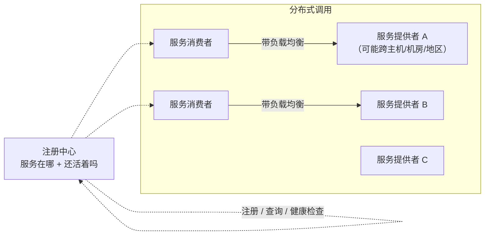
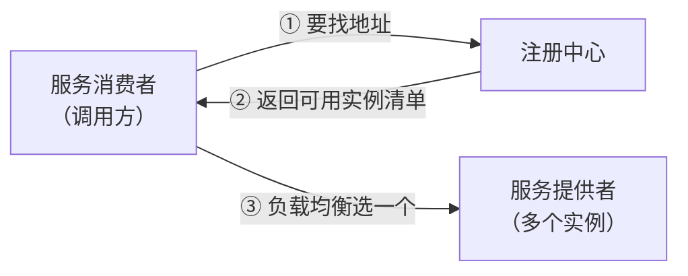
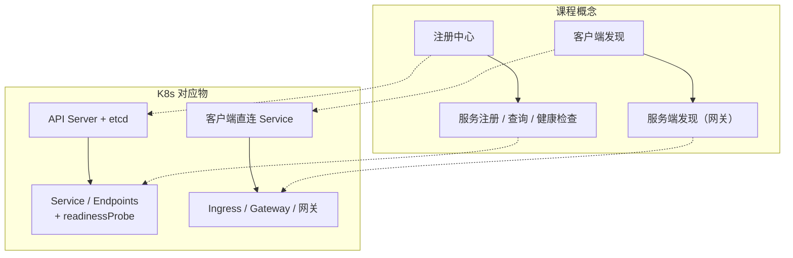

# Kubernetes 认证考点: 服务发现与负载均衡 —— 注册中心三功能、两种模式与主流实现

服务一多，"要调谁、在哪调"这件事就会从 trivial 变成整个系统的灵魂。

结论：**微服务是分布式系统，服务可能跨主机、网段、机房甚至地区，通过 HTTP/REST 或 RPC 互相调用 —— 所以服务发现是"微服务架构的灵魂"。服务发现 = 把服务信息注册到配置中心（注册中心），并从那查到更多信息。注册中心三大功能：① 服务注册（启动时登记服务名 + 访问方式/协议 + 地址）；② 服务查询（按服务名找到调用方式）；③ 服务健康检查（随时掌握每个实例是否可用，异常时配告警/重启策略）。模式分两种：客户端发现（消费者自己取信息 + 自己做负载均衡，更灵活、少一跳、性能好）与服务端发现（引入网关，消费者只请求网关，网关统一做发现和负载均衡，对调用方更简单、网关层能干更多事）。实现方案主要有 ZooKeeper（Java 栈、目录树、ZAB 协议）、etcd（受 ZooKeeper 启发，简单/安全/快速/可信 Raft，**是 K8s 的核心组件**）和 file（最简单但推送失败会出事，大型系统不直接用）。**

## 纲要

- 为什么需要服务发现
- 注册中心：是什么 + 三大功能
- 一致性是注册中心的头号挑战
- 两个调用对象与两种发现模式
- 客户端发现 vs 服务端发现
- 三种实现方案对比
- 在 K8s 里这些概念落在哪

## 为什么需要服务发现

**讲到微服务架构肯定离不开服务发现和服务治理。微服务架构是一个分布式系统、一个分散式系统，服务部署可能会跨主机、网段、机房，甚至是地区，各个服务之间通过 HTTP 接口或者 RPC 进行调用。在这种架构下，最重要的一环就是服务发现 —— 如果说它是微服务架构的灵魂，也当之无愧。**

**试想一下：当一个系统被拆分为多个服务、大量部署的时候，有什么能比"找到想调用的服务在哪里、以及能否正常提供服务"更重要呢？同样，有新服务启动时，如何让其他服务知道该服务在哪里呢？**



## 注册中心：是什么

**服务发现简单理解，就是把服务的信息注册到一个配置中心，而且从配置中心可以找到服务的更多信息。这里的配置中心也叫注册中心，它管理着所有的服务信息，是所有微服务创建、启动、运行、销毁、互相调用都绕不过去的中心服务。**

### 三大功能

| 功能 | 干什么 | 细节 |
| --- | --- | --- |
| **① 服务注册** | 服务启动时把自己的信息登记进去 | 服务信息主要含：**服务名称**（关键字）、**服务访问方式**（调用协议 HTTP 还是 gRPC）、**访问地址**（可能是域名，也可能是 IP 端口的集合） |
| **② 服务查询** | 通过服务名称查找调用方式 | 知道"怎么请求服务方" |
| **③ 服务健康检查** | 随时掌握服务运行状况 | 每个运行实例当前是异常还是运行良好；**实例异常时可配置处理策略，比如告警、服务自动重启** |

**服务发现的整个过程很简单：服务启动的时候先去进行注册，并且定时反馈服务本身的功能是否正常，由服务发现机制统一维护一份正确、可用的服务清单。**

```text
一次服务发现的最小闭环
服务启动
  → ① 向注册中心注册（服务名 / 协议 / 地址）
  → ② 定时上报健康检查（自己是否正常）
  → ③ 注册中心维护「可用实例清单」
调用方
  → ④ 按服务名查询 → 拿到可用实例清单
  → ⑤ 选一个（负载均衡）+ 发请求
异常实例
  → 注册中心标记不健康 → 从清单摘掉 / 触发自动重启策略
```

### 注册中心还是配置中心

**除了这三个主要功能，注册中心本身还是一个分布式的存储系统，而且注册中心保存的配置信息数据量还是挺大的 —— 因为会包含很多微服务，而且每一个微服务又会有很多个实例。注册中心作为一个配置中心，除了要保存上面的服务信息，可能还会有各个微服务的自定义配置信息（微服务把注册中心当做一个数据库来使用了）。**

**对于注册中心来说，最大的挑战是系统的可靠性和数据的一致性。所以每台机器上都会保存一份完整的配置信息，并且多台服务器之间的数据同步；为了保证数据的强一致性，需要实现一些复杂的一致性协议。**

```text
注册中心的可靠性要求
├── 每台机器都保存一份完整配置（不能单点持有）
├── 多机之间做数据同步
└── 为保证强一致性 → 一致性协议
    ├── ZooKeeper：ZAB（原子广播）
    └── etcd：Raft
```

> 到今天这套逻辑在 K8s 里几乎原封不动地搬了过去：**API Server + etcd 就是注册中心，Service/Endpoints 就是"可用实例清单"，kubelet 的探针就是健康检查。**

## 两个调用对象与两种发现模式

**服务发现和服务调用的过程中主要包含四个对象：第一个是服务消费者（也是调用方），他需要依赖某一个服务、要向这个服务发起请求；因为服务是分布式架构、会有很多后端实例，所以请求的过程中会用到负载均衡；服务调用请求的最终目的是服务提供者（也是服务方）；为了把整个过程串联起来，注册中心也就必不可少了。**



**完整的服务发现过程：首先是服务提供者向注册中心注册服务信息，然后在服务消费者向服务提供者发起请求之前，从注册中心获取服务信息。这里因为获取服务信息的时机不一样，才有了两种服务发现的模式。**

### 客户端发现模式

**客户端发现模式就是在服务消费者这一侧来获取服务信息，拿到服务信息之后自己来实现负载均衡策略，直接请求到服务提供者。这种模式的好处是：服务消费者可以自己控制负载均衡策略，有更好的灵活性；因为减少了服务端的请求转发，性能方面也会更好一些。**

### 服务端发现模式

**服务端发现模式会引入一个服务端的网关，服务消费者只需要请求服务端网关就可以了；服务端网关这里统一地去获取服务信息，再实现负载均衡策略，最终请求到服务提供者。对于服务消费者来说使用起来更加简单，而且可以在服务端网关这一层做更多的事情（这些会在接下来的 API 网关章节详细讲解）。**

| | 客户端发现 | 服务端发现 |
| --- | --- | --- |
| 谁拿服务信息 | 服务消费者自己 | 网关统一拿 |
| 谁做负载均衡 | 消费者自己实现 | 网关实现 |
| 消费者改动 | 每个调用方都要接注册中心 | 只认网关一个地址 |
| 性能 | **少一跳，更好** | 多一跳 |
| 灵活性 | **策略可定制** | 策略收敛在网关 |
| 适合 | 语言统一、追求性能 | 多语言、要统一治理 |

## 三种实现方案

**关于服务发现再来看看它的几个实现方案。**

### ZooKeeper

**首先是大名鼎鼎的 Apache ZooKeeper，它是 Java 技术栈中非常重要的服务。像 Hadoop、HBase、Kafka、Elasticsearch 等大型分布式系统都会内置 ZooKeeper 使用；它使用类似文件系统的目录树方式对数据进行组织，同时也是一个自洽的容错系统，使用 ZAB 原子广播协议，保证高可用和一致性。**

```text
ZooKeeper 的画像
├── 生态：Hadoop / HBase / Kafka / Elasticsearch 内置使用
├── 数据组织：类似文件系统的目录树（/services/user/...）
├── 一致性：ZAB（ZooKeeper Atomic Broadcast）
└── 性格：Java 栈正统，重，运维心智不轻
```

### etcd

**etcd 是受到 ZooKeeper 启发而催生的项目，除了与之类似的功能外，更专注于以下四点：① 简单，基于 HTTP 和 gRPC 的 API；② 安全，可以支持 SSL 客户端认证机制；③ 快速，单机支持一千次的写操作；④ 可信，使用 Raft 算法实现了分布式的数据一致性。当然，etcd 最被大家所关注的原因，还是因为它是 Kubernetes 集群中的核心组件。**

```text
etcd 的四个卖点（课程原话）
├── 简单  基于 HTTP 和 gRPC 的 API
├── 安全  支持 SSL 客户端认证机制
├── 快速  单机支持 1000 次写操作
├── 可信  使用 Raft 实现分布式数据一致性
└── ★ 它是 Kubernetes 集群的核心组件（API Server 的后端存储）
```

### file

**file 就是以文件的形式实现服务发现，这是一个比较简单的方案：需要服务提供者把 IP 端口写入文件中，然后服务消费者加载这个文件获取服务提供者的信息，再进行访问。优点是实现简单、去中心化；缺点是需要定时推送到服务消费者，如果推送失败了就会造成异常现象。所以在大型的分布式系统中，还是不太会直接使用文件作为服务发现的方案。**

| 方案 | 优点 | 缺点 | 适用 |
| --- | --- | --- | --- |
| **etcd** | 简单/安全/快速/可信（Raft）、K8s 核心 | 要运维一个分布式存储 | **生产主流** |
| **ZooKeeper** | 生态成熟、目录树直观 | 重、Java 栈依赖 | 老系统 |
| **file** | **实现简单、去中心化** | **需定时推送，推送失败就出异常** | 小系统/临时方案 |

```text
为什么 file 方案在大型系统里不能用
服务提供者写文件 → 定时 push 给消费者 → 消费者加载
                ↑ 这一步会失败
推送失败 ⇒ 消费者手里的清单是旧的 ⇒ 调到已下线的实例
     ⇒ 要么 404/超时，要么请求打到不该打的地方
大型系统里「清单同步失败」是常态，不是意外
```

## 这些概念在 K8s 里落在哪



| 课程里的概念 | K8s 里的对应物 |
| --- | --- |
| 注册中心 | **API Server + etcd** |
| 服务注册 / 查询 | Service + Endpoints（或 Service Discovery 的 CoreDNS） |
| 服务健康检查 | **readinessProbe / livenessProbe** |
| 可用实例清单 | Endpoints / EndpointSlice |
| 客户端发现 | 客户端直连 ClusterIP（kube-proxy 在节点侧做 LB） |
| 服务端发现 | Ingress / Gateway / API 网关统一入口 |
| 服务访问方式（协议） | 同一 Service 暴露 HTTP 或 gRPC 端口 |

## API 速览

| 名词 | 英文 / 全称 | 一句话 |
| --- | --- | --- |
| 服务发现 | Service Discovery | 找到服务在哪、能不能用 |
| 注册中心 | Registry / Configuration Center | 管理所有服务信息的中心服务 |
| 服务注册 | Service Registration | 启动时登记服务名/协议/地址 |
| 服务查询 | Service Query | 按服务名拿到调用方式 |
| 健康检查 | Health Check | 随时掌握实例状态，配告警/重启策略 |
| 一致性协议 | ZAB / Raft | 注册中心强一致的底层保证 |
| 客户端发现 | Client-side Discovery | 消费者自己拿到信息 + 自己做 LB |
| 服务端发现 | Server-side Discovery | 走网关，网关统一发现与 LB |
| ZooKeeper | Apache ZooKeeper | 目录树 + ZAB，Java 栈正统 |
| etcd | etcd | 简单/安全/快速/可信，K8s 核心组件 |

## Demo 示例

用 K8s 原生能力把这套概念跑一遍：

```bash
# ① 所谓「可用实例清单」—— Endpoints 就是注册中心吐出来的那份清单
kubectl get svc user-service
kubectl get endpoints user-service
# NAME          ENDPOINTS
# user-service  10.244.1.23:8080,10.244.1.24:8080,10.244.2.11:8080

# ② 所谓「健康检查」—— readinessProbe 决定一个实例进不进这份清单
kubectl get pod -l app=user-service -o custom-columns='NAME:.metadata.name,READY:.status.conditions[?(@.type=="Ready")].status'

# ③ 所谓「服务端发现」—— 客户端只认一个入口
kubectl apply -f - <<'EOF'
apiVersion: networking.k8s.io/v1
kind: Ingress
metadata: { name: user-ingress }
spec:
  ingressClassName: nginx
  rules:
    - host: api.example.com
      http:
        paths:
          - path: /user
            pathType: Prefix
            backend: { service: { name: user-service, port: { number: 8080 } } }
EOF
```

一份"注册中心健康检查 + 路由策略"的等价配置骨架：

```yaml
apiVersion: apps/v1
kind: Deployment
metadata:
  name: user-service
spec:
  template:
    spec:
      containers:
        - name: app
          image: registry/user-service:1.4
          ports: [{ containerPort: 8080, name: http }]
          # ← 对应注册中心的「健康检查」：挂了就不进可用清单
          readinessProbe:
            httpGet: { path: /ready, port: 8080 }
            periodSeconds: 5
            failureThreshold: 3
          livenessProbe:
            httpGet: { path: /health, port: 8080 }
            periodSeconds: 10
          # ← 对应「访问方式」的声明
          env:
            - name: LISTEN_PROTOCOL
              value: grpc
```

## 总结

1. **服务发现是微服务的灵魂** —— 系统拆散、大量部署后，"服务在哪、还活着吗"是绕不过去的第一问；新服务上线也要让别的服务知道它在哪；
2. **注册中心三大功能**：**服务注册**（服务名 + 访问方式 + 地址）、**服务查询**（按名取用法）、**服务健康检查**（随时掌握实例状态，异常时配告警/自动重启）；
3. **整个机制很朴素**：启动时注册 → 定时反馈自身状态 → 由发现机制统一维护一份**可用服务清单**；
4. **注册中心既是注册中心也是配置中心**，数据量大（多服务 × 多实例），**最大挑战是可靠性与强一致性**，靠"每台机器一份完整数据 + 一致性协议（ZAB / Raft）"解决；
5. **两种模式分水岭在"谁去拿服务信息"**：**客户端发现（消费者自己拿 + 自己做 LB，更灵活、少一跳、性能好）；服务端发现（走网关，网关统一拿 + 统一 LB，调用方简单、网关能干更多事）**；
6. **三个实现方案**：ZooKeeper（Java 栈、目录树、ZAB）、**etcd（简单/安全/快速 1000 写/可信 Raft，且是 K8s 核心组件）**、file（简单去中心化，但**定时推送会失败，大型系统不直接用**）；
7. **落到 K8s 上就是一套换皮**：**API Server + etcd = 注册中心**，**Service/Endpoints = 可用实例清单**，**readinessProbe = 健康检查**，Ingress/网关 = 服务端发现。

