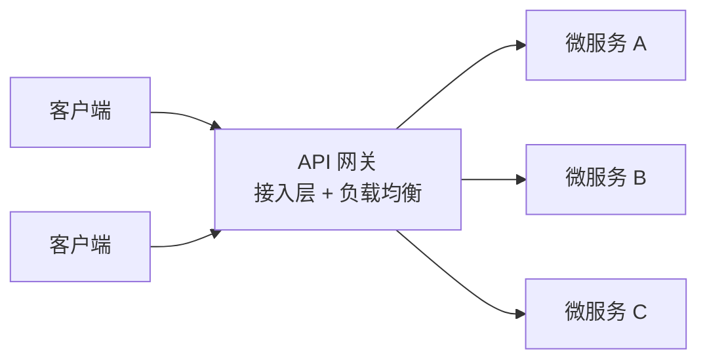
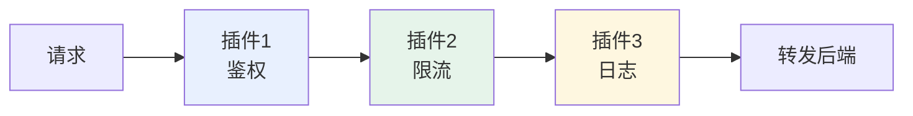
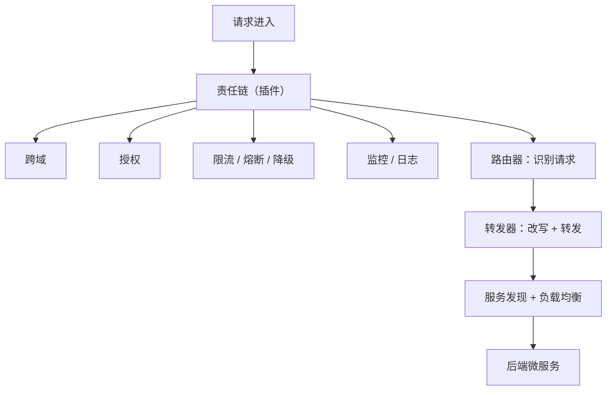

# Kubernetes 认证考点: 从设计模式角度理解 API 网关 —— 五个模式与两组能力

把网关当"转发请求的东西"理解不了它为什么这么重要，把它当"一组设计模式的组合"就通了。

结论：**API 网关既是服务接入层、也是服务调用的负载均衡器。换一个角度看，它身上能套出五个设计模式：① **代理模式**（调用方只认代理对象，后面成千上万个微服务怎么部署、怎么访问它都不用知道）；② **外观模式**（对外提供一致的高层接口、隐藏后端复杂度 —— 对外支持 HTTP/HTTPS、客户端可走 HTTP/1.0/1.1/2.0，网关一律转成 HTTP/2.0 打后端，跨域授权也在这里统一封装）；③ **中介者模式**（像代理模式但少了"控制点"）；前三个是**结构型模式**。④ **责任链模式**（多个插件串成接收者链条，按配置顺序执行，每个插件只干自己的事）；⑤ **策略模式**（不同算法 = 不同行为，比如换负载均衡算法 = 换调用策略）；后两个是**行为型模式**。落到能力上就是两组：**基础能力（路由器识别 URI/header/query/body、转发器改写请求与响应 + 服务发现 + 负载均衡）与扩展能力（插件中间件：跨域、授权、监控、缓存、熔断、降级、限流…）。**

## 纲要

- 网关是什么
- 结构型三兄弟：代理 / 外观 / 中介者
- 行为型两兄弟：责任链 / 策略
- 基础能力：路由器 + 转发器 + 负载均衡
- 扩展能力：插件化的中间件
- 五个模式一张总图

## 网关是什么

**API 网关作为服务的接入层，作为服务调用的负载均衡器，它的作用是非常重要的。**



**这一节咱们换一个角度来了解 API 网关：先思考一下，在 API 网关服务中用到了哪些设计模式呢？为什么要这么用呢？**

## 结构型模式一：代理模式

**首先我们会想到代理模式，毕竟 API 网关也经常被叫做代理服务，可能是七层代理，也可能是四层代理。**

**代理模式可以让调用方和服务方解耦：调用方只需要知道代理对象，而代理对象后面的成千上万个微服务是怎么部署和访问的，就不需要都知道了。通过代理对象可以简化调用的访问方式，也可以通过代理对象来增强对后端微服务的控制。**

```text
代理模式在网关里
调用方 ──► [代理对象 = API 网关] ──► 后端 A/B/C...（成千上万个）
调用方只需要知道：网关地址
调用方不需要知道：哪些实例活着、在哪、多少副本、什么版本

代理对象带来两个收益
├── ① 简化：访问的入口收敛成一个
└── ② 增强：可以在代理层加强对后端的控制（路由、灰度、熔断…）
```

> 四层（L4）代理转发的是 TCP/UDP 流，快但不看内容；七层（L7）代理看得懂 HTTP/gRPC，才能做路径路由、header 改写、协议转换。

## 结构型模式二：外观模式

**还有就是外观模式，它和代理模式很像，都可以对服务解耦、都可以简化服务间的访问；但是外观模式会隐藏后端服务的复杂度，提供一个一致的界面定义、一个高层的接口，让后端服务更强、更容易使用。**

**比如网关对外既要支持 HTTP 协议，又要支持 HTTPS 协议，但是后端服务却只需要支持 HTTP 就可以 —— 这里通过网关扩展了后端服务，好像后端服务也都支持了 HTTPS 协议。**

**另外，客户端调用网关可以是 HTTP 1.0、1.1、2.0 协议的任意一种，但是网关调用后端服务都会使用性能更好的 HTTP 2.0 —— 这里通过网关保证了多协议的支持，同时又增强了后端服务的网络性能。还有像跨域、授权等能力，也可以在网关这里做统一的封装，调用方看到的接口都是一样的，所有的后端服务都可以享受到外观模式。**

| 场景 | 对端 | 后端只需 |
| --- | --- | --- |
| 协议加密 | 网关对外支持 **HTTP + HTTPS** | 只支持 HTTP（HTTPS 由网关终止） |
| 协议版本 | 客户端可走 **1.0 / 1.1 / 2.0** | 统一用 **HTTP/2.0**（性能更好） |
| 跨域与授权 | **在网关统一封装**，调用方看到接口一致 | 所有后端都能白嫖这一层 |

> **外观模式的本质：在外围加一层"统一门面"，把复杂度挡在门后面，对外只暴露一个简单一致的接口。**

## 结构型模式三：中介者模式

**跟前面的三个（原文此处列出三个结构型）都属于结构型模式，中介者模式和代理模式更像，只是缺少代理对象的控制点。**

```text
代理模式 vs 中介者模式
├── 代理模式：替代、控制、增强（"我来替你干，而且我能管住你"）
└── 中介者模式：协调、收敛（"我把各方串起来，但不替你做决定"）
    ** 网关最接近中介者：把客户端与一堆后端协调成一条稳定的调用路径
```

## 行为型模式四：责任链模式

**折叠链（责任链）模式是在网关中配置多个插件作为请求接收者对象的一个链条，然后根据配置的顺序来执行插件一、插件二、插件三；在责任链中的各个插件只需要完成自己的特定任务就好了。**



```text
责任链的三个要点
├── ① 链条：多个插件 = 多个接收者，串成一条链
├── ② 顺序：按配置的顺序执行（顺序错了，行为就变了）
│   例：鉴权必须在限流前面 —— 否则没登录的人也能把限流打满
└── ③ 职责单一：每个插件只完成自己的特定任务
```

> 这条"每个插件只干一件事"是网关插件体系能扩展的前提：**你不改核心转发逻辑，只往链上挂处理器。**

## 行为型模式五：策略模式

**策略模式根据不同的算法实现，可以表现不一样的行为。比如，选择不同的负载均衡算法实现，就可以在请求时执行不同的调用策略。**

```text
策略模式在网关里
同一个「选后端实例」的动作，换一份算法 = 换一种行为
├── 轮询 Round Robin
├── 加权轮询（按实例规格)
├── 随机 + 权重
├── 一致性哈希（同 key 落同实例，适合有状态/本地缓存)
└── 最少连接（把请求给最闲的)
** 这就是「策略模式」：算法可替换，接口不变
```

## 两组能力

**API 网关肯定是离不开它的基础能力：路由器和转发器，另外就是负载均衡能力。**

### 基础能力：路由器 + 转发器 + 负载均衡

**路由器可以根据配置识别特定的请求 —— 可以识别特定的 URI 路径，可以识别特定的 header 头信息，可以识别请求的 query，甚至是 body 内容。而转发器可以根据配置，把一个请求二次包装后，转发给特定的后端服务。**

| 组件 | 干什么 | 细节 |
| --- | --- | --- |
| **路由器** | 识别请求 → 匹配规则 | 按 **URI 路径 / header / query / 甚至 body** 来识别 |
| **转发器** | 二次包装后转发给特定后端 | **可以改请求**：域名、路径、header、query、甚至 body；**也可以改响应**：增加 header、甚至直接改 body |
| **负载均衡** | 从多个实例里选一个 | 依赖**服务发现**从注册中心拿到微服务信息，再按负载均衡算法调用某个后端实例 |

```text
转发器能改的东西（记住这张表就够了）
请求方向：host / path / header / query / body
响应方向：加 header / 改 body / 直接短路返回（静态响应）
```

### 扩展能力：插件化的中间件

**API 网关除了基础能力，更加让人期待的是它的扩展能力，也就是中间件能力 —— 一个能够自定义插件来实现更多能力的 API 网关才是一个强大的网关。**

**比如：跨域、授权、监控、负载均衡、缓存、熔断、降级、限流、请求分辨和管理、静态响应处理等等。有些 API 网关已经内置了很多插件，有些则需要自己来二次开发。**

```text
网关的中间件清单
├── 安全类：授权鉴权、跨域 CORS、认证、签名校验
├── 稳定性：熔断、降级、限流、重试、超时
├── 性能类：缓存、静态响应处理、压缩
└── 可观测：监控、日志、链路埋点
```



## 五个模式一张总图

```text
API 网关 = 结构型 3 个 + 行为型 2 个

结构型（管"怎么把调用方和后端接起来"）
├── 代理模式   调用方只认代理，后端部署变化对调用方透明
├── 外观模式   对外一致接口，隐藏后端复杂度（协议收敛、统一封装）
└── 中介者模式 协调客户端与一堆后端，收敛成一个稳定入口

行为型（管"请求在网关里怎么被处理"）
├── 责任链模式 多个插件串成链，按序执行，各干各的
└── 策略模式   算法可替换（换负载均衡 = 换调用策略）
```

## API 速览

| 概念 | 类型 | 在网关里的作用 |
| --- | --- | --- |
| 代理模式 | 结构型 | 解耦调用方与后端，简化访问 + 增强控制 |
| 外观模式 | 结构型 | 提供一致高层接口，隐藏后端复杂度 |
| 中介者模式 | 结构型 | 协调各方，比代理少了控制点 |
| 责任链模式 | 行为型 | 插件链条，按配置顺序执行 |
| 策略模式 | 行为型 | 算法可替换（负载均衡算法） |
| 路由器 | 基础能力 | 按 URI / header / query / body 识别请求 |
| 转发器 | 基础能力 | 二次包装请求并转发，可改请求与响应 |
| 服务发现 | 基础能力 | 从注册中心拿微服务信息 |
| 负载均衡 | 基础能力 | 按算法调用某个后端实例 |
| 插件中间件 | 扩展能力 | 跨域/授权/监控/缓存/熔断/降级/限流等 |

## Demo 示例

把五模式和两组能力对应到一张可落地的配置骨架上：

```yaml
apiVersion: v1
kind: ConfigMap
metadata:
  name: gateway-config
data:
  config.yaml: |
    # ① 代理模式 / 外观模式：对外一个入口，协议到后端统一收敛
    listen:
      http: ":80"
      https: ":443"
      # 对外同时支持 HTTP+HTTPS，后端只跑 HTTP（HTTPS 在网关终止）
      protocol_upgrade:
        client: [http/1.0, http/1.1, http/2.0]
        backend: http/2

    # ② 路由器：识别特定请求（URI / header / query）
    router:
      - name: user-api
        match:
          uri:
            prefix: /api/user
          headers:
            - key: Authorization
              exists: true
        backend: user-service

    # ③ 转发器：改写请求与响应
    forwarder:
      request:
        setHeaders: { X-Gateway: "v1" }
        rewritePath: "/api/user(/.*)? => /v1$1"
        stripQuery: ["token"]
      response:
        setHeaders: { X-Frame-Options: "DENY" }

    # ④ 责任链：插件按序执行（鉴权在前，限流在后）
    chain:
      - name: cors          # 跨域
      - name: auth          # 授权
      - name: rate_limit    # 限流
      - name: metrics       # 监控 / 日志
      - name: circuit_breaker  # 熔断降级

    # ⑤ 策略模式：负载均衡算法可替换
    loadBalancer:
      strategy: least_conn        # round_robin | weighted | least_conn | chash
      discovery: registry         # 从注册中心获取微服务实例
```

自查表（对着这五条数一数你的网关有没有）：

```bash
# ① 代理：调用方是不是只认一个入口？
#    curl 一次网关地址，确认没暴露任何后端 Pod IP / Service ClusterIP

# ② 外观：协议收敛了吗？
# 先给变量赋值，例如：GW=10.0.0.10
curl -I http://$GW/api/user                 # 客户端 HTTP/1.1
curl --http2 -I http://$GW/api/user         # 客户端 HTTP/2
# 两种都该 200，且后端看到的统一是 HTTP/2

# ③ 中介者：新增一个后端服务，调用方要不要改代码？ → 不该

# ④ 责任链：随便禁掉一个插件看链上行为是否变了
#    例：关掉 rate_limit → 同样的压测不再 429

# ⑤ 策略：把 strategy 从 least_conn 换成 round_robin
#    观察后端实例的 QPS 分布是否从"倾斜"变成"均匀"
```

## 总结

理解网关最快的方式，是把这五个模式当成五把钥匙：

1. **代理模式** —— 网关就是那个"代理对象"，**调用方只认它，后面成千上万个微服务怎么部署怎么访问，调用方一律不用知道**；代理既能**简化访问方式**，也能**增强对后端的控制**；网关可以是四层代理也可以是七层代理；
2. **外观模式** —— 和代理很像，但更强调**隐藏后端复杂度、提供一致的高层接口**；三个经典例子：**对外 HTTP+HTTPS / 后端只需 HTTP；客户端 1.0/1.1/2.0 / 后端统一 HTTP/2.0；跨域与授权在网关统一封装**；
3. **中介者模式** —— 和代理更像，但**缺了代理对象的控制点**，作用是协调与收敛；
4. **前三个是结构型，后两个是行为型** —— 这个分类本身就是考点；
5. **责任链模式** —— 多个插件串成接收者链条，**按配置顺序执行（插件一、二、三）**，**每个插件只完成自己的特定任务**；
6. **策略模式** —— 不同算法表现不同行为，**换负载均衡算法就是换调用策略**；
7. **基础能力两件套**：**路由器**（按 URI / header / query / **甚至 body** 识别请求）+ **转发器**（二次包装转发，能改请求与响应的 header/body）+ **服务发现与负载均衡**（从注册中心拿信息、按算法选实例）；
8. **扩展能力才是网关的胜负手** —— **跨域、授权、监控、负载均衡、缓存、熔断、降级、限流、请求分辨和管理、静态响应处理**；**能自定义插件的网关才叫强大网关**，有些内置、有些要自己二次开发。

