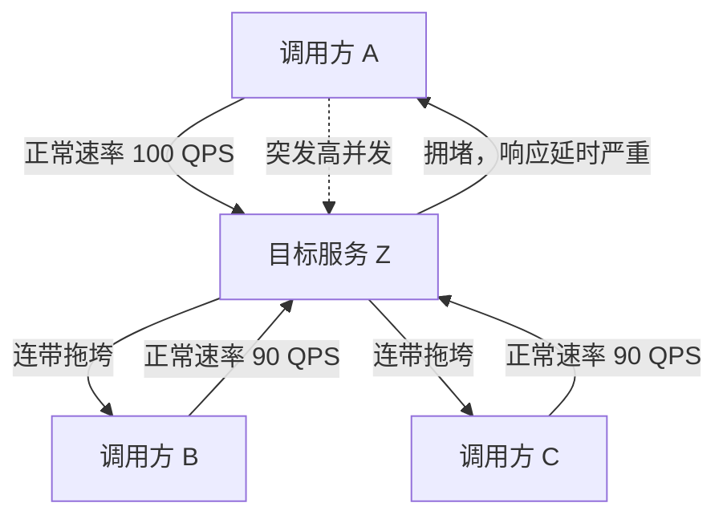
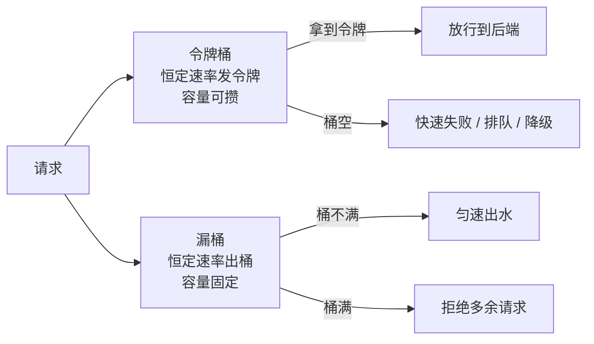
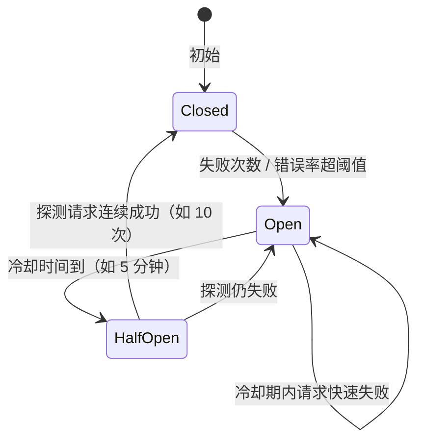

# Kubernetes 认证考点: 服务调用的限频、限流、降级与熔断 —— 五种自保护手段

线上环境里的服务调用，总会有意外：目标服务出 bug、性能与并发能力断崖下降，调用方还照常猛打，结果不只是目标服务立刻不可用，**调用方自己也会被一堆慢请求拖垮**；更常见的是运营推广一个活动，后端根本没提前知道，流量暴涨直接把服务冲垮。所以调用方不能只会"调"，还得会"自保"。

结论：**调用方主动自保一共五种手段 —— ① 超时（调用方主动断连接）；② 限流（限制请求的最大并发数）；③ 熔断（目标服务大量异常时快速拒绝，不再调用它）；④ 降级（比熔断更友好地给一个兜底响应）；⑤ 隔离（避免 A 的高并发打崩目标服务后波及 B、C）。** 这一篇重点落在**限频、限流、降级、熔断**的算法与方法上。

## 纲要

- 为什么要自保：两个真实场景
- 五种手段：超时 / 限流 / 熔断 / 降级 / 隔离
- 限频与限流的区别（以及那三个面试题）
- 限流算法：固定窗口 / 滑动窗口 / 令牌桶 / 漏桶
- 降级方法：读旧数据 / PlanB / 默认值 / 其他五种
- 熔断三状态与触发、恢复条件
- 一张总图：调用方的一个请求要过哪几关

## 为什么要自保：两个真实场景

服务治理不是理论问题，是**被事故逼出来的**。



场景一：**目标服务有 bug 或性能暴跌**。调用方没设超时，请求就一直挂着等 TCP 连接，连接数越积越多，资源开销越来越大，最后**调用方和目标服务一起崩溃**。

场景二：**活动推广带来的突发流量**。后端服务没有对应措施，流量峰值直接压过来。

区分清楚一件事：**凡是"调用方做出的决定"，都发生在调用方进程里，不需要改目标服务一行代码** —— 这也是这五种手段能救你的前提。

## 五种手段：超时 / 限流 / 熔断 / 降级 / 隔离

| 手段 | 作用 | 典型配置 | 代价 |
| --- | --- | --- | --- |
| **超时 timeout** | 调用方主动中断请求的连接 | 按目标服务预估延时设 TCP 超时，例如接口 100ms 内返回 → 设 500ms 或 1s | 什么都不配 = 无限等待 |
| **限流 rate limit** | 限制**请求的最大并发数 / 频次** | 目标服务最大 1000 QPS，就不让它超过这个数进来 | 超出的请求要快速失败或排队 |
| **熔断 circuit breaker** | 某时间段内目标服务大量异常，就**暂时不再调用它**，请求快速返回 | 错误率 / 连续错误数阈值 + 熔断窗口 | 熔断期间功能确实不可用（快速失败） |
| **降级 fallback** | 目标服务异常时**返回友好兜底**，比熔断温和 | 默认值 / 旧数据 / PlanB | 结果不完美，实现有难度 |
| **隔离 isolation** | 调用方 A/B/C 都调目标服务 Z，A 的突发流量不能波及 B、C | 线程池 / 信号量 / 连接池分别计数 | 资源占用翻倍 |

关键点：**熔断是降级的特殊形式 —— 简单粗暴，直接停止调用；过一段时间又放一小部分请求进来探测后端是否恢复**。所以熔断比降级简单，但它"粗暴"，用户体验更差。

## 限频与限流的区别（以及三个面试题）

先看这两句话差在哪：

- **限频**：限制的是**时间窗口内的频次**，比如"发短信 ≤ 100 次/小时、≤ 1000 次/24 小时"，**配额是配额，用完就没了，不能挪到下一秒去用**；
- **限流**：限制的是**同时并发数**，比如"目标服务最大撑 10000 QPS"、"接口并发配额 10 次/秒"，**没用不完的部分可以留给突发流量用**。

所以面试题三（配额 10 次/秒、用不完的能给突发流量用）**答案就是令牌桶**：桶里有 10 个令牌时突发能一次打 10 个，没用时令牌会攒着（攒到容量上限），突发时就能借。



### 四种限流算法怎么选

| 算法 | 思路 | 优点 | 缺点 | 适用 |
| --- | --- | --- | --- | --- |
| **固定窗口计数** | 每 1s 一个窗口，计数器 +1 到阈值就拒 | 实现最简单 | 窗口边界可被打满（临界期请求数翻倍） | 粗粒度限频，如短信条数 |
| **滑动窗口 / 滑动日志** | 记录每个请求时间戳，统计最近 1s 数量 | 边界问题弱化 | 存时间戳占内存 | 精度要求高的限频 |
| **令牌桶** | 恒定速率往桶里放令牌，请求取令牌，容量可攒 | **允许突发**，支持"配额用不完留给突发" | 实现稍复杂 | 接口限流、对外配额 |
| **漏桶** | 请求进桶，恒定速率出水 | 输出**匀速**，削峰效果最好 | 不支持突发（本来也不该要） | 保护下游均匀负载 |

一句话记忆：**令牌桶管"能不能突发"，漏桶管"出得匀不均匀"。**

限流放哪儿也得分清楚：

- **网关层限流**：面向客户端，防刷、保护整条链路；
- **服务自身限流**：保护自己（自己最多能吃 10000 QPS）；
- **调用方限流（客户端侧）**：调用方主动限制给某个下游的调用量，**隔离思想的第一层**。

## 降级方法：有总比没有好

降级的理念就一句：**有总比没有好，哪怕返回的结果不那么完美**。

```
服务端目录（降级手段一览）
├── 读旧数据
│   ├── 有备份数据 / 缓存数据就直接用
│   └── 旧数据虽然不是最新，也比空的强
├── Plan B
│   ├── 同一件事实现了多个方案
│   ├── 例：发布既可调 A 系统也可调 B 系统 → A 挂了切 B
│   └── 代价：开发量大，收益：可用性极高
├── 默认值
│   └── 最简单：降级开关打开，异常直接返回默认值
├── 放弃部分请求
│   └── 砍掉一部分请求，减少对后端的并发量
├── 降低质量
│   └── 跳过耗时、计算量大的逻辑，不要求实时算出全量结果
├── 提高参与门槛
│   └── 门槛高一点，进来的请求少一点
├── 反向过滤
│   └── 过滤一次太费劲 → 不过滤，直接返回全部内容
└── 补偿服务
    ├── 异常时先记日志，事后做补偿性操作
    └── 数据最终一致
```

降级几乎都是"在多种痛苦里选一种不那么痛的"。两个提醒：

1. **如果你的服务无法接受不完美结果，就别用降级；**
2. **如果降级实现太难或效果不好，也别硬降级** —— 为小概率异常兜太多底，没人感知得到，复杂度却实打实涨了。

## 熔断三状态与触发、恢复条件

熔断比降级简单，本质是**降级的特殊方法**：

- **Closed（关闭）**：正常放行，统计错误；
- **Open（打开）**：直接拒绝，不再调用目标服务；
- **Half-Open（半开）**：过一段时间**放行一小部分探测请求**，看后端是否恢复；成功了回到 Closed，失败则再 Open 一个周期。



触发条件和恢复条件要成对设计，课程里给的白盒版本：

| 阶段 | 规则（示例值） |
| --- | --- |
| **触发降级/熔断** | 1 分钟内服务超时（504/503 等）响应超过 100 次 |
| **首次恢复尝试** | 5 分钟后尝试连接 10 次请求到后端 |
| **恢复判定** | 10 次全部正常返回 → 恢复；只要有一次异常 → 继续保持降级/熔断 |
| **下次尝试** | 再等 5 分钟，再来一轮探测 |

还有一层容易忽略：**最简单的触发与恢复方式是手动**（运维改配置、开关降级），自动方式才需要上面这一整套规则。手动兜底 + 自动按规则恢复，是线上最稳的组合。

## 一张总图：一个请求要过哪几关

```
调用方进程（自保全部发生在这里，无需改目标服务）
├── 限频层   TokenBucket：10 tokens/s，容量 5   → 超了直接降级返回默认值
├── 隔离层   Semaphore：并发上限 3              → 超了快速失败
├── 熔断层   CircuitBreaker：Closed/Open/HalfOpen → Open 时快速失败
├── 超时层   context.WithTimeout(500 * time.Millisecond) → 到点主动断连接
└── 真正的 RPC 调用
    └── 目标服务 Z（被前面几层保护着）
```

落到代码上，四层是**串起来的短路径**：任何一层命中就直接返回，根本不往下走。这就是"调用方自保"的全部实现思路。

## API 速览

| 能力 | 典型接口 / 配置 | 语义 |
| --- | --- | --- |
| 令牌桶限频 | `NewTokenBucket(capacity, perToken)` / `Allow() bool` | 容量可攒、**允许突发**；取不到令牌即拒绝 |
| 漏桶限流 | `NewLeakyBucket(capacity, drainInterval)` / `Allow() bool` | 恒定速率出水，输出匀速，桶满拒绝 |
| 并发限流 | `NewSemaphore(maxConcurrent)` / `Acquire()` / `Release()` | 限制**同时并发数**，对应"限流"的并发语义 |
| 熔断器 | `Allow() bool` / `RecordOK()` / `RecordErr()` | 三状态；`RecordErr` 达阈值转 Open |
| 熔断配置 | `threshold=3`, `timeout=300ms`, `needOK=2` | 连续错 3 次熔断，冷却后探测 2 次成功才恢复 |
| 超时 | `context.WithTimeout(ctx, 500*time.Millisecond)` | 调用方主动中断，防止连接无限堆积 |
| 降级兜底 | `fallback(ctx) (Resp, error)` | 返回默认值 / 旧数据 / PlanB 结果 |
| 降级开关 | `degradeEnabled bool`（可动态下发） | 支持手动触发降级与手动恢复 |

## Demo 示例

下面这段用标准库把**限频 + 隔离 + 熔断 + 降级**串成一个调用方（无任何第三方依赖，可直接跑）：

```go
package main

import (
	"fmt"
	"strings"
	"sync"
	"sync/atomic"
	"time"
)

// ---------- 令牌桶：限频，容量可攒，允许突发 ----------
type TokenBucket struct {
	mu     sync.Mutex
	tokens float64
	cap    float64
	per    time.Duration // 产 1 个令牌需要多久
	last   time.Time
}

func NewTokenBucket(capacity float64, per time.Duration) *TokenBucket {
	return &TokenBucket{tokens: capacity, cap: capacity, per: per, last: time.Now()}
}

func (tb *TokenBucket) Allow() bool {
	tb.mu.Lock()
	defer tb.mu.Unlock()
	now := time.Now()
	tb.tokens += float64(now.Sub(tb.last)) / float64(tb.per)
	if tb.tokens > tb.cap {
		tb.tokens = tb.cap
	}
	tb.last = now
	if tb.tokens >= 1 {
		tb.tokens--
		return true
	}
	return false
}

// ---------- 信号量：隔离，限制并发数 ----------
type Semaphore struct{ sem chan struct{} }

func NewSemaphore(n int) *Semaphore { return &Semaphore{sem: make(chan struct{}, n)} }

func (s *Semaphore) Acquire() error {
	select {
	case s.sem <- struct{}{}:
		return nil
	default:
		return fmt.Errorf("concurrency limit reached")
	}
}

func (s *Semaphore) Release() { <-s.sem }

// ---------- 熔断器：Closed / Open / HalfOpen ----------
type State int32

const (
	StateClosed State = iota
	StateOpen
	StateHalfOpen
)

type CircuitBreaker struct {
	mu       sync.Mutex
	state    State
	fail     int
	threshold int
	lastFail time.Time
	timeout  time.Duration
	tryOK    int
	needOK   int
}

func NewCircuitBreaker(threshold int, timeout time.Duration, needOK int) *CircuitBreaker {
	return &CircuitBreaker{state: StateClosed, threshold: threshold, timeout: timeout, needOK: needOK}
}

func (cb *CircuitBreaker) Allow() bool {
	cb.mu.Lock()
	defer cb.mu.Unlock()
	switch cb.state {
	case StateClosed:
		return true
	case StateOpen:
		if time.Since(cb.lastFail) < cb.timeout {
			return false
		}
		cb.state, cb.tryOK = StateHalfOpen, 0 // 冷却结束，放探测请求进来
		return true
	default: // HalfOpen：只放行有限探测请求
		return true
	}
}

func (cb *CircuitBreaker) RecordOK() {
	cb.mu.Lock()
	defer cb.mu.Unlock()
	if cb.state != StateHalfOpen {
		return
	}
	cb.tryOK++
	if cb.tryOK >= cb.needOK {
		cb.state, cb.fail, cb.tryOK = StateClosed, 0, 0
	}
}

func (cb *CircuitBreaker) RecordErr() {
	cb.mu.Lock()
	defer cb.mu.Unlock()
	if cb.state == StateClosed {
		cb.fail++
		if cb.fail >= cb.threshold {
			cb.state, cb.lastFail = StateOpen, time.Now()
		}
		return
	}
	if cb.state == StateHalfOpen {
		cb.state, cb.lastFail, cb.tryOK = StateOpen, time.Now(), 0
	}
}

func (cb *CircuitBreaker) State() State { return cb.state }

func stateName(s State) string {
	switch s {
	case StateClosed:
		return "closed"
	case StateOpen:
		return "open"
	default:
		return "half-open"
	}
}

// ---------- 调用方：一次调用依次过限频 / 隔离 / 熔断 / 降级 ----------
type Client struct {
	tb  *TokenBucket
	lim *Semaphore
	cb  *CircuitBreaker
	err *int64 // 模拟下游异常计数
}

// Call 遵循"短路径"原则：任一层命中就直接返回兜底，绝不打到后端
func (c *Client) Call(name string) string {
	if !c.tb.Allow() {
		return fmt.Sprintf("[%s] 限频命中：降级返回默认值", name)
	}
	if err := c.lim.Acquire(); err != nil {
		return fmt.Sprintf("[%s] 并发超限：快速失败", name)
	}
	defer c.lim.Release()
	if !c.cb.Allow() {
		return fmt.Sprintf("[%s] 熔断中：快速失败", name)
	}
	atomic.AddInt64(c.err, 1)
	if atomic.LoadInt64(c.err)%3 == 0 { // 每 3 次里有 1 次下游异常
		c.cb.RecordErr()
		return fmt.Sprintf("[%s] 下游异常", name)
	}
	c.cb.RecordOK()
	return fmt.Sprintf("[%s] 正常返回", name)
}

func main() {
	tb := NewTokenBucket(5, 200*time.Millisecond) // 5 个令牌 + 每 200ms 补 1 个
	lim := NewSemaphore(3)                        // 最大并发 3
	cb := NewCircuitBreaker(3, 300*time.Millisecond, 2)
	c := &Client{tb: tb, lim: lim, cb: cb, err: new(int64)}

	var wg sync.WaitGroup
	var normal, limited int64
	for i := 0; i < 30; i++ {
		wg.Add(1)
		go func(i int) {
			defer wg.Done()
			r := c.Call(fmt.Sprintf("svc-%02d", i))
			switch {
			case strings.HasPrefix(r, "正常"):
				atomic.AddInt64(&normal, 1)
			case strings.HasPrefix(r, "限频"):
				atomic.AddInt64(&limited, 1)
			}
		}(i)
	}
	wg.Wait()

	fmt.Printf("30 次调用：正常 %d，限频降级 %d，熔断/并发拒绝 %d\n", normal, limited, 30-normal-limited)
	fmt.Printf("熔断器最终状态：%s\n", stateName(c.cb.State()))
}
```

跑起来会看到：**前 5 个请求直接通过（令牌桶容量 5，允许突发），之后 200ms 才补 1 个令牌**；并发到 3 就走"并发超限"；下游每 3 次错 1 次，累计 3 次失败后熔断器转 Open，后续请求直接"熔断中：快速失败"，冷却 300ms 后转 HalfOpen 放探测请求，连续成功 2 次才回 Closed。

调参观察点（实验时逐项改）：

```bash
go run main.go

# 实验 1：把 NewTokenBucket(5, 200ms) 改成 (1, 1000ms) → 几乎全走限频降级
# 实验 2：把 NewSemaphore(3) 改成 (100) → 并发层不再拒绝，观察熔断是否被点燃得更早
# 实验 3：把 threshold 从 3 提到 30 → 30 个请求里根本熔断不起来
# 实验 4：把 err%3 改成 err%100 → 熔断永不触发，说明"触发条件"是熔断能否生效的前提
```

## 总结

1. **自保一共五种手段**：**超时**（调用方主动断连接，不设就会把所有请求挂死、连接数堆到崩）、**限流**（限制最大并发/频次）、**熔断**（目标服务大量异常时不再调用它）、**降级**（更友好的兜底）、**隔离**（A 的突发不能波及 B 和 C）；
2. **限频 ≠ 限流**：**限频限制时间窗口内的频次**（短信 100/小时、1000/24 小时，**用不完不能挪到下个窗口**）；**限流限制并发数**（接口配额 10 次/秒，**用不完的可以留给突发流量**——这正是令牌桶的命门）；
3. **四种算法**：**固定窗口**最简单但临界会翻倍、**滑动窗口**弱化边界、**令牌桶**允许突发、**漏桶**输出匀速；**令牌桶管突发，漏桶管均匀**；
4. **降级八法**：**读旧数据、PlanB、默认值、放弃部分请求、降低质量、提高参与门槛、反向过滤、补偿服务**；理念是"**有总比没有好**"，但**不能接受不完美结果就别降级，实现太难效果不好也别硬降级**；
5. **熔断是降级的特殊形式**：**简单粗暴直接停止调用，冷却后再放一小部分请求探测**；三状态 **Closed → Open → HalfOpen → Closed**；
6. **触发与恢复要成对设计**：课程白盒版是"1 分钟内超时/5xx 响应超 100 次触发 → 5 分钟后尝试 10 次 → 全成功才恢复、有失败就继续熔断 → 再等 5 分钟重试"；
7. **手动触发最稳**：自动规则之外，留一个运维可手改的**降级开关**，出事第一时间人工兜底，再交给自动规则恢复；
8. **四层串成短路径**：**限频 → 隔离 → 熔断 → 超时 → 真调用**，任何一层命中直接返回兜底，这就是调用方自保的完整实现。

