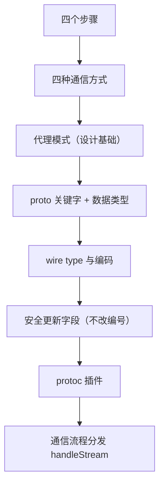

# gRPC 本章小结

这一章我们深入学习了 gRPC。本章小结换一种形式：**不再重复性总结，而是全部以提问的方式，让大家自己来思考和总结**。下面把课程里抛出的十几个问题整理出来，并附上对应的复习要点（答案），方便对照自测 —— 真正学会的标志，是能不翻书地把这些问题答出来。

## 纲要

- 用 gRPC 的四个步骤（自测）
- 客户端与服务端通信的四种方式
- 代理模式的作用与分类
- protobuf 关键字与数据类型
- wire type 与具体类型的编码
- 安全更新字段：为什么不能改字段编号
- protoc 插件与通信流程分发

## 本章问题清单与复习要点

| 问题（来自课程小结） | 复习要点（自测答案） |
| --- | --- |
| 使用 gRPC 的四个步骤是什么？ | ① 写 `.proto`（定义 service + message）；② `protoc` 生成桩代码；③ 服务端实现接口并 `Serve`；④ 客户端 `Dial` + 调用 |
| gRPC 客户端与服务端通信的四种方式？ | 一元 RPC（unary）、服务端流式、客户端流式、双向流式（四种组合） |
| 代理模式的作用？可分哪两类？ | 为目标对象提供代理以控制访问/增强能力；静态代理、动态代理 |
| proto 文件里还记得哪些关键字？ | `syntax` / `package` / `service` / `rpc` / `message` / `repeated` / `enum` / `import` 等 |
| protobuf 有哪些数据类型？ | 标量（`int32/64`、`uint32/64`、`sint32/64`、`fixed32/64`、`float`、`double`、`bool`、`string`、`bytes`）与 `message`、`enum`、`map` 等 |
| wire type 包括哪几种？ | 共六种：varint(0)、fixed64(1)、len(2)、start group(3)、end group(4)、fixed32(5)；group 已弃用 |
| varint 类型怎么编码？ | 可变字节长度，每字节最高位=续行位、低 7 位=数据；小数字只占 1 字节 |
| message / double 类型怎么编码？ | 都是 key + 长度 + 内容（len 类型）；double 是 fixed64，占 8 字节 |
| 安全更新字段为什么不能改编号？ | 字段编号是序列化后的"寻址键"，改了旧数据就解错字段；新增用新编号 |
| 哪些类型兼容、哪些不兼容？ | `int32/int64/uint32/uint64` 互兼容；`sint32/64` 互兼容但和 `int32` 不兼容；`string/bytes/message` 兼容 |
| protoc 插件怎么实现的？ | 实现 `protoc` 的插件协议（CodeGenerator 接口），读 `CodeGeneratorRequest` 写 `CodeGeneratorResponse` |
| 服务端怎样把请求转发给用户定义的 RPC 方法？ | `Serve` 的 for 循环 → `handleRawConn`（goroutine）→ `serveStreams` → `handleStream` 解析 service+method，查注册表分发 |

## 把问题串成一张复习地图



## 关键自测题展开

**问题一：使用 gRPC 的四个步骤**
定义 proto → 生成代码 → 服务端实现并启动 → 客户端建连调用。每一步都对应一个文件或一次 `protoc` / `grpc` 调用。

**问题三：代理模式的作用与两类**
代理模式为目标对象建立一个"代理"，在不改原对象的前提下做访问控制、增强（日志、限流、鉴权）。分**静态代理**（编译期写好代理类）和**动态代理**（运行期生成，gRPC 客户端的 stub 就是这类思想的体现）。

**问题七：具体到 varint 类型怎么编码**
每字节最高位表示"后面还有没有"，后 7 位是真实数据；数字越小字节越少。负数要先经 **zigzag** 折成正数再 varint，否则会撑满 10 字节。

**问题十一：服务端如何把请求转发到用户定义的 RPC 方法**
这是本章源码学习的落点：`Serve` 里有个监听连接的 for 循环，每来一个连接起协程交给 `handleRawConn` → `serveStreams` → `handleStream`；`handleStream` 从 stream 解析出 `service`（包名+服务名）和 `method`，再去注册表（unary 列表 / streams 列表）里找，找不到走 `unknownStream` 兜底。

```dir
gRPC 一章的知识落点
├── 会用
│   ├── 四个步骤：定义 / 生成 / 实现 / 调用
│   └── 四种通信：unary / 服务端流 / 客户端流 / 双向流
├── 懂设计
│   ├── 代理模式（静态 / 动态）
│   └── 三组成：HTTP/2 + protobuf + 代码生成
└── 读源码
    ├── proto 关键字、数据类型、wire type
    ├── 编码：key+value、varint、zigzag、len
    ├── 安全更新字段（不改编号）
    └── 通信分发：handleStream 查注册表
```dir

## 总结

1. **本章以"提问式小结"收尾**：把内容交还给你自己，能用问题串起全章才是真学会；
2. **四个步骤要背**：定义 proto → 生成代码 → 服务端实现并 `Serve` → 客户端 `Dial` 调用；
3. **四种通信方式**：一元、服务端流式、客户端流式、双向流式；
4. **代理模式**：作用是为目标对象建代理以控制/增强，分静态与动态两类，是理解 gRPC stub 的基础；
5. **proto 关键字与数据类型**：记住 `service`/`rpc`/`message`/`repeated`/`enum`/`import` 等关键字，以及标量、message、enum、map 等类型；
6. **wire type 六种**：varint / fixed64 / len / group(弃用) / fixed32，决定编码形态；
7. **编码细节**：varint 变长、zigzag 折负数、message 与 double 都是 len 类型（key+长度+内容）；
8. **安全更新字段**：**不能改字段编号**（编号是序列化的寻址键），新增用新唯一编号，类型不兼容也用新增字段；
9. **protoc 插件**：实现插件协议读请求、写响应即可自定义代码生成；
10. **通信分发**：服务端 `Serve` 的 for 循环 → `handleRawConn` → `serveStreams` → `handleStream`，解析 service+method 后查注册表分发，找不到走 `unknownStream` 兜底；
11. **本章内容远多于这十几个问题**：考试可能以变体方式提出更多类似问题，建议把上面每一条都能脱稿答出。
