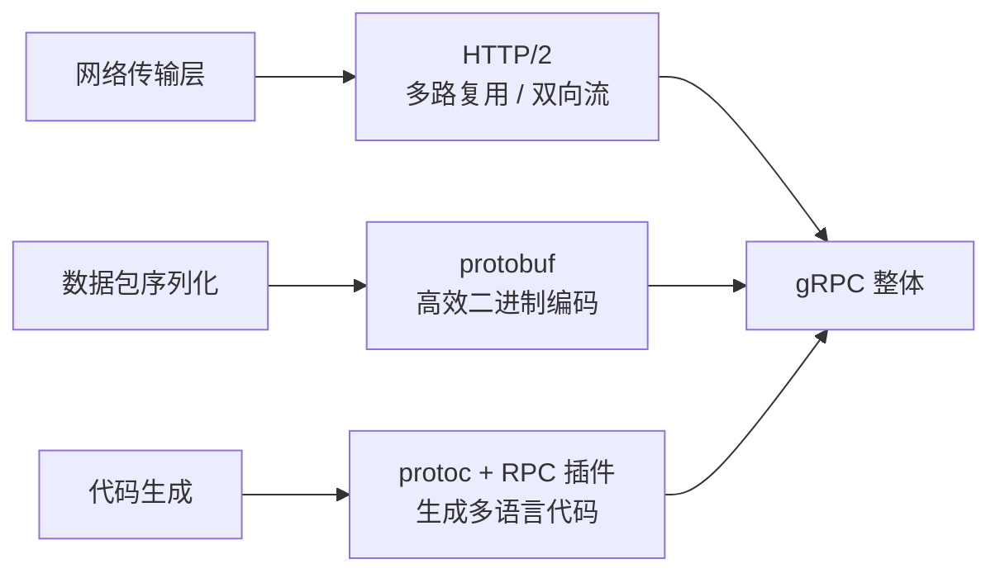
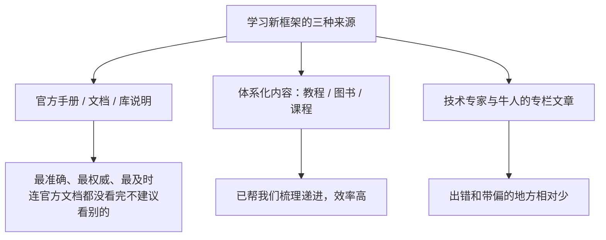

# gRPC 本章导学

这一章我们要深入学习 gRPC。很多同学应该了解过 gRPC，它的功能优点很突出：**高兼容性、高性能、使用简单**；支持的通讯方式上，**客户端和服务端都支持一次性请求和应答，也都支持流式请求和应答**。一次性请求和应答很像 HTTP 中的一次请求和响应，而流式请求和应答很像 WebSocket 的双向全双工通信。

要深入学习 gRPC，就要先理解它的三个组成部分：**网络传输层用 HTTP/2；数据包序列化协议用 protobuf；代码生成实现了 protoc 及 RPC 插件，可以生成多种语言代码**。本章会带大家把这三块吃透。

## 纲要

- gRPC 的三大优点与两种通讯方式
- gRPC 的三个组成部分：HTTP/2 + protobuf + 代码生成
- 本章学习路线：小例子 → 代理模式 → 源码学习
- 为什么要先学代理模式
- 三种推荐的知识来源
- 一张学习地图

## gRPC 的三个组成部分



一句话：**gRPC = HTTP/2（传输）+ protobuf（序列化）+ 插件生成的桩代码（调用封装）**。理解这三块，再看源码时就知道每一层在干什么。

## 本章学习路线

本章内容按"由浅入深、先会用再读源码"的顺序排布：

| 环节 | 内容 | 目的 |
| --- | --- | --- |
| **第一个 gRPC 小例子** | 通过实例讲解 | 更快了解 gRPC 的使用，知道实现一个 gRPC 服务需要哪几步 |
| **代理模式** | 暂时离开 gRPC，看设计模式 | 熟练掌握现有设计模式对学习别人系统、自己做系统设计都有极大帮助 |
| **从源码学习 gRPC 设计** | 覆盖三个组成部分 | 完整知道连接建立、请求响应执行、数据包序列化反序列化、代码怎么生成的 |

## 为什么要先学代理模式

代理模式（Proxy）是一个**比较常用、也容易理解**的设计模式。不论是自己做系统设计，还是学习别人的系统，熟练掌握现有设计模式都会有极大帮助。gRPC 的客户端的 stub、服务端的拦截器，本质上都是代理思想的体现 —— 希望通过代理模式的学习，帮助大家更好地理解和学习 gRPC 内部的其他设计模式。

## 三种推荐的知识来源

在开始具体内容前，先分享一套学习方法。自学一个新东西（比如 gRPC，或者后面用到的 Docker、Kubernetes、Prometheus 等开源组件），有三种比较好的知识来源：



1. **官方手册/文档/库说明（最推荐）**：尤其是开源项目，决定它能否流行，文档建设非常重要。看官方文档是最准确、最权威、最及时的，**连官方文档都没看完，不建议去看其他内容**；
2. **体系化内容**：教程、图书、课程，不论电子还是实体、线上还是线下。系统化内容已经帮我们全面梳理过，且递进式、深入浅出，学起来效率更高；
3. **技术专家与牛人的专栏文章**：现在内容太多，充斥大量无效甚至错误的内容，牛人专栏至少出错和带偏的地方会少一点。

> 大家用得最多的"搜索"并不是不行，但对于一个全新内容，想全面深入学习，靠碎片化搜索很难快速掌握。本课程老师的个人手记，本身就属于上面第二、第三种来源。建议把 gRPC、Docker、Kubernetes、Prometheus 这些组件，都试着从这三个来源系统学一遍。

## 带着问题去学

学完上面三部分，你应该能完整回答：**服务怎么创建的、连接和请求响应怎么执行的、数据包怎么序列化和反序列化的、各种代码怎么生成的**。带着这些问题边学边想，比单向听讲效果好得多。

```dir
本章知识地图（建议照着走一遍）
├── 1. 跑通第一个 gRPC 例子
│   ├── 写 .proto（service + message）
│   ├── protoc 生成 pb.go / pb_grpc.pb.go
│   └── 起 server、调 client，确认能通
├── 2. 补设计模式：代理模式
│   ├── 静态代理 / 动态代理（gRPC stub 即代理）
│   └── 体会"封装底层、暴露简单接口"的思想
└── 3. 读源码，串起三块
    ├── 网络传输：HTTP/2 连接与流
    ├── 序列化：protobuf 编解码
    └── 代码生成：protoc 插件生成的桩与分发
```dir

## 总结

1. **gRPC 的优点**：**高兼容性、高性能、使用简单**；通讯方式上**客户端和服务端都支持一次性请求/应答与流式请求/应答**，前者像 HTTP 一次请求响应，后者像 WebSocket 双向全双工；
2. **gRPC 的三大组成**：**网络传输层用 HTTP/2、数据包序列化用 protobuf、代码生成用 protoc 及 RPC 插件生成多语言代码**；
3. **本章路线**：先跑通**第一个 gRPC 小例子**知道要几步，再抽身学**代理模式**以便更好读系统，最后**从源码学习 gRPC 设计**，覆盖传输、序列化、插件三块；
4. **代理模式的意义**：常用且好懂，是理解 gRPC 客户端 stub、服务端拦截器的基础，也能帮助理解其他设计模式；
5. **学习方法优先序**：**官方文档最权威最及时（首选）→ 体系化教程/课程效率高 → 专家牛人专栏出错少**；碎片化搜索不适合用来"全面深入"学新东西；
6. **学习姿态**：带着"服务怎么建、连接怎么连、包怎么编解码、代码怎么生成"这几个问题去学，效果远好于单向听讲。
