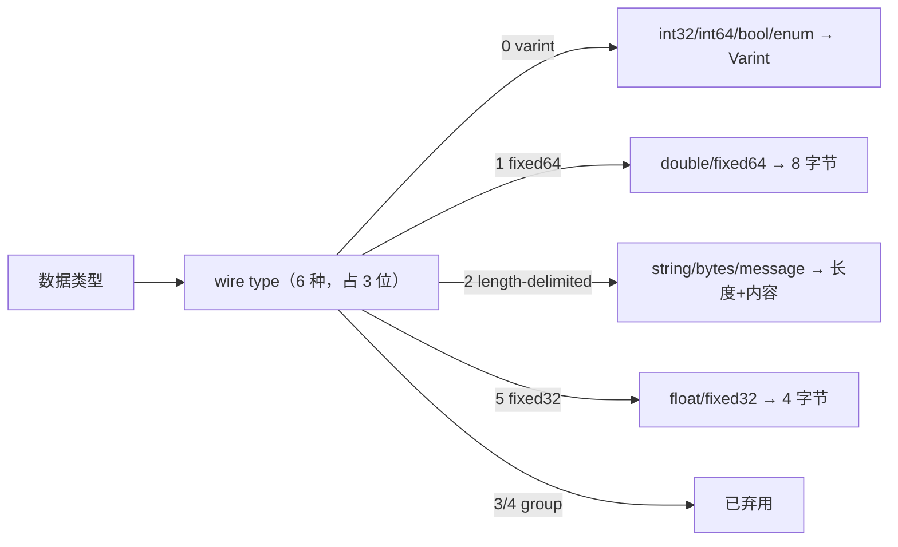
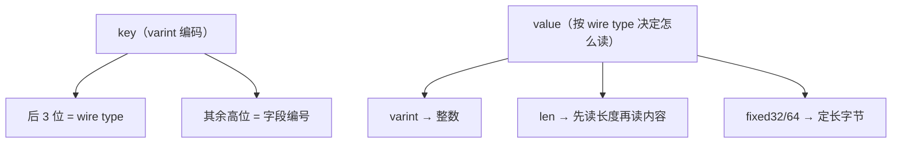

# proto3 使用及编解码原理介绍（一）

聊编解码之前，有个前置知识必须知道：**数据类型会决定数据的编码方式**。protobuf 总共**只有六种数据类型（wire type），需要占用三位来存储** —— 理解这"六选三比特"，整个编码表就通了。

结论：**编码 = key + value，key 里装"字段编号 + 数据类型"（数据类型固定放在 key 的最后三位），value 就是实际数据；数字类用 Varint 可变字节长度编码（每字节第一位表示后面还有没有、后七位是真实数据）；负数用 zigzag 算法折成正数再 Varint；字符串与复合消息都是 `长度 + 内容`；字段顺序无序、两次序列化字节可能不同；无法识别的未知字段会被保留在序列化输出里（这是字段兼容的关键手段）。**

## 纲要

- wire type：只有六种，占三位
- 数字类：Varint 变长编码
- 有符号整数：zigzag 为什么存在
- 消息编码 = key + value
- 字符串 / 浮点 / 复合消息的编码
- 字段顺序无序与未知字段保留
- 安全更新字段（下篇预告）

## wire type：只有六种，占三位

**wire type 这个类型会决定数据的编码方式，总共只有六种，需要占用三位来存储**，分别是：

| wire type | 值 | 覆盖的类型 | 编码形态 |
| --- | --- | --- | --- |
| **varint** | 0 | **数字类型**、布尔型、枚举型（`int32`/`int64`/`bool`/`enum`） | **可变字节长度编码** |
| **i64 / fixed64** | 1 | **64 位长度**（`fixed64`/`sfixed64`/`double`） | **固定 8 字节** |
| **len** | 2 | **字符串、字节、消息类型** | **长度 + 内容**（L-V） |
| **i32 / fixed32** | 5 | **32 位长度**（`fixed32`/`sfixed32`/`float`） | **固定 4 字节** |
| **start group / end group** | 3 / 4 | **已弃用，不用管了** | — |

> 课程转写里把 wire type 念成了 `whereint` / `realtype` / `learn` / `startgroup` / `jnt`，把它们对回上表，编码过程就顺了。编码细节以**官方文档**为准，这里挑最常用的部分讲。



## 数字类：Varint 可变字节长度编码

**varint 是可变字节长度编码，用一个字节或者多个字节表示整数类型，更小的数占用更小的字节。**

**每个字节的第一位表示后续是否还有数字，后面的七位才是实际的数据**，这样就实现了可变长度 —— **没必要给数字 1、2、3 这类很小的数字也分配四个字节、八个字节**。

也就是说：**小数字 = 1 字节，大数字才逐字节堆上去（每字节最高位做续行标记）。**

## 有符号整数：zigzag 算法

**有符号整形使用 zigzag 算法去编码。**

**二进制表示数字时，正数首位是 0、负数首位是 1。如果把负数也当正数处理，那会是一个巨大的数字，varint 也就没优势了。所以这里用 zigzag 算法，把负数转化为一个正数 —— 这个算法可以把小的负数转化为小的正数，原理就是小的负数和小的正数一样，出现频率最高。**

```
zigzag 映射（n → n<<1 异或 n>>31）
  0 → 0        1 → 2       -1 → 1
  2 → 4       -2 → 3
```

没有 zigzag 时 `-1` 编码出来是 10 字节（0xff×9 + 0x01），用了之后变成 1 字节 `0x01` —— **这就是"小的负数和小正数一样高频"这句结论的落点**。

## 消息编码 = key + value

**消息编码包括两部分，分别是 key 和 value。value 就是实际的数据了；key 只包含字段编号和数据类型：字段编号在消息中是唯一的，所以就可以找到对应的字段；数据类型就是上面的 wire type，再用三个 bit（固定放在 key 这个数据的最后三位）—— 所以从 key 的字节中拿到最后三位就知道数据类型了，前面的其他数据就是字段编号了；数据类型知道了，value 的长度也就确定了，于是也就可以读取到完整的 value 数据了。**



一句话：**key 自带"字段编号 + 类型"，读到 key 就知道怎么切 value —— 协议完全自描述，所以 protobuf 不需要像 JSON 那样带字段名。**

## 字符串 / 浮点 / 复合消息的编码

| 类型 | 编码格式 | 依据 |
| --- | --- | --- |
| **字符串** | **key + 长度 + 字符串** | 从 key 知道 wire type 是长度类型，再往后就是内容长度，知道了长度就能读完 |
| **浮点（32/64 位）** | **key + 32 位 / 64 位长度的字节** | key 里的 wire type 是 `i32`/`i64`，于是确定后面数据是 4 字节还是 8 字节 |
| **复合结构（message）** | **和字符串一样：key + 长度 + 内容** | 复合消息的 wire type 也是长度类型 |

**复合结构消息，它的 wire type 也是长度类型（len），所以编码方式和字符串编码是一样的。**

## 字段顺序无序、未知字段保留

**关于字段顺序，它是无序的 —— 在 protobuf 定义中不要求有序，序列化之后也不保证有序。因此，对同一个消息进行两次序列化得到的二进制数据可能会有差异，原因就是字段顺序会变化。**

两个直接推论：

1. **别做字节级 diff 断言**：两次 `Marshal` 的字节不一定相同（校验/缓存别拿二进制当 key，要用结构体的规范化表示）；
2. **不会乱序出错**：读取是按 key 里的字段编号跳转，跟写顺序无关。

**关于未知字段：protobuf 中无法识别的字段，还是会保留在序列化输出中，这也是一种字段兼容的方法。** —— 老服务收到新客户端多带的字段，**不丢、原样带在输出里**，老服务再转发、或新服务升级回来解出来还是完整的。

## 自己实现一轮 key + value 编解码

把"varint + zigzag + 长度"跑通，protoimpl 生成的那些字节就不神秘了：

```go
package main

import "fmt"

const (
	wireVarint = 0
	wireLen    = 2
)

// varint：每字节最高位为续行位，低 7 位放数据
func putVarint(b []byte, x uint64) []byte {
	for x >= 0x80 {
		b = append(b, byte(x)|0x80)
		x >>= 7
	}
	return append(b, byte(x))
}

// zigzag：把负数折成正数，让小负数也只占 1 字节
func zigzag(n int64) uint64 { return uint64(n<<1) ^ uint64(n>>63) }

// 编码一个字段：key = 字段编号<<3 | wire type
func encVarintField(num int, v int64) []byte {
	out := putVarint(nil, uint64(num)<<3|wireVarint)
	return putVarint(out, zigzag(v))
}
func encLenField(num int, v string) []byte {
	out := putVarint(nil, uint64(num)<<3|wireLen)
	out = putVarint(out, uint64(len(v)))
	return append(out, []byte(v)...)
}

func main() {
	bin := append(encVarintField(1, -1), encLenField(2, "world")...)
	fmt.Printf("编码字节: % x\n", bin)
}
```

跑一下看字节形状：

```bash
go run main.go
# 把 -1 改成 1  → zigzag 后还是小数字，占 1 字节
# 把 -1 改成 -1000 → zigzag 变成 1999，占 2~3 字节；换成 int32 不带 zigzag 会直接 10 字节
# 把 "world" 改成空串 → 只剩 key 一个字节，没有长度位，这就是 len 类型"长度+内容"的形状
```

## 下篇预告：如何安全地更新字段

更新 PB 文件的字段，就像更新数据表的字段，是比较常见的，但**如何安全地更新字段特别重要**。第一铁律：**不能更改字段的编号，新增字段用一个新的唯一编号；类型不兼容时也用新增字段的方式来做**。关于哪些类型互相兼容、哪些不能兼容（例如 `int32` 与 `sint32` 不兼容），下一篇会展开。

```dir
proto 文件组织建议（落盘形态）
├── proto/common/common.proto     # 公共枚举与基础消息（import 复用）
├── proto/user/user.proto         # 业务服务：service + 请求/响应
├── proto/user/user_profile.proto # 消息多时拆出去的第二个文件
└── gen/
    ├── pb.pb.go                  # 消息结构体（protoc-gen-go）
    └── pb_grpc.pb.go             # 服务与方法（protoc-gen-go-grpc）
```dir

## 总结

1. **数据类型决定编码方式**：**wire type 总共只有六种，需要占用三位来存储**；编码细节以官方文档为准，这里挑最常用的部分讲；
2. **数字类（int32/int64、bool、enum）用 varint 可变字节长度编码**：**用一个或多个字节表示整数，更小的数占用更小的字节；每个字节的第一位表示后续是否还有数字，后面七位是实际数据**；
3. **有符号整形用 zigzag 算法编码**：**正数首位 0、负数首位 1，负数按正数处理会变成巨大数字、varint 没优势；zigzag 把小的负数转化为小的正数，因为小的负数和小的正数一样出现频率最高**；
4. **消息编码 = key + value**：**value 是实际数据；key 只包含字段编号和数据类型，字段编号在消息中唯一所以能找到字段，数据类型就是 wire type，固定放在 key 最后三位，从 key 字节里拿最后三位就知道数据类型，前面其他数据是字段编号；数据类型知道了 value 长度就确定，于是能读到完整 value**；
5. **字符串编码格式是"key + 长度 + 字符串"**：从 key 知道 wire type 是长度类型，往后是内容长度，知道长度就能读完；**复合结构（message）的 wire type 也是长度类型，所以编码方式和字符串一样**；**浮点型是 key + 32 位或 64 位字节**，key 里的 wire type 决定后面 4 字节还是 8 字节；
6. **字段顺序无序**：**protobuf 定义中不要求有序、序列化后也不保证有序，同一消息两次序列化二进制可能有差异（原因就是字段顺序变化）**；
7. **未知字段会被保留在序列化输出中，这是一种字段兼容的方法**；
8. **安全更新字段的第一条铁律：不能改字段编号，新增用新唯一编号，类型不兼容也用新增字段**；具体兼容关系留待下篇展开。
