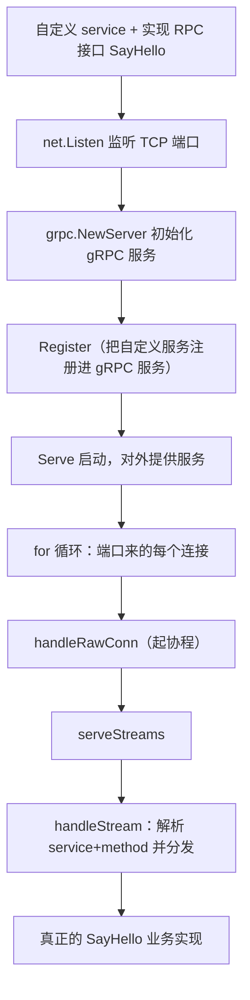
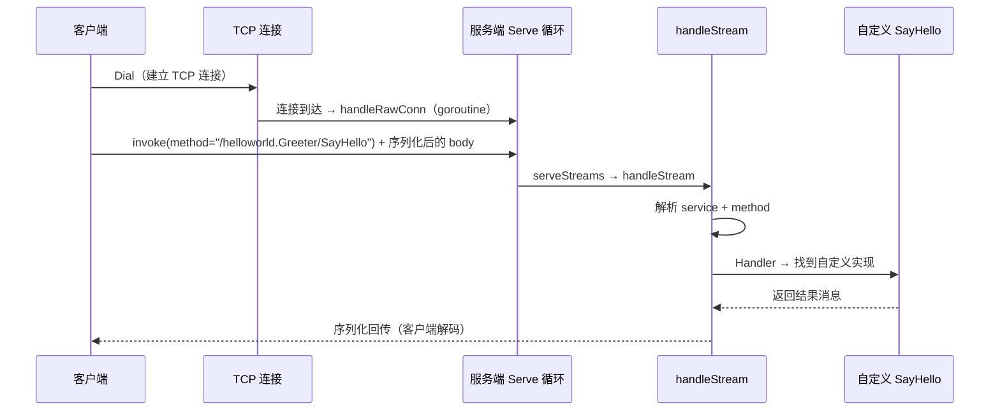
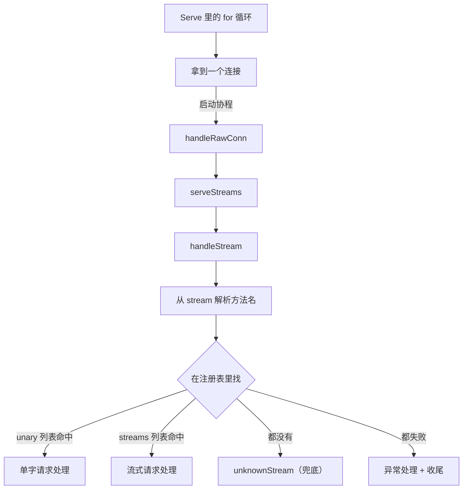

# 客户端与服务器通信流程

前面讲过使用 gRPC 的四个步骤，这里深入一下 gRPC 的通信流程。整个流程分为**服务端**和**客户端**两半。

结论：**服务端 = 自定义 service 并实现 RPC 接口 → main 里 `net.Listen` 监听 TCP 端口 → `grpc.NewServer` 初始化服务 → 把自己定义的服务注册进去 → `Serve` 启动对外服务；客户端 = 先和服务端建立 TCP 连接 → 创建客户端实例 → 准备请求消息 → 执行远程调用（内部对消息做编解码与序列化，经 TCP 发给服务端）。而服务端的 `Serve` 里有个关键 for 循环：每拿到一个连接就起一个协程交给 `handleRawConn` → `serveStreams` → `handleStream`，从 stream 里取出方法名解析出 service（包名 + 服务名）与 method，再在单字请求列表 / 流式请求列表里找，都找不到就落到 unknownStream 兜底 —— 这套分发逻辑跟自己写的业务系统一模一样。**

## 纲要

- 服务端四步：监听 → 初始化 → 注册 → 启动
- 注册那一刻做了什么：ServiceDesc、method 与 handler
- Unimplemented 默认实现为什么存在
- 客户端四步：建连 → 建实例 → 组请求 → 远程调用
- invoke：method 就是 "/helloworld.Greeter/SayHello"
- 服务端请求分发：for 循环 → conn → goroutine → serveStreams → handleStream
- 完整时序图

## 服务端四步

**服务端首先需要自定义一个 service，然后实现相应的 RPC 接口；然后在 main 方法中，首先要监听一个 TCP 端口，接着初始化一个 gRPC 服务，把自己定义的这个服务注册到定义的 gRPC 服务中，最后就是启动这个 gRPC 服务，开始对外提供服务。**



helloworld 的服务端代码就是这个骨架：**先定义 TCP 端口号，自定义一个 server 实现 SayHello；进入 main，`net.Listen` 监听端口，然后 `grpc.NewServer` 创建 gRPC 服务，接着把服务注册进去，最后 `Serve` 启动** —— 服务端流程看着很简单。

## 注册那一刻做了什么

**继续深入看 `pb.RegisterGreeterServer`，这里会调用 `RegisterService` 方法，其中有一个参数 `Greeter_ServiceDesc` —— 这个变量里会定义 `ServiceName`（包名 + 服务名）和 `Methods`（RPC 方法列表）**，可以看到定义的 SayHello 方法，**里面的 `Handler` 属性指向了处理这个方法的实现，这个方法会设置自定义的 server 来处理真正的 SayHello**。

```dir
pb 生成的注册信息（helloworld_grpc.pb.go）
├── Greeter_ServiceDesc
│   ├── ServiceName: "helloworld.Greeter"        ← 包名 + 服务名
│   └── Methods
│       └── SayHello
│           ├── MethodName: "SayHello"
│           └── Handler: 指向我们实现的那个方法
├── GreeterServer 接口
│   └── 让 gRPC 服务收到请求时知道该交给哪个方法执行，靠的就是这张表
└── UnimplementedGreeterServer                  ← 默认实现，返回"未实现"状态码
```dir

**往上还会发现 `GreeterServer` 接口下面还有一个 `UnimplementedGreeterServer`，它已经实现了 `GreeterServer` 接口 —— 这就是默认实现的 gRPC 服务，只不过返回了一个"未实现"的异常状态码。** 作用很实在：**业务方漏实现某个方法时，编译期不报错（接口少实现一个方法也不会编译失败），运行期就返回"未实现"状态码，而不是 panic。**

## 客户端四步与 invoke

**客户端要先建立与服务端的 TCP 连接，有了 TCP 连接就可以创建客户端实例，得到 gRPC 的客户端实例，就可以开始处理业务逻辑、把请求消息准备好执行远程调用。**

**代码里只有一行执行一个 Go 方法，本方法内部就是 gRPC 封装好的远程调用 —— 它会把请求的消息进行编解码和序列化，然后通过 TCP 传输给服务端；服务端接收到请求消息、执行完业务逻辑后再返回给客户端，客户端得到响应再反序列化解码，得到具体的返回消息，这就是完整的通信流程。**



**在生成的代码里能看到，请求真正发出去的那段就是 `c.cc.Invoke`，得到的响应直接返回 —— 这里的请求有一个参数 `method` 等于 `helloworld.Greeter.SayHello`，看着特别像 HTTP 的请求。后面把 gRPC 服务改造成 RESTful API 时，也就可以这么用。**

而我们使用起来特别简单：**客户端调用的 SayHello 方法，在生成的 gRPC 代码文件里已经封装了客户端请求 —— 包括消息的编解码和序列化，也包括网络传输和异常处理；单字请求（unary）和流式（stream）请求也都封装好了，使用时不需要关注底层逻辑，极大简化了开发工作量。**

## 服务端请求分发：从 for 循环到业务方法

**从服务端的 main 方法往 `s.Serve` 里看，会找到一个特别关键的 for 循环 —— 这看上去是一个死循环，里面做的就是要监听端口发来的每一个请求，拿到每一个连接，实际调用 `handleRawConn` 来执行，并且会启动一个协程来做请求处理；进到 handleRawConn 里会把请求发给 `serveStreams` 方法，serveStreams 里又去用 `handleStream` 方法来执行。**

**再进到 handleStream —— 这个方法离实际自定义的服务端方法越来越近了：首先从 stream 里拿到一个方法，能解析出 service 和 method（service 是包名 + 服务名，method 是 SayHello）；然后从注册的服务列表和相应的 RPC 方法列表里，就能找到对应的服务和方法。找方法有两个地方：一个是单字请求的列表，一个是 streams（多次流式请求）的列表；如果这两个都没有找到，还有一个兜底的 unknownStream —— 如果定义了未知的处理方法，前面找不到就一定会进入这个未知的处理方法；如果都没有成功，就走异常处理和收尾工作。**



**看服务端的这段处理逻辑，是不是觉得自己开发的业务系统的逻辑是一模一样 —— 就是根据各种请求参数决定后续的处理逻辑。**

## API 速览

| 环节 | 调用 | 说明 |
| --- | --- | --- |
| 服务端 | `net.Listen("tcp", ":50051")` | 先监听一个 TCP 端口 |
| 服务端 | `grpc.NewServer()` | 初始化一个 gRPC 服务 |
| 服务端 | `pb.RegisterGreeterServer(s, &server{})` | **把自定义服务注册进 gRPC 服务** |
| 服务端 | `s.Serve(lis)` | **关键 for 循环：监听连接、逐个 handler** |
| 注册表 | `Greeter_ServiceDesc` | **ServiceName（包名+服务名）+ Methods（RPC 列表，含 Handler）** |
| 兜底 | `UnimplementedGreeterServer` | 默认实现，返回"未实现"异常状态码 |
| 客户端 | `grpc.Dial(...)` | **先建立 TCP 连接** |
| 客户端 | `pb.NewGreeterClient(conn)` | 创建客户端实例 |
| 客户端 | `c.SayHello(ctx, req)` | **像本地一样调用（内部是 `c.cc.Invoke`）** |
| 传输 | `c.cc.Invoke(ctx, "/helloworld.Greeter/SayHello", req, resp, opts...)` | **method 形如 HTTP 请求路径** |
| 分发 | `handleStream` | 从 stream 解析 service + method，查 unary / streams 列表 |
| 兜底分发 | `unknownStream` | 前两者都没找到时进入的未知处理方法 |

## Demo 示例

把"注册 → 查表 → 分发"这套逻辑从生成代码里抽出来看，是一个极简的 RPC 分发器（自包含，可直接跑）：

```go
package main

import (
	"fmt"
	"strings"
)

// 极简「注册 + 分发」：把 gRPC 的 ServiceDesc / handleStream 缩到最小形态
type Method struct {
	Name    string // 例如 "helloworld.Greeter/SayHello"
	Handler string // 指向我们实现的方法
	Stream  bool   // 是否流式
}

type Registry struct {
	unary  map[string]Method
	stream map[string]Method
	fallback func(string)
}

func (r *Registry) register(sd Method) {
	if sd.Stream {
		r.stream[sd.Name] = sd
	} else {
		r.unary[sd.Name] = sd
	}
}

// handleStream：从 stream 里解析出 service 与 method，再去表里找
func (r *Registry) handleStream(fullMethod string) {
	var service, method string
	if i := strings.LastIndex(fullMethod, "/"); i >= 0 {
		service, method = fullMethod[:i], fullMethod[i+1:]
	}
	m, ok := r.unary[fullMethod]
	if !ok {
		if m, ok = r.stream[fullMethod]; ok {
			fmt.Printf("分发[stream] service=%q method=%q → %s\n", service, method, m.Handler)
			return
		}
		fmt.Printf("分发[兜底] service=%q method=%q → unknownStream\n", service, method)
		r.fallback(fullMethod)
		return
	}
	fmt.Printf("分发[unary] service=%q method=%q → %s\n", service, method, m.Handler)
}

func main() {
	r := &Registry{unary: map[string]Method{}, stream: map[string]Method{},
		fallback: func(m string) { fmt.Println("  兜底处理:", m) }}
	r.register(Method{Name: "helloworld.Greeter/SayHello", Handler: "自定义 server 的 SayHello"})
	r.handleStream("/helloworld.Greeter/SayHello") // → 命中 unary
	r.handleStream("/helloworld.Greeter/Chat")     // → 未注册，走兜底
}
```

验证点：

```bash
go run main.go
# 分发[unary] service="helloworld.Greeter" method="SayHello" → 自定义 server 的 SayHello
# 分发[兜底] service="helloworld.Greeter" method="Chat" → unknownStream

# 实验：把注册那行注释掉，所有请求都掉进兜底 → 这就是"没注册就找不到"的真实表现
# 实验：register 时把 Stream 设成 true，同样的请求就会走 stream 表 → 流式与单字的分叉点
```

## 总结

1. **服务端四步**：**自定义 service 并实现 RPC 接口 → main 里监听 TCP 端口 → 初始化 gRPC 服务（`grpc.NewServer`）→ 把服务注册进 gRPC 服务 → 启动（`Serve`）对外提供服务**；
2. **注册做了什么**：`RegisterGreeterServer` 调用 `RegisterService`，参数 `Greeter_ServiceDesc` 中**定义 ServiceName（包名 + 服务名）和 Methods（RPC 方法列表）**；**方法里的 Handler 属性指向处理这个方法的实现，会设置自定义 server 来处理真正的 SayHello**；
3. **UnimplementedGreeterServer 的作用**：**它已实现 `GreeterServer` 接口，是默认 gRPC 服务实现，只不过返回"未实现"异常状态码**；
4. **客户端四步**：**先建立与服务端 TCP 连接 → 创建客户端实例 → 准备请求消息 → 执行远程调用**；**内部把请求消息编解码和序列化，经 TCP 传给服务端，服务端执行完返回后客户端再反序列化解码得到返回消息**；
5. **调用栈只有一行**：**代码里只有一行执行一个 Go 方法，内部是 gRPC 封装好的远程调用**；**生成代码里 `c.cc.Invoke` 把请求真正发出去，参数 method 等于 `helloworld.Greeter.SayHello`，特别像 HTTP 请求**，后续改造成 RESTful API 时也可这么用；
6. **客户端为什么这么简单**：**生成代码已封装客户端请求的消息编解码、序列化、网络传输和异常处理，单字与流式请求也都封装好了，使用时不需关注底层逻辑，极大简化开发**；
7. **服务端 Serve 里的关键 for 循环**：**监听端口每个请求，拿到连接实际调用 `handleRawConn`（启动协程）；handleRawConn 把请求发给 `serveStreams`，serveStreams 用 `handleStream` 执行**；
8. **handleStream 的分发逻辑**：**先从 stream 拿到方法，解析出 service（包名+服务名）和 method（SayHello）**；**找方法有两个地方 —— 单字请求列表和 streams 列表；都没有就走兜底 `unknownStream`；都不成功走异常处理和收尾**；
9. **这段分发逻辑和自己开发的业务系统一模一样，都是根据请求参数决定后续处理逻辑**。
