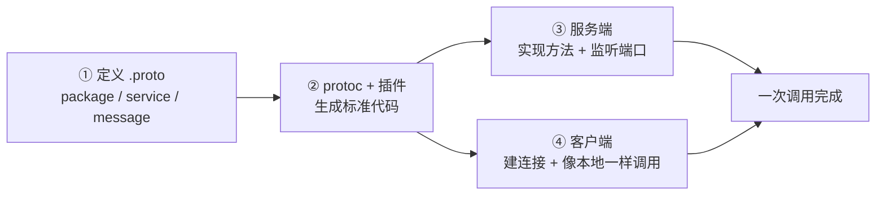
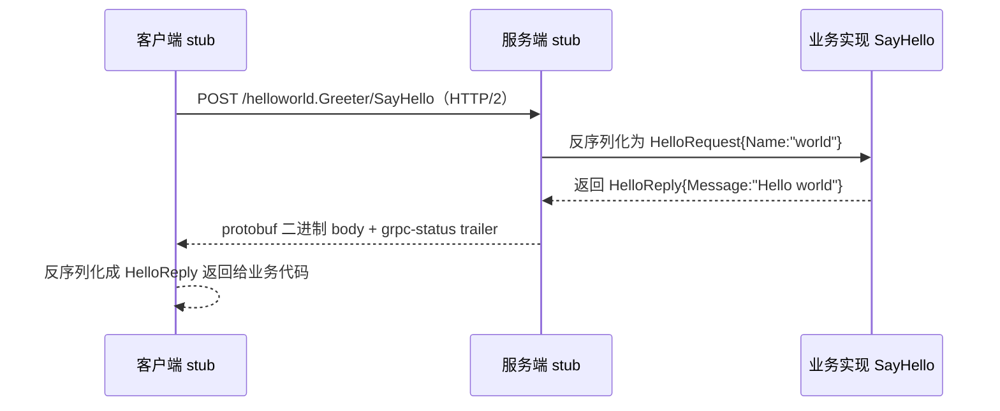

# Kubernetes 认证考点: 第一个 gRPC 案例演示 —— 四步流程与 helloworld 全链路

写第一个 gRPC 小程序之前，得先知道它的使用流程。结论先给：**gRPC 一共四步 —— ① 定义 `.proto` 文件（服务方法、输入消息、输出消息）；② 用 `protoc` 加 Go / gRPC 插件生成标准代码；③ 服务端实现定义好的方法并监听 TCP 端口；④ 客户端建立连接、创建 gRPC 客户端对象，然后像调本地方法一样调远程方法。** 官方仓库里就有现成的 helloworld 例子，直接拉源码看着跑一遍最快。

## 纲要

- gRPC 使用的四步流程
- 开发环境准备：Go / protoc / 两个插件
- 源码目录：helloworld 的三个子目录
- 跑起来：一个窗口 server 一个窗口 client
- proto 文件逐段拆解：syntax / package / service / message / 字段编号
- 生成的两份代码各管什么
- 客户端与服务端骨架代码
- 四步的通用性

## gRPC 使用的四步流程



四步里，**第①步和第②步是"契约"，第③步和第④步是"两边各自的实现"** —— 服务和方法定义好之后，服务端和客户端就可以**各自并行实现自己的业务逻辑**，开发效率很高。

## 开发环境准备

官方文档（`grpc.io` → Go 语言快速开始）里的**三个先决条件**：

| 条件 | 说明 |
| --- | --- |
| **Go 开发环境** | 建议下载最新版本（课程时为 Go 1.19） |
| **protoc（protobuf compiler）** | proto 文件编译器工具 |
| **两个 Go 插件** | `protoc-gen-go`（生成消息结构体）+ `protoc-gen-go-grpc`（生成服务与方法） |

装两个 Go 插件之前要先配好 **`GOPATH`，并且把 `GOPATH` 的 `bin` 目录配置到 `PATH` 变量中** —— 这一步漏了，`protoc` 执行时会报找不到插件。

```bash
# 安装 Go 的 protobuf 编译器插件
go install google.golang.org/protobuf/cmd/protoc-gen-go@latest
go install google.golang.org/grpc/cmd/protoc-gen-go-grpc@latest

# 确认 GOPATH 与 PATH
go env GOPATH
ls $(go env GOPATH)/bin      # protoc-gen-go / protoc-gen-go-grpc 都在这里
export PATH=$PATH:$(go env GOPATH)/bin

# 安装 protobuf 编译器本体
# macOS:  brew install protobuf
# Ubuntu: apt-get install -y protobuf-compiler
protoc --version
```

拉源码跑例子：

```bash
git clone https://github.com/grpc/grpc-go.git
cd grpc-go
cd examples/helloworld/helloworld      # PB 文件与生成后的标准代码都在这里
```

> 例子里 `helloworld` 目录存 PB 文件和生成后的标准代码，`greeter_client` 对应客户端代码，`greeter_server` 对应服务端代码。

## 跑起来：两个窗口

```bash
# 窗口一：起服务端（默认监听 50051）
go run greeter_server/main.go
# 控制台出现：server listening at 127.0.0.1:50051

# 窗口二：客户端，执行一次拿到一个 Hello World 响应
go run greeter_client/main.go
# 客户端打印：Hello World（响应内容）
# 服务端同时打一行：received hello
```

再执行一次、多执行几次，**客户端每次都返回 hello，服务端每次都再收到一行 `received hello`** —— 说明这个小例子已经完整跑通了。

```text
examples/helloworld/
├── helloworld/          # PB 文件 + protoc 生成的两个 .pb.go
│   ├── helloworld.proto
│   ├── helloworld.pb.go        # 消息结构体（struck 定义）
│   └── helloworld_grpc.pb.go   # service 与方法定义、message
├── greeter_server/
│   └── main.go                 # 服务端：实现 SayHello + 监听端口
└── greeter_client/
    └── main.go                 # 客户端：构造请求参数 + 处理返回值
```

## proto 文件逐段拆解

打开 `helloworld/helloworld.proto`，四段结构：

```proto
syntax = "proto3";           // protobuf 协议和版本（现在是 proto3）

package helloworld;          // 服务/消息的包名

option go_package = "examples/helloworld/helloworld";  // 可选，按语言定义
option java_package = "io.grpc.examples.helloworld";   // 可选，Java 也能用

// 定义服务
service Greeter {
  rpc SayHello (HelloRequest) returns (HelloReply) {}
  // 所有方法都必须有一个输入消息和一个输出消息，哪怕是空的 message 也行
}

// 输入消息
message HelloRequest {
  string name = 1;           // 字段类型 + 字段名 + 字段编号
}

// 输出消息
message HelloReply {
  string message = 2;
}
```

几个必须记牢的点：

| 要点 | 说明 |
| --- | --- |
| **`syntax = "proto3"`** | 声明 protobuf 协议版本，现在是 proto3 |
| **包名 package** | 必须写；`go_package` / `java_package` 等是**按语言可选的** |
| **service 里的方法** | **每个方法都必须有输入消息和输出消息，哪怕是一个空的 struct** |
| **字段编号不能乱改** | **序列化和反序列化按编号执行**，为保证新旧 `.proto` 文件兼容，**编号不能随便修改、增加和删除** |
| **支持的数据类型** | 数字、布尔、浮点、字符串、枚举、数组、map、对象等，**基本满足各个语言的需求** |
| **字段规则** | `required` 必须有（缺了报错）、`optional` 可有可无、`repeated` 可多个（相当于数组）；扩展与高级功能建议用到再看文档 |
| **字段名与顺序** | 定义消息要写清：名称、内部字段类型、字段名称、**字段的顺序编号** |

## 生成的两份代码各管什么

```bash
protoc --go_out=. --go-grpc_out=. helloworld/helloworld.proto
```

| 生成文件 | 内容 | 谁在用 |
| --- | --- | --- |
| **`helloworld.pb.go`** | 生成的 Go 代码，**把所有消息（struct 对象）都定义出来** | 业务代码构造请求/读响应 |
| **`helloworld_grpc.pb.go`** | **gRPC 服务和方法定义**，`service` / `message` 都在这里 | 服务端实现接口、客户端建 stub |

因为**生成的两份代码已经把"协议编解码 + 服务接口"封好**，所以服务端和客户端的代码都很短：**服务端 `main.go` 行数很少**，客户端 `main.go` **基本就是构造一下请求参数、请求之后再处理一下返回值**。

## 客户端与服务端骨架

服务端只需实现原型里定义的方法（方法多了、逻辑复杂了，工作量就转移到具体业务开发上了）：

```text
// 服务端：实现 pb 里定义好的 SayHello 方法
func (s *server) SayHello(ctx context.Context, in *pb.HelloRequest) (*pb.HelloReply, error) {
	log.Printf("received: %v", in.Name)
	return &pb.HelloReply{Message: "Hello " + in.Name}, nil
}
```

客户端只需建连接、建 stub、像本地一样调用：

```text
// 客户端：连上 50051，拿到一个 stub，然后像本地方法一样发请求
conn, err := grpc.Dial("127.0.0.1:50051", grpc.WithTransportCredentials(insecure.NewCredentials()))
if err != nil {
	log.Fatalf("did not connect: %v", err)
}
defer conn.Close()

c := pb.NewGreeterClient(conn)              // 创建 gRPC 客户端对象
r, err := c.SayHello(context.Background(), &pb.HelloRequest{Name: "world"}) // 像本地一样调用
if err != nil {
	log.Fatalf("could not greet: %v", err)
}
log.Printf("Greeting: %s", r.Message)
```

## 客户端到底发了什么（把"像本地调用"拆开看）

"像本地一样调用"是**编译期与 stub 给的错觉**，底层是一次 HTTP/2 POST：



拆到这一层，"像本地调用"其实就三件事：**路径是 `/包名.服务名/方法名`、body 是 protobuf 二进制、结果放在 HTTP trailer 的 `grpc-status` 里**。下面这段用标准库手工发起一次调用，看清它长什么样（本地没起服务端时会走到"调用失败"分支，这也是验证命令是否装对的快速方法）：

```go
package main

import (
	"bytes"
	"fmt"
	"io"
	"net/http"
)

// gRPC 底层：一次基于 HTTP/2 的 POST。
// 真实业务里这两段字节由 protoc-gen-go 生成的 stub 负责组装，
// 这里手写是为了看清协议形状：HelloRequest{Name:"world"} → field 1 = "world"
func main() {
	target := "http://127.0.0.1:50051"
	method := "/helloworld.Greeter/SayHello"

	reqBody := []byte{0x0a, 0x05, 'w', 'o', 'r', 'l', 'd'}

	req, err := http.NewRequest(http.MethodPost, target+method, bytes.NewReader(reqBody))
	if err != nil {
		panic(err)
	}
	req.Header.Set("Content-Type", "application/grpc")
	req.Header.Set("TE", "trailers") // 声明我要读 trailers

	resp, err := http.DefaultClient.Do(req)
	if err != nil {
		fmt.Println("调用失败（本地没起服务端时会走这里）：", err)
		return
	}
	defer resp.Body.Close()

	body, _ := io.ReadAll(resp.Body)
	fmt.Printf("HTTP 状态: %d\n", resp.StatusCode)
	fmt.Printf("响应 body 长度: %d 字节（protobuf 二进制）\n", len(body))
	fmt.Printf("grpc-status: %q\n", resp.Trailer.Get("grpc-status"))
	fmt.Printf("响应内容: %q\n", string(body))
}
```

## 四步的通用性

helloworld 只有几十行，但**实战项目的四步是一样的**：

```text
实战项目（服务多、方法多）          helloworld（小例子）
├── 多个 .proto                    └── 一个 helloworld.proto
├── 生成多份 pb.go                 ├── 生成两份 .pb.go
├── 服务端实现几十个方法             └── 只实现 SayHello
└── 客户端各端各自接 stub           └── 一个 greeter_client
```

**不论服务端还是客户端，在 gRPC 服务和方法定义好之后，就可以各自实现自己的业务逻辑，开发效率很高。**

## API 速览

| 环节 | 工具 / 接口 | 说明 |
| --- | --- | --- |
| 契约 | `syntax = "proto3"` | protobuf 版本声明 |
| 契约 | `service Xxx { rpc Foo (Req) returns (Resp) }` | 方法必须有输入与输出消息 |
| 契约 | `message Xxx { 类型 字段名 = 编号; }` | **编号是序列化依据，定型后不可改** |
| 契约 | `repeated` / `optional` / `required` | 可多个 / 可有可无 / 必须有 |
| 编译 | `protoc --go_out=. --go-grpc_out=. *.proto` | 生成消息代码 + 服务代码 |
| 插件 | `protoc-gen-go`、`protoc-gen-go-grpc` | 需 `GOPATH/bin` 在 `PATH` 里 |
| 服务端 | `pb.UnimplementedXxxServer` 嵌入 + 实现方法 | 实现定义好的方法并监听 TCP 端口 |
| 客户端 | `pb.NewXxxClient(conn)` | 建立 TCP 连接后创建客户端对象 |
| 客户端 | `client.Method(ctx, req)` | **像本地一样调用远程方法** |
| 传输 | HTTP/2 + `/package.Service/Method` | 路径即方法定位 |

## Demo 示例

本地按四步复现一遍（示例目录为 `grpc-go/examples/helloworld`）：

```bash
# ① 已有 .proto（这里直接复用官方的 helloworld.proto）

# ② 生成标准代码
cd examples/helloworld/helloworld
protoc --go_out=. --go_opt=module=google.golang.org/grpc/examples/helloworld/helloworld \
       --go-grpc_out=. --go-grpc_opt=module=google.golang.org/grpc/examples/helloworld/helloworld \
       helloworld.proto
ls   # → helloworld.pb.go  helloworld_grpc.pb.go

# ③ 起服务端（另一个窗口执行）
cd examples/helloworld/greeter_server
go run main.go            # 控制台出现：server listening at 127.0.0.1:50051

# ④ 起客户端
cd examples/helloworld/greeter_client
go run main.go            # 客户端返回 hello；服务端打印 received hello
```

验证与排障：

```bash
# 看服务端在不在监听 50051
lsof -i :50051

# 客户端报错 connection refused → 服务端没起来 / 端口不对
# protoc 报 "protoc-gen-go: program not found" → GOPATH/bin 没进 PATH
# 生成的代码里找不到 NewGreeterClient → 忘了装 protoc-gen-go-grpc 或 --go-grpc_out 没写
```

## 总结

1. **gRPC 使用流程是固定的四步**：**① 定义标准的 proto 文件（包、服务、方法、输入消息、输出消息）→ ② 用 protoc 命令行工具生成标准代码（需要 protoc 以及它的 Go 和 gRPC 插件）→ ③ 服务端用生成的代码提供服务、实现 gRPC 服务定义的方法并启动服务监听 TCP 端口 → ④ 客户端用生成的代码调用服务，建立 TCP 连接、创建 gRPC 客户端对象，然后像本地一样调用远程方法**；
2. **环境三先决条件**：**Go 开发环境（建议最新版）+ protoc 编译器 + 两个 Go 插件（protoc-gen-go 与 protoc-gen-go-grpc）**；装插件前**先配好 `GOPATH` 并把 `GOPATH` 的 `bin` 目录加到 `PATH`**；
3. **源码结构**：`examples/helloworld/` 下三个子目录 —— **`helloworld` 存 PB 文件与生成后的标准代码，`greeter_client` 是客户端代码，`greeter_server` 是服务端代码**；
4. **proto 文件四段**：`syntax = "proto3"` 声明版本、`package` 包名（还有可选的 `go_package` / `java_package`）、`service` 定义服务方法（**每个方法都必须有输入消息和输出消息，空 struct 也行**）、大量 `message` 定义输入输出；
5. **字段编号是命门**：消息里要写清名称、字段类型、字段名、**顺序编号**；**序列化和反序列化按编号执行，为了保证新旧 proto 文件兼容，编号不能随便修改、增加和删除**；proto 支持数字、布尔、浮点、字符串、枚举、数组、map、对象等类型；字段规则 `required`（必须有）/ `optional`（可有可无）/ `repeated`（可多个，相当于数组）；
6. **生成两份代码分工明确**：**`helloworld.pb.go` 把消息（struck 对象）全定义出来；`helloworld_grpc.pb.go` 里是 gRPC 服务和方法定义（service、message）**；
7. **服务端与客户端代码都很短**：服务端 `main.go` 行数很少（如果服务和方法多，工作量就转到业务实现上）；客户端基本是**构造请求参数、请求之后处理返回值**；
8. **四步具有通用性**：实战项目再复杂，**这四步不变**；**服务与方法定义好之后，服务端和客户端各自并行实现业务逻辑，开发效率很高**。

