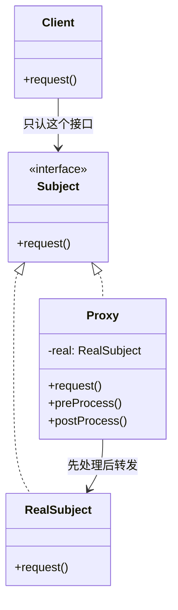
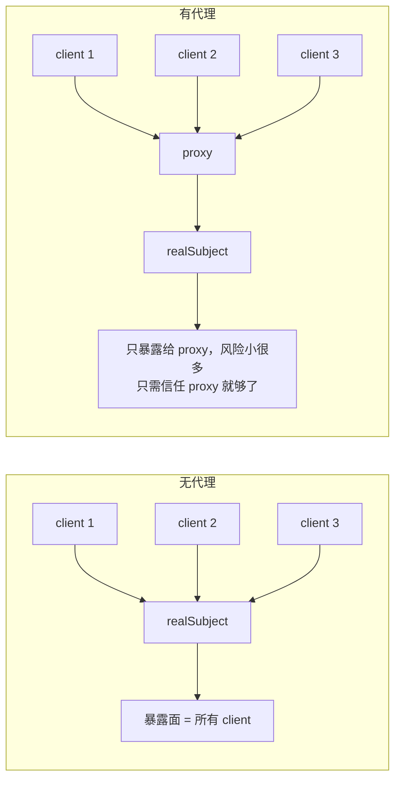

# Kubernetes 认证考点: 用代理模式理解 gRPC 的客户端与服务端 —— 定义、两类代理与正反代理

跑通第一个 gRPC 小例子之后本来可以直接深挖源码，但讲原理、讲设计前**得先把设计模式补上**。上一章讲 API 网关时提过一次代理模式，这一次要把它完整讲清楚 —— 而且 proxy 这个东西，你在 gRPC、API 网关、甚至 K8s 的 Service 里都会反复撞见。

结论：**代理模式的定义是"提供一个代理对象，并由代理对象控制对原对象的引用"，核心就"控制"两个字 —— 通过代理对象比直接调用原对象能增加更多限制或功能（权限检查、分布式负载均衡等）。代理分静态代理（硬编码、只有一个 realSubject）与动态代理（按配置或调用参数在启动/运行时动态选择原引用对象）；而"正向代理是客户端的代理、反向代理是服务端的代理"这一组，本质上就是代理模式在部署形态上的两个方向。**

## 纲要

- 代理模式的定义与 UML 类图
- 两个主要作用：中介隔离、开闭原则
- 一个缺点：系统变复杂了
- 静态代理 vs 动态代理
- 正向代理与反向代理（谁搭的、挡在哪）
- 回到 gRPC：把 proxy 换成 stub

## 代理模式的定义

**提供一个代理对象，并由代理对象控制对原对象的引用。**

这里要**特别注意"控制"这个词** —— 通过代理对象，会比直接调用原对象**增加更多的限制或者功能**，比较常见的有：**调用权限检查、分布式负载均衡**等等。

代理对象（proxy）内部直接调用 realSubject 的 request 方法，**proxy 自己还能插入 preProcess 和 postProcess 处理逻辑**：



不用代理模式时，**client 直接请求 realSubject**；现在 **client 直接调用的是 proxy，由 proxy 先处理一遍，再由 proxy 调用 realSubject，最后再返回给 client** —— 整个过程 **client 看到的只有 proxy，对它来说 proxy 就是真实的 subject 实现类**。

## 两个主要作用

**作用一：中介隔离，把 client 和 realSubject 解耦。**



realSubject 原来要服务很多 client，现在**只需要暴露给 proxy，它的风险就小很多了 —— 因为只需要信任 proxy 就够了**；**它的作用是中介隔离的效果，把 client 和 realSubject 解耦**，很多个 client 只需要知道 proxy，realSubject 只需要信任 proxy，就能很好地保护 realSubject。

**作用二：符合开闭原则（对扩展开放，对修改关闭）。**

新的需求可以在 **proxy 中实现**，从而**减少对 realSubject 的修改** —— realSubject 可以**更加聚焦自己的核心能力**，把一些**边缘性的、经常变化的扩展需求放在 proxy 中**来实现。

翻译成工程话：**"会变的部分"（鉴权、限流、日志、重试、负载均衡）放代理层，"不变的部分"（业务规则）放在原对象里**。

## 一个缺点：系统复杂性上升

代理模式不是免费的 —— **缺点是增加了系统的复杂性**。一个 proxy 里塞太多横切逻辑，最后会变成谁都不敢动的"上帝代理"。所以才有动态代理和框架（gRPC 的 stub、Istio 的 Envoy、K8s 的 kube-proxy）来分摊这件事。

## 静态代理 vs 动态代理

| 类型 | 定义 | 什么时候用 |
| --- | --- | --- |
| **静态代理** | **代理对象是在代码中硬编码、显式地代理引用的原对象** | **只有一个 realSubject 时，静态代理就够了** |
| **动态代理** | **可以根据配置或者调用参数等，在启动时或者运行过程中动态选择代理对象后面的原引用对象** | **系统中有多个 sub 接口的实现类时**，用静态代理就**缺少灵活性**了，必须上动态代理 |

**判断标准就一句话：原对象数量可扩展吗？** 只有一个，写死一个 wrapper；有一堆，就得让代理在运行时挑一个。

下面用标准库演示两种形态的差别（静态：手写一个 CheckProxy；动态：用参数把 realSubject 换成函数，调用方只认一个统一入口）：

```go
package main

import (
	"fmt"
	"time"
)

// Subject：接口里只有 request 一个方法（对应 UML 里的 subject 接口）
type Subject interface {
	Request(name string) string
}

// RealSubject：真实实现，只干自己的核心能力
type RealSubject struct{}

func (RealSubject) Request(name string) string {
	return fmt.Sprintf("real-subject: 处理 %s", name)
}

// ---------- 静态代理：代理对象在代码里硬编码 ----------
type StaticProxy struct {
	real RealSubject // 只有一个原对象，写死
}

func (p StaticProxy) Request(name string) string {
	pre := fmt.Sprintf("[pre] 权限检查通过，name=%s", name)
	post := fmt.Sprintf("[post] 记录调用日志，耗时处理完成")
	_ = pre
	time.Sleep(time.Millisecond) // 模拟权限检查/负载均衡的开销
	return p.real.Request(name) + " | " + post
}

// ---------- 动态代理：原对象在运行时按参数/配置决定 ----------
type DynamicInvoker struct {
	handler func(string) string // 真正干活的那一层，可随时替换
}

func (d DynamicInvoker) Request(name string) string {
	pre := fmt.Sprintf("[pre] 权限检查通过，name=%s", name) // 扩展点：新需求都加在这
	_ = pre
	return d.handler(name)
}

func main() {
	client := func(s Subject, name string) string { return s.Request(name) }

	// 只有一个 realSubject → 静态代理足够
	var s Subject = StaticProxy{real: RealSubject{}}
	fmt.Println(client(s, "user-rank"))

	// 多个实现 → 动态代理，按配置挑一个
	var d Subject = DynamicInvoker{handler: func(name string) string {
		return fmt.Sprintf("real-subject(策略B): 处理 %s", name)
	}}
	fmt.Println(client(d, "coupon"))

	fmt.Println("client 两侧都只认 Subject 接口，完全不知道背后是谁 —— 这就是解耦")
}
```

## 正向代理与反向代理

**正向代理和反向代理，都是"在客户端和服务端之间有一个代理"**，区别在于**谁搭的、挡在哪一边**：

|  | **正向代理** | **反向代理** |
| --- | --- | --- |
| **是谁的代理** | **客户端的代理** | **服务端的代理** |
| **谁搭建** | 由**客户端搭建**的代理服务 | 由**服务端搭建**的代理服务 |
| **干什么** | **帮助客户端访问其他无法访问的服务器资源** | **帮助服务端做负载均衡、安全防护**等 |
| **经典例子** | **浏览器中使用的网络代理插件** | **API 网关** |
| **谁能看见谁** | 服务端不知道真实的用户是谁（**服务端看到的客户端是代理对象**） | 客户端不知道自己访问的是哪一个真实服务端（**被代理对象屏蔽了**） |

回到那一句反直觉的话：**"服务端不知道真实用户是谁，因为服务端看到的客户端是代理对象"** —— 这句话只成立于正向代理；**"客户端不知道访问的是哪个真实服务端"** 成立于反向代理。课程转写在讲 API 网关那句时口误说成了"网关使用了正向代理"，按定义 **API 网关是服务端的代理，属于反向代理**（所以客户端才被屏蔽、才以为网关就是后端）。

两个课后的思考题：

1. **在国内要访问谷歌搜索，要用哪种代理？** → **正向代理**（客户端搭，帮客户端拿到它自己拿不到的资源）；
2. **实现了好几种文件发布的解决方案，这时候要用哪种代理？** → **反向代理**（服务端一侧统一对外暴露文件服务，客户端只认这一个入口，真实存储节点可以随便换，还能做负载均衡与安全防护）。

## 回到 gRPC：把 proxy 换成 stub

```text
grpc-go 源码目录（本章要翻的地方）
├── examples
│   ├── helloworld                  # 第一个小例子：单方法、单向调用
│   │   ├── helloworld              # proto 文件 + 生成的 pb.go
│   │   │   ├── helloworld.proto
│   │   │   ├── helloworld.pb.go        # 消息结构体（由 protoc-gen-go 生成）
│   │   │   └── helloworld_grpc.pb.go   # 服务与方法定义（由 protoc-gen-go-grpc 生成）
│   │   ├── greeter_client
│   │   │   └── main.go             # 客户端：就是那个 proxy 的使用方
│   │   └── greeter_server
│   │       └── main.go             # 服务端：realSubject 的实现
│   ├── echo                        # 实现了 gRPC 的四种通信方式
│   └── route_guide                 # 另一种通信方式的参考例子
├── cmd
│   └── protoc-gen-go-grpc          # 第二讲要拆的自定义 protoc 插件
└── ...

UML 里的角色                    gRPC 里的对应物
-------------------------      ----------------------------------------
Client                    -->   业务代码（SayHello 调用方）
Subject（接口 + request） -->   GreeterClient 接口 + SayHello(ctx, req)
RealSubject               -->   服务端注册的 Greeter 实现
Proxy                     -->   stub / 生成的 pb 客户端代码（连接、重试、负载均衡、拦截）
preProcess / postProcess  -->   拦截器（UnaryInterceptor）：日志、鉴权、限流、链路追踪
```

**生成代码就是那个 proxy** —— 它把"连 TCP、选实例、组帧、解帧、重试"这些横切逻辑 pre/post 掉了，业务代码只看到 `c.SayHello(ctx, req)` 一次本地调用。

## API 速览

| 概念 | 关键要素 | 说明 |
| --- | --- | --- |
| 定义 | 代理对象 + **控制对原对象的引用** | 核心是"控制"二字 |
| 可以增加什么 | 权限检查、分布式负载均衡 | 常见增强点 |
| 类图 | client → subject 接口 → realSubject / proxy | proxy 内部调 realSubject，另有 pre/post 处理 |
| 作用一 | **中介隔离、解耦**，realSubject 只暴露给 proxy，风险小 | 只需信任 proxy 就够了 |
| 作用二 | **开闭原则**：对扩展开放、对修改关闭 | 变化的需求放 proxy，核心能力留给 realSubject |
| 缺点 | **增加系统复杂性** | proxy 别退化成上帝对象 |
| 静态代理 | 代码中**硬编码、显式**代理原对象 | 只有一个 realSubject 时够用 |
| 动态代理 | 按**配置或调用参数**在启动/运行时选原引用对象 | 多个实现类时必须有 |
| 正向代理 | **客户端搭建**，帮客户端访问不可达资源 | 浏览器代理插件；服务端只见代理 |
| 反向代理 | **服务端搭建**，做负载均衡与安全防护 | API 网关；客户端只见代理 |

## Demo 示例

把"代理能加什么"落到 gRPC 的拦截器上（这是 proxy 的 preProcess / postProcess 的标准形态）：

```text
// 真实形态：UnaryClientInterceptor 就是 gRPC 给你预留的"代理层"
// （此处为骨架示意，不能直接 go run，需替换成 protoc 生成的 pb 类型）
func UnaryClientInterceptor(
	ctx context.Context,
	method string,
	req, reply interface{},
	cc *grpc.ClientConn,
	invoker grpc.UnaryInvoker,
	opts ...grpc.CallOption,
) error {
	start := time.Now()

	// preProcess：这里可以做权限检查、限流、选实例（分布式负载均衡）
	fmt.Printf("[proxy] pre  %s start\n", method)

	err := invoker(ctx, method, req, reply, cc, opts...) // 真正打到 realSubject

	// postProcess：这里做监控上报、日志、错误归类
	fmt.Printf("[proxy] post %s done in %v, err=%v\n", method, time.Since(start), err)
	return err
}
```

实验三连（验证"代理到底管了什么"）：

```bash
# ① 关掉拦截器 → 同样的请求，客户端看不到 any 的 pre/post 日志，说明横切逻辑全在 proxy 里
# ② 在 preProcess 里加一个 rate.Limit，跑压测 → 请求被拒，证明限流"增强"是加在代理上的
# ③ 在 preProcess 里换一个后端地址 → 业务代码一行没改却切到了另一台 realSubject（动态代理的现场演示）
```

## 总结

1. **代理模式定义**：**提供一个代理对象，并由代理对象控制对原对象的引用** —— 特别要注意**"控制"** 这个词，**通过代理对象会比直接调用原对象增加更多的限制或者功能**，常见的是**调用权限检查、分布式负载均衡**；
2. **类图关系**：**client 发起请求 → subject 接口（request 方法）→ 两个实现类 realSubject 与 proxy**；**proxy 内部直接调用 realSubject 的 request，并且自己在里面加 preProcess / postProcess 处理逻辑**；**不用代理时 client 直接请求 realSubject，用了代理后 client 只调 proxy、proxy 先处理再调 realSubject 最后返回，client 看到的只有 proxy、proxy 就是它眼里的真实 subject**；
3. **作用一：中介隔离、解耦** —— **realSubject 原来服务很多 client，现在只需暴露给 proxy，风险小很多，因为只需信任 proxy 就够了**；
4. **作用二：符合开闭原则** —— **对扩展开放、对修改关闭**，新需求在 **proxy 中实现**，**减少对 realSubject 的修改**，让 realSubject **聚焦核心能力**，把边缘性、常变化的扩展需求放进 proxy；
5. **缺点**：**增加了系统的复杂性**；
6. **两类代理**：**静态代理是代理对象在代码中硬编码、显式代理引用的原对象（只有一个 realSubject 时够用）**；**动态代理可以根据配置或者调用参数等，在启动时或运行过程中动态选择代理对象后面的原引用对象（有多个实现类时才够灵活）**；
7. **正向 vs 反向**：两者都在客户端和服务端之间有一个代理；**正向代理是客户端的代理、由客户端搭建，帮助客户端访问无法访问的其他服务器资源（浏览器代理插件），服务端不知道真实用户是谁**；**反向代理是服务端的代理、由服务端搭建，帮助服务端做负载均衡和安全防护（API 网关），客户端不知道真实服务端是哪个、被代理对象屏蔽了**；
8. **落到 gRPC**：**生成的 stub 就是 proxy，拦截器就是它的 preProcess / postProcess** —— 连 TCP、选实例、组帧解帧、重试这些"会变的事"都在代理层，业务代码只看见一次本地调用。

