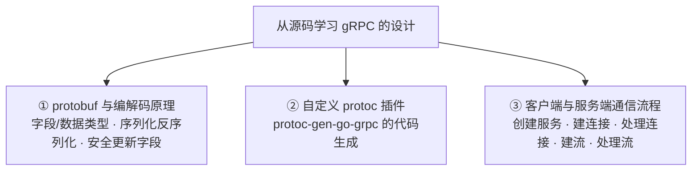
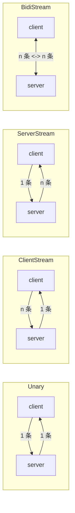

# Kubernetes 认证考点: 从源码学习 gRPC 设计（一）—— protobuf 字段、数据类型与四种通信方式

从源码学 gRPC 的设计，拆成**三个部分**讲：

1. **第一部分：protobuf 与编解码原理** —— 字段与数据类型、对象的序列化与反序列化、如何安全地更新字段；
2. **第二部分：gRPC 自定义的 protoc 插件** —— 就是装过的 `protoc-gen-go-grpc`，去看这个插件的实现代码，看 gRPC 的代码生成有什么神秘之处；
3. **第三部分：客户端与服务端的通信流程** —— 创建 gRPC 服务、创建连接、处理连接、建立流、处理流。

这一篇落第一部分。

结论：**开发一个 gRPC 服务第一步是写 proto 文件，`syntax = "proto3"`、`package`（可多段用点分割）与可选的 `option go_package/java_package` 是防服务名冲突的包名；`message` 定义消息结构体（即远程调用的输入输出数据）、`service` 定义远程服务名、里面用 `rpc` 关键字定义方法（写法和 interface 类似）；请求参数与返回值**必须且只能是一个消息**，`stream` 关键字放在输入上就是客户端流、放在输出上就是服务端流、两边都有就是双向流；消息字段是"类型在前、编号在后"，**每个字段必须有唯一编号且最小为 1**，字段类型以官方文档对照表为准。**

## 纲要

- 三部分的划分
- proto 文件的关键字：syntax / package / option / message / service / rpc
- 四种通信方式：stream 关键字放哪一边
- message 的字段与数据类型
- 嵌套消息与文件拆分（import）
- 编解码原理：TLV 与 Varint
- 如何安全地更新字段

## 三部分的划分



**第二部分和第三部分各是整章一节，这一篇先把第一部分的地基打完** —— 不看懂字段编号，后面读完源码也不知道那串字节是怎么来的。

## proto 文件的关键字

打开 `examples/helloworld/helloworld.proto` 看：

- **`syntax = "proto3"`** —— 定义 **proto（protobuf）的版本**，在没有更新的版本之前都用 proto3；
- **`package` 与 `option go_package` / `java_package`** —— **这些是为了避免服务名称冲突而定义的包名称**；其中 **`option` 是可选的，也就是说如果开发语言里没有 Java，就不需要定义 java_package**；
- **`message`** —— 定义**消息结构体**，也就是**远程方法调用中的输入和输出的数据**；
- **`service`** —— 定义**远程服务的名称**；
- **`rpc`** —— 在 service 里面定义**一组远程方法**，用 **rpc 作为关键字开头**，定义一个远程方法和**定义一个 interface 很类似**，也就是把**方法名称、请求参数、返回值**定义好就可以。

```proto
syntax = "proto3";              // 版本

package foo.bar.baz;            // 包名：多段、用点分割，用来区分服务、避免冲突
option go_package = "path/to/gen"; // 可选：Go 的包路径
option java_package = "com.example.gen"; // 可选：按语言而定

service Greeter {               // 远程服务名
  rpc SayHello (HelloRequest) returns (HelloReply) {} // rpc 方法，写法像 interface
  rpc Chat (stream Line) returns (stream Reply) {}    // 流式
}

message HelloRequest { string name = 1; }   // 输入消息
message HelloReply  { string message = 2; } // 输出消息
```

再看 `echo.proto`，它的 **`package` 是多段、使用点分割** —— 这就是**用多段 package 名称来区分服务**的现场。

## 四种通信方式：stream 关键字放在哪一边

**在远程方法的输入和输出消息前面，有的地方会出现 `stream` 这个关键字**：

| 写法 | 含义 | 名字 |
| --- | --- | --- |
| `rpc X (Req) returns (Resp)` | **无 stream** → 普通的一问一答 | **简单方式（Unary）** |
| **`stream` 在输入消息前面** | **支持客户端流式通信**（客户端连发多条，服务端一次回） | **客户端流（Client Streaming）** |
| **`stream` 在输出消息前面** | **支持服务端流式通信**（客户端发一条，服务端连回多条） | **服务端流（Server Streaming）** |
| **输入和输出两个消息前面都有 `stream`** | **客户端和服务端都支持流式通信** | **双向流（Bidirectional Streaming）** |



`examples/echo` 和 `examples/route_guide` 这两个项目**都实现了 gRPC 的四种通信方式，都可以参考学习** —— 想看流式怎么起，直接翻它们。

## 请求的硬约束：参数和返回值只能是一个消息

**这里要特别注意：请求参数和返回值都必须是一个消息，不能为空，也不能是多个消息。**

如果不需要输入和输出，**也建议给每一个方法都定义一个输入和输出消息，方便以后的扩展** —— 这正是"字段编号不能乱改"那套成本在接口层面的提前支付：今天返回空，明天要加个 code，就得改契约；今天就定义一个空的返回值消息，明天加字段只是编号 +1。

## message 的字段与数据类型

打开 `route_guide.proto` 看 message 定义：

**消息内部是各个字段的定义，在字段名称前面是数据类型**，可以看到 **int32、string 这些基础类型，也可以是 message 这种自定义的消息类型**；**字段名称后面是编号**，**在消息中的每个字段都需要有唯一的编号**，**编号的最小值是 1**。

| 类型 / 关键字 | proto 写法 | 说明 |
| --- | --- | --- |
| **基础数字** | `int32` / `int64` / `double`… | 官方文档有对照表，以官方文档为准 |
| **布尔** | `bool` | |
| **字符串 / 字节** | `string` / `bytes` | |
| **枚举** | `enum` | 定义枚举值 |
| **数组（可重复）** | `repeated` | **定义可重复的值，类似于数组类型** |
| **字典** | `map` | map 类型 |
| **对象引用** | 另一个 `message` 类型名 | protobuf message 定义对象引用 |
| **嵌套消息** | 在 message 内部再定义 message | **像 struct 内部又有 struct** |

关于字段数据类型：**官方文档中有对照表，一定要以官方文档为准**，其中包含**数字、布尔型、字符串、字节**这些基础类型，还有 **protobuf message 定义对象引用、定义枚举值、repeated 定义可重复的值（类似于数组类型）、map 类型**。

## 嵌套消息与文件拆分

**消息内部还可以嵌套定义消息，也就是 struct 内部又有 struct，这种结构看着有点复杂，不建议这么使用。**

更好的做法：**proto 文件可以拆分为多个来定义，通过 `import` 关键字把外部的 proto 文件引入到一个文件中**；**对于很大的服务（有很多方法、很多消息），可以考虑拆分为多个 proto 文件来定义**。

```text
examples/route_guide/
├── route_guide.proto          # service RouteGuide + 四个 rpc 方法
└── route_guide.proto 内部
    ├── service RouteGuide
    │   ├── rpc GetFeature(Point) returns (Feature)          # 服务端流
    │   ├── rpc ListFeatures(Rectangle) returns (stream Feature) # 服务端流
    │   ├── rpc RecordRoute(stream Point) returns (RouteSummary)  # 客户端流
    │   └── rpc Chat(stream Note) returns (stream Note)      # 双向流
    ├── message Point      { int32 latitude = 1; int32 longitude = 2; }
    ├── message Rectangle  { Point lo = 1; Point hi = 2; }
    ├── message Feature    { string name = 1; Point location = 2; }
    └── message RouteSummary { int32 point_count = 1; int32 distance = 2; }
```

## 编解码原理：TLV 与 Varint

**对象的序列化与反序列化（编解码）不是玄学，就是"Tag-Length-Value + Varint"两件事**：

```mermaid
flowchart LR
    OBJ["HelloRequest{Name:\"world\"}"] --> ENC["编码"]
    ENC --> BIN["0a 05 77 6f 72 6c 64"]
    BIN --> DEC["解码"]
    DEC --> OBJ2["还原成 HelloRequest"]
```

- **Tag（键）**：由「字段编号 << 3 | 类型」组成；
- **Varint（变长整数）**：数字按 7 位一组、高位在前补 `1` 的方式存，**小的数只占 1 字节**；
- **Value**：按类型放实际内容（字符串就是长度 + 原始字节）。

所以 `HelloRequest{name:"world"}`（字段编号 1、string 类型 = 2）编出来就是：

```text
0a            → 字段 1 + 类型 2（0<<3|2 = 0x0a）
05            → 长度 5
77 6f 72 6c 64 → "world"
```

自己实现一遍这 20 行，后面读 `protoimpl` 的生成代码就不慌了：

```go
package main

import "fmt"

// Varint 编码：7 位一组，小端分组、高位在前补 0x80
func encodeVarint(x uint64) []byte {
	var out []byte
	for x >= 0x80 {
		out = append(out, byte(x)&0x7f|0x80)
		x >>= 7
	}
	return append(out, byte(x))
}

func decodeVarint(b []byte) (uint64, int) {
	var x uint64
	for i := 0; i < len(b); i++ {
		x |= uint64(b[i]&0x7f) << (uint64(i) * 7)
		if b[i] < 0x80 {
			return x, i + 1
		}
	}
	return 0, 0
}

// 把一个字段编码成 TLV：tag = 字段编号<<3 | 类型(wire type 2 = 长度分隔)
func encodeField(fieldNum int, v string) []byte {
	out := encodeVarint(uint64(fieldNum)<<3 | 2)
	out = append(out, encodeVarint(uint64(len(v)))...)
	return append(out, []byte(v)...)
}

func decodeField(b []byte) (fieldNum int, value string) {
	key, n1 := decodeVarint(b) // n1/n2/n3 都是解码出的字节长度
	_, n2 := decodeVarint(b[n1:])
	_, n3 := decodeVarint(b[n1+n2:])
	value = string(b[n1+n2 : n1+n2+n3])
	return int(key >> 3), value
}

func main() {
	bin := encodeField(1, "world") // 对应 proto 里的 string name = 1;
	fmt.Printf("编码结果(hex): %x  字节数=%d\n", bin, len(bin))

	num, val := decodeField(bin)
	fmt.Printf("解码: field=%d value=%q\n", num, val)

	big := encodeVarint(300)
	fmt.Printf("300 的 Varint(hex): %x（占 %d 字节，固定 int32 要 4 字节）\n", big, len(big))
}
```

## 如何安全地更新字段

序列化和反序列化**按字段编号执行**，这是"安全更新"的全部依据：

| 动作 | 是否安全 | 说明 |
| --- | --- | --- |
| **新增字段**（新编号、类型兼容） | ✅ 安全 | 老版本读不到就用默认值/可选值 |
| **改字段名** | ✅ 影响小 | **契约看编号不是看名字**，但可读性差了要留注释 |
| **删字段** | ❌ 危险 | 编号被复用会串数据 |
| **改字段编号** | ❌ 危险 | 新旧版本号完全错位 |
| **换字段类型**（如 string → int） | ⚠️ 看 wire type | 同 wire type 才勉强兼容，否则读出来是脏数据 |
| **`required` 改 `optional`** | ✅ 相对安全 | `required` 在 proto3 已不推荐 |

**一句话：编号是 proto 的 ABI，改编号等于改二进制布局。** 配合"请求/返回值都先定义成完整消息"的习惯，前向兼容基本就稳了。

## API 速览

| 关键字 / 要素 | 作用 | 注意 |
| --- | --- | --- |
| `syntax = "proto3"` | 声明 protobuf 版本 | 当前版本 |
| `package` | 避免服务名称冲突 | **可多段，用点分割** |
| `option go_package` / `java_package` | 按语言的包路径 | **option 可选**，没 Java 就不写 java_package |
| `message` | 定义消息结构体（输入/输出数据） | 字段 = 类型 + 名称 + **编号** |
| `service` | 定义远程服务名 | 里面放 rpc 方法 |
| `rpc` | 定义远程方法 | 写法类似 interface |
| **请求/返回值** | **必须是一个消息** | **不能为空、不能是多个**；建议提前定义空消息便于扩展 |
| `stream` 在输入前 | **客户端流式通信** | |
| `stream` 在输出前 | **服务端流式通信** | |
| 两边都有 `stream` | **双向流式通信** | |
| `repeated` | 可重复值（数组） | |
| `map` | 字典 | |
| `enum` | 枚举 | |
| `import` | 引入外部 proto | **大服务建议拆成多个 proto 文件** |
| 嵌套 message | struct 套 struct | **不推荐**，拆文件更好 |

## Demo 示例

按三部分各自跑通一次（本讲先把第一部分验掉）：

```bash
# ① 第一部分：改 proto 后重新生成，看生成代码里字段编号跑到哪去了
cd examples/helloworld/helloworld
protoc --go_out=. --go-grpc_out=. helloworld.proto
grep -n "protobuf:\"bytes,1,opt,name=name,proto3\"" helloworld.pb.go

# ② 第二、三部分：从源码入口看插件与通信流程
#    cmd/protoc-gen-go-grpc          → 插件主程序
#    internal/... / examples/echo    → 四种通信方式的完整实现
go run ./features/...        # 运行 echo/route_guide 的示例代码
```

实验（验证"编号就是契约"）：

```bash
# 实验 1：把 name = 1 改成 name = 2，不重新生成、直接跑 → 旧调用方发来的字节会解析成别的字段
# 实验 2：新增 int32 code = 2; → 老客户端请求里没这个字段，新服务端读到 0（安全）
# 实验 3：把 rpc 的返回值改成 stream → 客户端调用签名从返回对象变成拿到一个流，需要重生成代码
```

## 总结

1. **学 gRPC 设计分三部分**：**① protobuf 与编解码原理（字段与数据类型、序列化反序列化、如何安全更新字段）② gRPC 自定义的 protoc 插件（拆 `protoc-gen-go-grpc` 的实现代码）③ 客户端与服务端通信流程（创建服务、创建连接、处理连接、建立流、处理流）**；
2. **定义 proto 是第一步**，最新版本是 **proto3**；`grpc-go` 源码例子里有 **helloworld、echo、route_guide 三个 proto，其中 echo 和 route_guide 实现了 gRPC 的四种通信方式，都可以参考学习**；
3. **`syntax` 定义 proto 版本，`package` 与 `option go_package/java_package` 是为了避免服务名称冲突而定义的包名称，其中 option 是可选的（没有 Java 就不需要 java_package）**；**echo 的 package 是多段、用点分割，可以用这种多段名称来区分服务**；
4. **`message` 定义消息结构体（远程调用的输入输出数据），`service` 定义远程服务名称，里面用 `rpc` 关键字定义远程方法，定义方式和 interface 很类似（方法名 + 请求参数 + 返回值）**；
5. **请求参数和返回值都必须是一个消息，不能为空，也不能是多个消息**；**即使不需要输入和输出，也建议给每个方法都定义一个输入和输出消息，方便以后的扩展**；
6. **`stream` 关键字的位置决定通信方式**：**在输入消息前面 = 客户端流式通信；在输出消息前面 = 服务端流式通信；输入输出两个前面都有 = 客户端和服务端都支持流式（双向）**；
7. **字段定义是"数据类型 + 字段名 + 编号"**：**消息内部字段名称前面是数据类型（int32/string 基础类型，也可以是 message 自定义消息类型），后面是编号；每个字段都要有唯一编号，编号最小值是 1**；数据类型以**官方文档对照表**为准，包含**数字、布尔、字符串、字节、enum、repeated（类似数组）、map、message 对象引用**；
8. **嵌套消息（struct 套 struct）不建议这么用**：**proto 文件可以拆分为多个来定义，通过 `import` 把外部 proto 引入；对于方法、消息很多的大服务，考虑拆分成多个 proto 文件**；
9. **编解码就是 TLV + Varint**：**序列化按字段编号执行**，所以**更新字段的安全底线是"编号只增不改不复用"**，改字段名影响小、改编号等于改 ABI。

