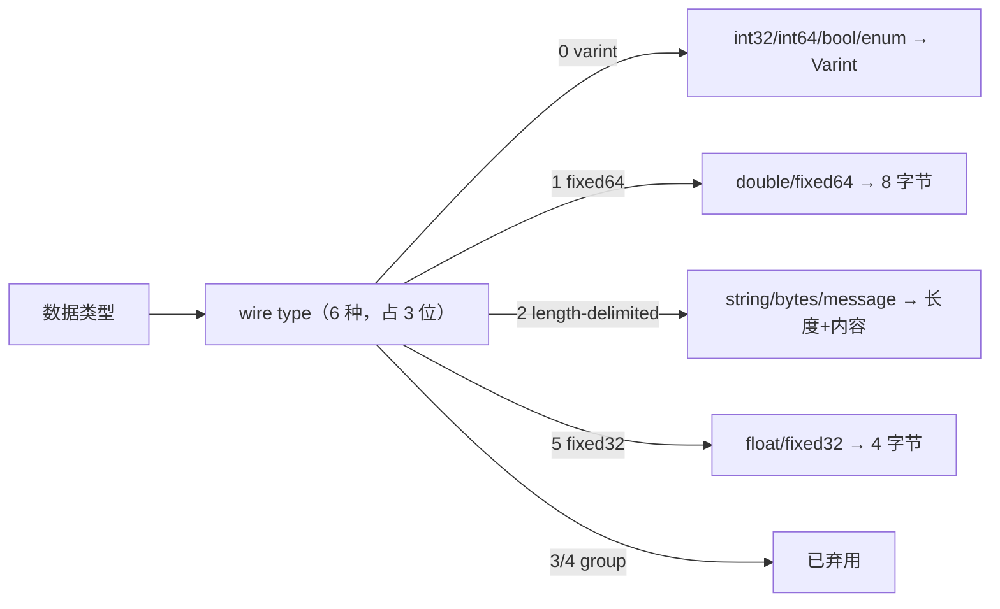
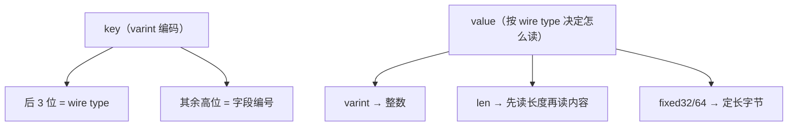

# Kubernetes 认证考点: proto3 使用与编解码原理 —— 六种 wire type、Varint 与字段安全更新

聊编解码之前有个前置知识必须知道：**数据类型会决定数据的编码方式**。protobuf 总共**只有六种数据类型（wire type），需要占用三位来存储** —— 理解这"六选三比特"，整个编码表就通了。

结论：**编码 = key + value，key 里装"字段编号 + 数据类型"（数据类型固定放在 key 的最后三位），value 就是实际数据；数字类用 **Varint 可变字节长度编码**（每字节第一位表示后面还有没有、后面 7 位是真实数据），负数用 **zigzag 算法**折成正数再 Varint；字符串与复合消息都是 `长度 + 内容`；字段顺序无序、两次序列化字节可能不同；无法识别的未知字段会被保留在序列化输出里（这就是字段兼容的关键手段）；更新字段的安全底线是**绝不改编号**，类型不兼容时走"新增字段"。**

## 纲要

- wire type：只有六种，占三位
- 数字类：Varint 变长编码
- 有符号整数：zigzag 为什么存在
- 消息编码 = key + value
- 字符串 / 浮点 / 复合消息的编码
- 字段顺序无序与未知字段保留
- 如何安全地更新字段（兼容性表）

## wire type：只有六种，占三位

**`wire type` 这个类型会决定数据的编码方式，总共只有六种，需要占用三位来存储**，分别是：

| wire type | 值 | 覆盖的类型 | 编码形态 |
| --- | --- | --- | --- |
| **varint** | 0 | **数字类型**、布尔型、枚举型（`int32`/`int64`/`bool`/`enum`） | **可变字节长度编码** |
| **i64 / fixed64** | 1 | **64 位长度**（`fixed64`/`sfixed64`/`double`） | **固定 8 字节** |
| **len** | 2 | **字符串、字节、消息类型** | **长度 + 内容**（L-V） |
| **i32 / fixed32** | 5 | **32 位长度**（`fixed32`/`sfixed32`/`float`） | **固定 4 字节** |
| **start group / end group** | 3 / 4 | **已弃用，不用管了** | — |

> 课程转写里把 wire type 念成了 `whereint` / `realtype` / `learn` / `startgroup` / `jnt`，把它们对回上表，编码过程就顺了。编码细节以**官方文档**为准，这里挑最常用的四种讲。



## 数字类：Varint 可变字节长度编码

**`varint` 是可变字节长度编码，用一个字节或者多个字节表示整数类型，更小的数占用更小的字节。**

**每个字节的第一位表示后续是否还有数字，后面的七位才是实际的数据**，这样就实现了可变长度 —— **没必要给数字 1、2、3 这类很小的数字也分配四个字节、八个字节**。

也就是说：**小数字 = 1 字节，大数字才逐字节堆上去（每字节最高位做续行标记）**。

## 有符号整数：zigzag 算法

**有符号整形使用 zigzag 算法去编码。**

**我们都知道使用二进制表示数字的数据中，正数的首位是 0，而负数的首位是 1。如果把负数也同理当正数处理，那就是一个巨大的数字了，varint 也就是没有优势了。所以这里使用 zigzag 算法，把负数转化为一个正数 —— 这个算法可以把小的负数转化为一个小的正数，原理就是小的负数和小的正数一样，出现频率最高。**

```
zigzag 映射（n → n<<1 异或 n>>31）
  0 → 0        1 → 2       -1 → 1
  2 → 4       -2 → 3
```

没有 zigzag 时 `-1` 编码出来是 10 字节（0xff×9 + 0x01），用了之后变成 1 字节 `0x01` —— **这就是"小的负数和小正数一样高频"这句结论的落点**。

## 消息编码 = key + value

**消息编码包括两部分，分别是 key 和 value。value 就是实际的数据了；key 只包含字段编号和数据类型：字段编号在消息中是唯一的，所以就可以找到对应的字段；数据类型就是上面的 wire type，再用三个 bit（固定放在 key 这个数据的最后三位）—— 所以从 key 的字节中拿到最后三位就知道数据类型了，前面的其他数据就是字段编号了；数据类型知道了，value 的长度也就确定了，于是也就可以读取到完整的 value 数据了。**



一句话：**key 自带"字段编号 + 类型"，读到 key 就知道怎么切 value —— 协议完全自描述，所以 protobuf 不需要像 JSON 那样带字段名。**

## 字符串 / 浮点 / 复合消息的编码

| 类型 | 编码格式 | 依据 |
| --- | --- | --- |
| **字符串** | **key + 长度 + 字符串** | 从 key 知道 wire type 是长度类型，再往后就是内容长度，知道了长度就能读完 |
| **浮点（32/64 位）** | **key + 32 位 / 64 位长度的字节** | key 里的 wire type 是 `i32`/`i64`，于是确定后面数据是 4 字节还是 8 字节 |
| **复合结构（message）** | **和字符串一样：key + 长度 + 内容** | 复合消息的 wire type 也是长度类型 |

## 字段顺序无序、未知字段保留

**关于字段顺序，它是无序的 —— 在 protobuf 定义中不要求有序，序列化之后也不保证有序。因此，对同一个消息进行两次序列化得到的二进制数据可能会有差异，原因就是字段顺序会变化。**

两个直接推论：

1. **别做字节级 diff 断言**：两次 `Marshal` 的字节不一定相同（所以校验/缓存别拿二进制当 key，要用结构体的规范化表示）；
2. **不会乱序出错**：读取是按 key 里的字段编号跳转，跟写顺序无关。

**关于未知字段：protobuf 中无法识别的字段，还是会保留在序列化输出中，这也是一种字段兼容的方法。** —— 老服务收到新客户端多带的字段，**不丢、原样带在输出里**，这样老服务再转发、或者新服务升级回来解出来还是完整的。

## 如何安全地更新字段

**更新 PB 文件的字段，就像更新数据表的字段一样，还是比较常见的，如何安全地更新字段也就特别重要。**

**第一点一定要记住：不能更改字段的编号，有新增加字段，就要用一个新的唯一编号；修改的话，如果字段类型不兼容，也使用新增字段的方式来做。**

### 类型兼容性表

| 兼容 | 说明 |
| --- | --- |
| `int32` / `int64` / `uint32` / `uint64` | **可以互相兼容** |
| `sint32` / `sint64` | 互相兼容，**但 `int32` 和 `sint32` 不兼容**（一个有符号编码方式不同：zigzag vs 裸 varint） |
| `string` / `bytes` / `message` / `optional` / `repeated` | **兼容** |
| `fixed32` / `sfixed32` | 兼容 |
| `fixed64` / `sfixed64` | 兼容 |
| `bool` | 有效 UTF-8 类型时，**`string` 和 `bytes` 兼容** |
| 枚举 | **和 `int32`、`uint64` 类型兼容** |

**如果类型不匹配，会发生强制类型转化和长度截断** —— 所以"看着能编过"不等于"升级安全"。更多兼容性说明用到时再查官方文档。

## API 速览

一个 proto 从定义到字节的完整链路（顺手看清 proto 文件该怎么摆）：

```text
proto 源码 → 字节流 的落点
├── proto/common/common.proto     # 公共枚举与基础消息（import 复用）
│   ├── syntax = "proto3"
│   └── enum Status { OK = 0; FAIL = 1; }
├── proto/user/user.proto         # 业务服务：service + 请求/响应
│   ├── service UserSvc
│   ├── message GetReq  { int64 id = 1; }
│   └── message GetResp { Status status = 1; bytes data = 2; }
├── proto/user/user_profile.proto # 消息太多时拆出去的第二个文件
├── cmd/protoc-gen-go-grpc        # 自定义 protoc 插件（下一讲拆它）
└── gen/
    ├── pb.pb.go                  # 消息结构体（protoc-gen-go）
    └── pb_grpc.pb.go             # 服务与方法（protoc-gen-go-grpc）

编码结果（GetReq{id:1} → 字段 1, varint）
└── 字节流：08 01
    ├── 0x08 → key = 1<<3 | 0（字段 1、wire type varint）
    └── 0x01 → value（zigzag 后的 id）
```

| 概念 | 要点 | 坑 |
| --- | --- | --- |
| wire type | **6 种、占 3 位**、决定编码方式 | group(3/4) 已弃用 |
| varint | **每字节首位 = 后面还有没有，后 7 位是数据** | 小数字只占 1 字节 |
| zigzag | **把小负数折成小正数再 varint** | `int32` 与 `sint32` 不兼容 |
| key | **后 3 位 = wire type，其余 = 字段编号** | 从 key 直接知道 value 怎么读 |
| string / message | **key + 长度 + 内容** | 两者编码方式一致 |
| 字段顺序 | **定义与序列化都不保证有序，两次字节可能不同** | 别做二进制 diff |
| 未知字段 | **无法识别的字段仍保留在序列化输出中** | 这是兼容的关键手段 |
| 更新规则 | **编号永不改、新增用新编号、不兼容类型改用新字段** | 类型不匹配会强转 + 截断 |

## Demo 示例

自己实现一轮"key + value"编解码（含 varint、zigzag、字符串），跑通之后 `protoimpl` 生成的那些字节就不神秘了：

```go
package main

import "fmt"

const (
	wireVarint  = 0
	wireFixed64 = 1
	wireLen     = 2
	wireFixed32 = 5
)

// varint：每字节最高位为续行位，低 7 位放数据
func putVarint(b []byte, x uint64) []byte {
	for x >= 0x80 {
		b = append(b, byte(x)|0x80)
		x >>= 7
	}
	return append(b, byte(x))
}

func readVarint(b []byte) (uint64, int) {
	var x uint64
	for i := 0; i < len(b); i++ {
		x |= uint64(b[i]&0x7f) << (uint64(i) * 7)
		if b[i] < 0x80 {
			return x, i + 1
		}
	}
	return 0, len(b)
}

// zigzag：把负数折成正数，让小负数也只占 1 字节
func zigzag(n int64) uint64 { return uint64(n<<1) ^ uint64(n>>63) }
func unzigzag(u uint64) int64 {
	if u&1 == 1 {
		return ^int64(u >> 1)
	}
	return int64(u >> 1)
}

// 编码一个字段：key = 字段编号<<3 | wire type
func encVarintField(num int, v int64) []byte {
	out := putVarint(nil, uint64(num)<<3|wireVarint)
	return putVarint(out, zigzag(v))
}
func encLenField(num int, v string) []byte {
	out := putVarint(nil, uint64(num)<<3|wireLen)
	out = putVarint(out, uint64(len(v)))
	return append(out, []byte(v)...)
}

func main() {
	bin := append(encVarintField(1, -1), encLenField(2, "world")...) // name=1 的负数, msg=2 的 "world"
	fmt.Printf("编码: % x\n", bin)

	i := 0
	key, n := readVarint(bin[i:]); i += n
	field, wire := int(key>>3), key&0x7
	v, n := readVarint(bin[i:]); i += n
	fmt.Printf("字段 %d / wire %d → zigzag 还原 = %d\n", field, wire, unzigzag(v))

	k2, n := readVarint(bin[i:])
	fmt.Printf("下一段: 字段 %d / wire %d, 内容 = %q\n", int(k2>>3), k2&0x7, bin[i+n+1:i+1+int(readLen(bin[i:]))])
	i += n + 1
	fmt.Println("剩余内容 =", string(bin[i:]))
}

func readLen(b []byte) int {
	v, _ := readVarint(b)
	return int(v)
}
```

关键观察（自己改数字验证）：

```bash
go run main.go
# 把 -1 改成 1  → 长度从 1 字节变 1 字节（zigzag 都是 1）
# 把 -1 改成 -1000 → zigzag 后变成 1999，占 2~3 字节；换成 int32 不带 zigzag 会直接 10 字节
# 把 "world" 改成空串 → 只剩 key 一个字节，没有长度位，这就是 len 类型"长度+内容"的形状
```

## 总结

1. **数据类型决定编码方式**：**wire type 总共只有六种，需要占用三位来存储**；**编码细节以官方文档为准，这里挑最常用的部分讲**；
2. **数字类（int32/int64、bool、enum）用 varint 可变字节长度编码**：**用一个或多个字节表示整数，更小的数占用更小的字节；每个字节的第一位表示后续是否还有数字，后面的七位才是实际数据**；
3. **有符号整形用 zigzag 算法编码**：**正数首位是 0、负数首位是 1，负数按正数处理会变成巨大的数字、varint 就没优势了；zigzag 能把小的负数转化为小的正数，因为小的负数和小的正数一样出现频率最高**；
4. **消息编码 = key + value**：**value 是实际数据；key 只包含字段编号和数据类型**，**字段编号在消息中唯一所以能找到字段**，**数据类型就是 wire type，固定放在 key 的最后三位，从 key 的字节里拿到最后三位就知道数据类型，前面的其他数据就是字段编号**；**数据类型知道了 value 的长度也就确定了，于是可以读到完整的 value**；
5. **字符串编码格式是"key + 长度 + 字符串"**：从 key 知道 wire type 是长度类型，往后就是内容长度，知道长度就能读完；**复合结构（message）的 wire type 也是长度类型，所以编码方式和字符串一样**；**浮点型就是 key + 32 位或 64 位长度的字节**，key 里的 wire type 决定后面是 4 字节还是 8 字节；
6. **字段顺序无序**：**protobuf 定义中不要求有序、序列化之后也不保证有序，所以对同一个消息两次序列化得到的二进制可能会有差异（原因是字段顺序变化）**；
7. **未知字段会被保留在序列化输出中，这是一种字段兼容的方法**；
8. **安全更新字段的第一条铁律：不能更改字段的编号，新增字段用一个新的唯一编号；如果字段类型不兼容，也用新增字段的方式来做**；
9. **类型兼容关系**：**int32/int64/uint32/uint64 互相兼容；sint32/sint64 互相兼容但 int32 与 sint32 不兼容；string/bytes/message/optional/repeated 兼容；fixed32 与 sfixed32、fixed64 与 sfixed64 兼容；string 与 bytes 在有效 UTF-8 时兼容；枚举与 int32、uint64 兼容**；**类型不匹配会发生强制类型转化和长度截断**。

