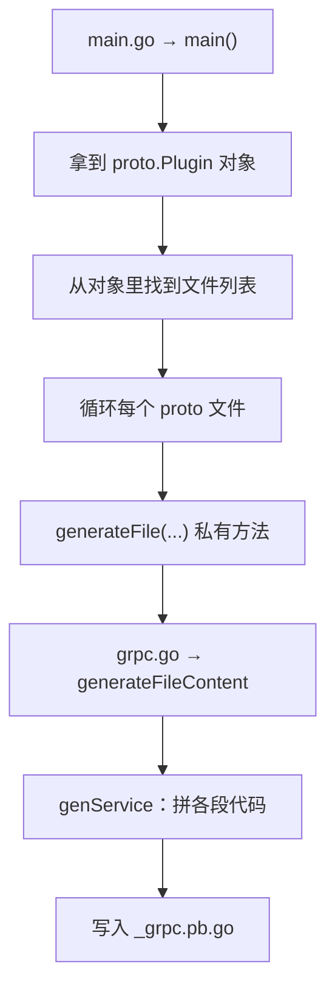
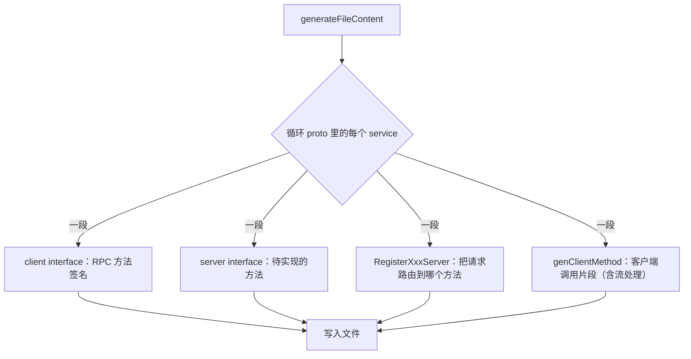

# Kubernetes 认证考点: gRPC 自定义 protoc 插件 —— 从 protoc-gen-go-grpc 源码看代码生成

要用 gRPC 生成代码，**除了 protoc 还需要两个插件**：一个是 **Go 插件**（生成 protobuf 的消息体和编解码等源码），一个是 **gRPC 插件**（生成 gRPC 服务和方法调用等代码）。

结论：**`protoc --go_out` 表示生成的 PB 代码位置、`--go-grpc_out` 表示生成的 gRPC 代码位置，最后的参数是 PB 文件（支持通配符）；落到源码里，`cmd/protoc-gen-go-grpc` 目录只有两个 Go 文件（main.go 和 grpc.go）—— main.go 拿到 `proto.Plugin` 对象里的文件列表后循环调 `generateFile`，真正的生成逻辑在 `generateFileContent` / `genService` 里，无非是"一段一段拼字符串、最后写入文件"；所以**写代码生成器不难，难的是想清楚要拼哪几段**。**

## 纲要

- 两个插件的分工与 protoc 命令
- 源码目录：cmd/protoc-gen-go-grpc 只有两个文件
- main 方法 → proto.Plugin → 文件列表 → generateFile
- generateFile：后缀 _grpc.pb.go、写注释与 package
- generateFileContent → genService：client 接口 / server 接口 / 注册方法 / 客户端方法
- 感受与动手：改源码编译成自定义插件、写自己的代码生成器

## 两个插件的分工

| 插件 | 生成什么 | 命令参数 |
| --- | --- | --- |
| **go 插件**（`protoc-gen-go`） | **protobuf 的消息体和编解码等源码** | `--go_out=.` |
| **gRPC 插件**（`protoc-gen-go-grpc`） | **gRPC 服务和方法调用等代码** | `--go-grpc_out=.` |

**protoc 命令使用是这个样子：`--go_out` 表示生成的 PB 代码位置，`--go-grpc_out` 表示生成的是 gRPC 代码位置，最后的参数是 PB 文件，这里也可以支持星号通配符。**

```bash
protoc --go_out=. --go-grpc_out=. *.proto
# └── 支持通配符：一次把目录下所有 proto 都生成一遍
```

## 源码目录：两个文件

**进入 grpc-go 源码，找到 cmd 目录里面的 `protoc-gen-go-grpc` 目录，这里就是 gRPC 插件了 —— 看到这个目录下只有两个 Go 文件，一个是 main，一个是 grpc，是不是也挺简单的。**

```text
grpc-go/
└── cmd
    └── protoc-gen-go-grpc        # gRPC 插件本体
        ├── main.go               # 入口：拿插件对象 → 遍历文件 → 生成
        └── grpc.go               # 真正的生成逻辑：generateFile / genService ...
```

一个"看起来很神秘"的工具，打开只有两个文件 —— 说明**难度不在体量，而在拆段方式**。

## main.go：入口只做三件事

**打开 main.go，映入眼帘的就是 main 方法；在 main 方法的最后面可以看到 `proto.Plugin` 这样一个对象，从这个对象里面能找到一个文件列表，然后这个循环就能够调用一个 `generateFile` 这个私有方法完成了代码生成。**



`generateFile` 这个方法**一定是在 grpc.go 里面**（看 main 只能看到它在调，实现得跳文件）。

## generateFile：定后缀、写 package

**进到 grpc.go 找 `generateFile`，这个方法很容易看懂：有定义文件名称后缀，是 `_grpc.pb.go`；会生成几段注释内容，会往文件中写入 package；最后是调用 `generateFileContent`。**

| 步骤 | 干什么 |
| --- | --- |
| ① 定义后缀 | 生成的文件名固定是 **`_grpc.pb.go`**（所以是 `helloworld_grpc.pb.go`） |
| ② 注释 | 顶部写几段注释（版本、源文件、工具名） |
| ③ package | **往文件中写入 package 名** |
| ④ 转交 | **调用 `generateFileContent`** 生成真正的主体 |

## generateFileContent → genService：四段主体

**`generateFileContent` 里面也是很容易看懂：先是一段注释，然后是一个循环调用 `genService` 生成 gRPC 服务对应的代码。**

**`genService` 方法相对来说比较长，但是内容也是按段来生成服务中的各段内容，包括：client interface 中的 RPC 方法 → server interface → 生成服务注册方法（让 gRPC 服务接收到请求时，知道如何把请求交给哪一个服务和方法来执行）；下面还有一大段代码，比如 `genClientMethod`，可以看到里面是生成客户端方法的一些片段 —— 全部的代码量也不是很大，这里不做一一讲解，打开源码自己也能看懂。**



对照 helloworld 已生成的 `helloworld_grpc.pb.go` 看，四段各自长什么样：

| 生成的段 | 你看到的代码 | 对应源 |
| --- | --- | --- |
| client 接口 | `type GreeterClient interface { SayHello(ctx, *HelloRequest, ...)*HelloReply }` | service 里的 rpc 方法 |
| server 接口 | `type GreeterServer interface { SayHello(context, *HelloRequest) (*HelloReply, error) }` | 同上 |
| 注册方法 | `func RegisterGreeterServer(s *grpc.Server, srv GreeterServer)` | 让服务收到请求知道交给谁 |
| 客户端方法 | `func (c *greeterClient) SayHello(...)` | 含连接、调用、流处理 |

## 感受：代码生成就是拼字符串

**看完之后大家感受如何 —— 强大的代码生成原来是这样的，也就是一层一层把字符串拼接起来，最后得到一个个正常的代码文件。现在让你来写一个代码生成器，还觉得难吗？**

```text
自定义插件 / 代码生成器的最小骨架
├── 输入：proto 文件（或数据库表结构）
├── 解析：拿到 service / rpc / message 的列表
├── 拼串：一段一段拼出目标语言的代码片段
│   ├── 文件头（注释 + package/import）
│   ├── 接口段（client / server 的方法签名）
│   ├── 实现段（注册 + 路由 + 调用）
│   └── 编解码段（消息体与序列化）
└── 输出：写文件（_grpc.pb.go / pb.go）
```

## 动手：改一改就成自定义插件

**有兴趣的同学可以尝试着直接修改这里的代码，然后编译得到一个自定义的 gRPC 插件；如果想再做点东西，也可以试着自己写一个代码生成器 —— 比如，根据数据库定义好的表结构，生成数据读写的代码和页面中的表单代码等。**

所以"自定义 protoc 插件"不是另一套体系：**它就是"改字符串 + 写文件"的一段程序，只是入口被 protoc 规定成了从 stdin 读 CodeGeneratorRequest、往 stdout 写 CodeGeneratorResponse。** 下面把这件事缩到最小可跑 —— 输入一份"表结构"，输出一个 Go 文件：

```go
package main

import (
	"fmt"
	"os"
	"strings"
)

// 极简代码生成器：输入表结构，拼出一段 Go 的读写函数。
// 和 protoc-gen-go-grpc 的做法一模一样：一段一段拼字符串，最后写入文件。
type table struct {
	Name    string
	Columns []string
}

func genRepo(t table) string {
	var b strings.Builder
	b.WriteString("package dao\n\n")
	b.WriteString("// Code generated by genrepo. DO NOT EDIT.\n\n")

	b.WriteString(fmt.Sprintf("type %s struct {\n", t.Name))
	for _, c := range t.Columns {
		b.WriteString(fmt.Sprintf("\t%s string `db:\"%s\"`\n", strings.Title(c), c))
	}
	b.WriteString("}\n\n")

	b.WriteString(fmt.Sprintf("func Insert%s(row *%s) error {\n", t.Name, t.Name))
	b.WriteString("\tcols := []string{")
	for i, c := range t.Columns {
		if i > 0 {
			b.WriteString(", ")
		}
		b.WriteString(fmt.Sprintf("%q", c))
	}
	b.WriteString("}\n")
	b.WriteString("\t// 真正的拼 SQL、执行、处理错误\n")
	b.WriteString("\treturn nil\n}\n")
	return b.String()
}

// generateFile —— 与 grpc.go 里的同名的那个私有方法一个意思：
// 定文件名、写内容、落盘
func generateFile(name string, content string) error {
	return os.WriteFile(name, []byte(content), 0o644)
}

func main() {
	gen := genRepo(table{Name: "UserRank", Columns: []string{"id", "user_id", "score"}})
	if err := generateFile("user_rank_gen.go", gen); err != nil {
		panic(err)
	}
	fmt.Println("已生成 user_rank_gen.go（这里不再 print 内容，实际会落盘）")
}
```

跑完去看 `user_rank_gen.go`：

```bash
go run main.go && cat user_rank_gen.go
# 这就是"一层一层把字符串拼起来"的最小证明
# 再朴素一点的做法：把 genRepo 换成读 proto 解析结果，就变回了 protoc 插件的技术形态
```

## Demo 示例

```bash
# ① 看生成命令（两个插件 + 通配符）
protoc --go_out=. --go-grpc_out=. *.proto

# ② 看插件目录只有两个文件
cd cmd/protoc-gen-go-grpc && ls
# main.go  grpc.go

# ③ 顺着调用链跳（对照 helloworld_grpc.pb.go 看）
grep -n "generateFile\|generateFileContent" grpc.go | head
grep -n "genService\|genClientMethod" grpc.go | head

# ④ 改一行注释，编译出自己的插件
sed -i '' 's/Code generated by/Code generated by MY-PLUGIN/' grpc.go
go build -o /usr/local/bin/protoc-gen-go-grpc .   # GOPATH/bin 必须在 PATH 里
protoc --go_out=. --go-grpc_out=. *.proto
head -1 *_grpc.pb.go        # 变成你自己的注释
```

## 总结

1. **gRPC 生成代码需要两个插件**：**go 插件生成 protobuf 的消息体和编解码等源码，gRPC 插件生成 gRPC 服务和方法调用等代码**；
2. **命令形式**：`--go_out` 表示**生成的 PB 代码位置**，`--go-grpc_out` 表示**生成的是 gRPC 代码位置**，**最后的参数是 PB 文件，也支持星号通配符**；
3. **源码位置**：**grpc-go 源码的 cmd 目录里有 `protoc-gen-go-grpc`，这里就是 gRPC 插件，目录下只有两个 Go 文件 —— 一个 main、一个 grpc**；
4. **main.go 干了什么**：**main 方法的最后面可以看到 `proto.Plugin` 这样一个对象，从对象里能找到文件列表，然后循环调用 `generateFile` 私有方法完成代码生成**；
5. **generateFile 在 grpc.go 里**：**定义文件名称后缀是 `_grpc.pb.go`，生成几段注释内容，往文件中写入 package，最后是调用 `generateFileContent`**；
6. **generateFileContent 循环调用 genService**：**genService 生成 gRPC 服务对应的各段代码，包括 client interface 中的 RPC 方法、server interface、服务注册方法（让 gRPC 服务接收到请求时知道如何把请求交给哪一个服务和方法来执行），还有 `genClientMethod` 这样生成客户端方法片段的代码**；
7. **总代码量并不大，值得自己打开源码看一遍**；**看不懂的地方对照前面 helloworld 已经生成的代码文件来看**；
8. **核心感受**：**强大的代码生成原来就是一层一层把字符串拼接起来，最后得到一个个正常的代码文件** —— 所以**自己写生成器并不难**；
9. **两个可动手的方向**：**直接修改插件代码、编译得到自定义的 gRPC 插件**；**自己写代码生成器，比如根据数据库定义好的表结构，生成数据读写的代码和页面中的表单代码**。

