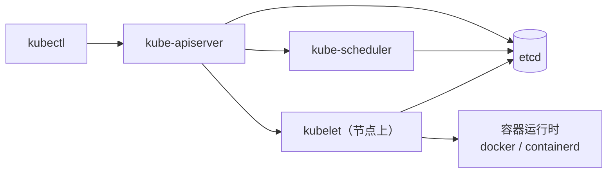
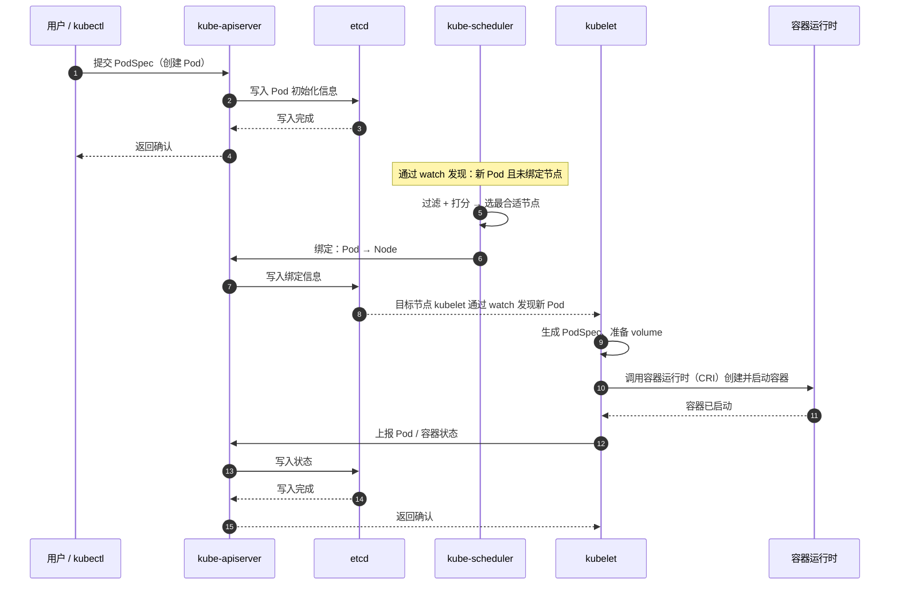
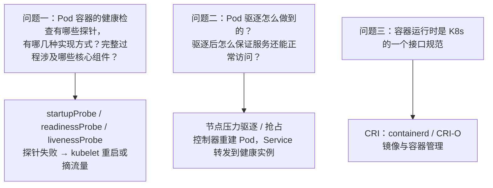

# Pod 创建和启动流程

这一节通过一个典型的执行过程，把前面讲过的核心组件串起来：涉及 kubectl、APIServer、etcd、scheduler、kubelet、容器运行时（docker/containerd）。**回顾讲过的 K8s 核心组件，只剩下 controller-manager 和 kube-proxy 没在流程里体现 —— 其实只是这个流程没体现，所有组件在 K8s 各类操作中或多或少都会用到。**

结论：**用户用 kubectl 或 API 客户端提交 PodSpec 给 APIServer → APIServer 把 Pod 对象初始化信息存入 etcd 并返回确认 → 各组件用 watch 机制跟踪资源变动 → scheduler 通过 watch 发现新 Pod 且未绑定节点，按资源需求过滤、打分、选出最合适节点并绑定回写 APIServer（再落 etcd）→ 目标节点上的 kubelet 通过 watch 发现要绑到自己节点的 Pod，调用容器运行时创建并启动 Pod 和容器 → 容器启动成功后 kubelet 把 Pod 与容器状态更新到 APIServer（落 etcd 后返回确认）。**

## 纲要

- 涉及哪些组件
- 完整七步：从 kubectl 到 Running
- 一张时序图
- 为什么每步都是"写 etcd + watch"
- 课后三问：探针、驱逐、容器运行时

## 涉及哪些组件



| 组件 / 工具 | 在流程里的角色 |
| --- | --- |
| **kubectl** | 用户提交 PodSpec 的入口（或任何其他 API 客户端） |
| **APIServer** | **K8s 对外的接口服务**，所有写与读都经它 |
| **etcd** | **K8s 的持久化数据库** |
| **kube-scheduler** | **调度器**：选节点、绑定 |
| **kubelet** | **普通集群节点上的核心组件**：建 Pod、起容器、回状态 |
| **容器运行时** | **容器运行与管理工具**（docker / containerd） |
| （controller-manager、kube-proxy） | 本流程没直接体现，但几乎所有操作都会用到 |

## 完整七步

1. **用户创建一个 Pod，通过 kubectl 或其他 API 客户端提交 PodSpec 给 APIServer，告知需要创建 Pod**；
2. **APIServer 尝试将 Pod 对象的初始化信息存入 etcd，写入完成后返回确认信息给客户端**；
3. **所有 K8s 组件都用 watch 机制跟踪 APIServer 上资源变动 —— kube-scheduler 通过 watch 发现新 Pod 对象，且还没绑定到任何集群节点**；
4. **kube-scheduler 根据 Pod 资源需求规格，经过集群节点过滤找到可调度节点、给节点打分，挑选最合适的工作节点，然后将 Pod 与节点的信息绑定、更新到 APIServer**；
5. **同样的，APIServer 收到绑定对象会写入 etcd 数据库**；
6. **目标节点上的 kubelet 通过 watch 发现有需要绑定的新 Pod，就在这个节点上调用容器运行时创建 Pod 和启动容器**；
7. **容器启动成功后，kubelet 将 Pod 和容器状态信息更新到 APIServer，etcd 确认写入完整后 APIServer 返回确认给 kubelet —— 流程完成**。



## 为什么每步都是"写 etcd + watch"

**这个流程反复出现的 pattern：每一次状态变化都是"组件写 APIServer → 落 etcd → 别人 watch 到 → 再接手"。**

```dir
组件之间不直接调用，全部经由 APIServer 中转
kubectl ──写──> apiserver ──写──> etcd
                    │
                    ├── watch(发现新Pod) ──> scheduler ──写绑定──> apiserver ──> etcd
                    └── watch(发现待绑Pod) ─> kubelet ──写状态──> apiserver ──> etcd
```dir

三个推论（考试与排障都用得着）：

- **组件无点对点调用** —— 所以"某步没做"要往"谁没 watch 到"上排查；
- **APIServer 是唯一写入口** —— 组件只能改 etcd 里的数据，不能直接写；
- **状态永远从 etcd 出发** —— 任一步中断，恢复后组件从 etcd 当前状态继续收敛。

## 课后三问

**现在知道了 Pod 创建和启动流程，现实中很多操作只要稍微变化，整个过程也会有变化。**



1. **问题一**：Pod 容器的健康检查有哪些探针、有哪几种实现方式？完整过程涉及哪些核心组件；
2. **问题二**：Pod 驱逐怎么做到的？驱逐后怎么保证服务正常运行和访问？过程能否完整描述；
3. **问题三**：容器运行时是 K8s 的一个接口规范（CRI），课程没详细讲，可再找资料深入了解，毕竟镜像和容器管理非常重要。

## Demo 示例

把七步逐段打点观测：

```bash
# 先给变量赋值，例如：POD=$(kubectl get pod -o jsonpath='{.items[0].metadata.name}')
# ① 步骤 1-2：提交并落库
kubectl apply -f pod-demo.yaml
kubectl get pod $POD --show-managed-fields -o yaml | head -40

# ② 步骤 3-5：scheduler 还没绑定时 nodeName 为空
kubectl get pod $POD -o jsonpath='{.spec.nodeName}'   # 空 = 未调度
kubectl describe pod $POD | grep -A5 -i events        # FailedScheduling

# ③ 步骤 6：kubelet 在本地拉起容器（事件顺序：Pulled → Created → Started）
kubectl describe pod $POD | grep -i -E "pulled|created|started|scheduled"

# ④ 步骤 7：状态写回 etcd
kubectl get pod $POD -o jsonpath='{.status.phase}'    # Running
kubectl get --raw /api/v1/namespaces/default/pods/$POD

# ⑤ 全程 watch
kubectl get pod -w
```

排障对应表：

| 症状 | 卡在哪一步 | 看什么 |
| --- | --- | --- |
| Pending 不动 | 步骤 4（调度） | `describe pod` 的 Events / `kubectl get events` |
| ContainerCreating 卡住 | 步骤 6（容器创建） | describe 的 Events、镜像是否可拉、volume 是否就绪 |
| Running 但不服务 | 步骤 7（状态与探针） | readinessProbe、Endpoints 是否挂上 |
| 重启次数涨 | 步骤 6-7（liveness 探活失败） | `kubectl get pod` 的 RESTARTS |

## 总结

1. **涉及组件**：kubectl、APIServer、etcd、scheduler、kubelet、容器运行时（docker/containerd）；**只剩 controller-manager 和 kube-proxy 没在流程中体现，但所有组件在 K8s 各类操作中或多或少都会用到**；
2. **第 1-2 步**：**用户提交 PodSpec 给 APIServer，APIServer 把初始化信息存入 etcd，写入完成后返回确认**；
3. **第 3 步**：**所有组件用 watch 机制跟踪 APIServer 资源变动 —— scheduler 通过 watch 发现新 Pod 且未绑定节点**；
4. **第 4-5 步**：**scheduler 按资源需求过滤、打分，挑最合适节点，把 Pod 与节点信息绑定更新到 APIServer；APIServer 把绑定对象写入 etcd**；
5. **第 6 步**：**目标节点 kubelet 通过 watch 发现有待绑定的新 Pod，调用容器运行时创建 Pod 和启动容器**；
6. **第 7 步**：**容器启动成功后 kubelet 把 Pod 和容器状态更新到 APIServer，etcd 确认写入完整后 APIServer 返回确认给 kubelet —— 流程完成**；
7. **pattern 很好记**：组件不直接互相调用，全部经 APIServer 中转，状态变化都是"写 APIServer → 落 etcd → 别人 watch 到 → 接手"，所以中断后能从 etcd 当前状态继续收敛；
8. **三道课后题值得自己答一遍**：① 探针种类与实现、涉及哪些组件；② 驱逐怎么做、驱逐后如何保证服务可访问；③ 容器运行时是 K8s 的接口规范（CRI），需自己再深入了解。
