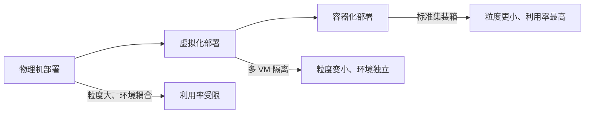
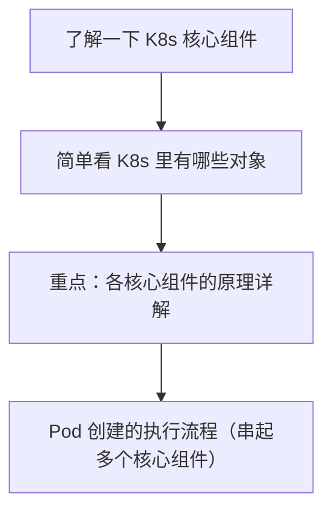

# Kubernetes 核心组件 本章导学

上一章我们了解了 gRPC 的一些内容。这一章开始学习 Kubernetes（常读作 k8s）。先简单回顾一下部署环境的演进，再给出本章的学习路线。

## 纲要

- 部署环境的三段演进：物理机 → 虚拟化 → 容器
- 用"海上游轮"类比三者的资源利用率差异
- 本章路线：核心组件 → 资源对象 → 各组件原理 → Pod 创建流程
- 为什么原理"用不上却必须学"
- 一张演进与路线地图

## 部署环境的三段演进

最早部署应用都是**直接在物理机上**，每个物理机就是一个运行环境。如果多种应用要部署在一起，需要这台物理机具备多种环境的能力。

后来为了提高物理机利用率，使用了**虚拟化技术**：它可以在一台物理机上做出互相隔离的多个虚拟机，把服务器资源粒度做小，环境也更独立。

而现在进入**容器化时代**，资源粒度可以做得更小，比虚拟化时代小很多很多。



## 用"海上游轮"做类比

这个过程可以用海上的游轮来对比：

| 阶段 | 游轮类比 | 资源利用特点 |
| --- | --- | --- |
| **物理机时代** | 一艘游轮就是一个环境，所有货物往上堆 | 对矿石、原油等大宗商品利用率还行（量大、环境单一），其他货物不合适 |
| **虚拟化时代** | 把游轮划分为多个区域（a 区粮食、b 区百货、c 区生鲜、d 区木材/动植物） | 能放更多种类货物，可按需调整各区域大小，利用率提高很多 |
| **容器化时代** | 大鲸鱼背很多标准集装箱，游轮上直接放标准集装箱，里面装什么自己定 | 极大提高利用率，也极大提高装箱、卸货、运输效率 |

**容器化时代就像图标里的大鲸鱼背着很多标准集装箱**：游轮上直接放标准集装箱就可以了，集装箱里到底放粮食、日用品、生鲜还是动植物，自己决定即可。Docker（常念 dockboss）可以帮助我们管理成千上万的集装箱，以及如何提高利用率、如何更高效地部署和运行等等工作。

## 本章学习路线



1. **了解 K8s 的核心组件**：先对 K8s 有一个框架性的了解；
2. **简单看一下 K8s 里的对象有哪些**：让大家对 K8s 有个整体认识；
3. **本章重点：对各个核心组件的原理做详细讲解** —— 虽然这些原理性的东西在实际工作中用不上，但**面试中肯定会被问到**，因为工作中一旦遇到问题，这些原理性知识才能帮我们快速定位并解决问题；
4. **了解 Pod 创建的执行流程**：这个过程会用到很多 K8s 核心组件，也能帮我们更好地理解它们的作用。

## 为什么原理"用不上却必须学"

课程里特别点了一句大实话：**这些原理性的东西在实际工作中是用不上的，但在面试中肯定要被问到**。原因很现实 —— 工作中一旦遇到问题（Pod 起不来、调度不出去、节点 NotReady），**只有懂原理才能顺着组件链快速定位并解决**，而不是只会 `kubectl get` / `kubectl describe` 碰运气。

```dir
本章内容落点
├── 核心组件（控制面 + 节点）
│   ├── kube-apiserver / etcd / kube-controller-manager / kube-scheduler
│   └── kubelet / kube-proxy
├── 资源对象总览
│   └── Pod / Service / Deployment / ConfigMap / Secret ...（几十种）
├── 各组件原理
│   ├── APIServer 原理
│   ├── ControllerManager 原理
│   ├── Scheduler 原理
│   └── Kubelet 原理
└── 串起来：Pod 创建和启动流程
```dir

## 总结

1. **部署演进三段**：**物理机（环境耦合、粒度大）→ 虚拟化（多 VM 隔离、粒度变小）→ 容器化（标准集装箱、粒度最小、利用率最高）**；
2. **游轮类比**：物理机是一艘船堆所有货；虚拟化是把船分区放不同货；容器化是大鲸鱼背标准集装箱，里面装什么自己定，利用率与装卸效率都极大提高；
3. **Docker 的角色**：帮助管理成千上万的"集装箱"（容器），提高利用率、优化部署与运行；
4. **本章路线**：先看**核心组件** → 再看**资源对象有哪些** → 重点讲**各核心组件原理** → 最后用**Pod 创建流程**串起这些组件；
5. **原理的价值**：实际工作用不上，但**面试必问**，且出问题时只有懂原理才能快速定位解决；
6. **Pod 创建流程的意义**：会用到很多核心组件，是理解这些组件作用的最好载体。
