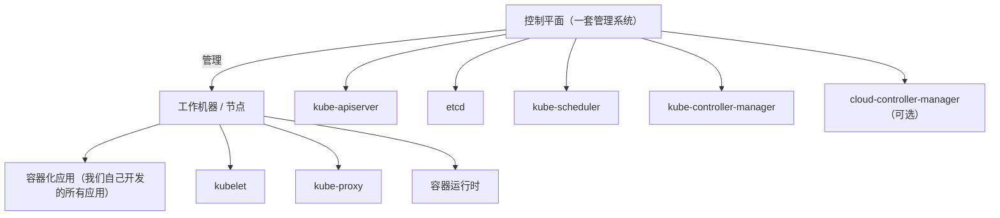
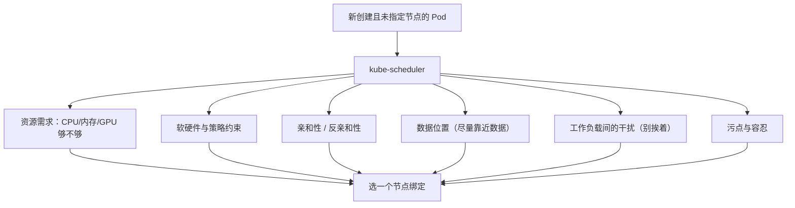
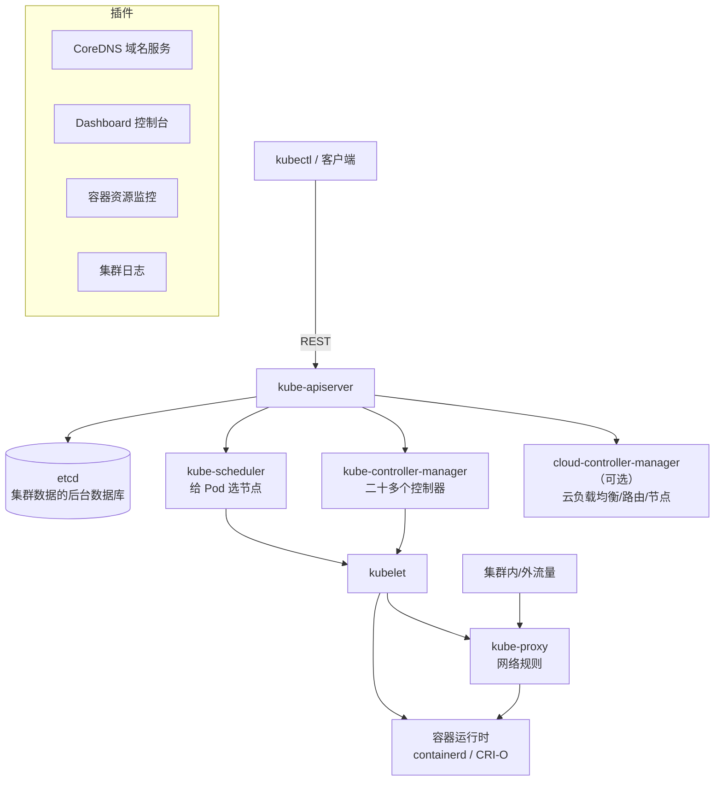

# Kubernetes 认证考点: K8s 核心组件 —— 控制平面五个加上节点三个

先看一张 K8s 集群架构图，核心组件都标在上面。**一个 K8s 集群可以分为两个部分：右边是一组工作机器，称为节点，上面运行容器化的应用程序 —— 自己开发的所有应用都跑在这些节点上；左边是 K8s 集群的控制平面，它是一套管理系统，专门管理右边的集群节点和服务。**

结论：**控制平面五个组件 —— `kube-apiserver`（公开 API、控制平面的前端、可水平扩缩）、`etcd`（一致且高可用的 KV 存储，K8s 集群数据的后台数据库）、`kube-scheduler`（给未指定节点的 Pod 选节点）、`kube-controller-manager`（二十多个控制器进程）、可选 `cloud-controller-manager`（接云厂商 API）；节点三个 —— `kubelet`（保证容器跑在 Pod 里并健康）、`kube-proxy`（维护网络规则）+ 容器运行时（containerd / CRI-O）；再加一堆插件（DNS、Dashboard、监控、日志）。**

## 纲要

- 集群的两半：控制平面 vs 节点
- 控制平面组件一：kube-apiserver 与 etcd
- 控制平面组件二：kube-scheduler 怎么选节点
- 控制平面组件三：kube-controller-manager 的二十多个控制器
- 控制平面组件四：cloud-controller-manager（可选）
- 节点组件：kubelet 与 kube-proxy
- 容器运行时与插件
- 一张总图

## 集群的两半



## 控制平面组件：kube-apiserver 与 etcd

| 组件 | 职责 | 要点 |
| --- | --- | --- |
| **kube-apiserver** | **负责公开了 K8s 的 API，是 K8s 控制平面的前端** | **设计上考虑了水平扩缩，也就是可以运行多个 API server** |
| **etcd** | **一致、高可用的 key-value 存储，用作 K8s 集群数据的后台数据库** | **注意：这里的 etcd 是作为 K8s 集群的数据库，并不是给自己开发的业务服务应用程序使用的数据库** |

这两条是**高频考点与高频踩坑点**：

- **apiserver 是唯一入口**：所有组件（包括 kubectl）都通过它读写，所以它能多副本水平扩容；
- **etcd 属于集群不属于业务**：业务数据请用自己的 MySQL/Redis，别往集群 etcd 里塞业务表 —— etcd 对延迟敏感、有体积上限（默认 etcd 配额 2GB），塞业务数据会拖垮整个控制平面。

## 控制平面组件：kube-scheduler

**kube-scheduler 负责监控新创建的、未指定运行节点的 Pod，并选择节点来让 Pod 在上面运行。调度决策考虑的因素包括：单个 Pod 和 Pod 集合的**资源需求**、**软硬件和策略约束**、**亲和性和反亲和性**、**数据位置**、**工作负载间的干扰**，最后（还有污点与容忍 taints/tolerations）。**



## 控制平面组件：kube-controller-manager

**kube-controller-manager 负责运行控制器进程，这里有二十多个控制器**：

| 控制器 | 干什么 |
| --- | --- |
| **节点控制器** | **负责在节点出现故障时进行通知和响应** |
| **任务控制器**（Job 控制器） | **监测代表一次性任务的 Job 对象，然后创建 Pod 来运行这些任务直至完成** |
| **端点（分片）控制器** | **填充端点对象，提供 Service 和 Pod 之间的连接** |
| **服务账号控制器** | **为新的命名空间创建默认的服务账号** |

**"控制器 = 循环 + 对比期望与真实 + 补齐差异"** —— 记住这句话，后面所有组件原理其实都是这一个套路。

## 控制平面组件：cloud-controller-manager（可选）

**K8s 控制平面还有一个 cloud-controller-manager 组件，是可选的、嵌入的特定于云平台的控制回路。它允许你把集群连接到云提供商的 API 之上，可以与该云平台交互；类似于 kube-controller-manager，控制器都包含云平台的驱动依赖。**

- **节点控制器**：**在节点终止（终指）时响应，检查云提供商已确定节点是否已被删除**；
- **路由控制器**：**在底层云基础设施里设置路由**；
- **服务控制器**：**创建、更新和删除云提供商负载均衡器**。

理解它的存在感：把"云厂商的东西（SLB、云路由、云机器生命周期）"从核心集群里剥出去，**自建集群时它不装，云上集群（如 TKE）它替你干活**。

## 节点组件只有两个

| 组件 | 干什么 | 边界 |
| --- | --- | --- |
| **kubelet** | **在集群每个节点上运行，保证容器都运行在 Pod 中；接受一组通过各类机制提供给它的 PodSpecs，确保这些 PodSpecs 中描述的容器处于运行状态且健康** | **它不会管理不是由 K8s 创建的容器** |
| **kube-proxy** | **集群中每个节点上运行的网络代理，维护节点上的网络规则，这些网络规则允许从集群内部或外部的网络会话与 Pod 进行网络通信** | 就是 Service 的负载均衡转发实现 |

**kubelet 那句"不管理非 K8s 创建的容器"很重要** —— 你在节点上用 `docker run` 起的容器，kubelet 不管、不会重启、也不计入调度。

```text
一个节点（Node）内部
├── kubelet            # 收 APIserver 下发的 PodSpec，拉起/重启/探活容器
│   ├── 保证容器运行在 Pod 中
│   └── 只管 K8s 创建的容器
├── kube-proxy         # 维护本节点的网络规则（iptables/IPVS）
│   └── 集群内/外会话 ↔ Pod 的网络通信
└── 容器运行时（CRI）  # 负责运行和管理容器的整个生命周期
    ├── containerd     # 主流
    └── CRI-O          # K8s CRI 的其他实现
```

## 容器运行时与插件

**除了这些 K8s 核心组件，要让一个集群正常跑起来，还需要一个软件 —— 容器运行时，需要一个容器运行时环境来负责运行和管理容器的整个生命周期。K8s 支持许多容器运行环境，例如 containerd、CRI-O 以及 K8s CRI 的其他任何实现。**

**为了扩充 K8s 的能力，还有很多插件可以使用，比如 DNS（集群的域名服务）、Dashboard（集群的管理控制台），还有容器资源监控和集群日志等等。**

## 一张总图



## API 速览

| 组件 | 层次 | 关键点 |
| --- | --- | --- |
| `kube-apiserver` | 控制平面 | **公开 API、控制平面前端、可多副本水平扩缩** |
| `etcd` | 控制平面 | **一致高可用 KV；是"集群"数据库，不是业务数据库** |
| `kube-scheduler` | 控制平面 | 给未指定节点的 Pod 选节点；**资源需求、软硬/策略约束、亲和反亲和、数据位置、干扰、污点容忍** |
| `kube-controller-manager` | 控制平面 | **二十多个控制器**：节点、Job、端点（分片）、服务账号… |
| `cloud-controller-manager` | 控制平面（可选） | 接云厂商 API：节点/路由/负载均衡器 |
| `kubelet` | 节点 | **保证容器运行在 Pod 中且健康；不管非 K8s 创建的容器** |
| `kube-proxy` | 节点 | 维护网络规则，让集群内外会话与 Pod 通信 |
| 容器运行时 | 节点 | containerd / CRI-O，管容器整个生命周期 |
| 插件 | 集群 | DNS、Dashboard、容器资源监控、集群日志 |

## Demo 示例

把"控制平面 → 节点"这条链路用命令摸一遍（**注意：不要再往 `_posts/` 拷任何东西，只在本目录对照输出**）：

```bash
# 先给变量赋值，例如：NODE=$(kubectl get node -o jsonpath='{.items[0].metadata.name}')；POD=$(kubectl get pod -o jsonpath='{.items[0].metadata.name}')
# ① 看控制平面组件（云上或 kind/minikube 环境）
kubectl get pods -n kube-system -o wide
# 通常能看到 kube-apiserver / etcd / kube-scheduler / kube-controller-manager / kube-proxy / coredns

# ② 看节点与各节点上的 pod（kubelet、kube-proxy、运行时插件）
kubectl get nodes -o wide
kubectl describe node $NODE | grep -i -E "kubelet|proxy|runtime"

# ③ 看 kubelet 接受并执行的 PodSpec（容器内日志目录下的审计/kubelet 日志）
kubectl get pod $POD -o yaml | grep -A5 "containers:"   # 这就是 kubelet 要保的东西

# ④ 看调度决策发生在哪一步：Pod 长时间 Pending = scheduler 没选到节点
kubectl get pod $POD -o jsonpath='{.spec.nodeName}'       # 空 = 还没调度
kubectl describe pod $POD | grep -A3 Events               # 看调度失败原因

# ⑤ 看 Service ↔ Pod 的连接是谁维护的：端点对象由端点控制器填充
kubectl get endpoints
kubectl get endpointslices
```

排障三连（对应组件各一个症状）：

```bash
# kubelet 挂了 → 节点 NotReady，Pod 被驱逐/重建
kubectl get nodes      # Ready=False

# kube-proxy 挂了 → 节点内网络规则失效，Service 不通（但 Pod 本身是好的）
kubectl get pod -n kube-system -l k8s-app=kube-proxy

# etcd 挂了 → apiserver 兜不住，kubectl 全部超时（这是最致命的一个）
kubectl get pods        # 长时间无响应 → 先看 etcd 与 apiserver
```

## 总结

1. **集群分两半**：**右边是工作机器（节点），运行容器化的应用程序，我们自己开发的所有应用都跑在这些节点上；左边是控制平面，是一套专门管理右侧集群节点和服务的管理系统**；
2. **kube-apiserver**：**负责公开 K8s 的 API，是 K8s 控制平面的前端；设计上考虑了水平扩缩，可以运行多个 API server**；
3. **etcd**：**一致且高可用的 key-value 存储，用作 K8s 集群数据的后台数据库；特别注意它是"集群"的数据库，不是给自己业务服务用的数据库**（业务数据请放自己的存储）；
4. **kube-scheduler**：**监控新创建的未指定运行节点的 Pod，并选择节点让 Pod 运行；决策考虑单个 Pod 和 Pod 集合的资源需求、软硬件和策略约束、亲和性和反亲和性、数据位置、工作负载间的干扰，最后还有污点与容忍**；
5. **kube-controller-manager**：**负责运行控制器进程，有二十多个控制器**；**节点控制器负责在节点出现故障时通知和响应；任务控制器监测代表一次性任务的 Job 对象、创建 Pod 运行任务直至完成；端点（分片）控制器填充端点对象，提供 Service 和 Pod 之间的连接；服务账号控制器为新的命名空间创建默认的服务账号**；
6. **cloud-controller-manager（可选）**：**嵌入的特定于云平台的控制回路，把集群连接到云提供商的 API 上与之交互；节点控制器在节点终止时响应检查云提供商是否已确定节点被删除，路由控制器在底层云基础设施设置路由，服务控制器创建更新和删除云提供商负载均衡器**；
7. **节点组件只有两个**：**kubelet 在每个节点上运行，保证容器都运行在 Pod 中，接受通过各类机制提供的 PodSpecs 并确保其中描述的容器处于运行状态且健康，但不管理不是由 K8s 创建的容器；kube-proxy 在每个节点上运行网络代理，维护节点上的网络规则，允许从集群内部或外部的网络会话与 Pod 进行网络通信**；
8. **还需要容器运行时**：**负责运行和管理容器的整个生命周期，支持 containerd、CRI-O 以及 K8s CRI 的其他实现**；
9. **插件扩充能力**：**DNS（集群域名服务）、Dashboard（管理控制台）、容器资源监控、集群日志等**；
10. **总清单**：**控制平面 = kube-apiserver + etcd + kube-scheduler + kube-controller-manager +（可选）cloud-controller-manager；节点 = kubelet + kube-proxy + 容器运行时；再加一批插件**。

