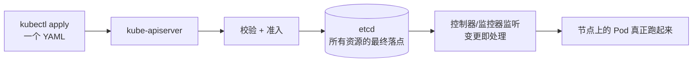

# Kubernetes 认证考点: K8s 的资源 —— 七大类资源模型与它们各自管什么

提到 K8s 的资源，很快就能说出很多：**Pod、Deployment、Job、Service、Ingress、ConfigMap** 等等。这一节不深挖它们之间的关系，只做一次全面罗列，先建立整体认知。

结论：**K8s 资源就是自己设计系统时的一个数据模型、或者定义的一张表的数据，这些资源最终都要持久化保存到 etcd 中，有些资源的数据变更甚至还会被其他监控器监听以及处理。** 它们分七类：**工作负载资源**（Pod / Deployment / Service / Ingress）、**配置与存储资源**、**身份认证资源**、**鉴权资源**、**策略资源**、**集群资源**、**扩展资源**。

## 纲要

- 资源 = 一张"表"的数据，最终都落在 etcd
- 工作负载资源：Pod / Deployment / ReplicaSet / Service / Ingress
- 配置与存储资源
- 身份认证资源：账号与认证方式
- 鉴权资源：谁可以访问和操作系统资源
- 策略资源：资源策略与网络访问策略
- 集群资源：节点与命名空间
- 扩展资源：对外公开与 webhook 调用
- 一张分类总图

## 资源就是"一张表的数据"

**K8s 资源就是咱们自己设计系统时的一个数据模型，或者定义的一张表的数据。这些 K8s 资源最终也是要持久化保存到 etcd 中的；有些资源的数据变更，甚至还会被其他监控器监听以及处理。**



这句话解释了 K8s 的本质：**你不是"命令机器启动一个容器"，而是"往这张表里插入一行"，剩下的由控制器去收敛到这行数据描述的状态。**

## 工作负载资源：最常使用的那几个

**从最常使用的资源开始看 —— 工作负载资源，这里的资源都是需要使用到服务器的 CPU、内存这些计算资源的。**

| 资源 | 是什么 | 适用 |
| --- | --- | --- |
| **Pod** | **可以在主机上运行的容器的集合** | **K8s 里最小的调度单元** |
| **Deployment** | **让 Pod 和 ReplicaSet 能够进行声明式更新（也就是把 Pod 和 ReplicaSet 等信息都配置到 Deployment 对象中）** | **适用于无状态服务的部署方式** |
| **Service** | **可以把 Pod 内部的应用暴露出去；Service 是服务的命名抽象，可以把应用的端口号暴露出来** | 集群内/外的稳定访问入口 |
| **Ingress** | **通过规则把服务暴露出来，可以通过 URL 访问，支持负载均衡等特性** | **有些网关服务就定义成了一个 Ingress 对象** |

几个容易混的点：

- **Pod 是集合不是容器**：一个 Pod 里可以有多个容器，它们共享网络命名空间，所以"容器都在 Pod 里跑"；
- **Deployment 是声明式的**：你写的是"我要 3 个副本、镜像是 v2"，K8s 负责把现状收敛到这个声明；
- **Service 是命名抽象**：Service 后面挂的是 Pod 的选择器（selector），Pod 重建换 IP 也不影响调用方 —— **集群里访问服务用 Service 名，从来不用 Pod IP**；
- **Ingress 是七层规则的载体**：路径/域名 → 转发到哪个 Service，所以网关类能力可以直接表达成一个对象。

## 配置与存储资源

**配置和存储资源：这里可以定义配置信息、存储卷等。** 典型就是 **ConfigMap**（配置信息）与 **Secret**（敏感配置），以及 **Volume / PVC / PV / StorageClass**（存储卷的声明与后端）。

## 身份认证资源

**身份认证资源：可以定义使用人的账号和访问认证方式的健全（ServiceAccount）资源。** 典型：**ServiceAccount**（Pod 运行时用的身份）+ 认证方式（token / OIDC 等）。

## 鉴权资源

**鉴权资源：可以定义哪些角色、身份主体可以访问和操作集群资源。** 典型三件套：**Role / ClusterRole（角色）+ RoleBinding / ClusterRoleBinding（绑定）+ Subject（身份主体）** —— 也就是俗称的 **RBAC 三件套**，Pod 想调 K8s API 时靠它授权。

## 策略资源

**策略资源：可以定义服务资源策略、网络访问策略等。** 典型：

- **LimitRange / ResourceQuota**：单个 Pod 与命名空间的资源额度；
- **NetworkPolicy**：网络访问策略（谁能访问谁）；
- **PodDisruptionBudget**：中断预算（维护时至少留几个副本）。

## 集群资源与扩展资源

- **集群资源：可以定义集群的节点、命名空间等** —— 典型 **Node**（节点本身也是一种资源，可以 `kubectl get nodes` 看到）、**Namespace**（命名空间，资源的逻辑边界）；
- **扩展资源：定义哪些资源可以对外公开、哪些可以通过 webhook 来调用** —— 典型 **CustomResourceDefinition（CRD）**（自定义资源对象）与 **APIService / Webhook**（扩展 API 与准入/校验钩子）。

## 一张分类总图

```text
K8s 资源（最终都持久化在 etcd）
├── 工作负载（占用 CPU / 内存）
│   ├── Pod                  # 容器的集合，最小调度单元
│   ├── ReplicaSet           # 维持副本数（通常由 Deployment 管理）
│   ├── Deployment           # 声明式更新，面向无状态服务
│   ├── Job / CronJob        # 一次性任务 / 定时任务
│   ├── StatefulSet          # 有状态服务（有稳定名字与存储）
│   ├── DaemonSet            # 每台节点一个（日志/监控代理）
│   ├── Service              # 服务的命名抽象，暴露端口号
│   └── Ingress              # URL 规则暴露服务，支持负载均衡
├── 配置与存储
│   ├── ConfigMap / Secret   # 配置信息 / 敏感配置
│   └── Volume / PVC / PV / StorageClass
├── 身份认证
│   └── ServiceAccount       # 使用人的账号 + 访问认证方式
├── 鉴权（RBAC）
│   ├── Role / ClusterRole               # 角色：能操作什么
│   ├── RoleBinding / ClusterRoleBinding # 绑定：谁用这个角色
│   └── ServiceAccount（作为主体）
├── 策略
│   ├── LimitRange / ResourceQuota       # 资源策略
│   ├── NetworkPolicy                    # 网络访问策略
│   └── PodDisruptionBudget              # 中断预算
├── 集群
│   ├── Node                             # 集群的节点
│   └── Namespace                        # 命名空间
└── 扩展
    ├── CustomResourceDefinition (CRD)   # 哪些资源可以对外公开
    └── APIService / Webhook             # 哪些通过 webhook 调用
```

## API 速览

| 类别 | 代表资源 | 一句话职责 |
| --- | --- | --- |
| 工作负载 | Pod | **容器的集合，最小调度单元** |
| 工作负载 | Deployment | **让 Pod 与 ReplicaSet 声明式更新，面向无状态服务** |
| 工作负载 | Service | **服务的命名抽象，暴露应用端口号** |
| 工作负载 | Ingress | **按规则暴露服务、URL 可访问、支持负载均衡；网关可定义成 Ingress 对象** |
| 配置存储 | ConfigMap / Secret / PVC | **配置信息、敏感配置、存储卷** |
| 身份认证 | ServiceAccount | **使用人的账号与访问认证方式** |
| 鉴权 | Role/ClusterRole + Binding | **定义哪些角色、身份主体能访问操作集群资源** |
| 策略 | LimitRange/ResourceQuota/NetworkPolicy | **资源策略与网络访问策略** |
| 集群 | Node / Namespace | **集群的节点、命名空间** |
| 扩展 | CRD / APIService / Webhook | **哪些资源对外公开、哪些通过 webhook 调用** |

## Demo 示例

把七类资源各抓一条看一遍，**资源清单本身就是最好的速查表**：

```bash
# ① 工作负载
kubectl get pods            # Pod
kubectl get deploy,rs       # Deployment / ReplicaSet
kubectl get svc             # Service（命名抽象）
kubectl get ingress         # Ingress（URL 规则）

# ② 配置与存储
kubectl get cm,secret       # ConfigMap / Secret
kubectl get pvc,pv          # 存储卷

# ③ 身份认证 + ④ 鉴权
kubectl get sa              # ServiceAccount（账号与认证方式）
kubectl get role,clusterrole,rolebinding,clusterrolebinding   # 角色与主体绑定

# ⑤ 策略
kubectl get networkpolicy,limitrange,resourcequota, PDB

# ⑥ 集群
kubectl get nodes,namespaces

# ⑦ 扩展
kubectl get crd,apiservice   # 自定义资源 + 聚合 API
```

验证"资源最终都在 etcd 里"这一句：

```bash
# 先给变量赋值，例如：POD=$(kubectl get pod -o jsonpath='{.items[0].metadata.name}')；DEPLOY=usergrowth
# 看某个资源的实际存储对象（需要 etcd 客户端工具）
ETCDCTL_API=3 etcdctl get /registry/pods/default/$POD
# → 二进制 protobuf，里面就是这个 Pod 的完整定义

# 任何资源改了之后，控制器都会来收敛：改一下副本数，看它自己补齐
kubectl scale deploy $DEPLOY --replicas=5
kubectl get deploy $DEPLOY   # 期望 5 / 就绪 5，中间过程就是控制器在补
```

## 总结

1. **K8s 资源的本质**：**是咱们自己设计系统时的一个数据模型或者定义的一张表的数据；这些资源最终都要持久化保存到 etcd 中，有些资源的数据变更还会被其他监控器监听以及处理**；
2. **工作负载资源**（都用得上 CPU、内存这些计算资源）四大件：**Pod 是可以在主机上运行的容器的集合；Deployment 让 Pod 和 ReplicaSet 能够进行声明式更新（把 Pod、ReplicaSet 等信息都配置到 Deployment 对象中），适用于无状态服务的部署方式；Service 是服务的命名抽象，可以把应用端口号暴露出去；Ingress 通过规则把服务暴露出来、可以通过 URL 访问、支持负载均衡等特性，有些网关服务就定义成了一个 Ingress 对象**；
3. **配置与存储资源**：**可以定义配置信息、存储卷等**（ConfigMap / Secret / 存储卷）；
4. **身份认证资源**：**可以定义使用人的账号和访问认证方式**（ServiceAccount）；
5. **鉴权资源**：**可以定义哪些角色、身份主体可以访问和操作集群资源**（Role / ClusterRole + Binding）；
6. **策略资源**：**可以定义服务资源策略、网络访问策略等**（资源额度、NetworkPolicy、中断预算）；
7. **集群资源**：**可以定义集群的节点、命名空间等**（Node / Namespace）；
8. **扩展资源**：**定义哪些资源可以对外公开、哪些可以通过 webhook 来调用**（CRD、APIService / Webhook）；
9. **别被数量劝退**：**资源这么多，想全面弄通确实不容易，用的时候不清楚就多翻官方文档** —— 但抓住"都是 etcd 里的一行数据 + 有控制器盯着收敛"这条主线，剩下的都是同一套模式。

