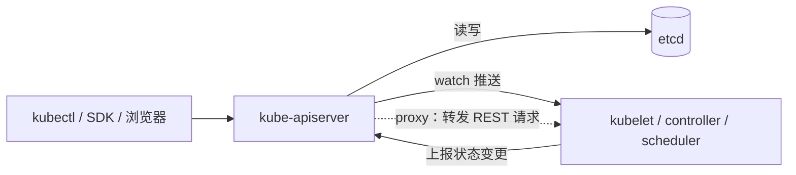
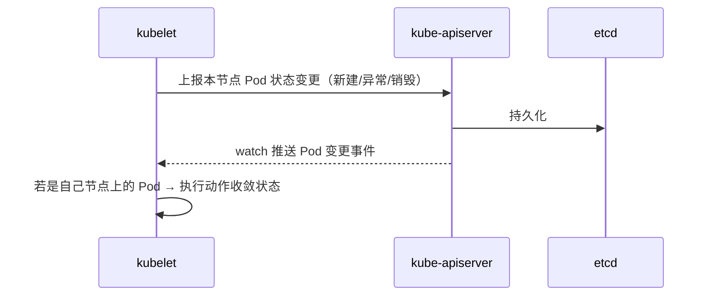
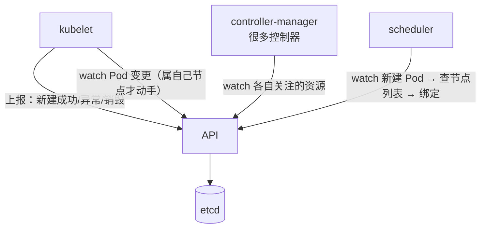

# Kubernetes 认证考点: APIServer 原理 —— 集群唯一的 etcd 网关与 watch 循环

**从名字上理解，APIServer 就是一个接口服务 —— K8s 集群的接口服务确实如此：APIServer 就是 K8s 集群暴露给外部访问的接口服务。它的实现和咱们开发一个 web 服务一样，是一个读写 etcd 数据库的 web 应用。**

结论：**所有跟 etcd 打交道的事情，都要通过 APIServer 完成；K8s 组件之间、插件之间没有直接调用的方法，它们之间的数据交换也全部经过 APIServer；所以它同时是"网关"（统一数据访问与更新的入口 + 身份认证与鉴权）和"代理"（把 REST 请求转发到某个节点上的 kubelet）。组件不是轮询拉取，而是用 APIServer 的 `watch` 方法实时监听资源变更；为了扛住几千个节点的规模，K8s 让各组件本地都缓存一份数据，只有变更才走网络。**

## 纲要

- APIServer 是什么：一个读写 etcd 的 web 应用
- 三个身份：网关 / 鉴权 / 代理
- 资源接口与 watch：怎么拿到实时变更
- 三种访问方式：curl / kubectl / client-go
- 各组件怎么跟 APIServer 通信
- 容量与性能：缓存缓解，但瓶颈点仍在这里

## APIServer 是什么

**APIServer 的实现和咱们开发一个 web 服务一样，是一个读写 etcd 数据库的 web 应用。**



两个必须记住的推论：

1. **组件之间没有直接调用** —— 组件之间、插件之间**没有直接调用的方法，它们之间的数据交换也都是通过 APIServer**；
2. **所有数据访问和更新都要经过 APIServer** —— 所以 K8S 组件在 K8S 中非常重要，**要求它具有网关功能**。

## 三个身份：网关、鉴权、代理

| 身份 | 说明 | 对应实现 |
| --- | --- | --- |
| **网关** | **所有的数据访问和更新都要经过 APIServer**，它是唯一入口 | REST 接口 + 认证鉴权 |
| **安全边界** | **为了保证安全的对外暴露，它还具有身份认证、鉴权的功能** | 认证 → 授权 → 准入 |
| **代理** | **消息转发的功能是一个 proxy 接口，可以通过代理方式将 API 收到的 REST 请求转发到某个 node 上的 kubelet 上，由 kubelet 负责响应** | `kubectl logs/exec/port-forward` 就走这条路 |

**proxy 那一条常被忽略**：`kubectl logs`、`kubectl exec`、`kubectl port-forward` 并不是直接连节点，而是 **APIServer 收下请求、转发到目标节点上的 kubelet、由 kubelet 响应** —— 所以节点在网络上不可达时，只要 APIServer 通，这些子命令也能工作。

## 资源接口与 watch

**APIServer 有很多接口，这些接口都是负责对 K8s 资源对象的管理功能，像资源的注册和发现；这里比较常用的资源有 node 相关接口、pod 相关接口、service 相关接口，当然还有很多很多，就是上一节讲过的八大类 K8s 的资源。**

**最后所有的资源对象，这些数据都会保存到 etcd 这个 key-value 结构的数据库中；它们的组件需要查询某些资源，可以通过 APIServer 提供的查询接口；如果需要实时掌握资源对象的状态变更，也可以使用 APIServer 的 watch 方法。**



**watch 而不是轮询** 是 K8s 能撑住大规模的关键语义：**变更即推送**，组件只处理自己关心的事件。

## 三种访问方式

1. **直接访问 REST 接口**：**既然是 RESTful 接口，那么通过 curl 或者浏览器中直接请求 API 接口也就行了，这种方式简单、粗暴，也很容易理解**；
2. **kubectl 客户端**：**比较常用的访问方式是通过 kubectl 客户端使用这个命令行工具来管理 K8s 资源，当然实际上就是访问 APIServer 来管理 K8s 集群，大部分运维和开发同学应该更习惯用这个方式**；
3. **编程方式**：**对于微服务平台或者团队的 DevOps 系统，或者为了快速高效的管理集群，可以使用编程方式，把管理功能与自己的程序结合起来 —— 自己的程序可以提供更加友好的交互页面、可以更好的完成批量化操作、可以把大量重复性的资源配置信息模板化；K8s 有开源的客户端代码 client-go 项目，直接拿过来就可以快速上手使用。**

```text
三种访问方式
├── curl / 浏览器   → 直接打 RESTful 接口（看原始结构，排障最直观）
├── kubectl         → 绝大多数人的日常入口（本质就是 REST 客户端）
└── client-go       → 平台/DevOps/批量/模板化，直接拿开源项目上手
```

## 各组件怎么与 APIServer 通信

**kubelet 作为在集群节点上运行的重要组件，管理着节点上所有的 Pod 信息和状态：当本机的 Pod 状态发生变更时，不论是新建成功了，还是出现异常，或者销毁了，都要调用 APIServer 的接口把这些数据上报；同时 kubelet 也需要通过 APIServer 的 watch 接口监听 Pod 的变更（比如要新建一个 Pod 实例、需要删除一个 Pod 对象、需要修改 Pod 信息等），当监听到的 Pod 变更是自己这个节点时，就需要做出相应的动作，以保证 Pod 的状态符合期待的结果。**



- **controller-manager**：**里面有非常多的控制器，它们也会使用 APIServer 的 watch 方法监听自己关注的资源对象，然后做出相应的处理**；
- **scheduler**：**也是要通过 APIServer 的 watch 方法监听到新建 Pod 的信息后查询节点列表，然后开始执行 Pod 调度逻辑，调度成功将 Pod 绑定到目标节点上**。

## 容量与性能：缓存缓解，但仍是瓶颈点

**这里数量最多的肯定是 kubelet，因为每个节点都有；如果集群的规模很大（比如几千个节点），那么对 APIServer 的并发要求就很高，对 etcd 的读写压力也会很大。K8s 这方面也是利用缓存的方法来缓解 APIServer 的压力 —— 在各个组件本地都有一份缓存数据，不需要每次都实时从 APIServer 中读取数据。**

```text
大规模集群里的压力分布
├── kubelet（每节点一个，数量最多）→ 上报 + watch
├── controller-manager（多副本）  → watch 各自资源
├── scheduler（多副本）           → watch 新建 Pod
└── APIServer / etcd              ← 集中承受：并发高、读写压力大的地方
    └── 缓解手段：各组件本地缓存（informer 的本地 cache），变更才走网络
```

**提醒：当集群规模很大、而且 Pod 数量也很多了，就意味着这些资源的更新和查询会很频繁，这时候需要特别注意 APIServer 和 etcd 的负载情况，别因为这里的性能成为这个集群的瓶颈。**

这一句是运维的真话：**K8s 的一切都收敛到 APIServer，所以它既是入口也是瓶颈** —— 监控 APIServer 的 QPS、延迟与 watch 连接数，是集群可观测的必做项。

## API 速览

| 能力 | 入口 / 接口 | 说明 |
| --- | --- | --- |
| 资源增删改查 | REST：`/api/v1/pods` / `/api/v1/nodes` / `/api/v1/services` | **node、pod、service 是最常用的几组接口** |
| 实时变更 | **`watch` 方法** | **实时掌握资源对象状态变更的事件流** |
| 上报状态 | 组件调用 APIServer 写回 Pod 状态（kubelet 主） | 新建成功 / 异常 / 销毁都上报 |
| 转发请求 | **proxy 接口** | **把 REST 请求转发到某节点的 kubelet，由 kubelet 响应** |
| 命令行 | `kubectl` | **本质就是访问 APIServer 的客户端** |
| 编程 | **client-go（开源客户端项目）** | 友好页面、批量操作、模板化配置 |
| 直连调试 | `curl` / 浏览器 | **简单的 RESTful 接口，最直观** |
| 安全 | 身份认证 + 鉴权 | **对外安全暴露的必备能力** |
| 性能 | 各组件本地缓存 | **避免每次实时读 APIServer** |

## Demo 示例

把"watch"这条链路亲手看一遍：

```bash
# 先给变量赋值，例如：APISERVER=10.0.0.10:6443；POD=$(kubectl get pod -o jsonpath='{.items[0].metadata.name}')
# ① 看一个资源的原始 REST 结构（不装 kubectl 也能看）
kubectl get pod $POD -o jsonpath='{.metadata.name}'
curl -k -H "Authorization: Bearer $(cat /var/run/secrets/kubernetes.io/serviceaccount/token)" \
     https://$APISERVER/api/v1/namespaces/default/pods

# ② 直接 watch（这就是组件订阅变更的方式，起一个终端看，另一个终端反复 apply/delete）
kubectl get pod -w
# 或 curl 带 watch=true：curl 'https://$APISERVER/api/v1/pods?watch=true'

# ③ 看 kubelet 是怎么上报的：造一个 Pod，立刻 get 能看到状态从 Pending → Running
kubectl apply -f pod-demo.yaml
kubectl get pod $POD -w

# ④ 看 proxy：kubectl 的 exec/logs 实际是转发到节点 kubelet
kubectl exec $POD -- ls
kubectl logs $POD

# ⑤ 看 APIServer / etcd 负载（大规模集群必须盯）
kubectl get --raw /metrics | grep apiserver_
# apiserver_request_count / apiserver_latency / apiserver_current_inflight_requests
```

排障提示：

```bash
# kubectl 报 connection refused / 超时 → 先看 APIServer 与目标 Node 的连通性
# watch 连接数暴涨（几百个 kubelet）→ 说明节点规模上来了，关注 APIServer 并发
# etcd 延迟升高 → 所有写都会变慢，因为所有写都要经过 APIServer 落 etcd
```

## 总结

1. **APIServer 就是 K8s 集群暴露给外部访问的接口服务，它的实现和开发一个 web 服务一样，是一个读写 etcd 数据库的 web 应用**；
2. **所有与 etcd 打交道的事情都要通过 APIServer 来完成，K8s 组件之间、插件之间没有直接调用的方法，它们之间的数据交换也都是通过 APIServer**；
3. **想要管理 K8s 集群上的资源对象，不论是通过命令行还是 SDK 编程实现，都需要调用 APIServer 提供的接口 —— 所以它具有网关功能；为了保证安全的对外暴露，它还具有身份认证、鉴权的功能**；
4. **消息转发是 proxy 接口**：**可以通过代理方式将 API 收到的 REST 请求转发到某个 node 上的 kubelet 上，由 kubelet 负责响应**；
5. **接口负责资源对象的管理（资源的注册和发现）**，**常用的有 node 相关接口、pod 相关接口、service 相关接口，还有很多，就是前面讲过的八大类资源**；
6. **所有资源对象数据都保存到 etcd 这个 key-value 结构的数据库中；组件查询资源可以通过 APIServer 提供的查询接口；如果需要实时掌握资源对象的状态变更，可以使用 APIServer 的 watch 方法**；
7. **三种访问方式**：**curl 或浏览器直接请求 REST 接口（简单粗暴容易理解）、kubectl 命令行（最常用，本质就是访问 APIServer）、编程方式用 client-go 开源客户端项目（可做友好交互页面、批量化操作、把重复性资源配置模板化）**；
8. **kubelet 的双向通信**：**本节点 Pod 状态变更（新建成功、异常、销毁）都要调用 APIServer 接口上报；同时通过 APIServer 的 watch 接口监听 Pod 变更，当监听到的变更是自己这个节点时才做出相应动作，保证 Pod 状态符合期待结果**；
9. **controller-manager 里很多控制器用 watch 方法监听自己关注的资源对象做出处理；scheduler 也是通过 watch 监听到新建 Pod 的信息后查询节点列表、执行调度逻辑、调度成功把 Pod 绑定到目标节点上**；
10. **规模与性能**：**kubelet 数量最多（每节点一个），几千个节点时对 APIServer 并发要求很高、对 etcd 读写压力也很大；K8s 用缓存的方法缓解 —— 各个组件本地都有一份缓存数据，不需要每次都实时从 APIServer 读取数据；但要特别注意 APIServer 和 etcd 的负载，别让这里的性能成为集群的瓶颈**。

