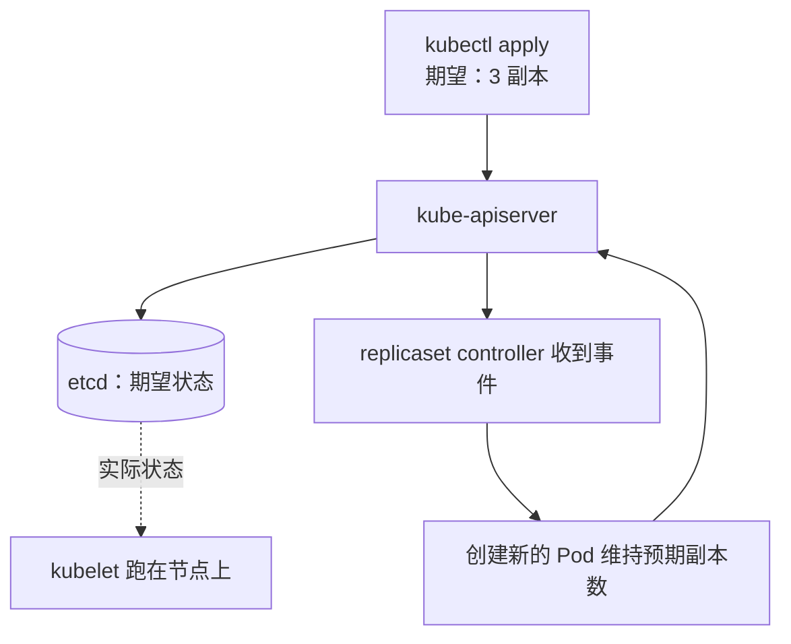
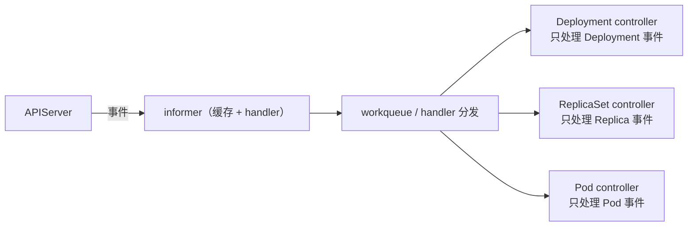
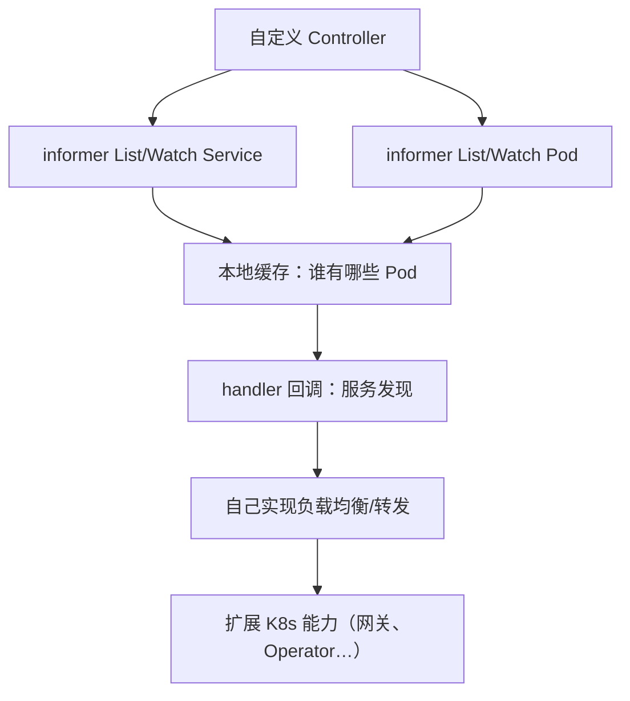
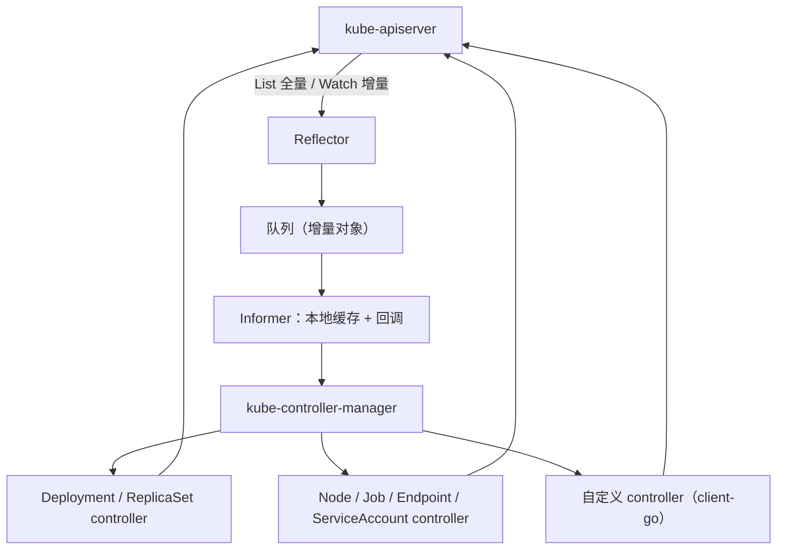

# Kubernetes 认证考点: ControllerManager 原理 —— informer、事件分发与期望状态收敛

K8s 里资源的管理方式看着"很简单"：写一个 YAML，或者一条 `kubectl` 命令就完事；另一个场景是集群里某个 Pod 挂了、或者把 Pod 从某个节点上驱逐了，**我们什么都没做，Pod 又自动重建了** —— 这些资源状态的管理是谁实现的？

结论：**这就是 controller-manager。它运行控制器，是处理集群中常规任务的后台线程，把多个控制器聚合成一个控制中心，统一查询和监听 K8s 资源对象、统一执行回调事件的注册与分发 —— 于是 controller 的逻辑可以非常纯粹，只实现自己的 event handler 就行。它的核心机制是 client-go 的 informer：List 走短连接拿全量、Watch 走长连接拿增量，拿到的对象进 workqueue 再落到本地 index 缓存，从而缓解对 APIServer 的访问压力。总结成一句话：controller 保证资源保持预期状态，controller-manager 保证 controller 保持在预期状态。**

## 纲要

- 一个现象：Pod 挂了为什么会自动重建
- controller 与 controller-manager 的分工
- 分发事件：注册 handler 等回调
- 架构：client-go、informer、reflector、index
- informer 的两大功能与 ListWatch
- 自定义控制器：拿 client-go 就能扩 K8s 能力
- 总图与收尾

## 一个现象：Pod 挂了为什么会自动重建

**K8s 中管理资源的方式比较简单，通常就是写一个 YAML 文件，简单的可以通过 kubectl 命令直接完成；另一个场景是集群中某个 Pod 挂掉了，或者将 Pod 从某个节点上驱逐了，然后没有做任何操作，Pod 又会自动重建 —— 这些资源的状态管理就是由 controller-manager 实现的。**



## controller 与 controller-manager 的分工

**kube-controller-manager 是运行控制器，处理集群中常规任务的后台线程；是集群内部的管理控制中心，由负责不同资源的多个 controller 构成，共同负责集群内 node、pod 等所有资源的管理。**

比如：**当通过 Deployment 创建的某个 Pod 发生异常退出时，ReplicaSet controller 便会接受并处理该退出事件，并创建新的 Pod 来维持预期副本数 —— 几乎每种特定资源都有特定的 controller 维护管理，以保持预期状态。**

而 **controller-manager 的职责是把所有的 controller 聚合起来，提供基础设施，降低 controller 的实现复杂度，启动和维护 controller 的正常运行。**

```text
两层"保持预期状态"
├── controller        → 保证集群内的资源保持预期状态
└── controller-manager → 保证 controller 保持在预期状态
```

这两句话是本节最值钱的一句总结，考试选择题也常考。

## 控制器的工作形态：注册 handler，等事件回调

**controller-manager 主要实现了一个分发事件的能力，而不同的 controller 只需要注册对应的 handler 来等待接收和处理事件。以 Deployment controller 举例：它启动的时候主要就是注册了三个资源的事件监听，分别是 Deployment、ReplicaSet、Pod；Deployment controller 运行起来之后只需要等着事件回调 —— 有 Pod 事件就开始执行 Pod 事件的相应处理方法，有 Deployment 事件就开始执行 Deployment 事件相应处理方法。**



**可以看到在 controller-manager 的帮助下，controller 的逻辑可以做得非常纯粹，只需要实现相应的 event handler 即可。**

## 架构：client-go、informer、reflector、index

**帮助 controller-manager 完成事件分发的是 client-go —— 目前 client-go 已经被单独抽取出来成为一个项目，除在 K8s 中经常被用到，在 K8s 二次开发过程中也会经常用到，比如可以通过 client-go 开发自定义 controller。**

**client-go 包中有一个非常核心的工具，就是 informer —— informer 让与 K8s APIServer 的交互更加优雅。它的主要功能可以概括为两点：**

1. **资源数据缓存（功能缓存）—— 缓解对 kube-APIServer 的访问压力**；
2. **提供了事件 handler 机制，并会触发回调 —— controller 就可以基于回调处理具体业务逻辑。**

**除了 informer 模块，还有 reflector 模块也很重要，反射器（reflectors）模块有下面几个功能：**

| 功能 | 说明 |
| --- | --- |
| **① 采用 ListWatch 机制与 kube-APIServer 交互** | **list 是短连接获取全量数据，watch 是长连接获取增量数据** |
| **② 可以获取任何资源，包括 CRD（自定义资源定义）** | 自定义资源也能进同一套缓存与回调体系 |
| **③ 获取到的增量对象添加到队列** | informer 取到数据后，会**通过 index 模块保存到本地缓存**，读取对象时直接从本地缓存读，减少与 APIServer 的交互压力 |

```text
client-go 里的 informer 链路
├── Reflector（反射器）
│   ├── List   → 短连接，拉全量
│   └── Watch  → 长连接，收增量（事件：Added / Updated / Deleted）
├── DeltaFIFO / 队列          → 增量对象进队
├── Indexer（本地 index 缓存） → 对象存本地，读的时候直接读本地
└── Informer
    ├── 缓存：缓解 APIServer 压力
    └── Handler：事件回调触发 controller 处理业务逻辑
```

**controller-manager 的实现还有很多细节，感兴趣的可以继续翻 client-go 源码，下载到本地顺着代码分析得更透彻。**

## 自定义控制器：拿 client-go 扩 K8s 的能力

**如果你想要自己开发一个网关程序，需要实现服务发现和负载均衡，那么就可以用 client-go 开发一个自定义的控制器，监听 service 和 Pod 信息，知道每个 service 和 Pod 的变更，也就知道如何访问某个服务 —— 通过自定义控制器来延展 K8s 的能力。**



## 总图



## API 速览

| 概念 | 作用 | 要点 |
| --- | --- | --- |
| **kube-controller-manager** | **运行控制器，处理集群常规任务的后台线程** | 集群内部的管理控制中心 |
| **controller** | **维持某一类资源的预期状态** | **几乎每种特定资源都有特定 controller**，如 ReplicaSet |
| **controller-manager 职责** | **聚合所有 controller、提供基础设施、降低实现复杂度、启动维护 controller 正常跑** | **保证 controller 保持在预期状态** |
| **事件分发** | **controller-manager 主要实现分发事件的能力，controller 注册 handler 等回调** | Deployment controller 监听 Deployment / ReplicaSet / Pod 三类 |
| **client-go** | **单独抽出来的开源客户端项目** | 二次开发、自定义 controller 的基础库 |
| **informer** | ① **资源数据缓存（缓解 APIServer 压力）** ② **事件 handler 机制并触发回调** | controller 基于回调处理业务逻辑 |
| **reflector（反射器）** | **ListWatch 与 APIServer 交互；可获取任何资源含 CRD；增量对象加到队列** | **List 短连接全量 / Watch 长连接增量** |
| **index / 本地缓存** | **对象通过 index 模块保存到本地缓存，读对象直接从本地读** | 减少与 APIServer 的交互 |

## Demo 示例

不用写 controller，用 kubectl 把"控制器在收敛"这件事看清楚：

```bash
# 先给变量赋值，例如：DEPLOY=usergrowth；POD=$(kubectl get pod -o jsonpath='{.items[0].metadata.name}')；NODE=$(kubectl get node -o jsonpath='{.items[0].metadata.name}')
# ① 把副本数改掉（改"期望状态"），看控制器把它收敛过来
kubectl scale deploy $DEPLOY --replicas=5
kubectl get deploy $DEPLOY    # 期望 5 / 可用慢慢追上 5

# ② 删掉一个 Pod（实际状态偏离期望），看控制器自动补回
kubectl delete pod $POD
kubectl get pod -w           # 新 Pod 立刻被拉起，副本数不变

# ③ 看控制器相关的事件（谁在动这些资源）
kubectl get events --sort-by=.lastTimestamp | tail -20

# ④ 手动把 Pod 从节点驱逐（ node 被排空），也会被重建/迁移
kubectl drain $NODE --ignore-daemonsets --delete-local-data

# ⑤ 看有哪些 controller 在跑
kubectl get pods -n kube-system | grep -i controller-manager
```

验证 informer 的价值（思考题，也是排障点）：

```bash
# 集群里 kubelet 数量 = 节点数，每个都 watch Pod
# 若组件每次都实时读 APIServer → 几千节点时 APIServer 必挂
# 有了 informer 本地缓存：只有变更才进网络，读走本地
# 实验：在 kubeconfig 里把某个 controller 的 APIServer 指向一个假地址，
#       看它启动后仍能基于本地缓存工作一会儿 —— 这就是缓存的价值
```

## 总结

1. **现象**：**集群中某个 Pod 挂掉、或者把 Pod 从某个节点驱逐，我们没做任何操作 Pod 又会自动重建 —— 这些资源的状态管理就是 controller-manager 实现的**；
2. **controller 是干活的**：**当通过 Deployment 创建的 Pod 异常退出时，ReplicaSet controller 接受并处理该退出事件，创建新的 Pod 来维持预期副本数；几乎每种特定资源都有特定的 controller 维护管理，以保持预期状态**；
3. **controller-manager 是管 controller 的**：**它是运行控制器、处理集群中常规任务的后台线程，是集群内部的管理控制中心，由负责不同资源的多个 controller 构成，共同负责集群内 node、pod 等所有资源的管理；它的职责是把所有 controller 聚合起来、提供基础设施、降低 controller 的实现复杂度、启动和维护 controller 的正常运行**；
4. **一句话总结**：**controller 保证集群内的资源保持预期状态，controller-manager 保证了 controller 保持在预期状态**；
5. **工作方式是事件分发**：**controller-manager 主要实现分发事件的能力，不同的 controller 只需要注册对应的 handler 来等待接收和处理事件；以 Deployment controller 为例，它启动主要注册了 deployment、replicaset、pod 三个资源的事件监听，运行起来后等事件回调 —— 有 Pod 事件就执行 Pod 处理方法，有 Deployment 事件就执行 Deployment 处理方法**；**在 controller-manager 的帮助下，controller 的逻辑可以非常纯粹，只实现 event handler 即可**；
6. **client-go**：**帮助 controller-manager 完成事件分发，已经被单独抽取出来成为一个项目；常用于 K8s 二次开发，比如开发自定义 controller**；
7. **informer 两大功能**：**① 资源数据缓存，缓解对 kube-APIServer 的访问压力 ② 提供事件 handler 机制并触发回调，controller 可以基于回调处理具体业务逻辑**；
8. **reflector（反射器）功能**：**① 采用 listwatch 机制与 kube-APIServer 交互，list 是短连接获取全量数据，watch 是长连接获取增量数据 ② 可以获取任何资源，包括 CRD（自定义资源定义） ③ 获取到的增量对象添加到队列；informer 取到数据后会通过 index 模块保存到本地缓存，通过 index 读取对象时可以从本地缓存读，减少与 APIServer 的交互压力**；
9. **延展能力**：**想自己开发网关程序（服务发现 + 负载均衡），可以用 client-go 开发自定义控制器，监听 service 和 pod 信息、知道每个 service 和 pod 的变更，也就知道如何访问某个服务，通过自定义控制器来延展 K8s 的能力**；**细节可以下载 client-go 源码顺着代码继续分析**。

