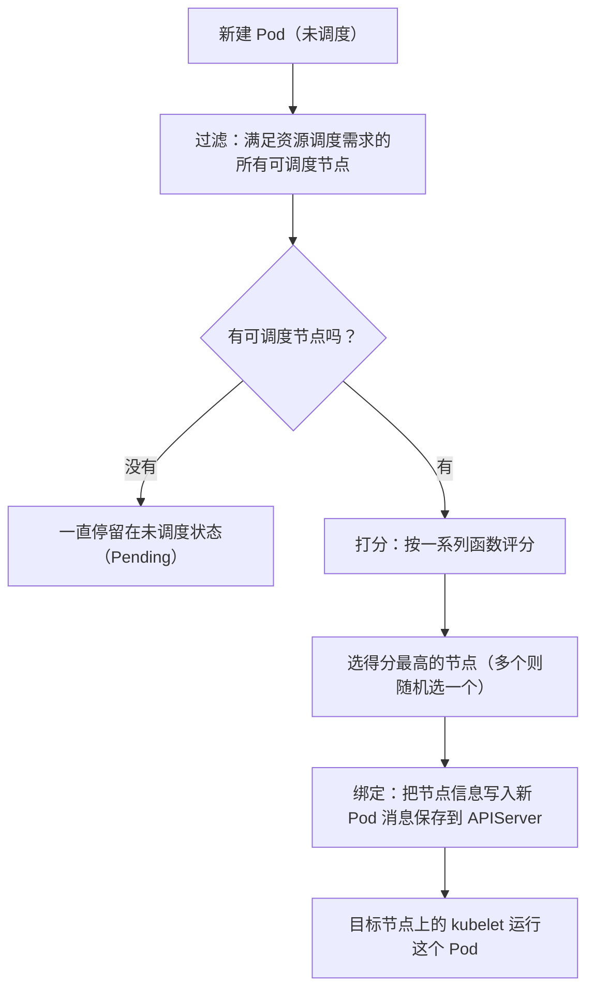
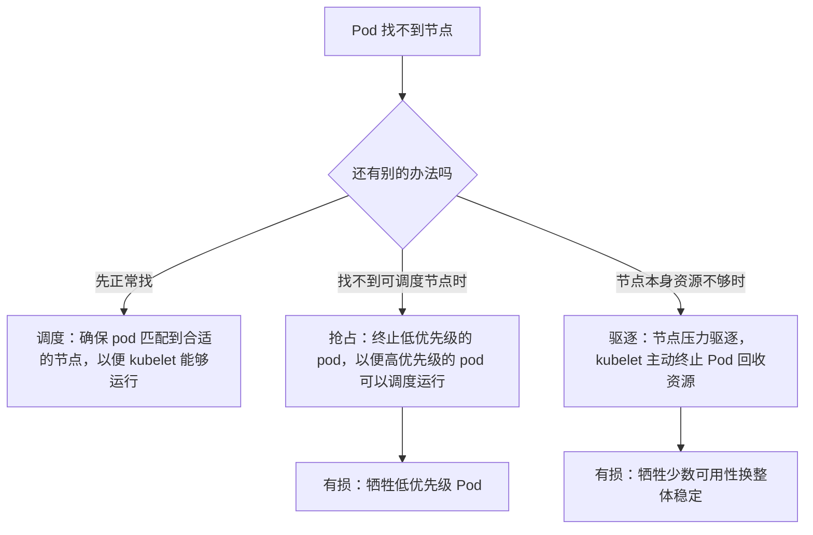

# Kubernetes 认证考点: Scheduler 原理 —— 过滤、打分、绑定三阶段与调度框架

**在 K8s 中，调度是指将 Pod 放置在合适的节点上，以便对应节点上的 kubelet 能够运行这些 Pod。kube-scheduler 是 K8s 集群的默认调度器 —— 对每一个新创建的 Pod 或者没有被调度的 Pod，kube-scheduler 会选择一个最优的节点去运行这个 Pod。**

结论：**调度有三步：① 过滤出满足资源调度需求的所有可调度节点（过滤后满足 Pod 调度请求的所有节点称为可调度节点；如果没有任何一个节点满足 Pod 的资源请求，这个 Pod 将一直停留在未调度状态）；② 对节点打分，选得分最高的；③ 得分最高的节点有多个就随机选一个，然后把节点信息写入新 Pod 的消息保存到 APIServer，这个过程叫"绑定"。调度之外还要分清三个词：**调度**（确保 Pod 匹配合适节点）、**抢占**（终止低优先级 Pod 让高优先级 Pod 跑起来，只在找不到正常可调度节点时触发，是有损策略）、**驱逐**（节点资源匮乏时 kubelet 主动让一个或多个 Pod 失效回收资源）。**

## 纲要

- 调度是什么：给 Pod 找节点
- 三个阶段：过滤 → 打分 → 绑定
- 调度时考虑哪些因素
- 调度 / 抢占 / 驱逐三个词的区别
- 扩展调度器的四种做法
- 调度框架：调度周期与绑定周期

## 调度是什么

**Pod 内的每一个容器对资源都有不同的需求，而且 Pod 本身也有不同的需求，因此需要根据这些特定的调度需求，对集群中的节点进行一次过滤 —— 过滤后满足 Pod 调度请求的所有节点称之为可调度节点。**



**注意"随机选一个"这个细节** —— 多个节点同分时随机挑，是为了避免所有 Pod 永远挤向同一批节点。

## 调度时考虑的因素

**在做调度决定时，需要考虑的因素包括：单独和整体的资源请求、硬件软件策略限制、亲和以及反亲和要求、数据局部性、负载间的干扰等等。**

| 因素 | 含义 |
| --- | --- |
| **资源请求** | 单个 Pod / 整体（Pod 集合）要多少 CPU、内存 |
| **软硬件与策略限制** | 节点标签、架构、污点容忍、pod 安全策略等 |
| **亲和 / 反亲和** | 希望在一起（同节点/同可用区），或希望隔开 |
| **数据局部性** | 尽量靠近数据，减少跨节点开销 |
| **负载间的干扰** | 别把高密度负载堆到同一节点 |

**所有这些听上去挺复杂，需要作为 K8s 集群的管理员来配置调度策略。**

## 三个词：调度 / 抢占 / 驱逐



| 词 | 定义 | 触发条件 | 有损？ |
| --- | --- | --- | --- |
| **调度** | **确保 Pod 匹配到合适的节点，以便 kubelet 能够运行** | 常规：给未调度 Pod 选节点 | 否 |
| **抢占** | **终止低优先级的 Pod，以便高优先级的 Pod 可以调度运行的过程；只有在无法找到正常的可调度节点时才会触发抢占逻辑** | **找不到正常可调度节点时** | **是**（"把优先机较低的 Pod 驱逐，也是一种有损的策略，不算完美解决方案"） |
| **驱逐** | **节点压力驱逐：kubelet 主动终止 Pod 以回收节点上的资源** | **kubelet 监控节点的内存、磁盘空间和文件系统的 inodes 等资源，一个或多个达到特定阈值时** | **是**（"只是在考虑整体稳定性的前提下，牺牲少数的可用性"） |

**可以看出 K8s 为了保证集群资源有限的情况下让重要的应用可以得到更好的保障，同时也可以更好地提高资源利用率。** 实践上对应三类配置：`priorityClassName`（抢占）、`resources.requests/limits` + QoS、以及 `evictionHard/soft` 阈值。

## 扩展调度器的四种做法

| 做法 | 说明 | 代价 |
| --- | --- | --- |
| **直接改官方 kube-scheduler 源码** | 直接修改调度器 | **需要我们对 K8s 集群有完全的控制权才行** |
| **实现一个新的调度器，两个调度器并行运行** | — | **非常可能出现资源冲突的问题** |
| **scheduler extend（外部扩展点）** | — | **和默认调度器之间的通信成本有点高，扩展点也很有限** |
| **scheduler framework（框架方式）** | 实现插件接口里的方法 | 官方推荐 |

**现在主流就是第四种 —— scheduler framework。** 它的工作流程分成两个大的颜色区块：

```mermaid
flowchart LR
    subgraph 调度周期（串行）
        A["Pod 选择一个节点<br/>过滤/打分/排名"]
    end
    subgraph 绑定周期（可并行）
        B["将该策略应用于集群"]
    end
    A --> B
    A + B ==>|"合称调度上下文 scheduling context"| C["调度上下文"]
```

**调度周期为 Pod 选择一个节点，绑定周期将该策略应用于集群；调度周期和绑定周期一起被称为调度上下文。调度周期是串行运行的，而绑定周期是可以并行运行的。**

**两个周期再细分，就是里面所有的扩展点 —— 无非就是 Pod 选择节点、过滤、打分、排名、绑定这些动作，插件 API 里面定义的插件接口就是这些扩展点对应的方法；要通过 scheduler framework 扩展调度器，只要实现这个接口、也就是实现相应的方法就好了。**

```text
scheduler framework 的主要扩展点
├── 调度周期（串行）
│   ├── PreFilter / Filter           # 过滤：哪些节点能放
│   ├── PostFilter                   # 都没节点时 → 考虑抢占
│   ├── PreScore / Score             # 打分：谁更合适
│   └── (NormalizeScore)             # 分数归一化 / 排名
└── 绑定周期（可并行）
    ├── PreBind / Bind               # 真正把 Pod 绑到节点
    └── PostBind                     # 绑定后的收尾（日志、指标）
```

## 其他调度器：按需选用

**kube-scheduler 肯定有很多局限性，毕竟业务场景实在是太多了，而且开源扩展调度器也确实有很多。**

```text
可选的调度方案
├── kube-scheduler（默认）
├── scheduler framework 自定义插件（推荐，实现接口即可）
├── google/batch      → 适用于大数据、AI 等领域的"任务类"调度器
└─ descheduler 项目   → 根据一些规则和配置策略重新平衡集群状态
```

如果大家需要不一样的调度器，可以参考别人已经实现和扩展的，或者直接拿来用。

## API 速览

| 概念 | 含义 | 要点 |
| --- | --- | --- |
| **kube-scheduler** | **K8s 集群的默认调度器** | 给每个新建/未调度 Pod 选一个最优节点 |
| **过滤** | 找出**可调度节点** | **没有任何节点满足 → Pod 一直停留在未调度状态** |
| **打分** | 按一系列函数给可调度节点评分 | 选得分最高的 |
| **绑定** | **把节点信息写入新建 Pod 的消息保存到 APIServer** | 调度器把决定通知给 kube-APIServer 的过程 |
| **同分处理** | **得分最高的节点有多个就随机选一个** | 避免长期扎堆 |
| **调度因素** | 资源请求、软硬件策略限制、亲和反亲和、数据局部性、负载干扰 | 都靠管理员配置策略 |
| **抢占** | **终止低优先级 Pod 让高优先级 Pod 调度运行** | **只在找不到正常可调度节点时触发；有损** |
| **驱逐（节点压力驱逐）** | **kubelet 主动终止 Pod 回收资源** | **内存/磁盘空间/inode 达阈值触发；有损** |
| **调度周期** | **为 Pod 选择一个节点** | **串行运行** |
| **绑定周期** | **将该策略应用于集群** | **可并行运行** |
| **调度上下文** | **调度周期 + 绑定周期** | 框架里统称 scheduling context |
| **扩展点** | 过滤、打分、排名、绑定等动作对应的插件方法 | **实现插件接口即可扩展** |

## Demo 示例

把"过滤 / 打分 / 绑定"三步用命令实际摸一遍：

```bash
# 先给变量赋值，例如：POD=$(kubectl get pod -o jsonpath='{.items[0].metadata.name}')；NODE=$(kubectl get node -o jsonpath='{.items[0].metadata.name}')；DEPLOY=usergrowth
# ① 看调度结果：nodeName 有值 = 已绑定；为空 = 还在未调度状态
kubectl get pod $POD -o jsonpath='{.spec.nodeName}'

# ② 看调度失败原因（过滤阶段被淘汰的节点与原因是关键）
kubectl describe pod $POD | grep -A5 -i events
kubectl get events --field-selector reason=FailedScheduling

# ③ 影响过滤：资源不够时 Pod 一直 Pending
kubectl top nodes
kubectl describe node $NODE | grep -A3 "Allocated resources"

# ④ 影响打分：亲和/反亲和、拓扑分布
#    下面这条反亲和规则会让副本尽量打散到不同节点（打分阶段生效）
kubectl get deploy $DEPLOY -o yaml | grep -A8 -i "affinity"

# ⑤ 看抢占：低优先级 Pod 被顶掉
kubectl get pods -o custom-columns=NAME:.metadata.name,PRIORITY:.spec.priority

# ⑥ 看驱逐：节点资源打满时 kubelet 的行为（节点上有 kubelet 日志）
kubectl get events | grep -i -E "evicted|oom|nodenotready"
```

动手实验（每步对应一个阶段）：

```bash
# 实验 1：给所有节点打污点 → 过滤阶段全部淘汰 → Pod 永远 Pending（验证"没节点可调度就一直未调度"）
# 先给变量赋值，例如：NODE=node-01
kubectl taint nodes $NODE key=value:NoSchedule

# 实验 2：取消污点，Pod 立刻被调度并绑定（验证"绑定 = 写入 APIServer"）
kubectl taint nodes $NODE key- 

# 实验 3：提高某节点资源，观察调度后 nodeName 指向它（验证打分阶段）
# 实验 4：把低优先级 Pod 的 priorityClassName 调低，再压一个高优先级 Pod 抢节点
```

## 总结

1. **调度是什么**：**在 K8s 中调度是指将 Pod 放置在合适的节点上，以便对应节点上的 kubelet 能够运行这些 Pod；kube-scheduler 是 K8s 集群的默认调度器，对每一个新创建的 Pod 或者没有被调度的 Pod，kube-scheduler 会选择一个最优的节点去运行这个 Pod**；
2. **先过滤**：**Pod 内每个容器和 Pod 本身对资源都有不同需求，需要按这些特定调度需求对节点做一次过滤，过滤后满足 Pod 调度请求的所有节点称为可调度节点；如果没有任何一个节点满足 Pod 的资源请求，这个 Pod 将一直停留在未调度状态**；
3. **再打分、后绑定**：**找到所有可调度节点后，再根据一系列函数对节点打分，选出得分最高的节点来运行 Pod；调度器把这个调度决定通知给 kube-APIServer，这个过程叫做绑定**；
4. **三步细节**：**第一步过滤出满足资源调度需求的所有可调度节点；第二步对这些节点打分、把得分最高的找出来；第三步选择得分最高的一个节点，如果得分最高的节点有多个就随机选一个**；
5. **调度考虑因素**：**单独和整体的资源请求、硬件软件策略限制、亲和以及反亲和要求、数据局部性、负载间的干扰等，需要集群管理员来配置调度策略**；
6. **三个词的区别**：**调度 = 确保 Pod 匹配到合适的节点以便 kubelet 能运行；抢占 = 终止低优先级的 Pod 以便高优先级的 Pod 可以调度运行，只有在无法找到正常的可调度节点时才会触发，是一种有损策略不算完美解决方案；驱逐 = 节点压力驱逐，kubelet 主动终止 Pod 以回收资源，kubelet 监控集群节点的内存、磁盘空间和文件系统的 inodes 等资源，一个或多个达到特定阈值时主动使 Pod 失效，也是有损策略，只是在整体稳定性前提下牺牲少数可用性**；
7. **扩展调度器的四种做法**：**直接修改官方 kube-scheduler 源码（需要完全控制集群）、实现新调度器两个并行（非常可能出现资源冲突）、scheduler extend（和默认调度器通信成本高、扩展点有限）、scheduler framework（实现插件接口方法即可，正解）**；
8. **框架的两个周期**：**调度周期为 Pod 选择一个节点、绑定周期将该策略应用于集群，两者合称调度上下文；调度周期串行运行、绑定周期可并行运行**；
9. **扩展点不过是一组动作**：**无非是 Pod 选择节点、过滤、打分、排名、绑定这些动作，插件接口里定义的就是这些扩展点对应的方法，实现接口实现相应方法即可扩展调度器**；
10. **按需选调度器**：**kube-scheduler 有局限性、业务场景太多，开源扩展调度器很多，比如 google/batch（大数据、AI 等任务类调度）、descheduler（按规则和配置策略重新平衡集群状态），可以直接参考或拿来用**。

