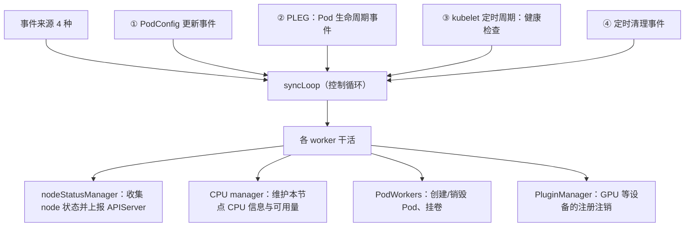
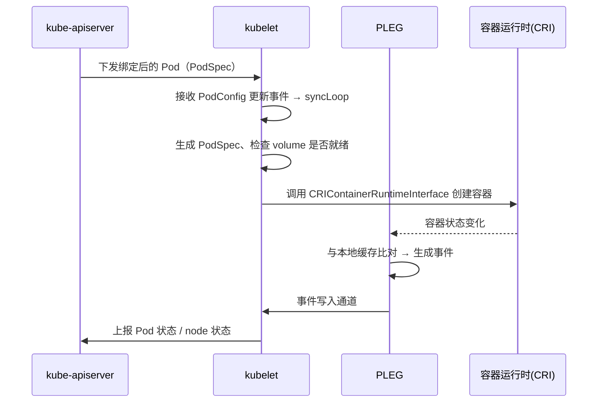
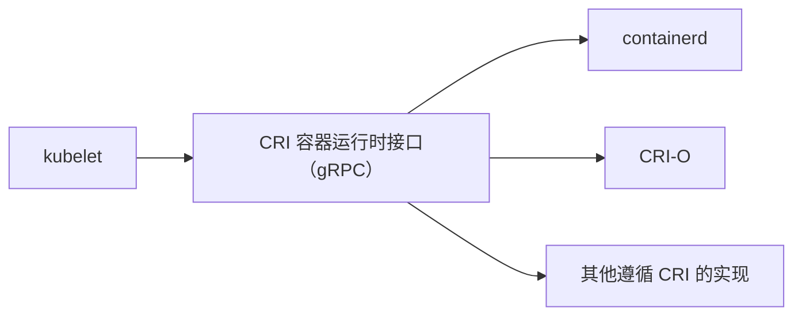

# Kubernetes 认证考点: Kubelet 原理 —— 节点端的控制器模式与 CRI 抽象

**K8s 集群分为控制平面和常规集群节点，kubelet 就是在部署每一个集群节点上的核心组件 —— 集群的管理和操作，在节点这一端的所有工作都离不开 kubelet 这个组件。**

结论：**kubelet 保证容器都运行在 Pod 中，而且只管理由 K8s 创建的容器；它的能力归纳起来就是「上报节点信息 + 管理 Pod（创建、销毁 Pod）」，但每一块都不简单：节点计算资源除 CPU/内存/硬盘外还支持 GPU 等扩展资源，Pod 还牵扯网络安全策略。架构上分成三类组件（各种资源的管理器 / 关键组件 / 依赖的运行时），工作原理就是一个控制器模式的控制循环：事件 + syncLoop，事件来自 PodConfig 更新、PLEG 生命周期、健康检查定时周期、定时清理四类，worker 各干各的活；而 kubelet 并不直接调 Docker API，而是通过一组叫 CRIContainerRuntimeInterface 的 gRPC 接口间接调用下层容器运行时 —— 这一层抽象就是为了对 kubelet 屏蔽下层容器运行时的差异。**

## 纲要

- kubelet 的职责边界
- 节点资源与 Pod 不止是"跑容器"
- 架构：绿（资源管理器）/ 黄（关键组件）/ 参与方（容器运行时）
- 工作原理：控制循环 = 事件 + syncLoop
- 收到"新建 Pod"之后 kubelet 依次做什么
- 为什么要 CRI 这一层抽象

## kubelet 的职责边界

**kubelet 能够保证容器都运行在 Pod 中；kubelet 只会管理由 K8s 创建的容器。**

这条边界前面讲核心组件时提过：你在节点上手 `docker run` 起的容器，kubelet 不管、不重启、也不计入调度。

**kubelet 功能归纳一下就是：上报 node 节点信息和管理 Pod，包括创建、销毁 Pod —— 功能看似简单，实际不然，每一个点拿出来都需要很大的篇幅来讲。** 比如：

- **节点节点的计算资源**：除了传统的 CPU、内存、硬盘，**还提供扩展来支持类似 GPU 等资源**；
- **Pod 不仅仅有容器**：**还有相关的网络安全策略等**。

## 架构：三类组件

看 kubelet 的架构图会发现它没有那么简单。

**上面绿色部分是相对简单些的组件，大部分都是各种资源的管理器** —— 毕竟 K8s 里有那么多的资源，落到一个节点上还是有很多，在节点上这些资源就都交给 kubelet 来管理了，**比如 Pod、container（容器）、image（镜像）、secret、configmap、certificate、volume、plugin 等等资源的管理**。

**中间黄色的组件是更加重要的组件**：

| 组件 | 干什么 |
| --- | --- |
| **PLEG**（Pod Lifecycle Event Generator，**Pod 生命周期事件生成器**） | **维护着 Pod 缓存，定期通过容器运行时获取 Pod 的信息，与缓存中的信息比较，生成相应的事件，然后把事件写入到通道中** |
| **PodWorkers** | **处理事件中 Pod 的信息同步**；**如果 Pod 正在创建则记录器延时记录 Pod 从 Pending 到 Running，杀掉不应该运行的 Pod，使用 volume manager 为 Pod 挂载卷等等** |
| **PodManager** | **存储 Pod 的期望状态** |
| **StatsProvider** | **提供节点和容器的统计信息** |
| **ContainerRuntime**（ContainerRuntime） | **容器运行时，与遵循 CRI 规范的高级容器运行时进行交互** |
| **syncLoop** | **接受来自 PodConfig 的 ConfigMap Pod 变更通知、定时任务、PLEG 的事件，将 Pod 同步到期望状态** |
| **PluginManager** | **运行一组异步循环，根据此节点确定哪个插件需要注册/取消注册并执行；供应商可以实现设备插件并手动部署或作为 DaemonSet 部署，而不必定制 K8s 本身的代码；目标设备包括 GPU 等计算资源** |

```text
节点（Node）内部的 kubelet
├── 资源管理器（绿色）：Pod / 容器 / 镜像 / secret / configmap / certificate / volume / plugin
├── 关键组件（黄色）
│   ├── PLEG               # Pod 生命周期事件生成器（缓存 vs 实际 → 事件）
│   ├── PodWorkers         # 事件里 Pod 信息的同步（建/删/挂卷/杀不该跑的）
│   ├── PodManager         # 存储 Pod 的期望状态
│   ├── StatsProvider      # 节点与容器的统计信息
│   ├── ContainerRuntime   # 遵循 CRI 的容器运行时
│   ├── syncLoop           # 控制循环：事件 + 定时 → 同步到期望状态
│   └── PluginManager      # 设备插件（GPU 等）的注册/注销
└── 下层：CRI 容器运行时接口（gRPC）→ containerd / CRI-O
```

## 工作原理：控制循环 = 事件 + syncLoop

**kubelet 本身也是按照控制器模式来工作的，它的工作核心就是一个控制循环，即事件和 syncLoop。而事件的来源包括四种：**

1. **来自 PodConfig 的更新事件**；
2. **来自 PLEG 的 Pod 生命周期事件**；
3. **来自 kubelet 本身设置的执行周期（Pod 的健康检查等）**；
4. **来自定时的清理事件**。

**而上面的很多 worker 接收到相应的事件完成指定的某项具体工作就好了。** 例如：**nodeStatusManager 负责响应 node 状态变化，把 node 状态收集起来并上报给 APIServer；CPU manager 负责维护该节点的 CPU 信息，能够正确管理 CPU 的使用量和可用量。**





## 收到"绑定 Pod"之后，kubelet 依次做什么

**如果此时接收到一个绑定 Pod 事件，需要在这个节点上新建一个 Pod，kubelet 就会为这个新的 Pod 生成对应的 PodSpec，检查 Pod 所声明使用的 volume 是不是已经准备好，然后调用下层的容器运行时（比如 Docker）开始创建这个 Pod 所定义的容器。**

步序就是：**生成 PodSpec → 检查 volume 是否就绪 → 调容器运行时创建容器 → 容器状态由 PLEG 回流 → 上报 APIServer。**

## 为什么要有 CRI 这一层抽象

**kubelet 调用下层容器运行时的执行过程，并不会直接使用 Docker 的 API，而是通过一组叫做 CRIContainerRuntimeInterface（容器运行时接口）这样的一个 gRPC 接口来间接执行的。K8s 项目之所以要在 K8s 中引入这样一层单独的抽象，当然是为了对 kubelet 屏蔽下层容器运行时的差异。**



这解释了为什么**容器运行时可以是插件式**的：换运行时不用改 kubelet 一行代码，只要都实现 CRI。

## API 速览

| 组件 | 层 | 职责 |
| --- | --- | --- |
| **kubelet** | 节点 | **保证容器都运行在 Pod 中；只管理由 K8s 创建的容器；上报节点信息 + 管理 Pod（创建/销毁）** |
| **PLEG** | 关键 | **Pod 生命周期事件生成器：定期从容器运行时拉 Pod 信息与缓存比对，生成事件写入通道** |
| **PodWorkers** | 关键 | **处理事件中 Pod 信息同步；记录 Pending→Running、杀不该跑的 Pod、为 Pod 挂卷** |
| **PodManager** | 关键 | **存储 Pod 的期望状态** |
| **StatsProvider** | 关键 | **提供节点和容器的统计信息** |
| **ContainerRuntime** | 关键 | **与遵循 CRI 规范的高级容器运行时交互** |
| **syncLoop** | 关键 | **接受 PodConfig 变更、定时任务、PLEG 事件，把 Pod 同步到期望状态** |
| **PluginManager** | 关键 | **异步循环：插件注册/注销；设备插件（GPU 等）无需改 K8s 代码** |
| **nodeStatusManager** | worker | **响应 node 状态变化，收集 node 状态并上报 APIServer** |
| **CPU manager** | worker | **维护本节点 CPU 信息，管理 CPU 使用量与可用量** |
| **CRIContainerRuntimeInterface** | 抽象 | **kubelet 通过这组 gRPC 接口间接调容器运行时，屏蔽下层差异** |

## Demo 示例

把"事件 + syncLoop"用命令看清楚：

```bash
# 先给变量赋值，例如：NODE=$(kubectl get node -o jsonpath='{.items[0].metadata.name}')；POD=$(kubectl get pod -o jsonpath='{.items[0].metadata.name}')
# ① 节点信息是谁上报的：node 状态来自 nodeStatusManager
kubectl describe node $NODE | head -30
kubectl get nodes -o custom-columns=NAME:.metadata.name,STATUS:.status.conditions[-1].type

# ② 看 Pod 从 Pending 到 Running 的过程（PLEG + PodWorkers 的现场）
kubectl apply -f pod-demo.yaml
kubectl get pod $POD -w
kubectl describe pod $POD | grep -i -E "events|pulled|created|started"

# ③ 看节点资源上报（含扩展资源如 GPU）
kubectl get node $NODE -o jsonpath='{.status.allocatable}'
kubectl describe node $NODE | grep -A3 "Allocated resources"

# ④ 健康检查在 kubelet 侧（不是只有探针配置，还有 kubelet 自己的周期）
ps aux | grep kubelet
cat /var/log/pods/kube-system/*kube-proxy*/... 2>/dev/null | head

# ⑤ 看容器运行时与 CRI（节点上）
crictl ps          # 容器运行时直连工具，绕开 kubelet
crictl images
```

排障三连：

```bash
# 先给变量赋值，例如：POD=$(kubectl get pod -o jsonpath='{.items[0].metadata.name}')
# Pod 一直 ContainerCreating → volume 没就绪 / 镜像拉不动（kubelet 在等）
kubectl describe pod $POD | grep -A5 Events

# 节点 NotReady → nodeStatusManager 没上报成功（kubelet 挂了或节点被压制）
kubectl get nodes

# 容器起来了但状态回不来 → PLEG 卡住（常见：节点 IO 高、容器运行时无响应）
# 现象：Pod 一直 Running 但实际不服务；kubelet 日志出现 PLEG relist 超时
```

## 总结

1. **kubelet 的位置**：**它是部署在每一个集群节点上的核心组件，集群的管理和操作在节点这一端的所有工作都离不开 kubelet；它能够保证容器都运行在 Pod 中，而且只会管理由 K8s 创建的容器**；
2. **职责归纳**：**上报 node 节点信息和管理 Pod，包括创建、销毁 Pod；功能看似简单实际不然 —— 节点计算资源除了传统 CPU、内存、硬盘，还提供扩展支持 GPU 等资源；Pod 不仅仅有容器，还有相关的网络安全策略等**；
3. **架构分三层**：**上面绿色的相对简单些，大部分是各种资源的管理器（Pod、容器、镜像、secret、configmap、certificate、volume、plugin 等资源的管理）；中间黄色的组件更重要（PLEG、PodWorkers、PodManager、StatsProvider、ContainerRuntime、syncLoop、PluginManager）；下面参与的是遵循 CRI 规范的容器运行时**；
4. **PLEG（Pod 生命周期事件生成器）**：**维护着 Pod 缓存，定期通过容器运行时获取 Pod 的信息，与缓存中的信息比较生成相应的事件，然后把事件写入到通道中**；
5. **PodWorkers**：**处理事件中 Pod 的信息同步，如果 Pod 正在创建则记录并延时记录 Pod 从 Pending 到 Running，杀掉不应该运行的 Pod，使用 volume manager 为 Pod 挂载卷等**；**PodManager 存储 Pod 的期望状态，StatsProvider 提供节点和容器的统计信息**；
6. **syncLoop**：**接受来自 PodConfig 的 ConfigMap Pod 变更通知、定时任务、PLEG 的事件，将 Pod 同步到期望状态；PluginManager 运行一组异步循环，根据节点确定哪个插件需要注册取消注册并执行，供应商可以实现设备插件并手动部署或作为 DaemonSet 部署，而不必定制 K8s 本身的代码，目标设备包括 GPU 等计算资源**；
7. **工作原理是控制器模式**：**kubelet 本身按照控制器模式工作，工作核心是一个控制循环，即事件 + syncLoop；事件来源有四种 —— PodConfig 的更新事件、PLEG 的 Pod 生命周期事件、kubelet 本身设置的执行周期（Pod 健康检查等）、定时清理事件；很多 worker 接收到相应事件完成指定工作即可**；**nodeStatusManager 负责响应 node 状态变化、收集 node 状态并上报 APIServer；CPU manager 负责维护该节点 CPU 信息、正确管理 CPU 使用量和可用量**；
8. **新建 Pod 时的顺序**：**接收绑定 Pod 事件 → 为新的 Pod 生成对应的 PodSpec → 检查 Pod 所声明使用的 volume 是不是已经准备好 → 调用下层容器运行时创建这个 Pod 所定义的容器**；
9. **CRI 抽象的意义**：**kubelet 调用下层容器运行时并不会直接调用 Docker 的 API，而是通过一组叫做 CRIContainerRuntimeInterface 的 gRPC 接口间接执行；K8s 引入这一层单独抽象，是为了对 kubelet 屏蔽下层容器运行时的差异。**

