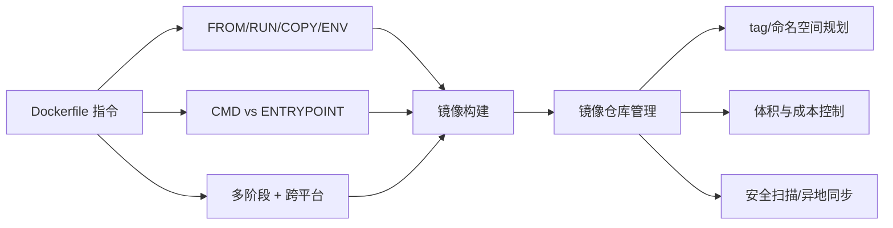

# 镜像仓库与 Dockerfile 的使用和管理

前面几节咱们已经写过好几个 Dockerfile，也成功构建并上传到了容器镜像仓库。但之前讲得比较粗略，这一节把这件事单独拎出来详细讲透：先把 Dockerfile 里**常用的指令**逐一过一遍——它们各自的含义、怎么用；然后再聊 **Dockerfile 文件本身的管理**；最后讲 **镜像仓库的管理**。这三块，任何一块没做好，都会在生产环境埋雷。

## 纲要

- Dockerfile 常用指令精讲：FROM / RUN / CMD / EXPOSE / ENV / ADD / COPY / ENTRYPOINT
- 多阶段构建（multi-stage）与跨平台（`--platform`）坑位
- CMD 与 ENTRYPOINT 的关系与覆盖规则
- Dockerfile 文件管理：按镜像分类建目录、纳入代码仓库、连同依赖一起管
- 镜像仓库管理：命名空间 / 仓库名 / tag 规划、镜像体积成本控制
- 云厂商注册中心的加分能力：异地同步、安全扫描、节点镜像缓存

## Dockerfile 常用指令逐一过

Dockerfile 的指令其实不多，但每个都得用对。下面把高频指令按"出场率"梳理一遍。

```dockerfile
# 1) FROM：指定基础镜像。可带仓库域名、tag、digest；不写仓库默认从 docker.io 拉取
FROM golang:1.22-alpine AS builder

# 2) RUN：在构建期执行命令。脚本复杂时，建议放进脚本文件再 RUN 执行，避免一行写错
RUN apk add --no-cache git ca-certificates && go mod download

# 3) COPY：把本地文件/目录复制到镜像内。比 ADD 更纯粹，日常优先用 COPY
COPY . /src
COPY --from=builder /src/app /usr/local/bin/app

# 4) ENV：设置环境变量，构建期和容器运行时都可用
ENV GIN_MODE=release APP_PORT=8080

# 5) EXPOSE：声明容器监听的端口（可带协议），仅文档性，运行时仍可被 -p 覆盖
EXPOSE 8080/tcp

# 6) CMD：容器启动时执行的命令（1 号进程）。三种形式：exec / shell / 作为 ENTRYPOINT 参数
CMD ["/usr/local/bin/app"]

# 7) ENTRYPOINT：容器启动的固定入口，可被 --entrypoint 覆盖
ENTRYPOINT ["/usr/local/bin/app"]
```

`FROM` 还有几个容易踩的点：可以指定 **tag 或 digest**，不写默认就是 `latest`；还能用 `--platform` 指定运行平台（如 `linux/amd64`、`linux/arm`、`windows`）。这里有个血泪教训——讲师用的是 M1 芯片的 MacBook，默认构建出来的是 **arm64** 镜像，推到服务器（通常是 amd64）上运行会直接报错；反过来在 Windows 上构建出 `windows/amd64`，在 Linux 上跑也会出问题。所以**跨平台交付一定要显式指定 `--platform`**。

`ADD` 与 `COPY` 很像，都是把文件/目录复制进镜像，区别在于 `ADD` 更"聪明"但也更复杂：`ADD` 支持从远程 URL 下载、会把本地压缩包自动解压、甚至能拉 git 仓库（较少用）。正因如此，**日常建议用更纯粹、更可预期的 `COPY`**；那些 `ADD` 的"黑魔法"完全可以用 `RUN` 脚本自己实现，可读性反而更好。`COPY` 还支持 `--from=<stage>`，正是多阶段构建的桥梁。

`CMD` 与 `ENTRYPOINT` 的关系，官方有一张交互表，记住几条铁律即可：

| 写法 | 容器启动行为 | 备注 |
| --- | --- | --- |
| 只有 CMD | 执行 CMD，运行时命令可覆盖 | 最常用 |
| 只有 ENTRYPOINT | 固定执行 ENTRYPOINT | 适合把容器当可执行文件 |
| CMD + ENTRYPOINT | CMD 作为 ENTRYPOINT 的默认参数 | `docker run` 传参会覆盖 CMD |
| 两者皆无 | 镜像无法独立运行 | Dockerfile 至少要有其一 |

> 多阶段构建（`FROM ... AS builder` + `COPY --from`）能在"编译环境"和"运行环境"之间做隔离，最终镜像只保留二进制，体积能小一大截。这类用法不常见但很关键。

## Dockerfile 文件怎么管

写一两个 Dockerfile 练手当然不需要管理。但团队里若有几十个，就必须当代码来管：

- **纳入代码仓库**：和源码、依赖文件、目录一起提交。这样才有历史版本可对比、可多人协作、丢失了能找回。
- **目录按镜像分类组织**：可按"操作系统 / 业务框架 / 开发语言"分层。基础镜像种类其实不多，大多数差异在源码环节，把差异点提炼出来，镜像数量也就收敛了。
- **连带依赖一起管**：镜像不是一次性的，会遇到功能升级、漏洞修复、甚至被误删。一旦出事，必须能拿着原始 Dockerfile + 依赖文件目录，重建出一模一样的镜像。

## 镜像仓库怎么管

管仓库的核心目的是**给服务部署提供方便**，所以要把命名空间、仓库名、版本（tag）规划清楚：

- **tag 命名**：可以和每次发布的版本号一致，也可以和代码提交（commit）关联，便于溯源。
- **盯紧镜像体积**：小镜像也有几十 MB，业务基础镜像普遍上百 MB；**一旦超过 1~2 GB 就要警惕**——推送/拉取耗时变长会拖慢部署与启动，存储占用也是实打实的成本。
- **定期清理**：历史版本基本不再使用，可以及时删除；真要回滚，也能从代码仓库 / Dockerfile 重建（前提是前面文件管理做到位）。

云厂商提供的容器注册中心还常有额外能力：多地备份、异地同步、镜像安全扫描、K8s 节点镜像缓存等。把云原生的产品和服务真正用起来，研发效率、稳定性和安全性都会受益。

```dir
Dockerfile 与镜像仓库管理
├── Dockerfile 指令
│   ├── FROM / RUN / COPY / ENV
│   ├── CMD vs ENTRYPOINT
│   └── 多阶段 + 跨平台 --platform
├── Dockerfile 文件管理
│   ├── 纳入代码仓库
│   └── 按镜像分类建目录
└── 镜像仓库管理
    ├── tag / 命名空间规划
    ├── 体积与成本控制
    └── 同步 / 安全扫描
```



## 总结

这一节把"镜像生产链"的上下游补齐了：

1. **指令要会用**：FROM / RUN / COPY / ENV / EXPOSE / CMD / ENTRYPOINT 是七件套，ADD 的"智能"特性建议用 COPY + RUN 替代；
2. **跨平台是坑**：M1 默认 arm64，交付服务器多为 amd64，务必 `--platform` 显式指定；
3. **CMD/ENTRYPOINT** 的组合关系是面试与排障高频点，牢记"至少要有其一、CMD 作参数"；
4. **多阶段构建**是瘦身与隔离的关键手段；
5. **文件当代码管**：Dockerfile 连同依赖目录进代码仓库，才能重建、协作、溯源；
6. **仓库重规划**：tag 关联发布或 commit，警惕 1~2 GB 大镜像，历史版本该删就删，善用云厂商的同步与扫描能力。
