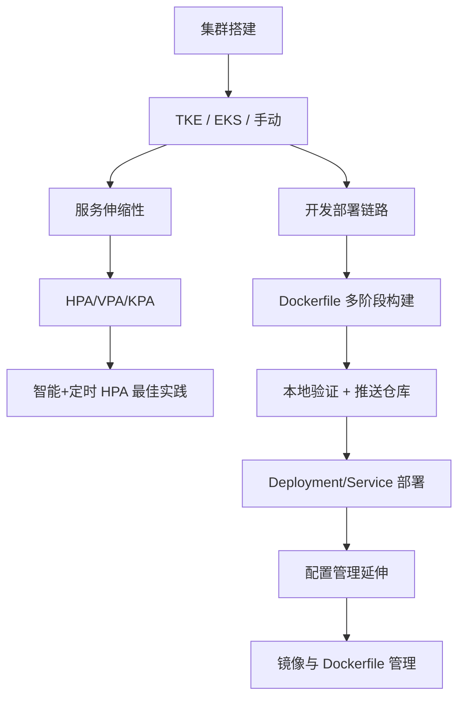

# Kubernetes 集群搭建、伸缩与镜像管理：本章小结

这一章内容不少，最后来做个简单的收口。全章最基础也最重要的，就是**动手把 K8s 集群搭起来**；在集群之上，深入讲了服务伸缩性的实现与原理——这是容器化和 K8s 带来的核心价值；之后是一连串"开发 → 部署"的实操；最后延伸到集群与服务的配置管理，并再次细讲了镜像仓库与 Dockerfile 的使用和管理。

## 纲要

- 集群搭建三路径：腾讯云 TKE / EKS 与手动 kubeadm，按需选择
- 服务伸缩性：HPA / VPA / KPA 原理与"智能 HPA + 定时 HPA"最佳实践
- 开发部署全链路：写 Dockerfile → 构建 → 本地验证 → 推送仓库 → 创建 Deployment/Service
- 镜像与 Dockerfile 管理：指令精讲、文件纳入代码仓库、仓库 tag/体积规划
- 集群与服务的配置管理延伸
- 章末进入项目实战：用户积分等级系统的设计与开发即将开始

## 本章小节结构

```text
KCNA 第5章 集群搭建、伸缩与镜像管理
├── 5-1 本章导学
├── 5-2 腾讯云上 K8S 集群的选择和搭建
├── 5-3 使用 kubeadm 手动搭建 K8s 集群
├── 5-4 服务伸缩性的实现和原理
├── 5-5 编写 Dockerfile 制作服务的运行镜像
├── 5-6 将服务的运行镜像部署到 K8S 集群中
├── 5-7 集群与服务的管理和配置
├── 5-8 作业-动手实践
├── 5-9 镜像仓库与 Dockerfile 的使用和管理
├── 5-10 镜像仓库与 Dockerfile 使用和管理（续）
└── 5-13 本章小结
```
## 集群搭建：一切的起点

本章在腾讯云上既创建了 **TKE（托管集群）**，也用了 **EKS（弹性容器）**，还单独租了云主机**手动搭建**了一套 K8s 集群。三条路成本与运维复杂度不同，大家完全可以参照着做出自己的选择——这正是动手章节的意义：把"搭建集群"从概念变成你亲手跑通过的流程。

```bash
# 验证集群是否就绪（通用写法，参数以实际环境为准）
kubectl get nodes
kubectl get pods -A

# 手动初始化控制平面（kubeadm 示意）
kubeadm init --pod-network-cidr=10.244.0.0/16
```

## 服务伸缩性：容器化的最大价值

K8s 集群的伸缩性不仅提升研发效率，更极大降低了服务器成本，算是 K8s 和容器化带来的最大价值之一。本章把 **HPA（横向）、VPA（纵向）、KPA（缩到零）** 都讲了一遍，包括它们的实现原理，并给出了项目中的**最佳实践方案**：用"智能 HPA + 定时 HPA"组合，让自动扩缩容既跟得住流量、又贴合业务规律。

| 能力 | 伸缩维度 | 解决的问题 |
| --- | --- | --- |
| HPA | 副本数（横向） | 流量波动时增减实例 |
| VPA | 单 Pod 资源（纵向） | 资源配比不合理 |
| KPA | 副本 + 缩到零 | Serverless 场景空闲零成本 |

## 开发部署全链路

讲完原理就是一连串实操：编写 **Dockerfile**、用 **多阶段构建**把服务打成镜像、本地运行容器验证服务可用、再上传到云上的**容器镜像仓库**；接着在 K8s 集群中创建 **Deployment 和 Service**，把镜像部署成真正线上可用的服务。

至此，一条完整的链路就跑通了：**镜像制作 → 测试 → 上传 → 部署 → Service 暴露运行**。随后针对集群与服务的配置管理，还做了一些延伸介绍。

## 镜像仓库与 Dockerfile 管理（重点回看）

章末再次详细展开了镜像与 Dockerfile 的管理，这也是容易在团队规模变大时翻车的地方：

- **Dockerfile 指令**：FROM / RUN / COPY / ENV / EXPOSE / CMD / ENTRYPOINT 必须会用，跨平台交付记得 `--platform`；
- **文件当代码管**：Dockerfile 连同依赖目录一起进代码仓库，才能重建、协作、溯源；
- **仓库规划**：tag 关联发布版本或 commit，警惕超大镜像（>1~2 GB）拖慢部署，善用云厂商的异地同步与安全扫描。



## 总结

本章把"从零到上线"的底座搭好了：

1. **集群三选一**：TKE 托管、EKS 弹性、手动 kubeadm，按需取舍；
2. **伸缩性是核心红利**：HPA/VPA/KPA 原理 + "智能 HPA + 定时 HPA"实践；
3. **全链路跑通**：Dockerfile → 构建 → 验证 → 上传 → Deployment/Service 部署；
4. **配置管理延伸**：集群与服务的配置在部署后仍有大量可优化空间；
5. **镜像管理回看**：指令、文件纳管、仓库规划三件套是团队规模化的关键；
6. **进入实战**：下一章起开始设计开发"用户积分与等级系统"，把知识串成线。
