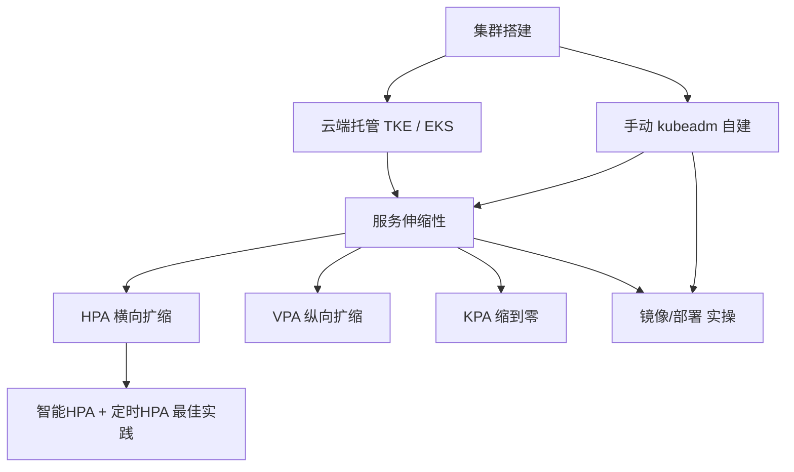

# Kubernetes 集群搭建与管理：本章导学

上一章咱们已经把 Kubernetes 的核心组件摸了一遍，从这一章开始，就进入"动手"阶段了——学习和掌握 K8s 集群的搭建与管理。本章有大量实操，有的在命令行里完成，有的在浏览器控制台里点选。需要提前说明的是：课程录制时的 K8s 组件版本、云厂商特性，可能和你实际动手时略有差异，不同云厂商之间也会有细节区别，所以跟着视频学的时候要懂得灵活变通。

本章选的云厂商是腾讯云。原因很直接：讲师本人在腾讯工作多年，一直负责云原生微服务开发平台，服务过几十个团队、数千开发者、上万个微服务，日均过千亿请求。当然课程本身不开发微服务平台，只是学习微服务框架，但无论多大规模的团队，第一步都是从一个最基础的 K8s 集群搭建开始的。

## 纲要

- 本章主线：搭建并管理 K8s 集群，先从云端再到手动
- 云厂商选择：腾讯云 TKE / EKS，以及自购云主机手动搭建三种路径
- 核心主题：服务伸缩性（弹性）的实现原理与价值
- 弹性三件套：HPA / VPA / KPA 的适用场景与最佳实践
- 一连串实操：Dockerfile、镜像制作、上传镜像仓库、Deployment/Service 部署
- 基础概念先行：云原生、集群、Docker、容器到底是什么

## 为什么是集群搭建，而不是别的地方

不管团队大小，真正把微服务跑起来，第一步永远是把 K8s 集群搭起来。本章会先在腾讯云上创建 **TKE（托管集群）** 和 **EKS（弹性容器服务，无需管理节点）**，还会单独租一台云主机，手把手手动搭建一套 K8s 集群。三条路各有取舍，大家完全可以参照着做出自己的选择：

```bash
# 腾讯云上创建托管集群（TKE）后，本地配置 kubectl 访问
# 拿到 kubeconfig 后验证集群
kubectl get nodes
kubectl get pods -A

# 手动初始化一个控制平面节点（kubeadm 示意）
kubeadm init --pod-network-cidr=10.244.0.0/16
mkdir -p $HOME/.kube
sudo cp -i /etc/kubernetes/admin.conf $HOME/.kube/config
```

> 上面的命令为通用写法，**具体参数（如 CIDR、kubeconfig 路径）建议以你所用 K8s 版本与云厂商官方文档为准**。

## 服务伸缩性：本章的重头戏

集群搭好之后，本章重点讲 **服务伸缩性（弹性）的实现与原理**。上一章其实已经铺垫过：K8s 不只是提升研发效率，更关键的是能降低资源成本——而降本增效的源头，正是"容器化 + 集群伸缩性"。

业务规模小的时候，一个节点、一个实例就能扛住；当用户和请求量上来，可能需要一百个实例才能支撑。这时候伸缩性的价值就极大体现了。本章会详细讲解弹性三件套：

| 能力 | 全称 | 伸缩维度 | 典型触发 |
| --- | --- | --- | --- |
| **HPA** | Horizontal Pod Autoscaler | 副本数（横向） | CPU / 内存 / 自定义指标 |
| **VPA** | Vertical Pod Autoscaler | 单 Pod 资源（纵向） | 资源使用率不足或过剩 |
| **KPA** | Knative Pod Autoscaler | 副本 + 缩到零 | 请求并发（Serverless 场景） |

课程里还会给出项目中的最佳实践：用 **"智能 HPA + 定时 HPA"** 组合，让自动扩缩容既跟得住流量峰值，又能贴合业务的早晚高峰规律。

## 基础概念：动手前先对齐认知

在正式进命令行之前，本章先把几个绕不开的基础概念讲清楚，避免"会敲命令但不懂为什么"：

- **云原生**：不是"在云上买几台云主机"这么简单，也不是"用了容器 / K8s / 把业务部署上云"就自动算数。它的原则涵盖 DevOps、微服务、容器化、不可变基础设施、声明式 API 等；它同时适用于公有云和私有云——你只需关心应用如何被创建与部署，不必纠结跑在哪里。
- **集群**：分布式架构天然就需要集群，区别只是规模大小。扩缩容（伸缩性）就是"需要更多资源时扩容、不需要时缩容"，从而提高资源利用率。
- **Docker / 容器**：Docker 是个开源项目，能方便地创建和运行容器。Dockerfile 经 `docker build` 构建成镜像，把镜像 `run` 起来就是一个独立容器；容器有自己完整的操作系统视角和依赖库，彼此互不打扰，本质上就是宿主机上的一个普通进程（类似 MySQL 服务进程）。
- **管理方式**：既有命令行模式（可编程、效率高），也有可视化页面（更直观、门槛低）。



## 后续实操清单

把集群跑起来后，本章还有一连串要亲自动手的操作，光看不练体会不深：

```dir
本章实操路径
├── 集群搭建
│   ├── 腾讯云 TKE 托管集群
│   ├── 腾讯云 EKS 弹性容器
│   └── 云主机手动 kubeadm 集群
├── 镜像与部署
│   ├── 编写 Dockerfile
│   ├── 构建镜像并本地验证
│   ├── 推送容器镜像仓库
│   └── 创建 Deployment / Service
└── 伸缩性
    ├── HPA / VPA / KPA 原理
    └── 智能HPA + 定时HPA 实践
```

> 集群在单机下很难体现价值，所以本次服务器都跑在腾讯云上作为训练用途。临时采购两台按量计费服务器，几小时实操完即可销毁，成本极低。

## 总结

本章导学把"动手搭建 K8s 集群"这件事的来龙去脉交代清楚了：

1. **定位清晰**：在掌握核心组件之后，本章进入集群搭建与管理的实操阶段，以腾讯云为示例厂商；
2. **三条搭建路径**：TKE 托管、EKS 弹性容器、云主机手动 kubeadm，按需选择；
3. **核心是弹性**：服务伸缩性是容器化带来的最大价值之一，直接关联研发效率与成本；
4. **弹性三件套**：HPA（横向）、VPA（纵向）、KPA（缩到零），并以"智能 HPA + 定时 HPA"作为最佳实践；
5. **概念先行**：云原生、集群、Docker、容器这些地基先打牢，再进命令行；
6. **动手为王**：Dockerfile 编写、镜像制作上传、Deployment/Service 部署等一连串实操，必须亲自跑一遍才有体感。
