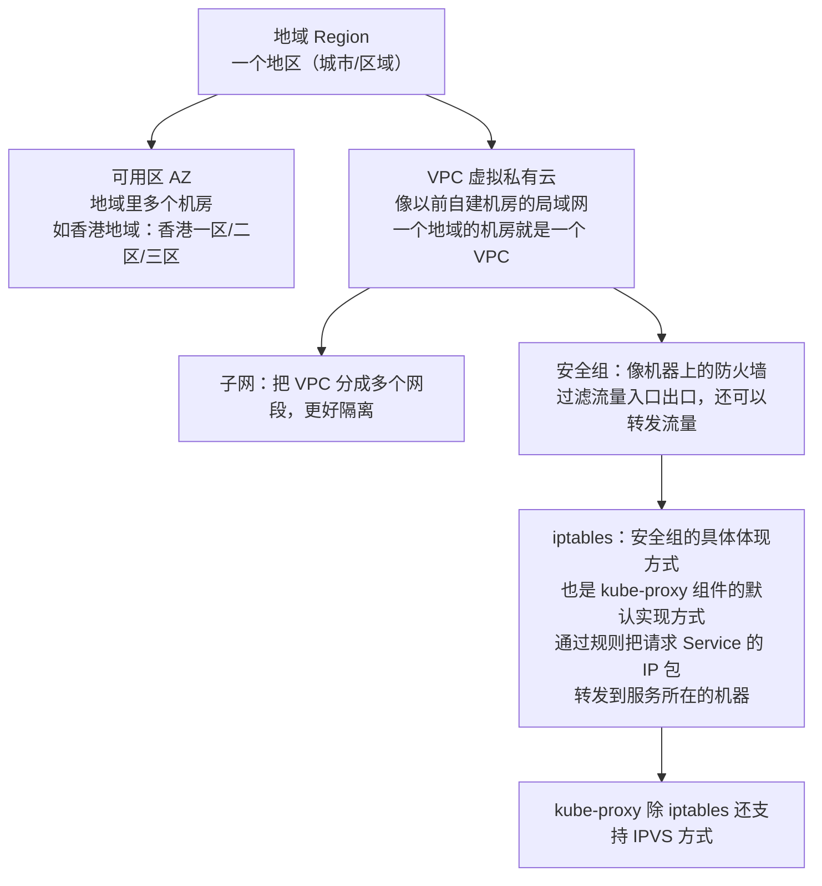
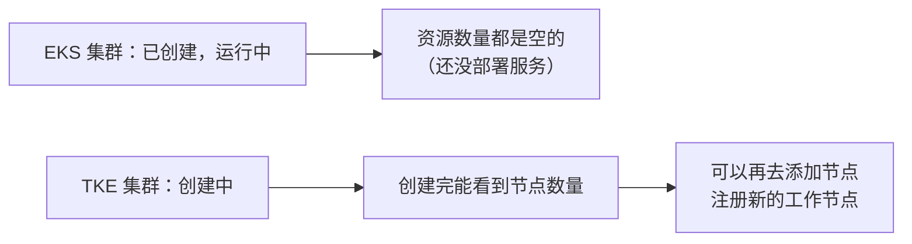

# Kubernetes 认证考点: 腾讯云上 K8s 集群的选择和搭建 —— TKE、EKS 与自建三种形态

开始搭建集群了。搭建 K8s 集群有两种方式：**云原生的方式（采购容器服务，快速搭建起来）**，或者**自建机房的方式（门槛更高）**。

结论：**腾讯云容器服务里有 TKE 和 EKS 两种集群 —— TKE 是标准集群，自己采购云主机当节点，master 至少三台（跑 etcd、apiserver、controller-manager、scheduler），worker 一台或更多，完全自己掌控；EKS 是 Serverless 弹性集群，节点和控制面组件全部托管，要 10 个 Pod 还是 1000 个 Pod 都按需，Pod 实际跑在"超级节点"这种虚拟工作节点上，TKE 也能用超级节点扩资源。没有特殊要求就选 EKS，要更好可控性就选 TKE。自搭则靠 kubeadm/kops/kubeSphere 这类工具，课程用 kubeadm。**

## 纲要

- 两条路线：云原生 vs 自建
- TKE 标准集群与 EKS 的差别
- 必备概念补课：地域、可用区、VPC、子网、安全组、iptables
- 动手：创建 EKS（Serverless）集群
- 动手：创建 TKE 标准集群（含节点规格与配额）
- 建完之后看到什么

## 两条路线

| 方式 | 做法 | 门槛 |
| --- | --- | --- |
| **云原生方式** | **采购容器服务（TKE / EKS），就可以快速搭建起来** | 低（点几下） |
| **自建机房方式** | 自己搭 | **这个门槛对于各位同学来说会更高一些** |

**自建要用一些工具来帮我们快速搭建 K8s 集群，比如 kubeadm、kops、kubeSphere；课程中使用的是 kubeadm —— 所以课程会搭建三个集群：腾讯云上的 TKE 集群、腾讯云上的 EKS 集群，以及租用云主机自己搭建的一个 K8s 集群。**

```text
三种集群形态
├── EKS（Serverless 弹性 K8s）      # 控制面 + 节点全托管，Pod 跑在超级节点上
├── TKE（标准集群）                 # 自己买云主机：master ≥3 台 + worker ≥1 台
└── 自搭（租云主机 + kubeadm）       # 完全自己掌控，门槛最高
```

## TKE 标准集群 vs EKS

**TKE 是标准集群，需要自己采购云主机来作为 K8s 集群的节点；其中 master 节点部署 K8s 控制面组件，至少需要三台服务器，上面会运行 etcd、apiserver、controller-manager、schedule 等核心组件，worker 节点可以是一台或者更多，这些节点主要就是运行咱们自己的应用程序。**

**TKE 集群作为独立集群，是完全可以由我们自己掌控的** —— 比如定制操作系统、修改运行时的一些配置，也可以设置更小规格的 Pod。

**而 EKS 集群会更加简单，因为不需要我们维护节点，也不需要维护控制面组件，全部被托管了；需要创建十个 Pod 还是一千个 Pod，都是按需使用，不需要提前准备服务器资源。这里的 Pod 实际上是运行在超级节点上的一种虚拟的工作节点；而且 TKE 机器也可以使用这种超级节点 —— 也就是说 TKE 集群不仅可以利用自己的工作节点，也可以利用超级节点来扩展集群资源。**

```mermaid
flowchart TB
    subgraph TKE标准集群
        M1["master 节点 ×3（自购云主机）"] --> C1["etcd / apiserver /<br/>controller-manager / scheduler"]
        W1["worker 节点 ×≥1（自购云主机）"] --> A1["运行咱们自己的应用程序"]
    end
    subgraph 超级节点（两种集群都能用）
        SN["超级节点（虚拟工作节点）<br/>按需起 Pod，不用管节点"]
    end
    TKE标准集群 --> SN
    subgraph EKS Serverless集群
        E1["控制面组件：全托管"]
        E2["Pod → 超级节点（按需）"]
    end
```

**具体是选择 TKE 还是 EKS？没有特殊要求 EKS 就可以很好地满足；如果需要有更好的可控性，那就用 TKE。**

## 概念补课：地域、可用区、VPC、子网、安全组、iptables



| 概念 | 是什么 | 类比 |
| --- | --- | --- |
| **地域** | **一个地区，比如一个城市或者一个区域** | 一个大机房片区 |
| **可用区** | **在一个地域里面有多个机房（如香港地域有香港一区、二区、三区，这三个区就是三个可用区）** | 同一地域里的不同机房 |
| **VPC（虚拟私有云）** | **像以前的自建机房是一个局域网，一个地域的机房就是一个 VPC** | 自己的局域网 |
| **子网** | **将一个 VPC 分为多个网段，可以更好隔离** | 局域网内再切网段 |
| **安全组** | **就像一个机器上的防火墙，可以过滤流量的入口和出口，还可以对流量进行转发** | 主机的防火墙 |
| **iptables** | **安全组的具体体现方式，也是 kube-proxy 组件的默认实现方式：通过规则把请求 Service 的 IP 包转发到服务所在的机器；kube-proxy 除了 iptables 方式，还支持 IPVS 方式** | 转发规则引擎 |

## 动手：创建 EKS（Serverless）集群

**用原生的方式创建 K8s 集群非常简单。**

```text
EKS 创建流程（控制台）
├── 登录腾讯云 → 容器服务 → 集群页面
├── 点击新建 → 选择集群类型
│   ├── Serverless 集群   ← 就是 EKS 弹性的 K8s 集群（先建这个）
│   ├── 标准集群          ← 可创建独立的集群（后建这个）
│   ├── 边缘集群          ← 部署位置离用户更近，不在正常 IDC 机房
│   └── 注册集群          ← 自己在 IDC 机房部署的 K8s 集群，注册到云平台来管理
├── 集群名字 / 版本        → 默认即可
├── 集群网络
│   ├── VPC               → 默认会创建出来一个
│   ├── 可用区            → 按默认选择
│   ├── 子网              → 已经存在的网段直接用
│   ├── 安全组            → 默认创建，规则后面可以再改
│   ├── Service 地址（Service IP）→ 如 192.168 网段，按默认的
│   └── Prometheus 监控    → 现在不创建（还没有相关业务需求，为空）
└── 完成 → 控制面组件（apiserver、etcd、controller-manager、scheduler）全部托管
```

**创建过程非常简单 —— 需要多少节点不太需要关心，部署服务需要多少资源它就会给到这些资源，再按照实际使用情况来计费，所以这种集群用起来更省心。**

## 动手：创建 TKE 标准集群

```text
TKE 标准集群创建
├── 集群名字 / 版本         → 例如 worktk1，广州，全部默认
├── 运行时组件              → docker 还是 containerd 都保持默认
├── 网络插件                → 默认
├── 容器网络地址            → 与前面 192 网段冲突 → 改成 10.x 网段
├── 单节点 Pod / Service 数量上限 → 可配置；需要更多可提工单加白名单
├── 服务器镜像              → 默认；有定制镜像也可以用
├── 节点配置
│   ├── 托管集群：master 节点由腾讯云服务器维护，不用自己管
│   └── 独立集群：需要自己采购 master 服务器，至少 3 台
│   └── worker 节点最少一台（测试用一个即可）
├── 云服务器规格            → 测试用低配：四核八G ×3（约 1 块多/小时）
├── 容器目录 / 安全组       → 默认
├── 密钥 / 密码             → 密码自己设置，务必记住
└── 组件                    → 按需选装，测试环境可一路下一步
```

几个实操提醒（都是课程里现场踩出来的）：

- **容器网络地址会跟别处冲突** —— 前面 EKS 用了 192 网段，标准集群这里改 10 网段；
- **节点规格不是越贵越好**：默认推荐八核十六G，测试用换到**四核八G 三台**，价格从八块多一小时降到一块多一小时；
- **master 至少三台、worker 至少一台**，这是最低可用形态；
- **密码自己设置一定要记住**，后面连节点要用。

## 建完之后看到什么



**一开始看不到节点、也管理不了；集群创建好后就能看到节点数量，也可以再去添加节点，注册新的工作节点、好节点（健康节点）都很简单。**

## API 速览

| 概念 | 要点 | 默认值/建议 |
| --- | --- | --- |
| **TKE（标准集群）** | **自己采购云主机；master 至少 3 台跑控制面，worker ≥1 台跑应用；完全自己掌控** | 测试用四核八G ×3 + worker ×1 |
| **EKS（Serverless）** | **节点与控制面全托管，Pod 跑在超级节点上，按需使用不提前备机器** | 无特殊要求首选 |
| **超级节点** | **一种虚拟工作节点；TKE 也能用它扩展集群资源** | 临时扩容场景 |
| **边缘集群** | **部署位置离用户更近，不在正常 IDC 机房里** | 边缘接入 |
| **注册集群** | **自己在 IDC 机房部署的 K8s 集群，注册到云平台来管理** | 混合云 |
| **地域 / 可用区** | **地域 = 一个地区；可用区 = 地域内多个机房** | 默认即可 |
| **VPC / 子网** | **VPC 像自建机房的局域网；子网把 VPC 分成多网段更好隔离** | 默认创建 |
| **安全组 / iptables** | **安全组像防火墙；iptables 是它的实现，也是 kube-proxy 默认转发方式** | kube-proxy 也支持 IPVS |
| **Service 地址** | Pod / Service 的网段，容易冲突 | EKS 用 192.x，TKE 容器网络改 10.x |
| **自搭工具** | **kubeadm / kops / kubeSphere（课程用 kubeadm）** | 门槛更高 |

## Demo 示例

集群建好之后的日常操作（控制台点完，命令行接着验证）：

```bash
# 先给变量赋值，例如：NODE=$(kubectl get node -o jsonpath='{.items[0].metadata.name}')
# ① 拿到 kubeconfig（托管集群在容器服务页可以下载）
#    kube-config.yaml 里就是 apiserver 地址 + 证书 + 用户
export KUBECONFIG=/path/to/kube-config.yaml

# ② 看集群与节点（EKS 会看到超级节点/无节点；TKE 会看到 master 与 worker）
kubectl get nodes -o wide
kubectl get nodes -l '!node-role.kubernetes.io/master' -o wide   # 只看 worker

# ③ 看控制面组件是否健康（TKE 里是腾讯云维护，一般只能在节点上看进程）
kubectl get pods -n kube-system -o wide

# ④ 加节点 / 移节点（课程里"注册新的工作节点都很简单"的对应操作）
#    控制台：集群 → 节点管理 → 新增节点；下线节点前先 cordon/drain
kubectl cordon $NODE        # 标记为不可调度
kubectl drain $NODE --ignore-daemonsets --delete-local-data
kubectl uncordon $NODE

# ⑤ 看 kube-proxy 用的是 iptables 还是 IPVS（对应前面那两个实现方式）
kubectl -n kube-system get ds kube-proxy -o yaml | grep -i -A5 "mode"
# 节点上：iptables -t nat -L | grep KUBE-SERVICES | head
```

排障提示：

```bash
# 连不上 apiserver → 先看 kubeconfig 里的 apiserver 地址与安全组是否放行 443/6443
# 节点 NotReady → 看安全组是否放行节点间内网、Pod 网段路由是否配好（VPC 路由表）
# Pod IP 不通 → 看容器网络插件（Calico/Flannel）与 VPC 是否支持该网段路由
```

## 总结

1. **两种搭建路线**：**云原生的方式（采购容器服务，快速搭建起来）与自建机房的方式（门槛更高）**；**自建要用工具快速搭建，比如 kubeadm、kops、kubeSphere，课程中使用的是 kubeadm，会搭三个集群（腾讯云 TKE、腾讯云 EKS、租云主机自建）**；
2. **TKE 是标准集群**：**需要自己采购云主机作为 K8s 集群的节点；master 节点部署 K8s 控制面组件，至少需要三台服务器，上面运行 etcd、apiserver、controller-manager、schedule 等核心组件，worker 节点可以是一台或更多，主要运行自己的应用程序；TKE 集群作为独立集群完全可以由我们自己掌控，比如定制操作系统、修改运行时配置、设置更小规格的 Pod**；
3. **EKS 是 Serverless（弹性）集群**：**不需要维护节点、也不需要维护控制面组件，全部被托管；要十个 Pod 还是一千个 Pod 都按需使用，不需要提前准备服务器资源；这里的 Pod 实际上是运行在超级节点上的一种虚拟的工作节点；TKE 也可以使用超级节点来扩展集群资源**；
4. **怎么选**：**没有特殊要求 EKS 就可以很好地满足，如果需要有更好的可控性，那就用 TKE**；
5. **必备概念补课**：**地域是一个地区（城市或区域）；可用区是在一个地域里面有多个机房（如香港地域有香港一区、二区、三区，这三个区就是三个可用区）；VPC 虚拟私有云像以前自建机房的局域网，一个地域的机房就是一个 VPC；子网把一个 VPC 分为多个网段，可以更好隔离；安全组像一个机器上的防火墙，可以过滤流量的入口和出口，还可以对流量进行转发**；
6. **iptables 与安全组、kube-proxy**：**iptables 是安全组的具体体现方式，也是 kube-proxy 组件的默认实现方式，通过规则把请求 Service 的 IP 包转发到服务所在的机器；kube-proxy 除了 iptables 方式，还支持 IPVS 方式**；
7. **创建 EKS 的步骤**：**登录腾讯云 → 容器服务 → 集群页面 → 新建 → 选 Serverless 集群（就是 EKS 弹性的 K8s 集群）→ 集群名字版本默认 → 集群网络（VPC 默认创建、可用区默认、子网已有、安全组默认可后改、Service 地址如 192.168 网段按默认、监控暂不创建）→ 完成；控制面组件全部托管，按实际使用计费，用起来更省心**；
8. **集群类型还有两种**：**边缘集群部署位置离用户更近、不在正常 IDC 机房里；注册集群是自己在 IDC 机房部署的 K8s 集群，可以注册到云平台来管理**；
9. **创建 TKE 标准集群的注意点**：**运行时组件 docker/containerd 默认、网络插件默认、容器网络地址与 192 网段冲突就改 10 网段、单节点 Pod/Service 数量上限不够可以提工单加白名单、托管集群的 master 由腾讯云维护而独立集群要自己采购 master 至少三台、worker 最少一台、测试用四核八G 三台（一块多一小时）而不是八核十六G（八块多一小时）、容器目录安全组默认、密码自己设置务必记住、组件按需选装**；
10. **建完之后**：**EKS 集群资源数量为空（还没部署服务），TKE 集群创建完能看到节点数量，也可以继续添加节点、注册新的工作节点**。

