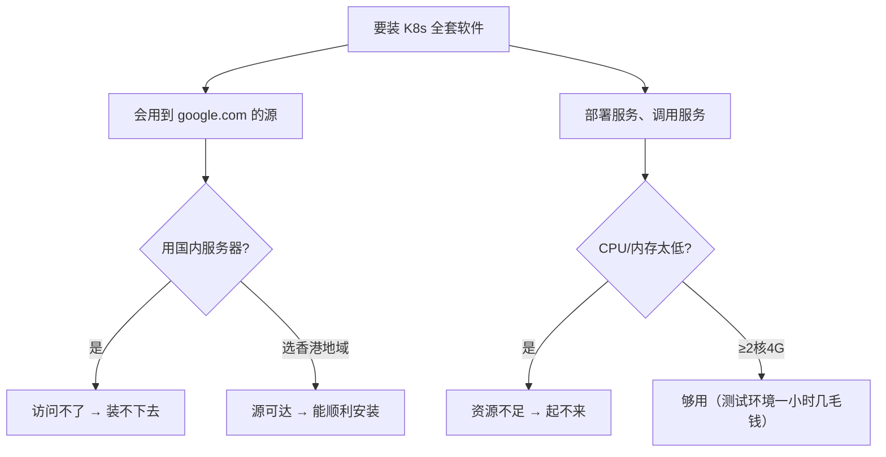
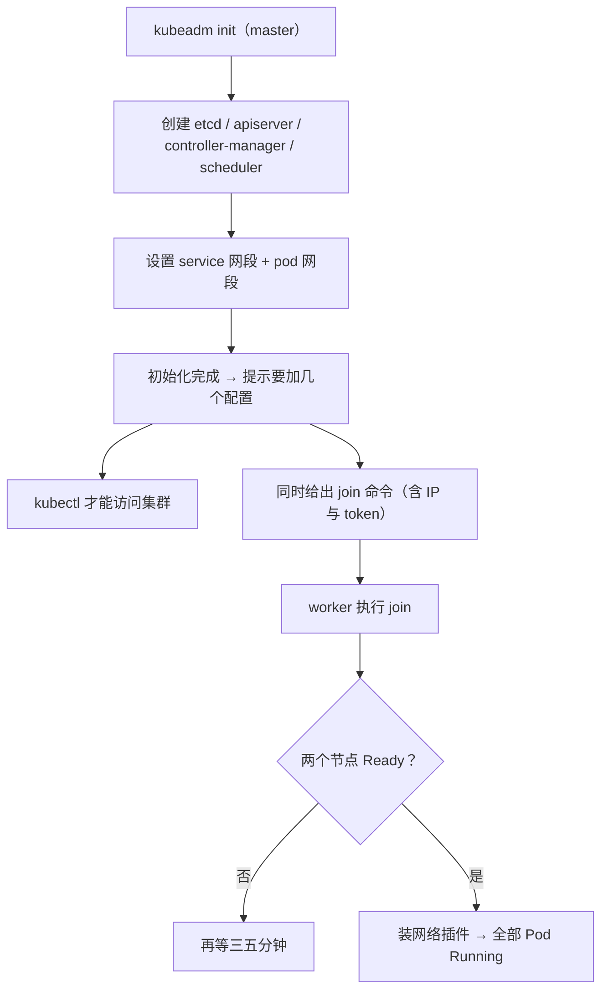

# Kubernetes 认证考点: 用 kubeadm 手动搭建 K8s 集群 —— 从采购云主机到两个节点 Ready

**安装 K8s 集群，首先需要采购两台香港地域的、至少两核四G的云主机。为什么是香港？因为我们安装的这些软件会用到 google.com 的源，如果是在国内的服务器就访问不了了。为了避免这些问题，选用香港地域的机器；而且至少要两台，一台是 master 节点，一台是 worker 节点，CPU 和内存如果太低也不行，部署服务、调用服务的时候会有资源不足的问题。**

结论：**采购 → 配 yum 源（系统源 + K8s 源）→ 装 docker 并启动（版本要挑稳的，最新版 1.25.4 有 bug，用验证过的 1.21.3，docker 20.10.21）→ 装 containerd 并配置开机启动（两个节点都要执行）→ 在 master 上 `kubeadm init` 初始化（同时设 service 与 pod 网段，会创建 etcd、apiserver、scheduler 等基础组件，需要点时间）→ 复制 kubeadm 给出的 admin 配置 → 在 worker 上用 `kubeadm join`（命令里带 IP 与 token）加入 → 装网络插件 → 等两个节点都 Ready，集群就通了。**

## 纲要

- 为什么挑香港、为什么至少两核四G
- 采购两台云主机：竞价实例与镜像怎么选
- 配源、装 docker 与 containerd
- master 上初始化：kubeadm init
- worker 加入：kubeadm join
- 装网络插件与验证 Ready
- 常用命令

## 为什么挑香港、为什么至少两核四G



**所以结论落在两点：地域选香港（源可达）、规格至少两核四G（部署服务时不资源不足）；一台做 master、一台做 worker。**

## 采购两台云主机

进入腾讯云云服务器页面，在中国香港新建两台机器：

| 配置 | 课程里的选择 | 说明 |
| --- | --- | --- |
| **计费方式** | **竞价实例** | **最便宜，比按量计费还便宜一些，但它有一些风险，临时使用可以接受** |
| **地域 / 可用区** | 中国香港（含概念：地域是一个地区，可用区是地域里的多个机房） | |
| **实例规格** | **至少两核四G** | **规格太低会报错、资源不足** |
| **镜像** | **自定义镜像（CentOS 9 的镜像）** | **自定义镜像做的事情很少，只是把相应组件做了更新，再更新时会快一点** |
| **网络** | 没有的话会默认建起来 | **流量按量计费，内网操作基本没有联网费用** |
| **安全组** | 把一些端口放开 | 后面还要配置 |
| **名称 / 密码** | 设置名称；**用户名是 root，密码务必记住** | |

```text
两台机器（课程里的分配）
├── 10.x.x.10  → master 节点（初始化控制面）
└── 10.x.x.14  → worker 节点（join 进集群）
```

**两台都开通好之后登录上去，再执行后面的步骤：加上多个 yum 配置，把 K8s 的源也加进去，然后到机器上去做安装。**

## 配源、装 docker 与 containerd

**首先要去安装 docker（少卡），然后让它启动起来，再查一下 docker 的版本，然后就安装 K8s 的组件。之前验证过，如果装一个最新版本（1.25.4）会有一些 bug，所以就用之前版本（1.21.3），这个版本是验证过没问题的。**

**两个节点（master 与 worker）都要做这些事，所以在两个窗口之间都要执行一次：**

1. **配 yum 源** —— **这两个都要去配置下，这是最基础的软件安装**；
2. **安装 docker → 启动 → 配开机启动 → 查版本信息（如 20.10.21，没问题）**；
3. **安装 K8s 组件 kubelet / kubeadm / kubectl（1.21.3）**；
4. **配置 docker 和 kubelet 服务的开机启动，还需要配置 containerd —— 把这些配置信息执行一遍然后重启一下，容器运行时就启动起来了。**

```bash
# ① 配 yum 源（系统源 + K8s 源，两台机器都要做）
cat > /etc/yum.repos.d/kubernetes.repo <<'EOF'
[kubernetes]
name=Kubernetes
baseurl=https://packages.kubernetes.io/rpm/
enabled=1
gpgcheck=1
repo_gpgcheck=1
gpgkey=https://packages.kubernetes.io/rpm/repo.key
EOF
yum clean all && yum makecache

# ② 装 docker（版本别追最新，1.25.4 有 bug；这里用验证过的 20.10.x）
yum install -y yum-utils device-mapper-persistent-data lvm2
yum-config-manager --add-repo https://mirrors.aliyun.com/docker-ce/linux/centos/docker-ce.repo
yum install -y docker-ce-20.10.* containerd.io
systemctl enable --now docker
docker version

# ③ 装 K8s 组件（1.21.3 是验证过没问题的版本）
yum install -y kubelet-1.21.3 kubeadm-1.21.3 kubectl-1.21.3 --disableexcludes=kubernetes
systemctl enable kubelet

# ④ 配 containerd 并重启（把配置信息执行一遍 → 容器运行时起来）
containerd config default > /etc/containerd/config.toml
#   在 config.toml 里把 SystemdCgroup = false 改成 true（kubelet 用 systemd cgroup 驱动）
systemctl restart containerd
```

## master 上初始化

**接下来要到 master 上面初始化 APIServer 等组件，在 master 上操作。我们用下面这段 kubeadm 命令，它会设置一下 service 和 pod 的网络；需要在 master 上面初始化，初始化这个过程会花一点时间，因为它也要创建那些基础组件，像 etcd、apiserver、scheduler 等等，所以需要一点时间。**



```bash
# master 上执行（--service-cidr / --pod-subnet 按自己的网段规划来）
kubeadm init \
  --kubernetes-version=1.21.3 \
  --service-cidr=10.96.0.0/12 \
  --pod-subnet=10.244.0.0/16 \
  --ignore-preflight-errors=NumCPU

# 初始化完成后提示要加的配置（复制出来）
mkdir -p $HOME/.kube
cp /etc/kubernetes/admin.conf $HOME/.kube/config
chown $(id -u):$(id -g) $HOME/.kube/config
echo 'export KUBECONFIG=/etc/kubernetes/admin.conf' >> /etc/profile
```

**初始化完成之后，需要加一些配置，然后就可以去访问 K8s 集群了。**

## worker 加入

**下面有一个加节点的方法，已经写出来了，连 IP 和 token 也已经有了 —— 在 worker 节点上执行，将节点连接到 master 上，也就是作为 work 节点加入到 K8s 集群。节点开始连接，要等一会儿；连上去之后，就可以在 master 节点上去看一下这个节点信息。**

```bash
# 先给变量赋值，例如：MASTER_IP=10.0.0.10；TOKEN=abcdef.0123456789abcdef；HASH=sha256:0123456789abcdef0123456789abcdef
# worker 上执行（token 与 master IP 由 kubeadm init 结束后给出）
kubeadm join $MASTER_IP:6443 --token $TOKEN --discovery-token-ca-cert-hash sha256:$HASH
```

## 装网络插件与验证 Ready

**关于网络配置这一块，我们可以加上这样的一个组件，在 master 节点上面执行。我们再看一下 node 信息还没准备好，所以这个节点准备还是有点慢，一般三五分钟算是比较快的了。**

**然后下面是一些认证、安全相关的组件，还有 google control（kubectl）相应的命令 —— 查 pod 信息、查日志信息，做集群管理时都会用到。**

```bash
# master 上装网络插件（以 Calico 为例，pod 网段 10.244.0.0/16 要匹配）
kubectl apply -f https://docs.projectcalico.org/manifests/calico.yaml

# 看节点：master 与 worker 都要变成 Ready
kubectl get nodes

# 看 Pod：coredns / etcd / apiserver / controller-manager / kube-proxy 都要跑起来
kubectl get pods -n kube-system -o wide

# 看某个容器的日志（集群管理常用）
# 先给变量赋值，例如：POD=$(kubectl get pod -n kube-system -o jsonpath='{.items[0].metadata.name}')
kubectl logs -n kube-system $POD -f
```

**大概过了两分多钟，两个节点已经正常运行起来了 —— 运行起来就意味着 K8s 集群已经成功搭建完成了。**

```text
集群搭好之后的样子（kubectl get pods -n kube-system）
├── kube-system
│   ├── coredns                    # DNS（集群域名服务）
│   ├── etcd-master                # 集群数据的后台数据库
│   ├── kube-apiserver-master      # 对外的接口服务
│   ├── kube-controller-manager-master
│   ├── kube-proxy-xxxxx           # 每个节点一个（网络规则）
│   ├── kube-scheduler-master
│   └── calico-node-xxxxx / flannel  # 网络插件，每个节点一个
```

## 常用命令速查

```bash
# 先给变量赋值，例如：NODE=$(kubectl get node -o jsonpath='{.items[0].metadata.name}')；POD=$(kubectl get pod -n kube-system -o jsonpath='{.items[0].metadata.name}')
# 集群与节点
kubectl get nodes -o wide
kubectl describe node $NODE

# 组件与排障
kubectl get pods -A
kubectl logs -n kube-system $POD -f
kubectl describe pod -n kube-system $POD

# 集群层信息
kubectl get cs                       # 控制面组件健康（1.21 仍可用）
kubectl cluster-info
```

## API 速览

| 阶段 | 命令 / 动作 | 关键点 |
| --- | --- | --- |
| 采购 | 香港地域 + **竞价实例** | **用 google.com 源；两核四G 起；临时用最便宜** |
| 镜像 | **自定义镜像（CentOS 9）** | **只更新了组件，安装更快** |
| 配源 | 系统 yum 源 + **K8s 源** | **两个节点都要做** |
| 运行时 | **docker（20.10.x）+ containerd** | **装 1.25.4 有 bug，用 1.21.3（kubelet/kubeadm/kubectl）** |
| 开机启动 | `systemctl enable --now docker kubelet` + 重启 containerd | **容器运行时才起得来** |
| 初始化 | **`kubeadm init`（master）** | **会创建 etcd / apiserver / scheduler；设 service 与 pod 网段** |
| 授权 | 复制 admin.conf 到 `~/.kube/config` | **不加这个访问不了集群** |
| 加入 | **`kubeadm join <ip>:6443 --token ...`** | **命令由 init 结束时给出，含 IP 与 token** |
| 网络 | 装网络插件（Calico/Flannel，master 上执行） | **没装网络插件节点永远不 Ready** |
| 验证 | `kubectl get nodes` / `kubectl get pods -A` | **两个节点 Ready + 所有组件 Running 才算通** |

## Demo 示例

把整条链路上最容易停住的四处各排一次：

```bash
# ① 卡在"节点 NotReady" → 99% 是网络插件没装（装之前两个节点都不 Ready）
kubectl get nodes
kubectl apply -f calico.yaml && kubectl get nodes   # 一般三五分钟内 Ready

# ② 卡在"kubeadm join 报 token 无效" → token 有 24h 有效期
kubeadm token list
kubeadm token create --print-join-command     # 重新生成一条 join 命令

# ③ 卡在"docker 起不来 / 版本不对"
systemctl status docker docker ps --help 2>&1 | head -5
docker version    # 对比 20.10.x 与最新 25.x 的差异

# ④ 卡在"kubectl 连不上" → admin.conf 没配好
kubectl get nodes
echo $KUBECONFIG
ls -l /etc/kubernetes/admin.conf
```

成本提示（课程原话）：**选两台竞价实例一小时才几毛钱，所以在腾讯云上做这些验证和配置，实际操作也花不了多少钱。**

## 总结

1. **先采购机器**：**需要采购两台香港地域的至少两核四G的云主机；选香港是因为安装的软件会用到 google.com 的源，国内服务器访问不了；至少两台，一台 master 一台 worker；CPU 和内存太低，部署服务、调用服务时会有资源不足的问题**；
2. **采购时的选择**：**计费方式选竞价实例（最便宜，比按量计费还便宜些，但有风险，临时使用可以接受）；地域和可用区（地域是一个地区，可用区是地域里的多个机房）；实例规格至少两核四G（太低会报错）；镜像选自定义镜像（CentOS 9 的镜像，自带更新过的组件，安装更快）；网络没有会默认建起来，流量按量计费、内网操作基本没有联网费用；安全组放开端口；用户名是 root，密码务必记住**；
3. **登录后第一件事**：**加上多个 yum 配置，把 K8s 的源也加进去，然后到机器上做安装**；
4. **装 docker 并挑版本**：**先安装 docker 让它启动起来、查 docker 版本，再安装 K8s 组件；装最新版本（1.25.4）会有一些 bug，所以用之前版本 1.21.3（验证过没问题）**；**docker 版本如 20.10.21**；
5. **master 与 worker 都要执行**：**配 yum 源、装基础软件、装 docker 并启动、配置开机启动、查版本信息；然后配置 docker 和 kubelet 服务的开机启动，还需要配置 containerd，把配置信息执行一遍然后重启，容器运行时就启动起来了**；
6. **master 初始化**：**在 master 上用 kubeadm 命令初始化 APIServer 等组件，它会设置 service 和 pod 的网络；初始化要花时间，因为要创建 etcd、apiserver、schedule 等基础组件；初始化完成后需要加一些配置，然后就可以访问 K8s 集群**；
7. **worker 加入**：**初始化会给出加节点的方法，连 IP 和 token 都有；在 worker 节点上执行，将节点连接到 master 上作为 work 节点加入集群，开始连接后要等一会儿**；
8. **网络插件与 Ready**：**网络配置可以在 master 节点上执行加组件；节点准备比较慢，一般三五分钟算比较快的，大概两分多钟两个节点就能正常运行起来，就意味着集群搭建成功**；
9. **验证与常用命令**：**`kubectl get pod` 能看到 coredns、etcd、apiserver、controller-manager、kube-proxy 等都正常运行；`kubectl logs` 可以看某一个容器的日志；做集群管理还会用到认证安全相关的组件与相应命令**；**文档会发布到课程里，可以照着一步一步把集群搭起来**。

