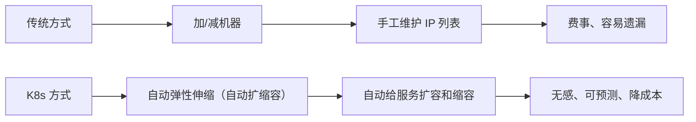
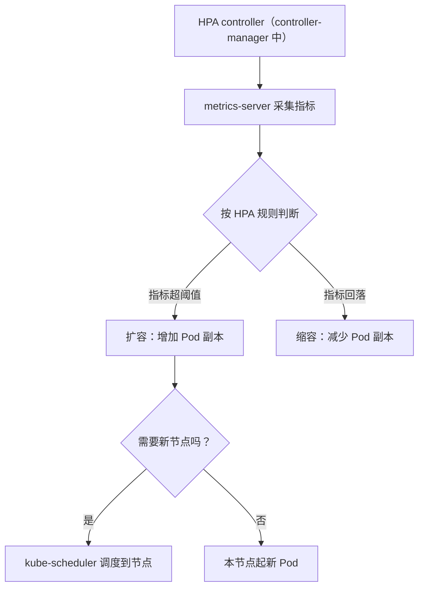
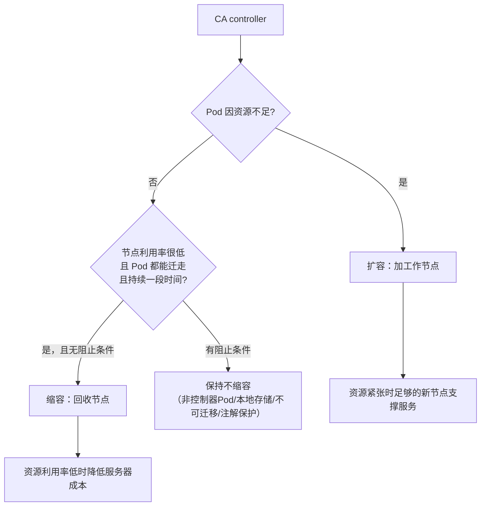

# Kubernetes 认证考点: 服务伸缩性的实现和原理 —— HPA / VPA / CA 三类扩缩容

作为一个分布式系统，就是可以部署多个服务器同时提供服务 —— **这样既可以通过增加服务器资源来提高系统的并发能力，也可以提高系统的可用性。给这个分布式系统（服务）增加或者减少服务器数量，就称为服务的伸缩性。**

结论：**传统运维增加/减少机器，要相应修改服务的 IP 列表，过程费事又容易遗漏；用 K8s 之后这个功能叫"自动弹性伸缩/自动扩缩容"，常见三类：`HPA`（Pod 水平自动伸缩，调副本数，默认的 controller-manager 里就有，最常用）、`VPA`（Pod 垂直自动伸缩，调单个 Pod 的 request/limit，要单独装）、`CA`（集群自动扩缩容，调工作节点数量，依赖云厂商能力）。另外实践上还有"智能 HPA"（带预测，用过去一天到一个月的指标）和"定时 HPA"（秒杀、购票这类强周期场景）。**

## 纲要

- 伸缩性要解决的老问题
- HPA：调副本数（最常用）
- VPA：调单个 Pod 的资源规格
- CA：调集群节点数量
- 三类对比一览
- 智能 HPA 与定时 HPA

## 伸缩性要解决的那个老问题

**传统的运维和部署方式：增加或者减少了机器，就需要相应地修改服务的 IP 列表，这个过程又费事又容易遗漏。**



## HPA：Pod 水平自动扩缩容（最常用）

**HPA 英文全称 Horizontal Pod Autoscaling，中文叫做 Pod 水平自动伸缩，也叫做 Pod 水平自动扩缩容。**

- **负责调整 Pod 的副本数量来实现**，用到的是 **HPA controller（在 K8s 默认的 controller-manager 中）**；
- **也是安装时最常用的弹性伸缩组件**；**无状态服务、负载波动较大的情况下，推荐使用它**；
- **依赖 metrics-server 组件来收集 Pod 运行的指标数据，然后根据配置的 HPA 规则来决定对 Pod 进行扩缩容**；
- **metrics-server 默认只支持 CPU、内存这两类指标数据；如果需要使用自定义指标，比如 QPS 作为伸缩策略，需要额外安装普罗米修斯 adapter 将自定义指标转换为 K8s APIServer 可以识别的指标**。



**整个 HPA 中会涉及到的 K8s 组件包括：APIServer、controller-manager（其中用到的 HPA controller 会来执行扩缩容策略），还有指标采集的工作需要 kubelet 组件来完成，如果涉及到扩容又需要 scheduler 组件来调度 —— 所以 K8s 的自动扩缩容也是需要很多组件配合才可以完成。**

## VPA：Pod 垂直自动扩缩容（不太常用）

**VPA 英文全称 Vertical Pod Autoscaling，中文叫做 Pod 垂直自动伸缩，也是针对服务的 Pod 进行自动扩缩容。**

- **它不是 K8s 默认支持的，需要单独安装 VPA 的 controller 才可以支持**；
- **它负责调整单个 Pod 的资源限额，就是对 Pod 使用的 CPU 和内存的 request/limit 数值进行调整** —— 比如原来使用两核四G规格不够用，通过 VPA 自动升级到四核八G的规格；
- **这种自动扩容更加适合大型计算类服务，比如批处理、数据挖掘这类服务**（不适合通过增加小规模的服务器来支持）；
- **同样的 VPA 也是依赖 Pod 的历史负载指标，然后自动计算和调整资源配额；VPA 调整 Pod 规格时会对 Pod 进行重启，使用新的资源规格来创建新的 Pod 实例**；
- **VPA 自动计算后的建议值可能会遇到实际资源上限，导致无法成功调度，而且 VPA 也没有经历过大规模场景验证，一般不太用这个功能。**

## CA：集群自动扩缩容（调节点）

**CA 英文全称 Cluster Autoscaler，中文叫做集群自动伸缩，是针对集群的工作节点进行自动扩缩容，需要用到云厂商的基础设施能力，需要单独安装 CA controller。**

- **CA 负责调整 K8s 集群中的工作节点数量来实现集群的扩缩容**；
- **当 Pod 因资源不足就会触发扩容**；
- **当工作节点利用率很低，且节点上所有的 Pod 都能调度到其他节点上，节点上没有 Pod 一段时间，就可以触发缩容了**。

**有一些情况会阻止 CA 对节点进行缩容：**

1. **节点上存在不是被控制器创建的 Pod**；
2. **节点上的 Pod 使用了本地存储**；
3. **节点上的 Pod 无法被调度到其他节点上**；
4. **节点有注解要求，不能被回收**。



**通过集群的自动扩缩容，既可以保证资源紧张时有足够的新节点来支撑服务，又可以在资源利用率很低的时候，通过自动缩容来降低服务器的成本 —— 可见它不仅提高了效率，也降低了成本。**

## 三类对比一览

| | **HPA** | **VPA** | **CA** |
| --- | --- | --- | --- |
| 全称 | **Horizontal Pod Autoscaling** | **Vertical Pod Autoscaling** | **Cluster Autoscaler** |
| 中文 | **Pod 水平自动伸缩** | **Pod 垂直自动伸缩** | **集群自动伸缩** |
| **调什么** | **Pod 的副本数量** | **单个 Pod 的 CPU/内存 request、limit** | **集群的工作节点数量** |
| 依赖 | **controller-manager 里的 HPA controller + metrics-server**（默认支持，最常用） | **要单独安装 VPA controller** | **云厂商基础设施 + 单独安装 CA controller** |
| 适合 | **无状态服务、负载波动大** | **批处理、数据挖掘等大型计算类服务** | **资源紧张扩容、低利用率缩容降本** |
| 代价/坑 | 自定义指标（如 QPS）要装 Prometheus adapter | **会重启 Pod；建议值可能超上限导致调度失败；没经过大规模验证** | **缩容被 4 类情况阻止** |

## 智能 HPA 与定时 HPA

**所谓智能 HPA 是对传统 HPA 的一种改进：传统 HPA 是根据之前一分钟或者五分钟内的 CPU、内存、QPS 等指标来决定是否进行扩容，会有较大的滞后性；当流量突然暴增，传统 HPA 一般很难马上支撑住，所以也就容易引发问题。而智能 HPA 增加了自动的预测能力，可以在流量突然暴增时、甚至在之前就可以开始自动扩容 —— 所以这里的智能需要的数据量不仅仅是一分钟五分钟内的指标，而是过去一天一个月的数据，甚至是更多的数据；自动缩容的过程也是类似，不是生硬地按照规则来执行，还会考虑是否短时间抖动。**

```text
传统 HPA vs 智能 HPA
├── 传统 HPA：过去 1min / 5min 的指标 → 超过阈值才扩 → 滞后，突发扛不住
└── 智能 HPA：过去 1 天 ~ 1 个月的指标 → 预测 → 甚至在暴涨前就扩容
    └── 缩容时也看抖动，不生硬按规则
```

**具体的实践方法可以参考腾讯云的 EHPA（Effective HPA）。**

**还有一些特殊的使用场景，使用规则化的定时 HPA 更加合适** —— 比如商品的秒杀活动，**可以在秒杀活动开始之前十分钟定时把服务器资源扩容准备好**；**另外，有规律性的、周期性的活动（游戏购票等）也都适用于这种定时 HPA；确定性的强周期，直接用定时 HPA 会更加简单有效，都不需要预测和计算了。**

**大家工作中把智能 HPA 和定时 HPA 用好了，就可以把服务可用性和资源成本做到很好的平衡。**

```text
伸缩性方案选型
├── 无状态服务、负载波动大          → HPA（默认就有，首选）
├── 需要按 QPS 这类自定义指标        → HPA + Prometheus adapter
├── 批处理 / 数据挖掘等计算型        → VPA（注意会重启 Pod）
├── 节点不够用 / 想降机器成本        → CA（云上才划算）
├── 流量有趋势、怕滞后              → 智能 HPA（EHPA，预测）
└── 秒杀 / 购票等强周期             → 定时 HPA（提前十分钟扩好）
```

## API 速览

| 名称 | 全称 / 中文 | 关键配置与依赖 |
| --- | --- | --- |
| **HPA** | **Horizontal Pod Autoscaling / Pod 水平自动伸缩** | `minReplicas`/`maxReplicas`/CPU（或内存）平均使用率；**metrics-server 默认只支持 CPU、内存；自定义指标（QPS）要装 Prometheus adapter** |
| **VPA** | **Vertical Pod Autoscaling / Pod 垂直自动伸缩** | 调整**单个 Pod 的 request / limit**；**依赖历史负载指标；调整会重启 Pod；需单独安装** |
| **CA** | **Cluster Autoscaler / 集群自动伸缩** | 调整**工作节点数量**；**需要云厂商基础设施能力；需单独安装 CA controller** |
| 组件分工 | HPA controller（controller-manager）+ metrics-server + kubelet（采集）+ scheduler（扩容调度） | **自动扩缩容需要很多组件配合** |
| 智能 HPA | 在传统 HPA 上加**预测能力** | **用过去一天、一个月的指标（EHPA）** |
| 定时 HPA | **规则化的定时扩缩容** | **秒杀前 10 分钟提前扩容；强周期场景最简单有效** |

## Demo 示例

```bash
# 先给变量赋值，例如：DEPLOY=usergrowth；NODE=$(kubectl get node -o jsonpath='{.items[0].metadata.name}')
# ① 看 HPA 对象（cloning 时先确认域名是 autoscaling/v2beta2 或 v2）
kubectl get hpa
kubectl describe hpa $DEPLOY   # 看 TARGETS / liveness 与判定原因

# ② 手动触发一次扩容，看它怎么收敛（等价于 HPA 在做的事）
kubectl scale deploy $DEPLOY --replicas=6

# ③ 看 VPA（装了才有）
kubectl get vpa

# ④ 看 CA 的节点事件（扩容/缩容原因都写在 events 里）
kubectl get events --sort-by=.lastTimestamp | grep -i -E "scale|autoscal|registered node"
kubectl describe node $NODE | grep -i -A3 "Annotations"
```

排障三连：

```bash
# 先给变量赋值，例如：DEPLOY=usergrowth；NODE=$(kubectl get node -o jsonpath='{.items[0].metadata.name}')
# ① HPA 一直 <unknown> → metrics-server 没装或没数据（最常见）
kubectl get pods -n kube-system | grep metrics-server

# ② HPA 定义了但从不扩容 → 看阈值与当前指标；自定义指标没走 adapter 也会 unknown
kubectl describe hpa $DEPLOY

# ③ CA 缩不掉节点 → 对照四类阻止条件：非控制器创建 Pod / 本地存储 / Pod 不可迁移 / 节点注解保护
kubectl get pods -A -o wide | grep $NODE
```

## 总结

1. **伸缩性的定义**：**作为一个分布式系统可以部署多个服务器同时提供服务，既可以通过增加服务器资源提高并发能力，也可以提高可用性；给服务增加或者减少服务器数量称为服务的伸缩性；传统方式增加或减少机器需要相应修改服务的 IP 列表，又费事又容易遗漏**；
2. **K8s 里叫自动弹性伸缩（自动扩缩容）**，**可以自动地给服务扩容和缩容，常见三类**：
   - **HPA（Horizontal Pod Autoscaling / Pod 水平自动伸缩）**：**最常使用；负责调整 Pod 的副本数量来实现，用到 HPA controller（在 K8s 默认的 controller-manager 中），也是安装时最常用的弹性伸缩组件；无状态服务、负载波动较大的情况下推荐使用**；**依赖 metrics-server 收集 Pod 指标，按 HPA 规则决定扩缩容；metrics-server 默认只支持 CPU、内存，自定义指标如 QPS 需要额外安装普罗米修斯 adapter 转成 APIServer 可识别的指标**；
   - **VPA（Vertical Pod Autoscaling / Pod 垂直自动伸缩）**：**不太常用；不是 K8s 默认支持，需要单独安装 VPA controller；负责调整单个 Pod 的资源限额（CPU 和内存的 request、limit）；适合批处理、数据挖掘等大型计算类服务；依赖 Pod 历史负载指标自动计算和调整；调整时对 Pod 进行重启；建议值可能遇到实际资源上限导致无法调度，也没经过大规模场景验证**；
   - **CA（Cluster Autoscaler / 集群自动伸缩）**：**针对集群的工作节点进行自动扩缩容，需要云厂商的基础设施能力、单独安装 CA controller；Pod 因资源不足触发扩容；工作节点利用率很低且节点上所有 Pod 都能调度到其他节点、节点上没有 Pod 一段时间触发缩容；四类情况会阻止缩容（存在非控制器创建的 Pod、使用了本地存储、Pod 无法调度到其他节点、节点有注解要求不能被回收）**；
3. **HPA 涉及的组件很多**：**APIServer、controller-manager（HPA controller 执行扩缩容策略）、kubelet（指标采集）、scheduler（扩容时调度）**；
4. **智能 HPA**：**传统 HPA 根据之前一分钟或五分钟内的指标决定扩容，有较大滞后性，流量突然暴增时很难马上支撑住容易引发问题；智能 HPA 增加了自动预测能力，可以在流量暴增时甚至之前就自动扩容，需要的数据量是过去一天一个月甚至更多，缩容也考虑短时间抖动**；**可参考腾讯云 EHPA（Effective HPA）**；
5. **定时 HPA**：**特殊场景更适合规则化的定时 HPA —— 商品秒杀活动可以在开始前十分钟定时扩容备好资源；有规律性、周期性的活动（游戏购票等）都适用；确定性的强周期直接用定时 HPA 更简单有效，都不需要预测和计算**；
6. **目标**：**把智能 HPA 和定时 HPA 用好了，就可以把服务可用性和资源成本做到很好的平衡**；**细节（时间周期、敏感度对业务的影响）还需要在实践中不断尝试摸索**。

