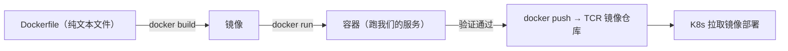
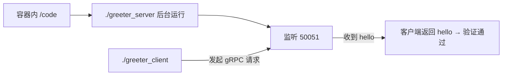

# Kubernetes 认证考点: 编写 Dockerfile 制作服务的运行镜像 —— 从基础镜像到推送 TCR

集群搭好了，接下来要把服务变成镜像。**首先需要一个 docker 环境，它可以帮我们完成两个最重要的工作：一是制作镜像，二是运行容器。Dockerfile 是一个纯文本文件，和我们的 shell 脚本有一点点像；编写好之后就可以使用 `docker build` 命令来制作镜像；镜像制作好之后也可以在本地运行容器，先手动验证一下镜像是否可以正常启动、里面的服务是否工作正常；容器启动、服务运行都正常说明镜像制作没问题了，就可以把这个镜像推送到容器注册中心（腾讯云 TCR）。**

结论：**基础镜像用最小的 alpine（3.16），它只有几兆但太干净要自己补 bash；程序先按 `GOOS=linux GOARCH=amd64` 交叉编译成可执行二进制再 COPY 进镜像；Dockerfile 就是 FROM → RUN（更新并安装 bash + 建 /code）→ COPY → WORKDIR → EXPOSE 50051 → CMD；构建时务必带 `-f`（指定文件）、`--network host`（要外网）、`--platform`（M1 编出来的要指定平台）；本地 `docker run` 起来跑一遍 client/server，最后 `docker login` + `docker push` 到 TCR。**

## 纲要

- docker 环境在干什么
- 选基础镜像：alpine 3.16
- 交叉编译出可执行程序
- Dockerfile 六行
- docker build 的三个关键参数
- 本地起容器验证
- 推送到 TCR 与镜像体积

## docker 环境在干什么



**两个最重要的工作：一是制作镜像，二是运行容器。** 开发机上装 docker 就行（mac 在 docker.com 上直接下载安装对应版本，Windows 和 Linux 也都支持）。

## 选基础镜像：alpine

**基础镜像直接用一个 Linux 系统就好了 —— 因为 Go 程序编译之后非常简单，不需要安装很多的依赖包。我们找到 alpine，这个是最小的一个镜像，可能只有两兆多或者五兆左右。但直接用它还有一点点问题：它特别小，里面安装的东西也特别少，像 shell 的支持都需要我们自己单独来安装，我们在写 Dockerfile 的时候把它安装上就行。**

**版本上，最新这个版本会经常变，所以不用它；3.17 也很新，我们找一个之前比较成熟的版本，用 3.16 —— 先 `docker pull` 把它拉到本地，后面写 Dockerfile 的 FROM 引用它时才能正常使用。**

| 镜像 | 体积 | 特点 |
| --- | --- | --- |
| **alpine:3.16** | **极小（几 MB）** | **太干净：bash 等基础库要自己装** |
| ubuntu（对比） | **略大一点** | **已经有 bash 等基础库** |

## 交叉编译出可执行程序

**我们的程序还是用 gRPC 的 helloworld 那个例子。开发环境是苹果 M1 芯片的电脑，但运行在 Linux 服务器上是英特尔架构的，所以我们需要指定一些环境变量：`GOOS` 指定 linux，`GOARCH` 设置为 amd64，`-o` 参数把编译后的程序输出到一个文件名（按目录名输出即可）** —— 先把客户端程序编译，再把服务端编译，编完各自目录里就多出一个可执行文件。

```bash
# 编译客户端（在 examples/helloworld/greeter_client 目录下）
GOOS=linux GOARCH=amd64 go build -o greeter_client .

# 编译服务端（在 examples/helloworld/greeter_server 目录下）
GOOS=linux GOARCH=amd64 go build -o greeter_server .
```

**然后把这两个文件复制到我们的 Dockerfile 所在的开发目录里面去 —— 后面我们需要把这些程序和 Dockerfile 一起管理起来。**

```text
镜像构建目录（Dockerfile 与可执行程序放一起）
├── Dockerfile
├── greeter_client        # 交叉编译后的 Linux amd64 二进制
└── greeter_server        # 交叉编译后的 Linux amd64 二进制
```

## Dockerfile 六行

```dockerfile
# 1. 基础镜像
FROM alpine:3.16

# 2. 更新并安装 bash（不装的话执行脚本命令会报错）
RUN apk update && apk add bash

# 3. 创建代码目录，后面可执行程序都放到 /code
RUN mkdir -p /code

# 4. 把本地的两个可执行程序复制进镜像
COPY greeter_client /code/
COPY greeter_server /code/

# 5. 指定工作目录：进容器默认就在这个目录，省一次 cd
WORKDIR /code

# 6. 暴露 gRPC 默认端口 + 容器启动命令
EXPOSE 50051
CMD ["./greeter_server"]
```

要点对照：

| 指令 | 作用 | 坑 |
| --- | --- | --- |
| **FROM** | **基础镜像（这里 alpine:3.16）** | **本地要有这个镜像，先 pull；版本别用 latest（经常变）** |
| **RUN** | **先用 apk 更新、再把 bash 装进去** | **alpine 太干净，不装 bash 执行脚本会报错** |
| **RUN mkdir** | **建 /code 目录** | 程序都放到这个目录 |
| **COPY** | **把 client / server 复制进来** | **必须先交叉编译好再 COPY** |
| **WORKDIR** | **指定工作目录（镜像执行时与启动容器后默认进入这里）** | **省掉每次 cd 的操作** |
| **EXPOSE** | **暴露服务的 gRPC 默认端口 50051** | 只是声明，真正拦截靠 K8s Service |
| **CMD** | **容器启动时直接执行 greeter_server** | **PID 1 就是这个进程（容器随它退出而退出）** |

## docker build 的三个关键参数

```bash
# 先给变量赋值，例如：NS=helloworld
docker build -f Dockerfile --network host --platform linux/amd64 \
  -t ccr.ccs.tencentyun.com/$NS/helloworld:v1 .
```

| 参数 | 为什么必须 | 不写的后果 |
| --- | --- | --- |
| **`-f`** | **指定要构建的 Dockerfile 文件；不指定默认找当前目录下叫 Dockerfile 的** | **后面同一目录下可能有很多 Dockerfile，不指定就找不到/找错** |
| **`--network host`** | **用当前开发机的网络；不指定默认是一个独立网络环境** | **外网不通，RUN 里装包会失败** |
| **`--platform`** | **开发机是 M1 芯片、线上是英特尔架构服务器** | **不单独指定 platform，运行时会报错** |

**镜像名称要写全：域名（ccr.ccs.tencentyun.com 是 TCR 镜像仓库的域名）+ 自己定义的 namespace + 镜像名 helloworld + 自定义版本（v1、v2…）。**

**`docker build` 是一层一层去执行的，能看到每一步的命令：FROM → 执行 update 安装 bash → 创建目录 → copy 文件 → 指定工作目录；而 EXPOSE 与 CMD 是启动时才用到的。它有缓存所以第二次构建很快 —— Dockerfile 有更新时同样会用缓存，只是从更新的那一行开始重新构建，前面的命令不再构建。**

## 本地起容器验证

```bash
# 方式一：直接跑（服务进程会阻塞住前台）
# 先给变量赋值，例如：NS=helloworld
docker run --network host ccr.ccs.tencentyun.com/$NS/helloworld:v1

# 方式二：进容器里自己调试（--entrypoint 指定启动命令）
docker run -it --entrypoint /bin/sh ccr.ccs.tencentyun.com/$NS/helloworld:v1
# 进来看目录：默认就是 /code，里面有复制进来的 server 和 client
```

**进入容器后手动验证：先执行 server 让它在后台跑，看到 server listening 启动起来并监听 50051 端口；再运行 client 发起一次 gRPC 请求 —— 客户端调用一次返回 hello，服务端收到一个 hello，这就说明容器已经没问题、里面的服务也能正常使用，验证完退出容器。**



## 推送到 TCR

```bash
# 登录容器注册中心（用户名密码在腾讯云容器镜像服务里会给）
docker login ccr.ccs.tencentyun.com

# 推送（速度与网络和资源规格有关；共享实例会有限速，企业版更快）
# 先给变量赋值，例如：NS=helloworld
docker push ccr.ccs.tencentyun.com/$NS/helloworld:v1
```

**推送完成去腾讯云控制台看：申请的是广州的共享 TCR 实例，打开镜像仓库能看到仓库 helloworld；之前创建的 namespace，镜像版本列表里会有两个版本 —— v1 的基础镜像是 alpine，另一个版本基础镜像用的是 ubuntu（从 hub.docker.com 下载的），比 alpine 大一点点，但好处是 bash 等基础库已经都有了。**

**所以看镜像体积：alpine 构建出来只有 19 兆，ubuntu 也只有 41 兆，基础镜像稍大一点点都可以接受，它们都是非常小的基础镜像；而 v1 之所以只有 19 兆，是因为里面的 greeter_client 和 greeter_server 两个文件本来有二十多兆，镜像已经压缩过所以比原文件更小。**

| 版本 | 基础镜像 | 镜像大小 |
| --- | --- | --- |
| **v1** | **alpine** | **19 MB** |
| 另一版本 | **ubuntu** | **41 MB**（默认带 bash 等基础库） |

## API 速览

| 概念 / 命令 | 要点 |
| --- | --- |
| **Dockerfile** | **纯文本文件，和 shell 脚本有点像** |
| `docker build` | **一层一层执行；有缓存，改了哪行就从哪行开始重建** |
| `-f` | **指定 Dockerfile；默认当前目录下叫 Dockerfile 的文件** |
| `--network host` | **用当前开发机网络；不指定是独立网络，外网不通** |
| `--platform` | **跨芯片架构（M1 → linux/amd64）必须指定** |
| `-t` | **镜像名：TCR 域名 + namespace + 镜像名 + 版本** |
| `FROM` | 基础镜像；**alpine 太小，bash 要自己装** |
| `RUN apk update && apk add bash` | **alpine 里不装 bash，执行脚本会报错** |
| `WORKDIR` | **进入容器默认所在目录** |
| `EXPOSE 50051` | **gRPC 默认端口** |
| `CMD` | **容器启动时执行 greeter_server（PID 1）** |
| `docker login` / `docker push` | **先登录 TCR，再推送** |

## Demo 示例

完整链路顺序执行：

```bash
# 先给变量赋值，例如：IMAGE=ccr.ccs.tencentyun.com/fan/helloworld:v1
# ① 准备基础镜像
docker pull alpine:3.16

# ② 交叉编译（M1 编 linux/amd64）
GOOS=linux GOARCH=amd64 go build -o greeter_server .

# ③ 构建（三个参数都不能少）
docker build -f Dockerfile --network host --platform linux/amd64 \
  -t $IMAGE .

# ④ 本地验证：进容器手动跑一遍
docker run -it --entrypoint /bin/sh --network host $IMAGE
cd /code && ./greeter_server &        # 后台起，看到 server listening at 50051
./greeter_client                      # 返回 hello → 服务端 also 收到 hello

# ⑤ 推送
docker login ccr.ccs.tencentyun.com
docker push $IMAGE
```

排障四连：

```bash
# 构建时 RUN 里 yum/apk 连不上 → 忘带 --network host（默认独立网络，外网不通）
# 构建报 exec format error → 忘带 --platform（M1 产物放到 amd64 机器跑不动）
# 容器一秒退出 → CMD 里的进程结束了（确认 CMD 指向的是 server 而不是会立即退出的命令）
# push 报 denied → 先 docker login，或检查 namespace 拼写是否与 TCR 页面一致
```

## 总结

1. **docker 环境的两个工作**：**一是制作镜像，二是运行容器；Dockerfile 是一个纯文本文件，和 shell 脚本有一点像，写好之后使用 docker build 命令来制作镜像**；**镜像制作好之后可以在本地运行容器先手动验证，容器启动、服务运行都正常说明镜像制作没问题，就可以推送到容器注册中心**；
2. **基础镜像选择**：**用一个 Linux 系统就好，因为 Go 程序编译后非常简单、不需要安装很多依赖包；最小的是 alpine，只有两兆多或五兆左右，但太干净、shell 支持都要自己装，在 Dockerfile 里装上即可；版本不用最新的（经常变），用比较成熟的 3.16，先 pull 到本地**；
3. **先交叉编译**：**开发环境是苹果 M1 芯片，运行在 Linux 服务器上是英特尔架构，所以要指定 GOOS=linux、GOARCH=amd64，用 -o 参数把程序输出到文件名；编完 client 和 server 后，把这两个文件复制到 Dockerfile 所在目录一起管理**；
4. **Dockerfile 六行**：**FROM alpine:3.16 → RUN 先 apk update 再把 bash 装进去（不然执行脚本命令会报错）→ RUN 创建 /code 目录 → COPY 把 client 和 server 复制进来 → WORKDIR 指定工作目录（进容器默认就在这里，省掉再次 cd）→ EXPOSE 暴露 gRPC 默认端口 50051 → CMD 直接执行 greeter_server**；
5. **docker build 三参数**：**`-f` 指定 Dockerfile 文件（不指定默认找当前目录下叫 Dockerfile 的，多一点文件就会找错）；`--network host` 用当前开发机网络（不指定是独立网络环境，外网不通）；`--platform` 必须单独指定（开发机 M1、线上英特尔架构，不指定运行时报错）**；**镜像名要写全域名 + namespace + 镜像名 + 版本**；
6. **构建过程与缓存**：**build 是一层一层执行（FROM → update 装 bash → 建目录 → copy → 指定工作目录；EXPOSE 与 CMD 是启动时才用）；有缓存所以第二次很快，Dockerfile 更新后从更新那一行开始重新构建，前面的命令不再构建**；
7. **本地验证**：**直接 docker run 会阻塞前台（它是服务进程），或者用 --entrypoint /bin/sh 进容器；进去默认就是 /code 目录；手动让 server 后台跑起来监听 50051，再跑 client 发起一次 gRPC 请求，客户端返回 hello、服务端收到 hello 就说明容器和服务都正常**；
8. **推送 TCR**：**先 docker login 登录容器注册中心（用户名密码腾讯云容器镜像服务里会给），再 docker push；共享实例有限速，企业版更快更贵**；
9. **镜像体积**：**alpine 版本只有 19 兆（因为两个二进制文件原本二十多兆，镜像已压缩所以更小），ubuntu 版本 41 兆（稍大但自带 bash 等基础库）；两者都是非常小的基础镜像，稍大一点都可以接受**。

