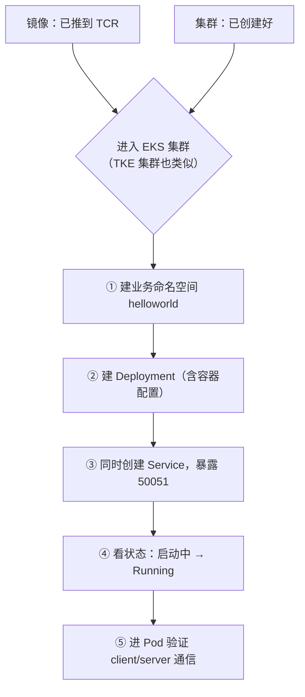
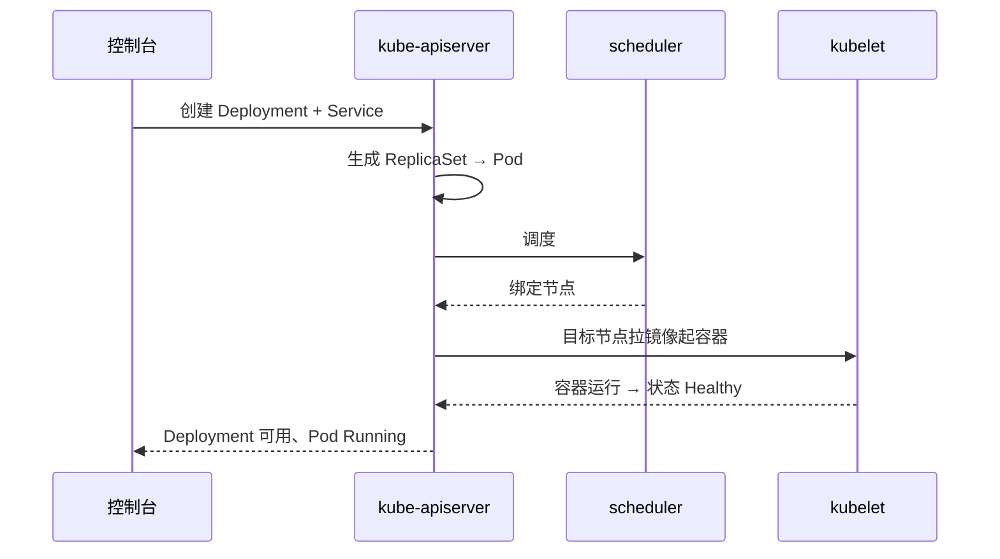
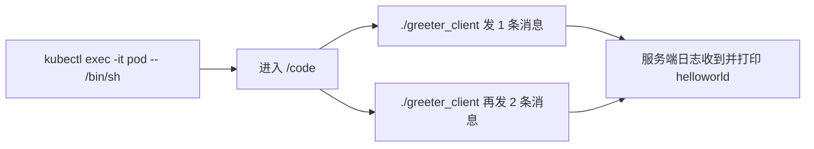

# Kubernetes 认证考点: 把运行镜像部署到 K8s 集群 —— 建命名空间、建 Deployment 与 Service

**前面咱们已经把服务的运行镜像制作完成了，这一节把它部署到 K8s 集群中。**

结论：**做完两个准备（① 镜像中心已经存在运行镜像 ② K8s 集群已经部署好）就可以开工：先新建一个业务命名空间（helloworld），再在这个命名空间里创建 Deployment 与 Service —— 容器名和命名空间同名、选好已做好的镜像版本与拉取策略、环境变量可选（Dockerfile 里的 ENV 和控制台里加效果一样）、资源用最低规格、HPA 可在这里配、访问设置里勾选启用就会同时创建 Service 并暴露 50051 端口；建完看状态从"启动中"到容器正常运行，再 `kubectl exec` 进 Pod 跑一次 client，服务端日志打印出 hello，整条链路就通了。**

## 纲要

- 两个前置准备
- 先建业务命名空间
- 创建部署时填哪些项
- 状态怎么变、怎么看出它起来了
- 进 Pod 验证服务可用
- 一行命令复述全流程

## 两个前置准备

| 准备 | 谁做的 |
| --- | --- |
| **① 镜像中心已经存在运行镜像** | **上一节完成的（推到 TCR）** |
| **② K8s 集群已经部署好** | **本章第一节搭建的（这里继续用腾讯云 EKS 演示）** |



## 先建业务命名空间

**进入到这个 EKS 的集群里面（当然进入 TKE 的集群也是类似的创建部署）。之前先看一下这个命名空间 —— 这些都是默认创建的几个命名空间，我们自己建一个业务的命名空间。**

**创建命名空间（名字叫 helloworld）：CPU、系统盘、安全组、数据卷这些都默认就好了。后面我们建的 deployment 就放到这个命名空间里面来。**

```text
集群的命名空间
├── default        # 默认
├── kube-system    # 控制面组件
├── kube-public
└── helloworld     # ← 新建的业务命名空间（Deployment 放这里）
```

## 创建部署时填哪些项

```yaml
apiVersion: v1
kind: Namespace
metadata:
  name: helloworld
---
apiVersion: apps/v1
kind: Deployment
metadata:
  name: helloworld
  namespace: helloworld
spec:
  replicas: 1
  selector:
    matchLabels:
      app: helloworld
  template:
    metadata:
      labels:
        app: helloworld
    spec:
      containers:
        - name: helloworld            # 容器名称（与命名空间同名）
          image: ccr.ccs.tencentyun.com/<ns>/helloworld:v1   # 选已做好的版本 v1/v2
          imagePullPolicy: IfNotPresent                       # 拉取策略
          ports:
            - containerPort: 50051                            # 服务的 gRPC 默认端口
          # 环境变量：控制台里加的，等价于 Dockerfile 里的 ENV，都会进到容器里
          # env:
          #   - name: ENV_NAME
          #     value: "dev"
          resources:
            requests:
              cpu: 100m
              memory: 128Mi
---
apiVersion: v1
kind: Service
metadata:
  name: helloworld
  namespace: helloworld
spec:
  selector:
    app: helloworld
  ports:
    - port: 50051
      targetPort: 50051
```

控制台里每一项对应什么：

| 配置项 | 填什么 / 为什么 | 坑 |
| --- | --- | --- |
| **容器名称** | **helloworld** | 与命名空间同名，便于辨认 |
| **镜像 + 版本** | **选之前已经做好的相应版本（v1、v2）** | **镜像必须先在镜像中心存在** |
| **拉取策略** | **ImagePullPolicy（如 IfNotPresent / Always）** | 版本不变却想用新镜像时容易被缓存住 |
| **自定义环境变量** | **容器里也可以自己在 Dockerfile 里用 ENV 命令实现；控制台里加了之后也会生效（命令一样会加到容器里）** | **不需要的就删掉，别留无用变量** |
| **资源数量 / 规格** | **默认就是最低规格，用最低规格就够** | |
| **实际数量自动调整** | **这里可以配置 HPA 的实例范围等策略** | **本课程演示用一个、手动处理即可** |
| **镜像拉取凭证** | **进价房凭证默认都已经设置好了** | 私有仓库凭证缺失会 ImagePullBackOff |
| **调度** | **默认设置就行** | |
| **访问设置 / 服务信息** | **默认勾选"启用" → 创建部署时也会同时创建这个服务** | **不勾就没有 Service，集群内也无法用服务名访问** |
| **暴露端口** | **50051，与容器保持一致** | 与 EXPOSE 不一致会连不上 |

## 状态怎么变

**创建一个部署，这个步骤已经创建好了，这些是它的状态：在"启动中"；我们看一下进程列表，这是实例名称盘点状态 —— 就是还没有分配资源，这个要稍微等一下，看是不是有报错；现在是"（编制/运行）状态了"，说明它已经启动起来了，Pod 也正常运行起来了，容器也运行起来了。**



## 进 Pod 验证服务可用

**要验证一下这个服务是不是可用。因为现在它只是服务器内能访问，所以我们远程登录到这个 Pod 里面去（登录脚本默认是 /bin/sh），看一下进去默认目录是什么 —— 没问题，跟本地测试的时候一样，是 /code；看一下里面有哪些文件，里面有 client，我们就运行这个 client 程序，程序发送了一个消息过去，再发送两个消息过去，这些都能够正常发送出去；而服务端这边的日志末端也收到了，打印出来 hello —— 部署和服务验证就跑完了。**



对应命令：

```bash
# ① 看刚创建的资源
kubectl get deploy -n helloworld
kubectl get pods -n helloworld -o wide
kubectl get svc -n helloworld

# ② 进 Pod（默认 shell 是 /bin/sh）
# 先给变量赋值，例如：POD=$(kubectl get pod -n helloworld -o jsonpath='{.items[0].metadata.name}')
kubectl exec -it $POD -n helloworld -- /bin/sh
cd /code && ls          # 里面有 client 与 server
./greeter_client        # 发送一条消息 → 服务端打印 hello
./greeter_client        # 再发两条也正常

# ③ 看服务端日志（验证收到的消息）
kubectl logs -f $POD -n helloworld
```

## 一行命令复述全流程

```text
镜像已推 TCR → 建命名空间 helloworld
   → 建 Deployment（镜像 v1、拉策略、环境变量、最低资源、HPA 可选）
   → 同时建 Service 暴露 50051
   → 状态 启动中 → 已分配资源 → 容器 Running
   → kubectl exec 进 Pod 跑 client → 服务端日志打印 hello ✓
```

## API 速览

| 资源 / 配置 | 作用 | 关键字段 |
| --- | --- | --- |
| **Namespace** | **业务资源的逻辑边界** | `helloworld`（我们建的） |
| **Deployment** | **声明式管理无状态服务（Pod + ReplicaSet）** | `replicas`、容器 `image`、`imagePullPolicy`、自定义 `env`、`resources` |
| **Service** | **服务的命名抽象，暴露端口** | `selector`、`ports.port/targetPort`、**访问设置勾选启用才会同时创建** |
| **容器端口** | **50051（gRPC 默认）** | **要与 EXPOSE 保持一致** |
| **HPA 策略** | **控制台上可配实例范围（创建时就能设）** | 演示场景用一个、手动即可 |
| **镜像拉取凭证** | **私有仓库登录信息，默认已设置** | 缺失会 ImagePullBackOff |

## Demo 示例

控制台点完之后，用命令行把每一个环节都验一遍：

```bash
# ① 命名空间与部署
kubectl get ns | grep helloworld
kubectl get deploy -n helloworld -o wide

# ② 看 Pod 拉镜像有没有卡住（最常见的两类问题）
kubectl describe pod -n helloworld | grep -A5 -i events
#   ErrImagePull / ImagePullBackOff → 镜像不存在或凭证不对
#   ContainerCreating               → 还在起

# ③ 看 Service 有没有把 Pod 挂上（ENDPOINTS 为空 = 没选到 Pod）
kubectl get endpoints -n helloworld

# ④ 集群内访问（用一个临时 Pod 或 exec 进去跑 client）
# 先给变量赋值，例如：POD=$(kubectl get pod -n helloworld -o jsonpath='{.items[0].metadata.name}')
kubectl exec -it $POD -n helloworld -- /bin/sh -c "cd /code && ./greeter_client"

# ⑤ 看服务端收没收到
kubectl logs $POD -n helloworld
```

排障提示：

```bash
# Pod CrashLoopBackOff → 容器一启动就退出（CMD 进程结束或配置错误）
# 先给变量赋值，例如：POD=$(kubectl get pod -n helloworld -o jsonpath='{.items[0].metadata.name}')；CONTAINER=helloworld；IMAGE=ccr.ccs.tencentyun.com/helloworld/helloworld
kubectl logs $POD -n helloworld --previous

# Service 创建了但连不上 → 看 Endpoints 是否为空（selector 与 Pod 标签对不上）
kubectl get endpoints -n helloworld

# 想更新版本 → 改镜像 tag 后触发滚动更新（控制台改或 kubectl set image）
kubectl set image deploy/helloworld -n helloworld $CONTAINER=$IMAGE:v2
```

## 总结

1. **两个准备**：**一、镜像中心已经存在运行镜像（上一节完成）；二、K8s 集群已经部署好（本章第一节搭建，这次直接用腾讯云 EKS 集群演示）**；**两个准备都做好就可以开始创建部署和服务，最后再验证服务是否可以被正常访问**；
2. **先建业务命名空间**：**进入 EKS 集群（进入 TKE 集群也是类似的创建部署），先看一眼默认创建的几个命名空间，然后自己新建一个业务的命名空间，比如叫 helloworld；CPU、系统盘、安全组、数据卷都默认就好了，后面建的 deployment 就放到这个命名空间里面来**；
3. **创建部署时要填的**：**容器名称也叫 helloworld；镜像选之前已经做好了相应版本（v1、v2）的，拉（image）策略按需设置；自定义环境变量容器里也可以自己在 Dockerfile 里用 ENV 命令实现，在控制台加了之后也会生效（命令一样会加到容器里面去），不需要的就删掉；资源的数量默认是最低规格，实际数量自动调整（HPA 的实例范围等策略可以在这里配置，演示用一个、手动处理即可）；进价房凭证（镜像拉取凭证）默认都已设置好；调度设置默认；访问设置/服务信息默认勾选启用，那么创建部署的时候也会同时创建这个服务，我们还要暴露服务的端口 50051 保持一致**；
4. **状态变化**：**创建部署后状态是"启动中"，实例名称盘点状态是还没分配资源，要稍微等一下看有没有报错；之后变成正常状态，说明已经启动起来了，Pod 也正常运行、容器也运行起来了**；
5. **验证服务可用**：**因为现在只是服务器内能访问，要远程登录到 Pod 里面去，登录脚本默认是 /bin/sh；进去默认目录跟本地测试一样是 /code，里面有 client，运行 client 程序发送一个消息、再发送两个消息，都能正常发送出去；服务端这边的日志末端也收到了并打印出 helloworld —— 部署和服务验证就跑完了**；
6. **结论**：**整个过程很简单，再结合之前创建 K8s 集群的过程也非常简单，云原生的方式直接用腾讯云控制台来完成，不管是部署还是集群的维护都挺容易。**

